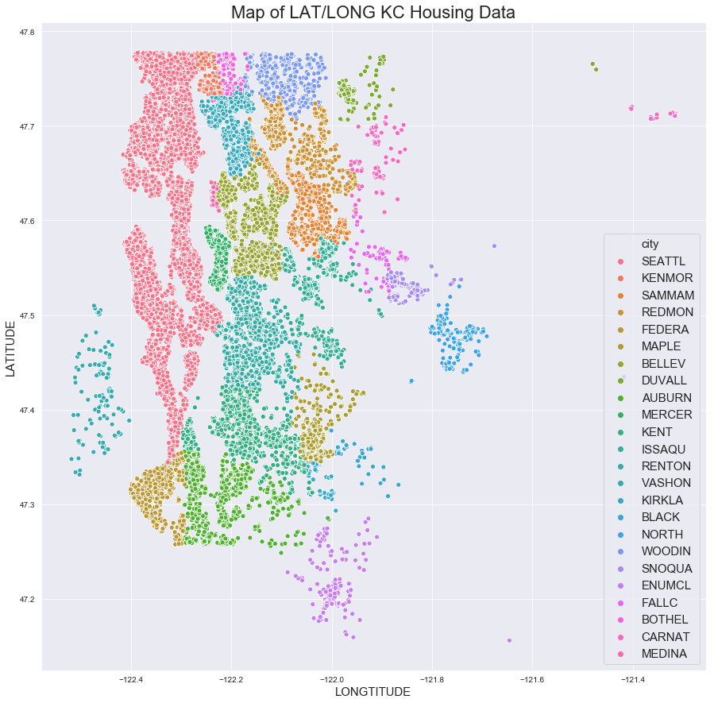

## Final Project Submission

Please fill out:
* Student name: Taylor Stanley
* Student pace:full time
* Scheduled project review date/time: Friday, July 31st, 2020
* Instructor name: Abhineet Kulkarni
* Blog post URL: https://medium.com/@tcastanley/r%C2%B2-the-good-the-bad-and-the-ugly-a05fe9e0282c


# Obtaining The Data

## Import data & Libraries


```python
import pandas as pd
import numpy as np
import matplotlib.pyplot as plt
import seaborn as sns
%matplotlib inline
sns.set_style('darkgrid')
```


```python
pd.set_option('display.max_rows', 250)
pd.set_option('display.max_columns', 50)
```

## Preview Data & Analyze dtypes


```python
data = pd.read_csv('kc_house_data.csv')
data.head()
```


<div>
<style scoped>
    .dataframe tbody tr th:only-of-type {
        vertical-align: middle;
    }

    .dataframe tbody tr th {
        vertical-align: top;
    }

    .dataframe thead th {
        text-align: right;
    }
</style>
<table border="1" class="dataframe">
  <thead>
    <tr style="text-align: right;">
      <th></th>
      <th>id</th>
      <th>date</th>
      <th>price</th>
      <th>bedrooms</th>
      <th>bathrooms</th>
      <th>sqft_living</th>
      <th>sqft_lot</th>
      <th>floors</th>
      <th>waterfront</th>
      <th>view</th>
      <th>condition</th>
      <th>grade</th>
      <th>sqft_above</th>
      <th>sqft_basement</th>
      <th>yr_built</th>
      <th>yr_renovated</th>
      <th>zipcode</th>
      <th>lat</th>
      <th>long</th>
      <th>sqft_living15</th>
      <th>sqft_lot15</th>
    </tr>
  </thead>
  <tbody>
    <tr>
      <th>0</th>
      <td>7129300520</td>
      <td>10/13/2014</td>
      <td>221900.0</td>
      <td>3</td>
      <td>1.00</td>
      <td>1180</td>
      <td>5650</td>
      <td>1.0</td>
      <td>NaN</td>
      <td>0.0</td>
      <td>3</td>
      <td>7</td>
      <td>1180</td>
      <td>0.0</td>
      <td>1955</td>
      <td>0.0</td>
      <td>98178</td>
      <td>47.5112</td>
      <td>-122.257</td>
      <td>1340</td>
      <td>5650</td>
    </tr>
    <tr>
      <th>1</th>
      <td>6414100192</td>
      <td>12/9/2014</td>
      <td>538000.0</td>
      <td>3</td>
      <td>2.25</td>
      <td>2570</td>
      <td>7242</td>
      <td>2.0</td>
      <td>0.0</td>
      <td>0.0</td>
      <td>3</td>
      <td>7</td>
      <td>2170</td>
      <td>400.0</td>
      <td>1951</td>
      <td>1991.0</td>
      <td>98125</td>
      <td>47.7210</td>
      <td>-122.319</td>
      <td>1690</td>
      <td>7639</td>
    </tr>
    <tr>
      <th>2</th>
      <td>5631500400</td>
      <td>2/25/2015</td>
      <td>180000.0</td>
      <td>2</td>
      <td>1.00</td>
      <td>770</td>
      <td>10000</td>
      <td>1.0</td>
      <td>0.0</td>
      <td>0.0</td>
      <td>3</td>
      <td>6</td>
      <td>770</td>
      <td>0.0</td>
      <td>1933</td>
      <td>NaN</td>
      <td>98028</td>
      <td>47.7379</td>
      <td>-122.233</td>
      <td>2720</td>
      <td>8062</td>
    </tr>
    <tr>
      <th>3</th>
      <td>2487200875</td>
      <td>12/9/2014</td>
      <td>604000.0</td>
      <td>4</td>
      <td>3.00</td>
      <td>1960</td>
      <td>5000</td>
      <td>1.0</td>
      <td>0.0</td>
      <td>0.0</td>
      <td>5</td>
      <td>7</td>
      <td>1050</td>
      <td>910.0</td>
      <td>1965</td>
      <td>0.0</td>
      <td>98136</td>
      <td>47.5208</td>
      <td>-122.393</td>
      <td>1360</td>
      <td>5000</td>
    </tr>
    <tr>
      <th>4</th>
      <td>1954400510</td>
      <td>2/18/2015</td>
      <td>510000.0</td>
      <td>3</td>
      <td>2.00</td>
      <td>1680</td>
      <td>8080</td>
      <td>1.0</td>
      <td>0.0</td>
      <td>0.0</td>
      <td>3</td>
      <td>8</td>
      <td>1680</td>
      <td>0.0</td>
      <td>1987</td>
      <td>0.0</td>
      <td>98074</td>
      <td>47.6168</td>
      <td>-122.045</td>
      <td>1800</td>
      <td>7503</td>
    </tr>
  </tbody>
</table>
</div>


## Null values


```python
data.isna().sum()
```


    id                  0
    date                0
    price               0
    bedrooms            0
    bathrooms           0
    sqft_living         0
    sqft_lot            0
    floors              0
    waterfront       2376
    view               63
    condition           0
    grade               0
    sqft_above          0
    sqft_basement       0
    yr_built            0
    yr_renovated     3842
    zipcode             0
    lat                 0
    long                0
    sqft_living15       0
    sqft_lot15          0
    dtype: int64


**We have 3 columns that need to be cleaned of Null values:**

---
* **Waterfront: 2376**
* **View: 63**
* **Yr_Renovated: 3842**

## Visualize Continuous& Categorical Features Against Price


```python
cont_vars = ['price','date','sqft_living','sqft_lot','sqft_basement','sqft_above','sqft_living15','sqft_lot15','yr_built','yr_renovated'] 
cat_vars = ['price','bedrooms','bathrooms','floors','waterfront','view','condition','grade', 'zipcode']

data_cont = data[cont_vars]
data_cat = data[cat_vars]
```


```python
# sns.pairplot(data_cont);
```


```python
# sns.pairplot(data_cat);
```

## Initial Multicollinearity Check


```python
plt.figure(figsize=(15,10))
sns.heatmap(abs(data.corr()), center=0);

plt.title('Multicollinearity Check', fontsize=20);
plt.yticks(fontsize=15);
plt.xticks(fontsize=15);
```


### Multicollinearity Observations

**There are only 1 pair of features that have a correlation above 0.80:**

* **sqft_living & sqft_above @ (.88)**

**We will drop sqft_above from the models to avoid multicollinearity issues.**

## Identify Feature Outliers


```python
data.describe()
```


<div>
<style scoped>
    .dataframe tbody tr th:only-of-type {
        vertical-align: middle;
    }

    .dataframe tbody tr th {
        vertical-align: top;
    }

    .dataframe thead th {
        text-align: right;
    }
</style>
<table border="1" class="dataframe">
  <thead>
    <tr style="text-align: right;">
      <th></th>
      <th>id</th>
      <th>price</th>
      <th>bedrooms</th>
      <th>bathrooms</th>
      <th>sqft_living</th>
      <th>sqft_lot</th>
      <th>floors</th>
      <th>waterfront</th>
      <th>view</th>
      <th>condition</th>
      <th>grade</th>
      <th>sqft_above</th>
      <th>yr_built</th>
      <th>yr_renovated</th>
      <th>zipcode</th>
      <th>lat</th>
      <th>long</th>
      <th>sqft_living15</th>
      <th>sqft_lot15</th>
    </tr>
  </thead>
  <tbody>
    <tr>
      <th>count</th>
      <td>2.159700e+04</td>
      <td>2.159700e+04</td>
      <td>21597.000000</td>
      <td>21597.000000</td>
      <td>21597.000000</td>
      <td>2.159700e+04</td>
      <td>21597.000000</td>
      <td>19221.000000</td>
      <td>21534.000000</td>
      <td>21597.000000</td>
      <td>21597.000000</td>
      <td>21597.000000</td>
      <td>21597.000000</td>
      <td>17755.000000</td>
      <td>21597.000000</td>
      <td>21597.000000</td>
      <td>21597.000000</td>
      <td>21597.000000</td>
      <td>21597.000000</td>
    </tr>
    <tr>
      <th>mean</th>
      <td>4.580474e+09</td>
      <td>5.402966e+05</td>
      <td>3.373200</td>
      <td>2.115826</td>
      <td>2080.321850</td>
      <td>1.509941e+04</td>
      <td>1.494096</td>
      <td>0.007596</td>
      <td>0.233863</td>
      <td>3.409825</td>
      <td>7.657915</td>
      <td>1788.596842</td>
      <td>1970.999676</td>
      <td>83.636778</td>
      <td>98077.951845</td>
      <td>47.560093</td>
      <td>-122.213982</td>
      <td>1986.620318</td>
      <td>12758.283512</td>
    </tr>
    <tr>
      <th>std</th>
      <td>2.876736e+09</td>
      <td>3.673681e+05</td>
      <td>0.926299</td>
      <td>0.768984</td>
      <td>918.106125</td>
      <td>4.141264e+04</td>
      <td>0.539683</td>
      <td>0.086825</td>
      <td>0.765686</td>
      <td>0.650546</td>
      <td>1.173200</td>
      <td>827.759761</td>
      <td>29.375234</td>
      <td>399.946414</td>
      <td>53.513072</td>
      <td>0.138552</td>
      <td>0.140724</td>
      <td>685.230472</td>
      <td>27274.441950</td>
    </tr>
    <tr>
      <th>min</th>
      <td>1.000102e+06</td>
      <td>7.800000e+04</td>
      <td>1.000000</td>
      <td>0.500000</td>
      <td>370.000000</td>
      <td>5.200000e+02</td>
      <td>1.000000</td>
      <td>0.000000</td>
      <td>0.000000</td>
      <td>1.000000</td>
      <td>3.000000</td>
      <td>370.000000</td>
      <td>1900.000000</td>
      <td>0.000000</td>
      <td>98001.000000</td>
      <td>47.155900</td>
      <td>-122.519000</td>
      <td>399.000000</td>
      <td>651.000000</td>
    </tr>
    <tr>
      <th>25%</th>
      <td>2.123049e+09</td>
      <td>3.220000e+05</td>
      <td>3.000000</td>
      <td>1.750000</td>
      <td>1430.000000</td>
      <td>5.040000e+03</td>
      <td>1.000000</td>
      <td>0.000000</td>
      <td>0.000000</td>
      <td>3.000000</td>
      <td>7.000000</td>
      <td>1190.000000</td>
      <td>1951.000000</td>
      <td>0.000000</td>
      <td>98033.000000</td>
      <td>47.471100</td>
      <td>-122.328000</td>
      <td>1490.000000</td>
      <td>5100.000000</td>
    </tr>
    <tr>
      <th>50%</th>
      <td>3.904930e+09</td>
      <td>4.500000e+05</td>
      <td>3.000000</td>
      <td>2.250000</td>
      <td>1910.000000</td>
      <td>7.618000e+03</td>
      <td>1.500000</td>
      <td>0.000000</td>
      <td>0.000000</td>
      <td>3.000000</td>
      <td>7.000000</td>
      <td>1560.000000</td>
      <td>1975.000000</td>
      <td>0.000000</td>
      <td>98065.000000</td>
      <td>47.571800</td>
      <td>-122.231000</td>
      <td>1840.000000</td>
      <td>7620.000000</td>
    </tr>
    <tr>
      <th>75%</th>
      <td>7.308900e+09</td>
      <td>6.450000e+05</td>
      <td>4.000000</td>
      <td>2.500000</td>
      <td>2550.000000</td>
      <td>1.068500e+04</td>
      <td>2.000000</td>
      <td>0.000000</td>
      <td>0.000000</td>
      <td>4.000000</td>
      <td>8.000000</td>
      <td>2210.000000</td>
      <td>1997.000000</td>
      <td>0.000000</td>
      <td>98118.000000</td>
      <td>47.678000</td>
      <td>-122.125000</td>
      <td>2360.000000</td>
      <td>10083.000000</td>
    </tr>
    <tr>
      <th>max</th>
      <td>9.900000e+09</td>
      <td>7.700000e+06</td>
      <td>33.000000</td>
      <td>8.000000</td>
      <td>13540.000000</td>
      <td>1.651359e+06</td>
      <td>3.500000</td>
      <td>1.000000</td>
      <td>4.000000</td>
      <td>5.000000</td>
      <td>13.000000</td>
      <td>9410.000000</td>
      <td>2015.000000</td>
      <td>2015.000000</td>
      <td>98199.000000</td>
      <td>47.777600</td>
      <td>-121.315000</td>
      <td>6210.000000</td>
      <td>871200.000000</td>
    </tr>
  </tbody>
</table>
</div>


### Outlier Observations

**Features with Outliers**

---
**Median vs Mean Difference**

**1. price: -400,000**

**2. sqft_living: ~ -200**

**3. sqft_lot: -34,000**

**4. condition: -0.4**

**5. sqft_above: -200+**

**6. sqft_living15: -150**

**7. sqft_lot15: -5000**

# Clean Data

## Convert Date Feature


```python
df = data.copy()
df['date'] = pd.to_datetime(df['date'])
```

## Convert Sqft_Basement Feature


```python
df['sqft_basement'] = df['sqft_basement'].astype(str)
df['sqft_basement'].value_counts()
```


    0.0       12826
    ?           454
    600.0       217
    500.0       209
    700.0       208
    800.0       201
    400.0       184
    1000.0      148
    300.0       142
    900.0       142
    200.0       105
    750.0       104
    450.0       103
    530.0       103
    480.0       103
    720.0        98
    620.0        90
    580.0        84
    840.0        83
    420.0        81
    860.0        79
    670.0        78
    1100.0       78
    550.0        76
    780.0        76
    650.0        75
    240.0        74
    680.0        73
    380.0        73
    850.0        72
    360.0        72
    940.0        71
    770.0        71
    910.0        71
    440.0        69
    1200.0       69
    880.0        69
    290.0        69
    350.0        68
    520.0        68
    630.0        66
    920.0        66
    960.0        65
    730.0        65
    740.0        64
    430.0        64
    760.0        63
    1010.0       63
    640.0        63
    340.0        62
    570.0        62
    820.0        62
    950.0        62
    280.0        62
    560.0        62
    460.0        61
    790.0        61
    1060.0       58
    310.0        58
    980.0        57
    830.0        56
    1040.0       55
    810.0        55
    540.0        55
    250.0        54
    120.0        53
    140.0        53
    890.0        52
    990.0        52
    470.0        51
    1070.0       51
    1020.0       51
    1250.0       50
    510.0        48
    660.0        48
    870.0        48
    330.0        47
    390.0        46
    690.0        45
    610.0        45
    970.0        44
    270.0        44
    1030.0       44
    150.0        44
    220.0        43
    1120.0       43
    100.0        42
    260.0        42
    320.0        41
    590.0        41
    370.0        41
    930.0        41
    1300.0       41
    1050.0       41
    710.0        38
    1400.0       38
    180.0        38
    1110.0       35
    190.0        33
    1090.0       32
    1080.0       32
    1220.0       31
    1130.0       30
    1230.0       30
    1270.0       30
    1170.0       30
    1500.0       29
    160.0        29
    490.0        28
    170.0        28
    1140.0       28
    1180.0       28
    1150.0       27
    1160.0       26
    210.0        26
    130.0        25
    1190.0       24
    410.0        24
    1370.0       23
    1320.0       22
    1280.0       22
    90.0         21
    1260.0       21
    1380.0       21
    80.0         20
              ...  
    1950.0        4
    40.0          4
    1630.0        4
    1900.0        4
    1610.0        4
    2150.0        3
    1910.0        3
    2070.0        3
    2220.0        3
    2160.0        3
    2170.0        3
    1750.0        3
    1860.0        3
    265.0         3
    1740.0        3
    515.0         2
    2090.0        2
    2010.0        2
    1840.0        2
    1890.0        2
    1820.0        2
    2200.0        2
    2110.0        2
    414.0         2
    2040.0        2
    2000.0        2
    2080.0        2
    10.0          2
    2030.0        2
    235.0         2
    1810.0        2
    2100.0        2
    435.0         2
    2550.0        2
    1730.0        2
    2330.0        2
    1798.0        1
    2130.0        1
    1284.0        1
    516.0         1
    2250.0        1
    4820.0        1
    2810.0        1
    1481.0        1
    875.0         1
    276.0         1
    1008.0        1
    3480.0        1
    506.0         1
    602.0         1
    207.0         1
    2350.0        1
    2050.0        1
    1880.0        1
    2580.0        1
    248.0         1
    1913.0        1
    2610.0        1
    946.0         1
    1525.0        1
    374.0         1
    243.0         1
    2400.0        1
    143.0         1
    1990.0        1
    1248.0        1
    417.0         1
    1816.0        1
    3000.0        1
    588.0         1
    1770.0        1
    2360.0        1
    2500.0        1
    556.0         1
    1960.0        1
    518.0         1
    784.0         1
    1135.0        1
    862.0         1
    4130.0        1
    3260.0        1
    2240.0        1
    1281.0        1
    2310.0        1
    2300.0        1
    2120.0        1
    935.0         1
    2390.0        1
    176.0         1
    2490.0        1
    792.0         1
    768.0         1
    283.0         1
    2196.0        1
    666.0         1
    2180.0        1
    652.0         1
    1275.0        1
    1024.0        1
    274.0         1
    1245.0        1
    1920.0        1
    20.0          1
    475.0         1
    508.0         1
    172.0         1
    861.0         1
    295.0         1
    2730.0        1
    65.0          1
    915.0         1
    415.0         1
    2190.0        1
    1548.0        1
    2570.0        1
    906.0         1
    1930.0        1
    2720.0        1
    3500.0        1
    2850.0        1
    704.0         1
    1852.0        1
    225.0         1
    266.0         1
    2600.0        1
    Name: sqft_basement, Length: 304, dtype: int64


```python
def str_changer(value, string=None, replacement=None):
    if value == string:
        value = replacement
    return value

df['sqft_basement'] = df['sqft_basement'].map(lambda x: str_changer(value=x,string='?', replacement='1'))
df['sqft_basement'] = df['sqft_basement'].astype(float)

df['sqft_basement'].plot.hist();
```


##  Clean Waterfront Feature

**We need to decide what to do with the NaN values for this feature.  Let's take a closer look at the data to choose the optimal course of action!**


```python
print(df['waterfront'].value_counts(dropna=False))
print('The total number of NaN values for Waterfront is {}'.format(df['waterfront'].isna().sum()))
```

     0.0    19075
    NaN      2376
     1.0      146
    Name: waterfront, dtype: int64
    The total number of NaN values for Waterfront is 2376
    


```python
df['waterfront'] = df['waterfront'].fillna(0.5)
print(df['waterfront'].value_counts())
```

    0.0    19075
    0.5     2376
    1.0      146
    Name: waterfront, dtype: int64
    


```python
fig, (ax1, ax2, ax3) = plt.subplots(ncols=3, figsize=(15,15), sharey=True, sharex=True)

sns.scatterplot(x='long', y='lat', hue='price', data=df[df['waterfront'] == 0], ax=ax1);
sns.scatterplot(x='long', y='lat', hue='price', data=df[df['waterfront'] == 0.5], ax=ax2);
sns.scatterplot(x='long', y='lat', hue='price', data=df[df['waterfront'] == 1], ax=ax3);
```


**Not much to make from these visualizations, lets have a look at some more data using the groupby method.**


```python
print('Number of houses without a waterfront or view: {}'.format(
    df[(df['waterfront'] == 0 ) & (df['view'] == 0)].shape[0]))
print('Number of houses without a waterfront and have 1 view: {}'.format(
    df[(df['waterfront'] == 0 ) & (df['view'] == 1)].shape[0]))
print('Number of houses without a waterfront and more than 1 view: {}'.format(
    df[(df['waterfront'] == 0 ) & (df['view'] > 1)].shape[0]))
print('----------------------------------------------------')
print('Number of houses with a waterfront but no view: {}'.format(
    df[(df['waterfront'] == 1 ) & (df['view'] == 0)].shape[0]))
print('Number of houses with a waterfront and have 1 view: {}'.format(
    df[(df['waterfront'] == 1 ) & (df['view'] == 1)].shape[0]))
print('Number of houses with a waterfront and more than 1 view: {}'.format(
    df[(df['waterfront'] == 1 ) & (df['view'] > 1)].shape[0]))
print('----------------------------------------------------')
print('Number of houses with UNKNOWN waterfront and no view: {}'.format(
    df[(df['waterfront'] == 0.5 ) & (df['view'] == 0)].shape[0]))
print('Number of houses with UNKNOWN waterfront and have 1 view: {}'.format(
    df[(df['waterfront'] == 0.5 ) & (df['view'] == 1)].shape[0]))
print('Number of houses with UNKNOWN waterfront and more than 1 view: {}'.format(
    df[(df['waterfront'] == 0.5 ) & (df['view'] > 1)].shape[0]))
```

    Number of houses without a waterfront or view: 17312
    Number of houses without a waterfront and have 1 view: 290
    Number of houses without a waterfront and more than 1 view: 1417
    ----------------------------------------------------
    Number of houses with a waterfront but no view: 0
    Number of houses with a waterfront and have 1 view: 1
    Number of houses with a waterfront and more than 1 view: 144
    ----------------------------------------------------
    Number of houses with UNKNOWN waterfront and no view: 2110
    Number of houses with UNKNOWN waterfront and have 1 view: 39
    Number of houses with UNKNOWN waterfront and more than 1 view: 221
    


```python
likely_no_wtr_df = df[(df['waterfront'] == 0.5) & (df['view'] == 0)]
likely_wtr_df = df[(df['waterfront'] == 0.5) & (df['view'] > 1)]

for index in list(likely_no_wtr_df.index):
    df.loc[index, 'waterfront'] = 0    
    
for index in list(likely_wtr_df.index):
    df.loc[index, 'waterfront'] = 1

    
print(df.shape)
df.head()
```

    (21597, 21)
    


<div>
<style scoped>
    .dataframe tbody tr th:only-of-type {
        vertical-align: middle;
    }

    .dataframe tbody tr th {
        vertical-align: top;
    }

    .dataframe thead th {
        text-align: right;
    }
</style>
<table border="1" class="dataframe">
  <thead>
    <tr style="text-align: right;">
      <th></th>
      <th>id</th>
      <th>date</th>
      <th>price</th>
      <th>bedrooms</th>
      <th>bathrooms</th>
      <th>sqft_living</th>
      <th>sqft_lot</th>
      <th>floors</th>
      <th>waterfront</th>
      <th>view</th>
      <th>condition</th>
      <th>grade</th>
      <th>sqft_above</th>
      <th>sqft_basement</th>
      <th>yr_built</th>
      <th>yr_renovated</th>
      <th>zipcode</th>
      <th>lat</th>
      <th>long</th>
      <th>sqft_living15</th>
      <th>sqft_lot15</th>
    </tr>
  </thead>
  <tbody>
    <tr>
      <th>0</th>
      <td>7129300520</td>
      <td>2014-10-13</td>
      <td>221900.0</td>
      <td>3</td>
      <td>1.00</td>
      <td>1180</td>
      <td>5650</td>
      <td>1.0</td>
      <td>0.0</td>
      <td>0.0</td>
      <td>3</td>
      <td>7</td>
      <td>1180</td>
      <td>0.0</td>
      <td>1955</td>
      <td>0.0</td>
      <td>98178</td>
      <td>47.5112</td>
      <td>-122.257</td>
      <td>1340</td>
      <td>5650</td>
    </tr>
    <tr>
      <th>1</th>
      <td>6414100192</td>
      <td>2014-12-09</td>
      <td>538000.0</td>
      <td>3</td>
      <td>2.25</td>
      <td>2570</td>
      <td>7242</td>
      <td>2.0</td>
      <td>0.0</td>
      <td>0.0</td>
      <td>3</td>
      <td>7</td>
      <td>2170</td>
      <td>400.0</td>
      <td>1951</td>
      <td>1991.0</td>
      <td>98125</td>
      <td>47.7210</td>
      <td>-122.319</td>
      <td>1690</td>
      <td>7639</td>
    </tr>
    <tr>
      <th>2</th>
      <td>5631500400</td>
      <td>2015-02-25</td>
      <td>180000.0</td>
      <td>2</td>
      <td>1.00</td>
      <td>770</td>
      <td>10000</td>
      <td>1.0</td>
      <td>0.0</td>
      <td>0.0</td>
      <td>3</td>
      <td>6</td>
      <td>770</td>
      <td>0.0</td>
      <td>1933</td>
      <td>NaN</td>
      <td>98028</td>
      <td>47.7379</td>
      <td>-122.233</td>
      <td>2720</td>
      <td>8062</td>
    </tr>
    <tr>
      <th>3</th>
      <td>2487200875</td>
      <td>2014-12-09</td>
      <td>604000.0</td>
      <td>4</td>
      <td>3.00</td>
      <td>1960</td>
      <td>5000</td>
      <td>1.0</td>
      <td>0.0</td>
      <td>0.0</td>
      <td>5</td>
      <td>7</td>
      <td>1050</td>
      <td>910.0</td>
      <td>1965</td>
      <td>0.0</td>
      <td>98136</td>
      <td>47.5208</td>
      <td>-122.393</td>
      <td>1360</td>
      <td>5000</td>
    </tr>
    <tr>
      <th>4</th>
      <td>1954400510</td>
      <td>2015-02-18</td>
      <td>510000.0</td>
      <td>3</td>
      <td>2.00</td>
      <td>1680</td>
      <td>8080</td>
      <td>1.0</td>
      <td>0.0</td>
      <td>0.0</td>
      <td>3</td>
      <td>8</td>
      <td>1680</td>
      <td>0.0</td>
      <td>1987</td>
      <td>0.0</td>
      <td>98074</td>
      <td>47.6168</td>
      <td>-122.045</td>
      <td>1800</td>
      <td>7503</td>
    </tr>
  </tbody>
</table>
</div>


```python
df['waterfront'].value_counts()
```


    0.0    21185
    1.0      367
    0.5       45
    Name: waterfront, dtype: int64


**We have taken an educated guess on assigning most of these unknown (0.5) values and we are left with only a few remaining rows that are still unclear.  This is an acceptable loss should we choose to drop these later.**

## Clean Yr_Renovated Feature

**Here we are going to set the "Unknown" renovation status value to the year 1800.  This will be used later on during the feature engineering stages.**


```python
df['yr_renovated'] = df['yr_renovated'].fillna(1800)
df['yr_renovated'].value_counts().head()
```


    0.0       17011
    1800.0     3842
    2014.0       73
    2003.0       31
    2013.0       31
    Name: yr_renovated, dtype: int64


##  Clean View Feature


```python
df['view'] = df['view'].fillna(0.5)
df['view'].value_counts()
```


    0.0    19422
    2.0      957
    3.0      508
    1.0      330
    4.0      317
    0.5       63
    Name: view, dtype: int64


# EDA & Feature Engineering


```python
df_eda = df.copy()
```

## Bin Categorical Features for Further Exploration


```python
def bathroom_binner(value):
    if value <= 1.5:
        return '1_5_or_less'
    elif value > 1.5 and value < 3:
        return '2_to_3'
    else:
        return '3_or_more'
    
def bedroom_binner(value):
    if value <= 3:
        return '3_or_less'
    else:
        return '4_or_more'
    
def grade_binner(value):
    if value <= 6:
        return '6_or_less'
    elif value == 7:
        return '7'
    elif value == 8:
        return '8'
    elif value == 9:
        return '9'
    else:
        return 'more_than_10'
    
def condition_binner(value):
    if value < 3:
        return '2_or_less'
    elif value == 3:
        return '3'
    else:
        return 'more_than_3'

def floor_binner(value):
    if value == 1:
        return '1_floor'
    elif value == 2 or value == 3:
        return '2_or_more'
    else:
        return 'split'    
    
df_eda['bathroom_bins'] = df_eda['bathrooms'].map(bathroom_binner)
df_eda['bedroom_bins'] = df_eda['bedrooms'].map(bedroom_binner)
df_eda['grade_bins'] = df_eda['grade'].map(grade_binner)
df_eda['cond_bins'] = df_eda['condition'].map(condition_binner)
df_eda['floor_bins'] = df_eda['floors'].map(floor_binner)
df_eda.head()
```


<div>
<style scoped>
    .dataframe tbody tr th:only-of-type {
        vertical-align: middle;
    }

    .dataframe tbody tr th {
        vertical-align: top;
    }

    .dataframe thead th {
        text-align: right;
    }
</style>
<table border="1" class="dataframe">
  <thead>
    <tr style="text-align: right;">
      <th></th>
      <th>id</th>
      <th>date</th>
      <th>price</th>
      <th>bedrooms</th>
      <th>bathrooms</th>
      <th>sqft_living</th>
      <th>sqft_lot</th>
      <th>floors</th>
      <th>waterfront</th>
      <th>view</th>
      <th>condition</th>
      <th>grade</th>
      <th>sqft_above</th>
      <th>sqft_basement</th>
      <th>yr_built</th>
      <th>yr_renovated</th>
      <th>zipcode</th>
      <th>lat</th>
      <th>long</th>
      <th>sqft_living15</th>
      <th>sqft_lot15</th>
      <th>bathroom_bins</th>
      <th>bedroom_bins</th>
      <th>grade_bins</th>
      <th>cond_bins</th>
      <th>floor_bins</th>
    </tr>
  </thead>
  <tbody>
    <tr>
      <th>0</th>
      <td>7129300520</td>
      <td>2014-10-13</td>
      <td>221900.0</td>
      <td>3</td>
      <td>1.00</td>
      <td>1180</td>
      <td>5650</td>
      <td>1.0</td>
      <td>0.0</td>
      <td>0.0</td>
      <td>3</td>
      <td>7</td>
      <td>1180</td>
      <td>0.0</td>
      <td>1955</td>
      <td>0.0</td>
      <td>98178</td>
      <td>47.5112</td>
      <td>-122.257</td>
      <td>1340</td>
      <td>5650</td>
      <td>1_5_or_less</td>
      <td>3_or_less</td>
      <td>7</td>
      <td>3</td>
      <td>1_floor</td>
    </tr>
    <tr>
      <th>1</th>
      <td>6414100192</td>
      <td>2014-12-09</td>
      <td>538000.0</td>
      <td>3</td>
      <td>2.25</td>
      <td>2570</td>
      <td>7242</td>
      <td>2.0</td>
      <td>0.0</td>
      <td>0.0</td>
      <td>3</td>
      <td>7</td>
      <td>2170</td>
      <td>400.0</td>
      <td>1951</td>
      <td>1991.0</td>
      <td>98125</td>
      <td>47.7210</td>
      <td>-122.319</td>
      <td>1690</td>
      <td>7639</td>
      <td>2_to_3</td>
      <td>3_or_less</td>
      <td>7</td>
      <td>3</td>
      <td>2_or_more</td>
    </tr>
    <tr>
      <th>2</th>
      <td>5631500400</td>
      <td>2015-02-25</td>
      <td>180000.0</td>
      <td>2</td>
      <td>1.00</td>
      <td>770</td>
      <td>10000</td>
      <td>1.0</td>
      <td>0.0</td>
      <td>0.0</td>
      <td>3</td>
      <td>6</td>
      <td>770</td>
      <td>0.0</td>
      <td>1933</td>
      <td>1800.0</td>
      <td>98028</td>
      <td>47.7379</td>
      <td>-122.233</td>
      <td>2720</td>
      <td>8062</td>
      <td>1_5_or_less</td>
      <td>3_or_less</td>
      <td>6_or_less</td>
      <td>3</td>
      <td>1_floor</td>
    </tr>
    <tr>
      <th>3</th>
      <td>2487200875</td>
      <td>2014-12-09</td>
      <td>604000.0</td>
      <td>4</td>
      <td>3.00</td>
      <td>1960</td>
      <td>5000</td>
      <td>1.0</td>
      <td>0.0</td>
      <td>0.0</td>
      <td>5</td>
      <td>7</td>
      <td>1050</td>
      <td>910.0</td>
      <td>1965</td>
      <td>0.0</td>
      <td>98136</td>
      <td>47.5208</td>
      <td>-122.393</td>
      <td>1360</td>
      <td>5000</td>
      <td>3_or_more</td>
      <td>4_or_more</td>
      <td>7</td>
      <td>more_than_3</td>
      <td>1_floor</td>
    </tr>
    <tr>
      <th>4</th>
      <td>1954400510</td>
      <td>2015-02-18</td>
      <td>510000.0</td>
      <td>3</td>
      <td>2.00</td>
      <td>1680</td>
      <td>8080</td>
      <td>1.0</td>
      <td>0.0</td>
      <td>0.0</td>
      <td>3</td>
      <td>8</td>
      <td>1680</td>
      <td>0.0</td>
      <td>1987</td>
      <td>0.0</td>
      <td>98074</td>
      <td>47.6168</td>
      <td>-122.045</td>
      <td>1800</td>
      <td>7503</td>
      <td>2_to_3</td>
      <td>3_or_less</td>
      <td>8</td>
      <td>3</td>
      <td>1_floor</td>
    </tr>
  </tbody>
</table>
</div>


## Binary Features


```python
def binary_view_converter(value):
    if value > 0:
        return 1
    else:
        return 0
    
def binary_basement_converter(value):
    if value > 1:
        return 1
    else:
        return 0
        
df_eda['view_binar'] = df_eda['view'].map(binary_view_converter)
df_eda['view_binar'] = df_eda['view_binar'].fillna(0)

df_eda['basement_binar'] = df_eda['sqft_basement'].map(binary_basement_converter)

df_eda.head()
```


<div>
<style scoped>
    .dataframe tbody tr th:only-of-type {
        vertical-align: middle;
    }

    .dataframe tbody tr th {
        vertical-align: top;
    }

    .dataframe thead th {
        text-align: right;
    }
</style>
<table border="1" class="dataframe">
  <thead>
    <tr style="text-align: right;">
      <th></th>
      <th>id</th>
      <th>date</th>
      <th>price</th>
      <th>bedrooms</th>
      <th>bathrooms</th>
      <th>sqft_living</th>
      <th>sqft_lot</th>
      <th>floors</th>
      <th>waterfront</th>
      <th>view</th>
      <th>condition</th>
      <th>grade</th>
      <th>sqft_above</th>
      <th>sqft_basement</th>
      <th>yr_built</th>
      <th>yr_renovated</th>
      <th>zipcode</th>
      <th>lat</th>
      <th>long</th>
      <th>sqft_living15</th>
      <th>sqft_lot15</th>
      <th>bathroom_bins</th>
      <th>bedroom_bins</th>
      <th>grade_bins</th>
      <th>cond_bins</th>
      <th>floor_bins</th>
      <th>view_binar</th>
      <th>basement_binar</th>
    </tr>
  </thead>
  <tbody>
    <tr>
      <th>0</th>
      <td>7129300520</td>
      <td>2014-10-13</td>
      <td>221900.0</td>
      <td>3</td>
      <td>1.00</td>
      <td>1180</td>
      <td>5650</td>
      <td>1.0</td>
      <td>0.0</td>
      <td>0.0</td>
      <td>3</td>
      <td>7</td>
      <td>1180</td>
      <td>0.0</td>
      <td>1955</td>
      <td>0.0</td>
      <td>98178</td>
      <td>47.5112</td>
      <td>-122.257</td>
      <td>1340</td>
      <td>5650</td>
      <td>1_5_or_less</td>
      <td>3_or_less</td>
      <td>7</td>
      <td>3</td>
      <td>1_floor</td>
      <td>0</td>
      <td>0</td>
    </tr>
    <tr>
      <th>1</th>
      <td>6414100192</td>
      <td>2014-12-09</td>
      <td>538000.0</td>
      <td>3</td>
      <td>2.25</td>
      <td>2570</td>
      <td>7242</td>
      <td>2.0</td>
      <td>0.0</td>
      <td>0.0</td>
      <td>3</td>
      <td>7</td>
      <td>2170</td>
      <td>400.0</td>
      <td>1951</td>
      <td>1991.0</td>
      <td>98125</td>
      <td>47.7210</td>
      <td>-122.319</td>
      <td>1690</td>
      <td>7639</td>
      <td>2_to_3</td>
      <td>3_or_less</td>
      <td>7</td>
      <td>3</td>
      <td>2_or_more</td>
      <td>0</td>
      <td>1</td>
    </tr>
    <tr>
      <th>2</th>
      <td>5631500400</td>
      <td>2015-02-25</td>
      <td>180000.0</td>
      <td>2</td>
      <td>1.00</td>
      <td>770</td>
      <td>10000</td>
      <td>1.0</td>
      <td>0.0</td>
      <td>0.0</td>
      <td>3</td>
      <td>6</td>
      <td>770</td>
      <td>0.0</td>
      <td>1933</td>
      <td>1800.0</td>
      <td>98028</td>
      <td>47.7379</td>
      <td>-122.233</td>
      <td>2720</td>
      <td>8062</td>
      <td>1_5_or_less</td>
      <td>3_or_less</td>
      <td>6_or_less</td>
      <td>3</td>
      <td>1_floor</td>
      <td>0</td>
      <td>0</td>
    </tr>
    <tr>
      <th>3</th>
      <td>2487200875</td>
      <td>2014-12-09</td>
      <td>604000.0</td>
      <td>4</td>
      <td>3.00</td>
      <td>1960</td>
      <td>5000</td>
      <td>1.0</td>
      <td>0.0</td>
      <td>0.0</td>
      <td>5</td>
      <td>7</td>
      <td>1050</td>
      <td>910.0</td>
      <td>1965</td>
      <td>0.0</td>
      <td>98136</td>
      <td>47.5208</td>
      <td>-122.393</td>
      <td>1360</td>
      <td>5000</td>
      <td>3_or_more</td>
      <td>4_or_more</td>
      <td>7</td>
      <td>more_than_3</td>
      <td>1_floor</td>
      <td>0</td>
      <td>1</td>
    </tr>
    <tr>
      <th>4</th>
      <td>1954400510</td>
      <td>2015-02-18</td>
      <td>510000.0</td>
      <td>3</td>
      <td>2.00</td>
      <td>1680</td>
      <td>8080</td>
      <td>1.0</td>
      <td>0.0</td>
      <td>0.0</td>
      <td>3</td>
      <td>8</td>
      <td>1680</td>
      <td>0.0</td>
      <td>1987</td>
      <td>0.0</td>
      <td>98074</td>
      <td>47.6168</td>
      <td>-122.045</td>
      <td>1800</td>
      <td>7503</td>
      <td>2_to_3</td>
      <td>3_or_less</td>
      <td>8</td>
      <td>3</td>
      <td>1_floor</td>
      <td>0</td>
      <td>0</td>
    </tr>
  </tbody>
</table>
</div>


## Add built_yrs_ago Feature


```python
df_eda['built_yrs_ago'] = df_eda['date'].dt.year - df_eda['yr_built']
df_eda.head()
```


<div>
<style scoped>
    .dataframe tbody tr th:only-of-type {
        vertical-align: middle;
    }

    .dataframe tbody tr th {
        vertical-align: top;
    }

    .dataframe thead th {
        text-align: right;
    }
</style>
<table border="1" class="dataframe">
  <thead>
    <tr style="text-align: right;">
      <th></th>
      <th>id</th>
      <th>date</th>
      <th>price</th>
      <th>bedrooms</th>
      <th>bathrooms</th>
      <th>sqft_living</th>
      <th>sqft_lot</th>
      <th>floors</th>
      <th>waterfront</th>
      <th>view</th>
      <th>condition</th>
      <th>grade</th>
      <th>sqft_above</th>
      <th>sqft_basement</th>
      <th>yr_built</th>
      <th>yr_renovated</th>
      <th>zipcode</th>
      <th>lat</th>
      <th>long</th>
      <th>sqft_living15</th>
      <th>sqft_lot15</th>
      <th>bathroom_bins</th>
      <th>bedroom_bins</th>
      <th>grade_bins</th>
      <th>cond_bins</th>
      <th>floor_bins</th>
      <th>view_binar</th>
      <th>basement_binar</th>
      <th>built_yrs_ago</th>
    </tr>
  </thead>
  <tbody>
    <tr>
      <th>0</th>
      <td>7129300520</td>
      <td>2014-10-13</td>
      <td>221900.0</td>
      <td>3</td>
      <td>1.00</td>
      <td>1180</td>
      <td>5650</td>
      <td>1.0</td>
      <td>0.0</td>
      <td>0.0</td>
      <td>3</td>
      <td>7</td>
      <td>1180</td>
      <td>0.0</td>
      <td>1955</td>
      <td>0.0</td>
      <td>98178</td>
      <td>47.5112</td>
      <td>-122.257</td>
      <td>1340</td>
      <td>5650</td>
      <td>1_5_or_less</td>
      <td>3_or_less</td>
      <td>7</td>
      <td>3</td>
      <td>1_floor</td>
      <td>0</td>
      <td>0</td>
      <td>59</td>
    </tr>
    <tr>
      <th>1</th>
      <td>6414100192</td>
      <td>2014-12-09</td>
      <td>538000.0</td>
      <td>3</td>
      <td>2.25</td>
      <td>2570</td>
      <td>7242</td>
      <td>2.0</td>
      <td>0.0</td>
      <td>0.0</td>
      <td>3</td>
      <td>7</td>
      <td>2170</td>
      <td>400.0</td>
      <td>1951</td>
      <td>1991.0</td>
      <td>98125</td>
      <td>47.7210</td>
      <td>-122.319</td>
      <td>1690</td>
      <td>7639</td>
      <td>2_to_3</td>
      <td>3_or_less</td>
      <td>7</td>
      <td>3</td>
      <td>2_or_more</td>
      <td>0</td>
      <td>1</td>
      <td>63</td>
    </tr>
    <tr>
      <th>2</th>
      <td>5631500400</td>
      <td>2015-02-25</td>
      <td>180000.0</td>
      <td>2</td>
      <td>1.00</td>
      <td>770</td>
      <td>10000</td>
      <td>1.0</td>
      <td>0.0</td>
      <td>0.0</td>
      <td>3</td>
      <td>6</td>
      <td>770</td>
      <td>0.0</td>
      <td>1933</td>
      <td>1800.0</td>
      <td>98028</td>
      <td>47.7379</td>
      <td>-122.233</td>
      <td>2720</td>
      <td>8062</td>
      <td>1_5_or_less</td>
      <td>3_or_less</td>
      <td>6_or_less</td>
      <td>3</td>
      <td>1_floor</td>
      <td>0</td>
      <td>0</td>
      <td>82</td>
    </tr>
    <tr>
      <th>3</th>
      <td>2487200875</td>
      <td>2014-12-09</td>
      <td>604000.0</td>
      <td>4</td>
      <td>3.00</td>
      <td>1960</td>
      <td>5000</td>
      <td>1.0</td>
      <td>0.0</td>
      <td>0.0</td>
      <td>5</td>
      <td>7</td>
      <td>1050</td>
      <td>910.0</td>
      <td>1965</td>
      <td>0.0</td>
      <td>98136</td>
      <td>47.5208</td>
      <td>-122.393</td>
      <td>1360</td>
      <td>5000</td>
      <td>3_or_more</td>
      <td>4_or_more</td>
      <td>7</td>
      <td>more_than_3</td>
      <td>1_floor</td>
      <td>0</td>
      <td>1</td>
      <td>49</td>
    </tr>
    <tr>
      <th>4</th>
      <td>1954400510</td>
      <td>2015-02-18</td>
      <td>510000.0</td>
      <td>3</td>
      <td>2.00</td>
      <td>1680</td>
      <td>8080</td>
      <td>1.0</td>
      <td>0.0</td>
      <td>0.0</td>
      <td>3</td>
      <td>8</td>
      <td>1680</td>
      <td>0.0</td>
      <td>1987</td>
      <td>0.0</td>
      <td>98074</td>
      <td>47.6168</td>
      <td>-122.045</td>
      <td>1800</td>
      <td>7503</td>
      <td>2_to_3</td>
      <td>3_or_less</td>
      <td>8</td>
      <td>3</td>
      <td>1_floor</td>
      <td>0</td>
      <td>0</td>
      <td>28</td>
    </tr>
  </tbody>
</table>
</div>


## Add Count Feature for Future Exploration


```python
df_eda['count'] = 1
```

## Add City & Population Features

**Questions:**

**1. Which kinds of housing conditions exist in each city?**

**2. Which cities are more or less popular for development?**

**3. How should population fit into this decision?**

https://www.zip-codes.com/county/wa-king.asp

### Scrape City & Population Data


```python
plt.figure(figsize=(15,15))
sns.scatterplot(x='long', y='lat', data=df_eda);

plt.title('Map of LAT/LONG KC Housing Data', fontsize=22)
plt.ylabel('LATITUDE', fontsize=15)
plt.xlabel('LONGTITUDE', fontsize=15)
```


    Text(0.5, 0, 'LONGTITUDE')


```python
#Scrape code from KC municipal website to assign citys rather than zipcodes and optimize our featuers.
from bs4 import BeautifulSoup
import requests
```


```python
html_page = requests.get('https://www.zip-codes.com/county/wa-king.asp')
soup = BeautifulSoup(html_page.content, 'html.parser')

warning = soup.find('table', border='0')

zip_city_list = warning.find_all('td', class_='label')[1:]
zip_city_list = list(zip_city_list)

temp = []
for zip in zip_city_list:
    temp.append(str(zip)[114:127])
zip_city_clean = temp
zip_city_clean = [x.split(',') for x in zip_city_clean]

pop_list = warning.find_all('td', class_='info')
pop_list = list(pop_list)[7:]
```


```python
temp_pop = []
print(len(pop_list)//5)
count=0
for pop in range(120):        
    temp_pop.append(str(pop_list[count])[17:23])
    count +=5
pop_list = list(temp_pop)
```

    119
    


```python
zip_code_df = pd.DataFrame()

zip_code_df['zip_code'] = [int(x[0]) for x in zip_city_clean]
zip_code_df['city'] = [str(x[1].replace(' ','')) for x in zip_city_clean]
zip_code_df['zip_population'] = [str(x) for x in pop_list]

print(len(zip_code_df))
zip_code_df.head()

```

    120
    


<div>
<style scoped>
    .dataframe tbody tr th:only-of-type {
        vertical-align: middle;
    }

    .dataframe tbody tr th {
        vertical-align: top;
    }

    .dataframe thead th {
        text-align: right;
    }
</style>
<table border="1" class="dataframe">
  <thead>
    <tr style="text-align: right;">
      <th></th>
      <th>zip_code</th>
      <th>city</th>
      <th>zip_population</th>
    </tr>
  </thead>
  <tbody>
    <tr>
      <th>0</th>
      <td>98001</td>
      <td>AUBURN</td>
      <td>31,911</td>
    </tr>
    <tr>
      <th>1</th>
      <td>98002</td>
      <td>AUBURN</td>
      <td>31,647</td>
    </tr>
    <tr>
      <th>2</th>
      <td>98003</td>
      <td>FEDERA</td>
      <td>44,151</td>
    </tr>
    <tr>
      <th>3</th>
      <td>98004</td>
      <td>BELLEV</td>
      <td>27,946</td>
    </tr>
    <tr>
      <th>4</th>
      <td>98005</td>
      <td>BELLEV</td>
      <td>17,714</td>
    </tr>
  </tbody>
</table>
</div>


```python
#drop PO boxs here
def KC_zip_pop_cleaner(string):            
    count = -1
    for letter in string:
        if letter == '>' or letter == 'd' or letter == '<' or letter == 't' or letter == 'n' or letter == '/' or letter == ',':
            string = string.replace(letter, '')
        else:
            continue
    return int(string)
zip_code_df['zip_population'] = zip_code_df['zip_population'].map(KC_zip_pop_cleaner)
zip_code_df = zip_code_df[zip_code_df['zip_population'] != 0]

zip_code_df = zip_code_df.reset_index().drop('index', axis=1)
print(len(zip_code_df))
zip_code_df.head()
```

    81
    


<div>
<style scoped>
    .dataframe tbody tr th:only-of-type {
        vertical-align: middle;
    }

    .dataframe tbody tr th {
        vertical-align: top;
    }

    .dataframe thead th {
        text-align: right;
    }
</style>
<table border="1" class="dataframe">
  <thead>
    <tr style="text-align: right;">
      <th></th>
      <th>zip_code</th>
      <th>city</th>
      <th>zip_population</th>
    </tr>
  </thead>
  <tbody>
    <tr>
      <th>0</th>
      <td>98001</td>
      <td>AUBURN</td>
      <td>31911</td>
    </tr>
    <tr>
      <th>1</th>
      <td>98002</td>
      <td>AUBURN</td>
      <td>31647</td>
    </tr>
    <tr>
      <th>2</th>
      <td>98003</td>
      <td>FEDERA</td>
      <td>44151</td>
    </tr>
    <tr>
      <th>3</th>
      <td>98004</td>
      <td>BELLEV</td>
      <td>27946</td>
    </tr>
    <tr>
      <th>4</th>
      <td>98005</td>
      <td>BELLEV</td>
      <td>17714</td>
    </tr>
  </tbody>
</table>
</div>


```python
zip_code_clean = zip_code_df.groupby('city')['zip_code'].apply(list).reset_index(name='zip_list')
zip_code_clean['city_population'] = [x for x in zip_code_df.groupby('city').sum()['zip_population']]
zip_code_clean['zip_populations'] = zip_code_df.groupby('city')['zip_population'].apply(list).reset_index(name='zip_populations')['zip_populations']

zip_code_clean.head()
```


<div>
<style scoped>
    .dataframe tbody tr th:only-of-type {
        vertical-align: middle;
    }

    .dataframe tbody tr th {
        vertical-align: top;
    }

    .dataframe thead th {
        text-align: right;
    }
</style>
<table border="1" class="dataframe">
  <thead>
    <tr style="text-align: right;">
      <th></th>
      <th>city</th>
      <th>zip_list</th>
      <th>city_population</th>
      <th>zip_populations</th>
    </tr>
  </thead>
  <tbody>
    <tr>
      <th>0</th>
      <td>AUBURN</td>
      <td>[98001, 98002, 98092]</td>
      <td>103374</td>
      <td>[31911, 31647, 39816]</td>
    </tr>
    <tr>
      <th>1</th>
      <td>BARING</td>
      <td>[98224]</td>
      <td>294</td>
      <td>[294]</td>
    </tr>
    <tr>
      <th>2</th>
      <td>BELLEV</td>
      <td>[98004, 98005, 98006, 98007, 98008]</td>
      <td>131324</td>
      <td>[27946, 17714, 36364, 24889, 24411]</td>
    </tr>
    <tr>
      <th>3</th>
      <td>BLACK</td>
      <td>[98010]</td>
      <td>5025</td>
      <td>[5025]</td>
    </tr>
    <tr>
      <th>4</th>
      <td>BOTHEL</td>
      <td>[98011]</td>
      <td>29212</td>
      <td>[29212]</td>
    </tr>
  </tbody>
</table>
</div>


### Create City/Pop DataFrame


```python
#Write function to assign a city to each house
def zip_to_city(zip_code):
    count = 0
    for code in zip_code_clean['zip_list']:
        count += 1
        for element in code:
            if zip_code == element:
                return zip_code_clean['city'][count - 1]
            else:
                continue
                
#Write a function to assign a city population to each city
def zip_to_city_pop(zip_code):
    count = 0
    for code in zip_code_clean['zip_list']:
        count += 1
        for element in code:
            if zip_code == element:
                return zip_code_clean['city_population'][count - 1]
            else:
                continue
                
#Write a function to assign a zip population to each zipcode
def zip_to_zip_pop(zip_code):
    count = 0
    for code in zip_code_df['zip_code']:
        if zip_code == code:
            return zip_code_df['zip_population'][count]
        else:
            count += 1
            continue

df_eda['city'] = df_eda['zipcode'].map(zip_to_city)
df_eda['city_population'] = df_eda['zipcode'].map(zip_to_city_pop)
df_eda['zip_population'] = df_eda['zipcode'].map(zip_to_zip_pop)
df_eda.head()
```


<div>
<style scoped>
    .dataframe tbody tr th:only-of-type {
        vertical-align: middle;
    }

    .dataframe tbody tr th {
        vertical-align: top;
    }

    .dataframe thead th {
        text-align: right;
    }
</style>
<table border="1" class="dataframe">
  <thead>
    <tr style="text-align: right;">
      <th></th>
      <th>id</th>
      <th>date</th>
      <th>price</th>
      <th>bedrooms</th>
      <th>bathrooms</th>
      <th>sqft_living</th>
      <th>sqft_lot</th>
      <th>floors</th>
      <th>waterfront</th>
      <th>view</th>
      <th>condition</th>
      <th>grade</th>
      <th>sqft_above</th>
      <th>sqft_basement</th>
      <th>yr_built</th>
      <th>yr_renovated</th>
      <th>zipcode</th>
      <th>lat</th>
      <th>long</th>
      <th>sqft_living15</th>
      <th>sqft_lot15</th>
      <th>bathroom_bins</th>
      <th>bedroom_bins</th>
      <th>grade_bins</th>
      <th>cond_bins</th>
      <th>floor_bins</th>
      <th>view_binar</th>
      <th>basement_binar</th>
      <th>built_yrs_ago</th>
      <th>count</th>
      <th>city</th>
      <th>city_population</th>
      <th>zip_population</th>
    </tr>
  </thead>
  <tbody>
    <tr>
      <th>0</th>
      <td>7129300520</td>
      <td>2014-10-13</td>
      <td>221900.0</td>
      <td>3</td>
      <td>1.00</td>
      <td>1180</td>
      <td>5650</td>
      <td>1.0</td>
      <td>0.0</td>
      <td>0.0</td>
      <td>3</td>
      <td>7</td>
      <td>1180</td>
      <td>0.0</td>
      <td>1955</td>
      <td>0.0</td>
      <td>98178</td>
      <td>47.5112</td>
      <td>-122.257</td>
      <td>1340</td>
      <td>5650</td>
      <td>1_5_or_less</td>
      <td>3_or_less</td>
      <td>7</td>
      <td>3</td>
      <td>1_floor</td>
      <td>0</td>
      <td>0</td>
      <td>59</td>
      <td>1</td>
      <td>SEATTL</td>
      <td>837792</td>
      <td>24092</td>
    </tr>
    <tr>
      <th>1</th>
      <td>6414100192</td>
      <td>2014-12-09</td>
      <td>538000.0</td>
      <td>3</td>
      <td>2.25</td>
      <td>2570</td>
      <td>7242</td>
      <td>2.0</td>
      <td>0.0</td>
      <td>0.0</td>
      <td>3</td>
      <td>7</td>
      <td>2170</td>
      <td>400.0</td>
      <td>1951</td>
      <td>1991.0</td>
      <td>98125</td>
      <td>47.7210</td>
      <td>-122.319</td>
      <td>1690</td>
      <td>7639</td>
      <td>2_to_3</td>
      <td>3_or_less</td>
      <td>7</td>
      <td>3</td>
      <td>2_or_more</td>
      <td>0</td>
      <td>1</td>
      <td>63</td>
      <td>1</td>
      <td>SEATTL</td>
      <td>837792</td>
      <td>37081</td>
    </tr>
    <tr>
      <th>2</th>
      <td>5631500400</td>
      <td>2015-02-25</td>
      <td>180000.0</td>
      <td>2</td>
      <td>1.00</td>
      <td>770</td>
      <td>10000</td>
      <td>1.0</td>
      <td>0.0</td>
      <td>0.0</td>
      <td>3</td>
      <td>6</td>
      <td>770</td>
      <td>0.0</td>
      <td>1933</td>
      <td>1800.0</td>
      <td>98028</td>
      <td>47.7379</td>
      <td>-122.233</td>
      <td>2720</td>
      <td>8062</td>
      <td>1_5_or_less</td>
      <td>3_or_less</td>
      <td>6_or_less</td>
      <td>3</td>
      <td>1_floor</td>
      <td>0</td>
      <td>0</td>
      <td>82</td>
      <td>1</td>
      <td>KENMOR</td>
      <td>20419</td>
      <td>20419</td>
    </tr>
    <tr>
      <th>3</th>
      <td>2487200875</td>
      <td>2014-12-09</td>
      <td>604000.0</td>
      <td>4</td>
      <td>3.00</td>
      <td>1960</td>
      <td>5000</td>
      <td>1.0</td>
      <td>0.0</td>
      <td>0.0</td>
      <td>5</td>
      <td>7</td>
      <td>1050</td>
      <td>910.0</td>
      <td>1965</td>
      <td>0.0</td>
      <td>98136</td>
      <td>47.5208</td>
      <td>-122.393</td>
      <td>1360</td>
      <td>5000</td>
      <td>3_or_more</td>
      <td>4_or_more</td>
      <td>7</td>
      <td>more_than_3</td>
      <td>1_floor</td>
      <td>0</td>
      <td>1</td>
      <td>49</td>
      <td>1</td>
      <td>SEATTL</td>
      <td>837792</td>
      <td>14770</td>
    </tr>
    <tr>
      <th>4</th>
      <td>1954400510</td>
      <td>2015-02-18</td>
      <td>510000.0</td>
      <td>3</td>
      <td>2.00</td>
      <td>1680</td>
      <td>8080</td>
      <td>1.0</td>
      <td>0.0</td>
      <td>0.0</td>
      <td>3</td>
      <td>8</td>
      <td>1680</td>
      <td>0.0</td>
      <td>1987</td>
      <td>0.0</td>
      <td>98074</td>
      <td>47.6168</td>
      <td>-122.045</td>
      <td>1800</td>
      <td>7503</td>
      <td>2_to_3</td>
      <td>3_or_less</td>
      <td>8</td>
      <td>3</td>
      <td>1_floor</td>
      <td>0</td>
      <td>0</td>
      <td>28</td>
      <td>1</td>
      <td>SAMMAM</td>
      <td>46463</td>
      <td>25748</td>
    </tr>
  </tbody>
</table>
</div>


## Add Transactions & Sale_capita Feature


```python
#Get total count per city
df_city_trans_clean = df_eda.groupby('city').mean()
df_city_trans_clean = df_city_trans_clean.drop('count', axis=1)
df_city_trans_clean = pd.concat([df_city_trans_clean, df_eda.groupby('city').sum()['count']], axis=1)

#Create new Transactions Feature
transaction_count_list = df_city_trans_clean['count']
df_eda['transactions'] = df_eda['city'].map(transaction_count_list)

#Combine to create new Sale per Capita Feature
sales_capita_df = df_eda.groupby('city').mean()
sales_capita_df['sale_capita_city'] = sales_capita_df['transactions'] / sales_capita_df['city_population']

sales_capita_list = sales_capita_df['sale_capita_city']

df_eda['sale_capita_city'] = df_eda['city'].map(sales_capita_list)
df_eda.head()
```


<div>
<style scoped>
    .dataframe tbody tr th:only-of-type {
        vertical-align: middle;
    }

    .dataframe tbody tr th {
        vertical-align: top;
    }

    .dataframe thead th {
        text-align: right;
    }
</style>
<table border="1" class="dataframe">
  <thead>
    <tr style="text-align: right;">
      <th></th>
      <th>id</th>
      <th>date</th>
      <th>price</th>
      <th>bedrooms</th>
      <th>bathrooms</th>
      <th>sqft_living</th>
      <th>sqft_lot</th>
      <th>floors</th>
      <th>waterfront</th>
      <th>view</th>
      <th>condition</th>
      <th>grade</th>
      <th>sqft_above</th>
      <th>sqft_basement</th>
      <th>yr_built</th>
      <th>yr_renovated</th>
      <th>zipcode</th>
      <th>lat</th>
      <th>long</th>
      <th>sqft_living15</th>
      <th>sqft_lot15</th>
      <th>bathroom_bins</th>
      <th>bedroom_bins</th>
      <th>grade_bins</th>
      <th>cond_bins</th>
      <th>floor_bins</th>
      <th>view_binar</th>
      <th>basement_binar</th>
      <th>built_yrs_ago</th>
      <th>count</th>
      <th>city</th>
      <th>city_population</th>
      <th>zip_population</th>
      <th>transactions</th>
      <th>sale_capita_city</th>
    </tr>
  </thead>
  <tbody>
    <tr>
      <th>0</th>
      <td>7129300520</td>
      <td>2014-10-13</td>
      <td>221900.0</td>
      <td>3</td>
      <td>1.00</td>
      <td>1180</td>
      <td>5650</td>
      <td>1.0</td>
      <td>0.0</td>
      <td>0.0</td>
      <td>3</td>
      <td>7</td>
      <td>1180</td>
      <td>0.0</td>
      <td>1955</td>
      <td>0.0</td>
      <td>98178</td>
      <td>47.5112</td>
      <td>-122.257</td>
      <td>1340</td>
      <td>5650</td>
      <td>1_5_or_less</td>
      <td>3_or_less</td>
      <td>7</td>
      <td>3</td>
      <td>1_floor</td>
      <td>0</td>
      <td>0</td>
      <td>59</td>
      <td>1</td>
      <td>SEATTL</td>
      <td>837792</td>
      <td>24092</td>
      <td>8973</td>
      <td>0.010710</td>
    </tr>
    <tr>
      <th>1</th>
      <td>6414100192</td>
      <td>2014-12-09</td>
      <td>538000.0</td>
      <td>3</td>
      <td>2.25</td>
      <td>2570</td>
      <td>7242</td>
      <td>2.0</td>
      <td>0.0</td>
      <td>0.0</td>
      <td>3</td>
      <td>7</td>
      <td>2170</td>
      <td>400.0</td>
      <td>1951</td>
      <td>1991.0</td>
      <td>98125</td>
      <td>47.7210</td>
      <td>-122.319</td>
      <td>1690</td>
      <td>7639</td>
      <td>2_to_3</td>
      <td>3_or_less</td>
      <td>7</td>
      <td>3</td>
      <td>2_or_more</td>
      <td>0</td>
      <td>1</td>
      <td>63</td>
      <td>1</td>
      <td>SEATTL</td>
      <td>837792</td>
      <td>37081</td>
      <td>8973</td>
      <td>0.010710</td>
    </tr>
    <tr>
      <th>2</th>
      <td>5631500400</td>
      <td>2015-02-25</td>
      <td>180000.0</td>
      <td>2</td>
      <td>1.00</td>
      <td>770</td>
      <td>10000</td>
      <td>1.0</td>
      <td>0.0</td>
      <td>0.0</td>
      <td>3</td>
      <td>6</td>
      <td>770</td>
      <td>0.0</td>
      <td>1933</td>
      <td>1800.0</td>
      <td>98028</td>
      <td>47.7379</td>
      <td>-122.233</td>
      <td>2720</td>
      <td>8062</td>
      <td>1_5_or_less</td>
      <td>3_or_less</td>
      <td>6_or_less</td>
      <td>3</td>
      <td>1_floor</td>
      <td>0</td>
      <td>0</td>
      <td>82</td>
      <td>1</td>
      <td>KENMOR</td>
      <td>20419</td>
      <td>20419</td>
      <td>283</td>
      <td>0.013860</td>
    </tr>
    <tr>
      <th>3</th>
      <td>2487200875</td>
      <td>2014-12-09</td>
      <td>604000.0</td>
      <td>4</td>
      <td>3.00</td>
      <td>1960</td>
      <td>5000</td>
      <td>1.0</td>
      <td>0.0</td>
      <td>0.0</td>
      <td>5</td>
      <td>7</td>
      <td>1050</td>
      <td>910.0</td>
      <td>1965</td>
      <td>0.0</td>
      <td>98136</td>
      <td>47.5208</td>
      <td>-122.393</td>
      <td>1360</td>
      <td>5000</td>
      <td>3_or_more</td>
      <td>4_or_more</td>
      <td>7</td>
      <td>more_than_3</td>
      <td>1_floor</td>
      <td>0</td>
      <td>1</td>
      <td>49</td>
      <td>1</td>
      <td>SEATTL</td>
      <td>837792</td>
      <td>14770</td>
      <td>8973</td>
      <td>0.010710</td>
    </tr>
    <tr>
      <th>4</th>
      <td>1954400510</td>
      <td>2015-02-18</td>
      <td>510000.0</td>
      <td>3</td>
      <td>2.00</td>
      <td>1680</td>
      <td>8080</td>
      <td>1.0</td>
      <td>0.0</td>
      <td>0.0</td>
      <td>3</td>
      <td>8</td>
      <td>1680</td>
      <td>0.0</td>
      <td>1987</td>
      <td>0.0</td>
      <td>98074</td>
      <td>47.6168</td>
      <td>-122.045</td>
      <td>1800</td>
      <td>7503</td>
      <td>2_to_3</td>
      <td>3_or_less</td>
      <td>8</td>
      <td>3</td>
      <td>1_floor</td>
      <td>0</td>
      <td>0</td>
      <td>28</td>
      <td>1</td>
      <td>SAMMAM</td>
      <td>46463</td>
      <td>25748</td>
      <td>800</td>
      <td>0.017218</td>
    </tr>
  </tbody>
</table>
</div>


## Add Renovation, Resale, & Flip Features

### Binary Resale Feature


```python
resale_df = df_eda[df_eda.duplicated('id', keep='first')]
print(resale_df.shape)
resale_df.head()
```

    (177, 35)
    


<div>
<style scoped>
    .dataframe tbody tr th:only-of-type {
        vertical-align: middle;
    }

    .dataframe tbody tr th {
        vertical-align: top;
    }

    .dataframe thead th {
        text-align: right;
    }
</style>
<table border="1" class="dataframe">
  <thead>
    <tr style="text-align: right;">
      <th></th>
      <th>id</th>
      <th>date</th>
      <th>price</th>
      <th>bedrooms</th>
      <th>bathrooms</th>
      <th>sqft_living</th>
      <th>sqft_lot</th>
      <th>floors</th>
      <th>waterfront</th>
      <th>view</th>
      <th>condition</th>
      <th>grade</th>
      <th>sqft_above</th>
      <th>sqft_basement</th>
      <th>yr_built</th>
      <th>yr_renovated</th>
      <th>zipcode</th>
      <th>lat</th>
      <th>long</th>
      <th>sqft_living15</th>
      <th>sqft_lot15</th>
      <th>bathroom_bins</th>
      <th>bedroom_bins</th>
      <th>grade_bins</th>
      <th>cond_bins</th>
      <th>floor_bins</th>
      <th>view_binar</th>
      <th>basement_binar</th>
      <th>built_yrs_ago</th>
      <th>count</th>
      <th>city</th>
      <th>city_population</th>
      <th>zip_population</th>
      <th>transactions</th>
      <th>sale_capita_city</th>
    </tr>
  </thead>
  <tbody>
    <tr>
      <th>94</th>
      <td>6021501535</td>
      <td>2014-12-23</td>
      <td>700000.0</td>
      <td>3</td>
      <td>1.50</td>
      <td>1580</td>
      <td>5000</td>
      <td>1.0</td>
      <td>0.0</td>
      <td>0.0</td>
      <td>3</td>
      <td>8</td>
      <td>1290</td>
      <td>290.0</td>
      <td>1939</td>
      <td>0.0</td>
      <td>98117</td>
      <td>47.6870</td>
      <td>-122.386</td>
      <td>1570</td>
      <td>4500</td>
      <td>1_5_or_less</td>
      <td>3_or_less</td>
      <td>8</td>
      <td>3</td>
      <td>1_floor</td>
      <td>0</td>
      <td>1</td>
      <td>75</td>
      <td>1</td>
      <td>SEATTL</td>
      <td>837792</td>
      <td>31365</td>
      <td>8973</td>
      <td>0.010710</td>
    </tr>
    <tr>
      <th>314</th>
      <td>4139480200</td>
      <td>2014-12-09</td>
      <td>1400000.0</td>
      <td>4</td>
      <td>3.25</td>
      <td>4290</td>
      <td>12103</td>
      <td>1.0</td>
      <td>0.0</td>
      <td>3.0</td>
      <td>3</td>
      <td>11</td>
      <td>2690</td>
      <td>1600.0</td>
      <td>1997</td>
      <td>0.0</td>
      <td>98006</td>
      <td>47.5503</td>
      <td>-122.102</td>
      <td>3860</td>
      <td>11244</td>
      <td>3_or_more</td>
      <td>4_or_more</td>
      <td>more_than_10</td>
      <td>3</td>
      <td>1_floor</td>
      <td>1</td>
      <td>1</td>
      <td>17</td>
      <td>1</td>
      <td>BELLEV</td>
      <td>131324</td>
      <td>36364</td>
      <td>1407</td>
      <td>0.010714</td>
    </tr>
    <tr>
      <th>325</th>
      <td>7520000520</td>
      <td>2015-03-11</td>
      <td>240500.0</td>
      <td>2</td>
      <td>1.00</td>
      <td>1240</td>
      <td>12092</td>
      <td>1.0</td>
      <td>0.0</td>
      <td>0.0</td>
      <td>3</td>
      <td>6</td>
      <td>960</td>
      <td>280.0</td>
      <td>1922</td>
      <td>1984.0</td>
      <td>98146</td>
      <td>47.4957</td>
      <td>-122.352</td>
      <td>1820</td>
      <td>7460</td>
      <td>1_5_or_less</td>
      <td>3_or_less</td>
      <td>6_or_less</td>
      <td>3</td>
      <td>1_floor</td>
      <td>0</td>
      <td>1</td>
      <td>93</td>
      <td>1</td>
      <td>SEATTL</td>
      <td>837792</td>
      <td>25922</td>
      <td>8973</td>
      <td>0.010710</td>
    </tr>
    <tr>
      <th>346</th>
      <td>3969300030</td>
      <td>2014-12-29</td>
      <td>239900.0</td>
      <td>4</td>
      <td>1.00</td>
      <td>1000</td>
      <td>7134</td>
      <td>1.0</td>
      <td>0.0</td>
      <td>0.0</td>
      <td>3</td>
      <td>6</td>
      <td>1000</td>
      <td>0.0</td>
      <td>1943</td>
      <td>1800.0</td>
      <td>98178</td>
      <td>47.4897</td>
      <td>-122.240</td>
      <td>1020</td>
      <td>7138</td>
      <td>1_5_or_less</td>
      <td>4_or_more</td>
      <td>6_or_less</td>
      <td>3</td>
      <td>1_floor</td>
      <td>0</td>
      <td>0</td>
      <td>71</td>
      <td>1</td>
      <td>SEATTL</td>
      <td>837792</td>
      <td>24092</td>
      <td>8973</td>
      <td>0.010710</td>
    </tr>
    <tr>
      <th>372</th>
      <td>2231500030</td>
      <td>2015-03-24</td>
      <td>530000.0</td>
      <td>4</td>
      <td>2.25</td>
      <td>2180</td>
      <td>10754</td>
      <td>1.0</td>
      <td>0.0</td>
      <td>0.0</td>
      <td>5</td>
      <td>7</td>
      <td>1100</td>
      <td>1080.0</td>
      <td>1954</td>
      <td>0.0</td>
      <td>98133</td>
      <td>47.7711</td>
      <td>-122.341</td>
      <td>1810</td>
      <td>6929</td>
      <td>2_to_3</td>
      <td>4_or_more</td>
      <td>7</td>
      <td>more_than_3</td>
      <td>1_floor</td>
      <td>0</td>
      <td>1</td>
      <td>61</td>
      <td>1</td>
      <td>SEATTL</td>
      <td>837792</td>
      <td>44555</td>
      <td>8973</td>
      <td>0.010710</td>
    </tr>
  </tbody>
</table>
</div>


```python
df_eda['index'] = list(df_eda.index)
df_eda.head()
```


<div>
<style scoped>
    .dataframe tbody tr th:only-of-type {
        vertical-align: middle;
    }

    .dataframe tbody tr th {
        vertical-align: top;
    }

    .dataframe thead th {
        text-align: right;
    }
</style>
<table border="1" class="dataframe">
  <thead>
    <tr style="text-align: right;">
      <th></th>
      <th>id</th>
      <th>date</th>
      <th>price</th>
      <th>bedrooms</th>
      <th>bathrooms</th>
      <th>sqft_living</th>
      <th>sqft_lot</th>
      <th>floors</th>
      <th>waterfront</th>
      <th>view</th>
      <th>condition</th>
      <th>grade</th>
      <th>sqft_above</th>
      <th>sqft_basement</th>
      <th>yr_built</th>
      <th>yr_renovated</th>
      <th>zipcode</th>
      <th>lat</th>
      <th>long</th>
      <th>sqft_living15</th>
      <th>sqft_lot15</th>
      <th>bathroom_bins</th>
      <th>bedroom_bins</th>
      <th>grade_bins</th>
      <th>cond_bins</th>
      <th>floor_bins</th>
      <th>view_binar</th>
      <th>basement_binar</th>
      <th>built_yrs_ago</th>
      <th>count</th>
      <th>city</th>
      <th>city_population</th>
      <th>zip_population</th>
      <th>transactions</th>
      <th>sale_capita_city</th>
      <th>index</th>
    </tr>
  </thead>
  <tbody>
    <tr>
      <th>0</th>
      <td>7129300520</td>
      <td>2014-10-13</td>
      <td>221900.0</td>
      <td>3</td>
      <td>1.00</td>
      <td>1180</td>
      <td>5650</td>
      <td>1.0</td>
      <td>0.0</td>
      <td>0.0</td>
      <td>3</td>
      <td>7</td>
      <td>1180</td>
      <td>0.0</td>
      <td>1955</td>
      <td>0.0</td>
      <td>98178</td>
      <td>47.5112</td>
      <td>-122.257</td>
      <td>1340</td>
      <td>5650</td>
      <td>1_5_or_less</td>
      <td>3_or_less</td>
      <td>7</td>
      <td>3</td>
      <td>1_floor</td>
      <td>0</td>
      <td>0</td>
      <td>59</td>
      <td>1</td>
      <td>SEATTL</td>
      <td>837792</td>
      <td>24092</td>
      <td>8973</td>
      <td>0.010710</td>
      <td>0</td>
    </tr>
    <tr>
      <th>1</th>
      <td>6414100192</td>
      <td>2014-12-09</td>
      <td>538000.0</td>
      <td>3</td>
      <td>2.25</td>
      <td>2570</td>
      <td>7242</td>
      <td>2.0</td>
      <td>0.0</td>
      <td>0.0</td>
      <td>3</td>
      <td>7</td>
      <td>2170</td>
      <td>400.0</td>
      <td>1951</td>
      <td>1991.0</td>
      <td>98125</td>
      <td>47.7210</td>
      <td>-122.319</td>
      <td>1690</td>
      <td>7639</td>
      <td>2_to_3</td>
      <td>3_or_less</td>
      <td>7</td>
      <td>3</td>
      <td>2_or_more</td>
      <td>0</td>
      <td>1</td>
      <td>63</td>
      <td>1</td>
      <td>SEATTL</td>
      <td>837792</td>
      <td>37081</td>
      <td>8973</td>
      <td>0.010710</td>
      <td>1</td>
    </tr>
    <tr>
      <th>2</th>
      <td>5631500400</td>
      <td>2015-02-25</td>
      <td>180000.0</td>
      <td>2</td>
      <td>1.00</td>
      <td>770</td>
      <td>10000</td>
      <td>1.0</td>
      <td>0.0</td>
      <td>0.0</td>
      <td>3</td>
      <td>6</td>
      <td>770</td>
      <td>0.0</td>
      <td>1933</td>
      <td>1800.0</td>
      <td>98028</td>
      <td>47.7379</td>
      <td>-122.233</td>
      <td>2720</td>
      <td>8062</td>
      <td>1_5_or_less</td>
      <td>3_or_less</td>
      <td>6_or_less</td>
      <td>3</td>
      <td>1_floor</td>
      <td>0</td>
      <td>0</td>
      <td>82</td>
      <td>1</td>
      <td>KENMOR</td>
      <td>20419</td>
      <td>20419</td>
      <td>283</td>
      <td>0.013860</td>
      <td>2</td>
    </tr>
    <tr>
      <th>3</th>
      <td>2487200875</td>
      <td>2014-12-09</td>
      <td>604000.0</td>
      <td>4</td>
      <td>3.00</td>
      <td>1960</td>
      <td>5000</td>
      <td>1.0</td>
      <td>0.0</td>
      <td>0.0</td>
      <td>5</td>
      <td>7</td>
      <td>1050</td>
      <td>910.0</td>
      <td>1965</td>
      <td>0.0</td>
      <td>98136</td>
      <td>47.5208</td>
      <td>-122.393</td>
      <td>1360</td>
      <td>5000</td>
      <td>3_or_more</td>
      <td>4_or_more</td>
      <td>7</td>
      <td>more_than_3</td>
      <td>1_floor</td>
      <td>0</td>
      <td>1</td>
      <td>49</td>
      <td>1</td>
      <td>SEATTL</td>
      <td>837792</td>
      <td>14770</td>
      <td>8973</td>
      <td>0.010710</td>
      <td>3</td>
    </tr>
    <tr>
      <th>4</th>
      <td>1954400510</td>
      <td>2015-02-18</td>
      <td>510000.0</td>
      <td>3</td>
      <td>2.00</td>
      <td>1680</td>
      <td>8080</td>
      <td>1.0</td>
      <td>0.0</td>
      <td>0.0</td>
      <td>3</td>
      <td>8</td>
      <td>1680</td>
      <td>0.0</td>
      <td>1987</td>
      <td>0.0</td>
      <td>98074</td>
      <td>47.6168</td>
      <td>-122.045</td>
      <td>1800</td>
      <td>7503</td>
      <td>2_to_3</td>
      <td>3_or_less</td>
      <td>8</td>
      <td>3</td>
      <td>1_floor</td>
      <td>0</td>
      <td>0</td>
      <td>28</td>
      <td>1</td>
      <td>SAMMAM</td>
      <td>46463</td>
      <td>25748</td>
      <td>800</td>
      <td>0.017218</td>
      <td>4</td>
    </tr>
  </tbody>
</table>
</div>


```python
def resale_identifier(index):
    for resale_id in list(resale_df.index):
        if resale_id != index:
            continue 
        else:
            return 1
        
df_eda['resale'] = df_eda['index'].map(resale_identifier)
df_eda['resale'] = df_eda['resale'].fillna(0)
df_eda = df_eda.drop('index', axis=1)

print(len(df_eda[df_eda['resale'] == 1]))
print(df_eda.shape)
df_eda.head()
```

    177
    (21597, 36)
    


<div>
<style scoped>
    .dataframe tbody tr th:only-of-type {
        vertical-align: middle;
    }

    .dataframe tbody tr th {
        vertical-align: top;
    }

    .dataframe thead th {
        text-align: right;
    }
</style>
<table border="1" class="dataframe">
  <thead>
    <tr style="text-align: right;">
      <th></th>
      <th>id</th>
      <th>date</th>
      <th>price</th>
      <th>bedrooms</th>
      <th>bathrooms</th>
      <th>sqft_living</th>
      <th>sqft_lot</th>
      <th>floors</th>
      <th>waterfront</th>
      <th>view</th>
      <th>condition</th>
      <th>grade</th>
      <th>sqft_above</th>
      <th>sqft_basement</th>
      <th>yr_built</th>
      <th>yr_renovated</th>
      <th>zipcode</th>
      <th>lat</th>
      <th>long</th>
      <th>sqft_living15</th>
      <th>sqft_lot15</th>
      <th>bathroom_bins</th>
      <th>bedroom_bins</th>
      <th>grade_bins</th>
      <th>cond_bins</th>
      <th>floor_bins</th>
      <th>view_binar</th>
      <th>basement_binar</th>
      <th>built_yrs_ago</th>
      <th>count</th>
      <th>city</th>
      <th>city_population</th>
      <th>zip_population</th>
      <th>transactions</th>
      <th>sale_capita_city</th>
      <th>resale</th>
    </tr>
  </thead>
  <tbody>
    <tr>
      <th>0</th>
      <td>7129300520</td>
      <td>2014-10-13</td>
      <td>221900.0</td>
      <td>3</td>
      <td>1.00</td>
      <td>1180</td>
      <td>5650</td>
      <td>1.0</td>
      <td>0.0</td>
      <td>0.0</td>
      <td>3</td>
      <td>7</td>
      <td>1180</td>
      <td>0.0</td>
      <td>1955</td>
      <td>0.0</td>
      <td>98178</td>
      <td>47.5112</td>
      <td>-122.257</td>
      <td>1340</td>
      <td>5650</td>
      <td>1_5_or_less</td>
      <td>3_or_less</td>
      <td>7</td>
      <td>3</td>
      <td>1_floor</td>
      <td>0</td>
      <td>0</td>
      <td>59</td>
      <td>1</td>
      <td>SEATTL</td>
      <td>837792</td>
      <td>24092</td>
      <td>8973</td>
      <td>0.010710</td>
      <td>0.0</td>
    </tr>
    <tr>
      <th>1</th>
      <td>6414100192</td>
      <td>2014-12-09</td>
      <td>538000.0</td>
      <td>3</td>
      <td>2.25</td>
      <td>2570</td>
      <td>7242</td>
      <td>2.0</td>
      <td>0.0</td>
      <td>0.0</td>
      <td>3</td>
      <td>7</td>
      <td>2170</td>
      <td>400.0</td>
      <td>1951</td>
      <td>1991.0</td>
      <td>98125</td>
      <td>47.7210</td>
      <td>-122.319</td>
      <td>1690</td>
      <td>7639</td>
      <td>2_to_3</td>
      <td>3_or_less</td>
      <td>7</td>
      <td>3</td>
      <td>2_or_more</td>
      <td>0</td>
      <td>1</td>
      <td>63</td>
      <td>1</td>
      <td>SEATTL</td>
      <td>837792</td>
      <td>37081</td>
      <td>8973</td>
      <td>0.010710</td>
      <td>0.0</td>
    </tr>
    <tr>
      <th>2</th>
      <td>5631500400</td>
      <td>2015-02-25</td>
      <td>180000.0</td>
      <td>2</td>
      <td>1.00</td>
      <td>770</td>
      <td>10000</td>
      <td>1.0</td>
      <td>0.0</td>
      <td>0.0</td>
      <td>3</td>
      <td>6</td>
      <td>770</td>
      <td>0.0</td>
      <td>1933</td>
      <td>1800.0</td>
      <td>98028</td>
      <td>47.7379</td>
      <td>-122.233</td>
      <td>2720</td>
      <td>8062</td>
      <td>1_5_or_less</td>
      <td>3_or_less</td>
      <td>6_or_less</td>
      <td>3</td>
      <td>1_floor</td>
      <td>0</td>
      <td>0</td>
      <td>82</td>
      <td>1</td>
      <td>KENMOR</td>
      <td>20419</td>
      <td>20419</td>
      <td>283</td>
      <td>0.013860</td>
      <td>0.0</td>
    </tr>
    <tr>
      <th>3</th>
      <td>2487200875</td>
      <td>2014-12-09</td>
      <td>604000.0</td>
      <td>4</td>
      <td>3.00</td>
      <td>1960</td>
      <td>5000</td>
      <td>1.0</td>
      <td>0.0</td>
      <td>0.0</td>
      <td>5</td>
      <td>7</td>
      <td>1050</td>
      <td>910.0</td>
      <td>1965</td>
      <td>0.0</td>
      <td>98136</td>
      <td>47.5208</td>
      <td>-122.393</td>
      <td>1360</td>
      <td>5000</td>
      <td>3_or_more</td>
      <td>4_or_more</td>
      <td>7</td>
      <td>more_than_3</td>
      <td>1_floor</td>
      <td>0</td>
      <td>1</td>
      <td>49</td>
      <td>1</td>
      <td>SEATTL</td>
      <td>837792</td>
      <td>14770</td>
      <td>8973</td>
      <td>0.010710</td>
      <td>0.0</td>
    </tr>
    <tr>
      <th>4</th>
      <td>1954400510</td>
      <td>2015-02-18</td>
      <td>510000.0</td>
      <td>3</td>
      <td>2.00</td>
      <td>1680</td>
      <td>8080</td>
      <td>1.0</td>
      <td>0.0</td>
      <td>0.0</td>
      <td>3</td>
      <td>8</td>
      <td>1680</td>
      <td>0.0</td>
      <td>1987</td>
      <td>0.0</td>
      <td>98074</td>
      <td>47.6168</td>
      <td>-122.045</td>
      <td>1800</td>
      <td>7503</td>
      <td>2_to_3</td>
      <td>3_or_less</td>
      <td>8</td>
      <td>3</td>
      <td>1_floor</td>
      <td>0</td>
      <td>0</td>
      <td>28</td>
      <td>1</td>
      <td>SAMMAM</td>
      <td>46463</td>
      <td>25748</td>
      <td>800</td>
      <td>0.017218</td>
      <td>0.0</td>
    </tr>
  </tbody>
</table>
</div>


### Binary Flipped House Feature

**Speficy which homes are just renovations**

**Now we will refer back to the unknown variable to check and see what patterns we can find.**


```python
df_eda['suspicious_flips'] = df_eda['yr_renovated'] - df_eda['date'].dt.year

def flip_detective(value):
    if value >= 0:
        value = 1
        return value
    else:
        value = 0
        return value

df_eda['suspicious_flips'] = df_eda['suspicious_flips'].map(flip_detective)

flipped_df = df_eda[((df_eda['resale'] == 1) &
                     (df_eda['yr_renovated'] == 1800)) |
                    (df_eda['suspicious_flips'] == 1)]

print('Total flipped houses:', len(flipped_df))
flipped_df_index_list = list(flipped_df.index)
```

    Total flipped houses: 112
    


```python
def flip_finalizer(index):
    for flip_id in flipped_df_index_list:
        if flip_id != index:
            continue 
        else:
            return 1
        
df_eda['index'] = list(df_eda.index)
df_eda['flipped'] = df_eda['index'].map(flip_finalizer)
df_eda['flipped'] = df_eda['flipped'].fillna(0)
df_eda = df_eda.drop(['index', 'suspicious_flips'], axis=1)
df_eda.head()
```


<div>
<style scoped>
    .dataframe tbody tr th:only-of-type {
        vertical-align: middle;
    }

    .dataframe tbody tr th {
        vertical-align: top;
    }

    .dataframe thead th {
        text-align: right;
    }
</style>
<table border="1" class="dataframe">
  <thead>
    <tr style="text-align: right;">
      <th></th>
      <th>id</th>
      <th>date</th>
      <th>price</th>
      <th>bedrooms</th>
      <th>bathrooms</th>
      <th>sqft_living</th>
      <th>sqft_lot</th>
      <th>floors</th>
      <th>waterfront</th>
      <th>view</th>
      <th>condition</th>
      <th>grade</th>
      <th>sqft_above</th>
      <th>sqft_basement</th>
      <th>yr_built</th>
      <th>yr_renovated</th>
      <th>zipcode</th>
      <th>lat</th>
      <th>long</th>
      <th>sqft_living15</th>
      <th>sqft_lot15</th>
      <th>bathroom_bins</th>
      <th>bedroom_bins</th>
      <th>grade_bins</th>
      <th>cond_bins</th>
      <th>floor_bins</th>
      <th>view_binar</th>
      <th>basement_binar</th>
      <th>built_yrs_ago</th>
      <th>count</th>
      <th>city</th>
      <th>city_population</th>
      <th>zip_population</th>
      <th>transactions</th>
      <th>sale_capita_city</th>
      <th>resale</th>
      <th>flipped</th>
    </tr>
  </thead>
  <tbody>
    <tr>
      <th>0</th>
      <td>7129300520</td>
      <td>2014-10-13</td>
      <td>221900.0</td>
      <td>3</td>
      <td>1.00</td>
      <td>1180</td>
      <td>5650</td>
      <td>1.0</td>
      <td>0.0</td>
      <td>0.0</td>
      <td>3</td>
      <td>7</td>
      <td>1180</td>
      <td>0.0</td>
      <td>1955</td>
      <td>0.0</td>
      <td>98178</td>
      <td>47.5112</td>
      <td>-122.257</td>
      <td>1340</td>
      <td>5650</td>
      <td>1_5_or_less</td>
      <td>3_or_less</td>
      <td>7</td>
      <td>3</td>
      <td>1_floor</td>
      <td>0</td>
      <td>0</td>
      <td>59</td>
      <td>1</td>
      <td>SEATTL</td>
      <td>837792</td>
      <td>24092</td>
      <td>8973</td>
      <td>0.010710</td>
      <td>0.0</td>
      <td>0.0</td>
    </tr>
    <tr>
      <th>1</th>
      <td>6414100192</td>
      <td>2014-12-09</td>
      <td>538000.0</td>
      <td>3</td>
      <td>2.25</td>
      <td>2570</td>
      <td>7242</td>
      <td>2.0</td>
      <td>0.0</td>
      <td>0.0</td>
      <td>3</td>
      <td>7</td>
      <td>2170</td>
      <td>400.0</td>
      <td>1951</td>
      <td>1991.0</td>
      <td>98125</td>
      <td>47.7210</td>
      <td>-122.319</td>
      <td>1690</td>
      <td>7639</td>
      <td>2_to_3</td>
      <td>3_or_less</td>
      <td>7</td>
      <td>3</td>
      <td>2_or_more</td>
      <td>0</td>
      <td>1</td>
      <td>63</td>
      <td>1</td>
      <td>SEATTL</td>
      <td>837792</td>
      <td>37081</td>
      <td>8973</td>
      <td>0.010710</td>
      <td>0.0</td>
      <td>0.0</td>
    </tr>
    <tr>
      <th>2</th>
      <td>5631500400</td>
      <td>2015-02-25</td>
      <td>180000.0</td>
      <td>2</td>
      <td>1.00</td>
      <td>770</td>
      <td>10000</td>
      <td>1.0</td>
      <td>0.0</td>
      <td>0.0</td>
      <td>3</td>
      <td>6</td>
      <td>770</td>
      <td>0.0</td>
      <td>1933</td>
      <td>1800.0</td>
      <td>98028</td>
      <td>47.7379</td>
      <td>-122.233</td>
      <td>2720</td>
      <td>8062</td>
      <td>1_5_or_less</td>
      <td>3_or_less</td>
      <td>6_or_less</td>
      <td>3</td>
      <td>1_floor</td>
      <td>0</td>
      <td>0</td>
      <td>82</td>
      <td>1</td>
      <td>KENMOR</td>
      <td>20419</td>
      <td>20419</td>
      <td>283</td>
      <td>0.013860</td>
      <td>0.0</td>
      <td>0.0</td>
    </tr>
    <tr>
      <th>3</th>
      <td>2487200875</td>
      <td>2014-12-09</td>
      <td>604000.0</td>
      <td>4</td>
      <td>3.00</td>
      <td>1960</td>
      <td>5000</td>
      <td>1.0</td>
      <td>0.0</td>
      <td>0.0</td>
      <td>5</td>
      <td>7</td>
      <td>1050</td>
      <td>910.0</td>
      <td>1965</td>
      <td>0.0</td>
      <td>98136</td>
      <td>47.5208</td>
      <td>-122.393</td>
      <td>1360</td>
      <td>5000</td>
      <td>3_or_more</td>
      <td>4_or_more</td>
      <td>7</td>
      <td>more_than_3</td>
      <td>1_floor</td>
      <td>0</td>
      <td>1</td>
      <td>49</td>
      <td>1</td>
      <td>SEATTL</td>
      <td>837792</td>
      <td>14770</td>
      <td>8973</td>
      <td>0.010710</td>
      <td>0.0</td>
      <td>0.0</td>
    </tr>
    <tr>
      <th>4</th>
      <td>1954400510</td>
      <td>2015-02-18</td>
      <td>510000.0</td>
      <td>3</td>
      <td>2.00</td>
      <td>1680</td>
      <td>8080</td>
      <td>1.0</td>
      <td>0.0</td>
      <td>0.0</td>
      <td>3</td>
      <td>8</td>
      <td>1680</td>
      <td>0.0</td>
      <td>1987</td>
      <td>0.0</td>
      <td>98074</td>
      <td>47.6168</td>
      <td>-122.045</td>
      <td>1800</td>
      <td>7503</td>
      <td>2_to_3</td>
      <td>3_or_less</td>
      <td>8</td>
      <td>3</td>
      <td>1_floor</td>
      <td>0</td>
      <td>0</td>
      <td>28</td>
      <td>1</td>
      <td>SAMMAM</td>
      <td>46463</td>
      <td>25748</td>
      <td>800</td>
      <td>0.017218</td>
      <td>0.0</td>
      <td>0.0</td>
    </tr>
  </tbody>
</table>
</div>


### Binary Renovation Count Feature


```python
reno_index_df = df_eda[(df_eda['yr_renovated'] > 1800) |
                       (df_eda['resale'] == 1)]

def reno_checker(value):
    row = df_eda[df_eda['id'] == value]
    for index in list(reno_index_df.index):
        if index != row.index[0]:
            continue 
        else:
            return 1
df_eda['renovated'] = df_eda['id'].map(reno_checker)
df_eda.head()
```


<div>
<style scoped>
    .dataframe tbody tr th:only-of-type {
        vertical-align: middle;
    }

    .dataframe tbody tr th {
        vertical-align: top;
    }

    .dataframe thead th {
        text-align: right;
    }
</style>
<table border="1" class="dataframe">
  <thead>
    <tr style="text-align: right;">
      <th></th>
      <th>id</th>
      <th>date</th>
      <th>price</th>
      <th>bedrooms</th>
      <th>bathrooms</th>
      <th>sqft_living</th>
      <th>sqft_lot</th>
      <th>floors</th>
      <th>waterfront</th>
      <th>view</th>
      <th>condition</th>
      <th>grade</th>
      <th>sqft_above</th>
      <th>sqft_basement</th>
      <th>yr_built</th>
      <th>yr_renovated</th>
      <th>zipcode</th>
      <th>lat</th>
      <th>long</th>
      <th>sqft_living15</th>
      <th>sqft_lot15</th>
      <th>bathroom_bins</th>
      <th>bedroom_bins</th>
      <th>grade_bins</th>
      <th>cond_bins</th>
      <th>floor_bins</th>
      <th>view_binar</th>
      <th>basement_binar</th>
      <th>built_yrs_ago</th>
      <th>count</th>
      <th>city</th>
      <th>city_population</th>
      <th>zip_population</th>
      <th>transactions</th>
      <th>sale_capita_city</th>
      <th>resale</th>
      <th>flipped</th>
      <th>renovated</th>
    </tr>
  </thead>
  <tbody>
    <tr>
      <th>0</th>
      <td>7129300520</td>
      <td>2014-10-13</td>
      <td>221900.0</td>
      <td>3</td>
      <td>1.00</td>
      <td>1180</td>
      <td>5650</td>
      <td>1.0</td>
      <td>0.0</td>
      <td>0.0</td>
      <td>3</td>
      <td>7</td>
      <td>1180</td>
      <td>0.0</td>
      <td>1955</td>
      <td>0.0</td>
      <td>98178</td>
      <td>47.5112</td>
      <td>-122.257</td>
      <td>1340</td>
      <td>5650</td>
      <td>1_5_or_less</td>
      <td>3_or_less</td>
      <td>7</td>
      <td>3</td>
      <td>1_floor</td>
      <td>0</td>
      <td>0</td>
      <td>59</td>
      <td>1</td>
      <td>SEATTL</td>
      <td>837792</td>
      <td>24092</td>
      <td>8973</td>
      <td>0.010710</td>
      <td>0.0</td>
      <td>0.0</td>
      <td>NaN</td>
    </tr>
    <tr>
      <th>1</th>
      <td>6414100192</td>
      <td>2014-12-09</td>
      <td>538000.0</td>
      <td>3</td>
      <td>2.25</td>
      <td>2570</td>
      <td>7242</td>
      <td>2.0</td>
      <td>0.0</td>
      <td>0.0</td>
      <td>3</td>
      <td>7</td>
      <td>2170</td>
      <td>400.0</td>
      <td>1951</td>
      <td>1991.0</td>
      <td>98125</td>
      <td>47.7210</td>
      <td>-122.319</td>
      <td>1690</td>
      <td>7639</td>
      <td>2_to_3</td>
      <td>3_or_less</td>
      <td>7</td>
      <td>3</td>
      <td>2_or_more</td>
      <td>0</td>
      <td>1</td>
      <td>63</td>
      <td>1</td>
      <td>SEATTL</td>
      <td>837792</td>
      <td>37081</td>
      <td>8973</td>
      <td>0.010710</td>
      <td>0.0</td>
      <td>0.0</td>
      <td>1.0</td>
    </tr>
    <tr>
      <th>2</th>
      <td>5631500400</td>
      <td>2015-02-25</td>
      <td>180000.0</td>
      <td>2</td>
      <td>1.00</td>
      <td>770</td>
      <td>10000</td>
      <td>1.0</td>
      <td>0.0</td>
      <td>0.0</td>
      <td>3</td>
      <td>6</td>
      <td>770</td>
      <td>0.0</td>
      <td>1933</td>
      <td>1800.0</td>
      <td>98028</td>
      <td>47.7379</td>
      <td>-122.233</td>
      <td>2720</td>
      <td>8062</td>
      <td>1_5_or_less</td>
      <td>3_or_less</td>
      <td>6_or_less</td>
      <td>3</td>
      <td>1_floor</td>
      <td>0</td>
      <td>0</td>
      <td>82</td>
      <td>1</td>
      <td>KENMOR</td>
      <td>20419</td>
      <td>20419</td>
      <td>283</td>
      <td>0.013860</td>
      <td>0.0</td>
      <td>0.0</td>
      <td>NaN</td>
    </tr>
    <tr>
      <th>3</th>
      <td>2487200875</td>
      <td>2014-12-09</td>
      <td>604000.0</td>
      <td>4</td>
      <td>3.00</td>
      <td>1960</td>
      <td>5000</td>
      <td>1.0</td>
      <td>0.0</td>
      <td>0.0</td>
      <td>5</td>
      <td>7</td>
      <td>1050</td>
      <td>910.0</td>
      <td>1965</td>
      <td>0.0</td>
      <td>98136</td>
      <td>47.5208</td>
      <td>-122.393</td>
      <td>1360</td>
      <td>5000</td>
      <td>3_or_more</td>
      <td>4_or_more</td>
      <td>7</td>
      <td>more_than_3</td>
      <td>1_floor</td>
      <td>0</td>
      <td>1</td>
      <td>49</td>
      <td>1</td>
      <td>SEATTL</td>
      <td>837792</td>
      <td>14770</td>
      <td>8973</td>
      <td>0.010710</td>
      <td>0.0</td>
      <td>0.0</td>
      <td>NaN</td>
    </tr>
    <tr>
      <th>4</th>
      <td>1954400510</td>
      <td>2015-02-18</td>
      <td>510000.0</td>
      <td>3</td>
      <td>2.00</td>
      <td>1680</td>
      <td>8080</td>
      <td>1.0</td>
      <td>0.0</td>
      <td>0.0</td>
      <td>3</td>
      <td>8</td>
      <td>1680</td>
      <td>0.0</td>
      <td>1987</td>
      <td>0.0</td>
      <td>98074</td>
      <td>47.6168</td>
      <td>-122.045</td>
      <td>1800</td>
      <td>7503</td>
      <td>2_to_3</td>
      <td>3_or_less</td>
      <td>8</td>
      <td>3</td>
      <td>1_floor</td>
      <td>0</td>
      <td>0</td>
      <td>28</td>
      <td>1</td>
      <td>SAMMAM</td>
      <td>46463</td>
      <td>25748</td>
      <td>800</td>
      <td>0.017218</td>
      <td>0.0</td>
      <td>0.0</td>
      <td>NaN</td>
    </tr>
  </tbody>
</table>
</div>


```python
df_eda['renovated'] = df_eda['renovated'].fillna(0)

print('There are {} identified flipped houses.'.format(len(df_eda[df_eda['flipped'] == 1])))
print('There are {} identified houses sold more than once.'.format(len(df_eda[df_eda['resale'] == 1])))
print('There are {} identified renovated houses.'.format(len(df_eda[df_eda['renovated'] == 1])))
```

    There are 112 identified flipped houses.
    There are 177 identified houses sold more than once.
    There are 744 identified renovated houses.
    


```python
df_eda
```


<div>
<style scoped>
    .dataframe tbody tr th:only-of-type {
        vertical-align: middle;
    }

    .dataframe tbody tr th {
        vertical-align: top;
    }

    .dataframe thead th {
        text-align: right;
    }
</style>
<table border="1" class="dataframe">
  <thead>
    <tr style="text-align: right;">
      <th></th>
      <th>id</th>
      <th>date</th>
      <th>price</th>
      <th>bedrooms</th>
      <th>bathrooms</th>
      <th>sqft_living</th>
      <th>sqft_lot</th>
      <th>floors</th>
      <th>waterfront</th>
      <th>view</th>
      <th>condition</th>
      <th>grade</th>
      <th>sqft_above</th>
      <th>sqft_basement</th>
      <th>yr_built</th>
      <th>yr_renovated</th>
      <th>zipcode</th>
      <th>lat</th>
      <th>long</th>
      <th>sqft_living15</th>
      <th>sqft_lot15</th>
      <th>bathroom_bins</th>
      <th>bedroom_bins</th>
      <th>grade_bins</th>
      <th>cond_bins</th>
      <th>floor_bins</th>
      <th>view_binar</th>
      <th>basement_binar</th>
      <th>built_yrs_ago</th>
      <th>count</th>
      <th>city</th>
      <th>city_population</th>
      <th>zip_population</th>
      <th>transactions</th>
      <th>sale_capita_city</th>
      <th>resale</th>
      <th>flipped</th>
      <th>renovated</th>
    </tr>
  </thead>
  <tbody>
    <tr>
      <th>0</th>
      <td>7129300520</td>
      <td>2014-10-13</td>
      <td>221900.0</td>
      <td>3</td>
      <td>1.00</td>
      <td>1180</td>
      <td>5650</td>
      <td>1.0</td>
      <td>0.0</td>
      <td>0.0</td>
      <td>3</td>
      <td>7</td>
      <td>1180</td>
      <td>0.0</td>
      <td>1955</td>
      <td>0.0</td>
      <td>98178</td>
      <td>47.5112</td>
      <td>-122.257</td>
      <td>1340</td>
      <td>5650</td>
      <td>1_5_or_less</td>
      <td>3_or_less</td>
      <td>7</td>
      <td>3</td>
      <td>1_floor</td>
      <td>0</td>
      <td>0</td>
      <td>59</td>
      <td>1</td>
      <td>SEATTL</td>
      <td>837792</td>
      <td>24092</td>
      <td>8973</td>
      <td>0.010710</td>
      <td>0.0</td>
      <td>0.0</td>
      <td>0.0</td>
    </tr>
    <tr>
      <th>1</th>
      <td>6414100192</td>
      <td>2014-12-09</td>
      <td>538000.0</td>
      <td>3</td>
      <td>2.25</td>
      <td>2570</td>
      <td>7242</td>
      <td>2.0</td>
      <td>0.0</td>
      <td>0.0</td>
      <td>3</td>
      <td>7</td>
      <td>2170</td>
      <td>400.0</td>
      <td>1951</td>
      <td>1991.0</td>
      <td>98125</td>
      <td>47.7210</td>
      <td>-122.319</td>
      <td>1690</td>
      <td>7639</td>
      <td>2_to_3</td>
      <td>3_or_less</td>
      <td>7</td>
      <td>3</td>
      <td>2_or_more</td>
      <td>0</td>
      <td>1</td>
      <td>63</td>
      <td>1</td>
      <td>SEATTL</td>
      <td>837792</td>
      <td>37081</td>
      <td>8973</td>
      <td>0.010710</td>
      <td>0.0</td>
      <td>0.0</td>
      <td>1.0</td>
    </tr>
    <tr>
      <th>2</th>
      <td>5631500400</td>
      <td>2015-02-25</td>
      <td>180000.0</td>
      <td>2</td>
      <td>1.00</td>
      <td>770</td>
      <td>10000</td>
      <td>1.0</td>
      <td>0.0</td>
      <td>0.0</td>
      <td>3</td>
      <td>6</td>
      <td>770</td>
      <td>0.0</td>
      <td>1933</td>
      <td>1800.0</td>
      <td>98028</td>
      <td>47.7379</td>
      <td>-122.233</td>
      <td>2720</td>
      <td>8062</td>
      <td>1_5_or_less</td>
      <td>3_or_less</td>
      <td>6_or_less</td>
      <td>3</td>
      <td>1_floor</td>
      <td>0</td>
      <td>0</td>
      <td>82</td>
      <td>1</td>
      <td>KENMOR</td>
      <td>20419</td>
      <td>20419</td>
      <td>283</td>
      <td>0.013860</td>
      <td>0.0</td>
      <td>0.0</td>
      <td>0.0</td>
    </tr>
    <tr>
      <th>3</th>
      <td>2487200875</td>
      <td>2014-12-09</td>
      <td>604000.0</td>
      <td>4</td>
      <td>3.00</td>
      <td>1960</td>
      <td>5000</td>
      <td>1.0</td>
      <td>0.0</td>
      <td>0.0</td>
      <td>5</td>
      <td>7</td>
      <td>1050</td>
      <td>910.0</td>
      <td>1965</td>
      <td>0.0</td>
      <td>98136</td>
      <td>47.5208</td>
      <td>-122.393</td>
      <td>1360</td>
      <td>5000</td>
      <td>3_or_more</td>
      <td>4_or_more</td>
      <td>7</td>
      <td>more_than_3</td>
      <td>1_floor</td>
      <td>0</td>
      <td>1</td>
      <td>49</td>
      <td>1</td>
      <td>SEATTL</td>
      <td>837792</td>
      <td>14770</td>
      <td>8973</td>
      <td>0.010710</td>
      <td>0.0</td>
      <td>0.0</td>
      <td>0.0</td>
    </tr>
    <tr>
      <th>4</th>
      <td>1954400510</td>
      <td>2015-02-18</td>
      <td>510000.0</td>
      <td>3</td>
      <td>2.00</td>
      <td>1680</td>
      <td>8080</td>
      <td>1.0</td>
      <td>0.0</td>
      <td>0.0</td>
      <td>3</td>
      <td>8</td>
      <td>1680</td>
      <td>0.0</td>
      <td>1987</td>
      <td>0.0</td>
      <td>98074</td>
      <td>47.6168</td>
      <td>-122.045</td>
      <td>1800</td>
      <td>7503</td>
      <td>2_to_3</td>
      <td>3_or_less</td>
      <td>8</td>
      <td>3</td>
      <td>1_floor</td>
      <td>0</td>
      <td>0</td>
      <td>28</td>
      <td>1</td>
      <td>SAMMAM</td>
      <td>46463</td>
      <td>25748</td>
      <td>800</td>
      <td>0.017218</td>
      <td>0.0</td>
      <td>0.0</td>
      <td>0.0</td>
    </tr>
    <tr>
      <th>5</th>
      <td>7237550310</td>
      <td>2014-05-12</td>
      <td>1230000.0</td>
      <td>4</td>
      <td>4.50</td>
      <td>5420</td>
      <td>101930</td>
      <td>1.0</td>
      <td>0.0</td>
      <td>0.0</td>
      <td>3</td>
      <td>11</td>
      <td>3890</td>
      <td>1530.0</td>
      <td>2001</td>
      <td>0.0</td>
      <td>98053</td>
      <td>47.6561</td>
      <td>-122.005</td>
      <td>4760</td>
      <td>101930</td>
      <td>3_or_more</td>
      <td>4_or_more</td>
      <td>more_than_10</td>
      <td>3</td>
      <td>1_floor</td>
      <td>0</td>
      <td>1</td>
      <td>13</td>
      <td>1</td>
      <td>REDMON</td>
      <td>77226</td>
      <td>18784</td>
      <td>977</td>
      <td>0.012651</td>
      <td>0.0</td>
      <td>0.0</td>
      <td>0.0</td>
    </tr>
    <tr>
      <th>6</th>
      <td>1321400060</td>
      <td>2014-06-27</td>
      <td>257500.0</td>
      <td>3</td>
      <td>2.25</td>
      <td>1715</td>
      <td>6819</td>
      <td>2.0</td>
      <td>0.0</td>
      <td>0.0</td>
      <td>3</td>
      <td>7</td>
      <td>1715</td>
      <td>1.0</td>
      <td>1995</td>
      <td>0.0</td>
      <td>98003</td>
      <td>47.3097</td>
      <td>-122.327</td>
      <td>2238</td>
      <td>6819</td>
      <td>2_to_3</td>
      <td>3_or_less</td>
      <td>7</td>
      <td>3</td>
      <td>2_or_more</td>
      <td>0</td>
      <td>0</td>
      <td>19</td>
      <td>1</td>
      <td>FEDERA</td>
      <td>91661</td>
      <td>44151</td>
      <td>779</td>
      <td>0.008499</td>
      <td>0.0</td>
      <td>0.0</td>
      <td>0.0</td>
    </tr>
    <tr>
      <th>7</th>
      <td>2008000270</td>
      <td>2015-01-15</td>
      <td>291850.0</td>
      <td>3</td>
      <td>1.50</td>
      <td>1060</td>
      <td>9711</td>
      <td>1.0</td>
      <td>0.0</td>
      <td>0.5</td>
      <td>3</td>
      <td>7</td>
      <td>1060</td>
      <td>0.0</td>
      <td>1963</td>
      <td>0.0</td>
      <td>98198</td>
      <td>47.4095</td>
      <td>-122.315</td>
      <td>1650</td>
      <td>9711</td>
      <td>1_5_or_less</td>
      <td>3_or_less</td>
      <td>7</td>
      <td>3</td>
      <td>1_floor</td>
      <td>1</td>
      <td>0</td>
      <td>52</td>
      <td>1</td>
      <td>SEATTL</td>
      <td>837792</td>
      <td>34584</td>
      <td>8973</td>
      <td>0.010710</td>
      <td>0.0</td>
      <td>0.0</td>
      <td>0.0</td>
    </tr>
    <tr>
      <th>8</th>
      <td>2414600126</td>
      <td>2015-04-15</td>
      <td>229500.0</td>
      <td>3</td>
      <td>1.00</td>
      <td>1780</td>
      <td>7470</td>
      <td>1.0</td>
      <td>0.0</td>
      <td>0.0</td>
      <td>3</td>
      <td>7</td>
      <td>1050</td>
      <td>730.0</td>
      <td>1960</td>
      <td>0.0</td>
      <td>98146</td>
      <td>47.5123</td>
      <td>-122.337</td>
      <td>1780</td>
      <td>8113</td>
      <td>1_5_or_less</td>
      <td>3_or_less</td>
      <td>7</td>
      <td>3</td>
      <td>1_floor</td>
      <td>0</td>
      <td>1</td>
      <td>55</td>
      <td>1</td>
      <td>SEATTL</td>
      <td>837792</td>
      <td>25922</td>
      <td>8973</td>
      <td>0.010710</td>
      <td>0.0</td>
      <td>0.0</td>
      <td>0.0</td>
    </tr>
    <tr>
      <th>9</th>
      <td>3793500160</td>
      <td>2015-03-12</td>
      <td>323000.0</td>
      <td>3</td>
      <td>2.50</td>
      <td>1890</td>
      <td>6560</td>
      <td>2.0</td>
      <td>0.0</td>
      <td>0.0</td>
      <td>3</td>
      <td>7</td>
      <td>1890</td>
      <td>0.0</td>
      <td>2003</td>
      <td>0.0</td>
      <td>98038</td>
      <td>47.3684</td>
      <td>-122.031</td>
      <td>2390</td>
      <td>7570</td>
      <td>2_to_3</td>
      <td>3_or_less</td>
      <td>7</td>
      <td>3</td>
      <td>2_or_more</td>
      <td>0</td>
      <td>0</td>
      <td>12</td>
      <td>1</td>
      <td>MAPLE</td>
      <td>31171</td>
      <td>31171</td>
      <td>589</td>
      <td>0.018896</td>
      <td>0.0</td>
      <td>0.0</td>
      <td>0.0</td>
    </tr>
    <tr>
      <th>10</th>
      <td>1736800520</td>
      <td>2015-04-03</td>
      <td>662500.0</td>
      <td>3</td>
      <td>2.50</td>
      <td>3560</td>
      <td>9796</td>
      <td>1.0</td>
      <td>0.0</td>
      <td>0.0</td>
      <td>3</td>
      <td>8</td>
      <td>1860</td>
      <td>1700.0</td>
      <td>1965</td>
      <td>0.0</td>
      <td>98007</td>
      <td>47.6007</td>
      <td>-122.145</td>
      <td>2210</td>
      <td>8925</td>
      <td>2_to_3</td>
      <td>3_or_less</td>
      <td>8</td>
      <td>3</td>
      <td>1_floor</td>
      <td>0</td>
      <td>1</td>
      <td>50</td>
      <td>1</td>
      <td>BELLEV</td>
      <td>131324</td>
      <td>24889</td>
      <td>1407</td>
      <td>0.010714</td>
      <td>0.0</td>
      <td>0.0</td>
      <td>0.0</td>
    </tr>
    <tr>
      <th>11</th>
      <td>9212900260</td>
      <td>2014-05-27</td>
      <td>468000.0</td>
      <td>2</td>
      <td>1.00</td>
      <td>1160</td>
      <td>6000</td>
      <td>1.0</td>
      <td>0.0</td>
      <td>0.0</td>
      <td>4</td>
      <td>7</td>
      <td>860</td>
      <td>300.0</td>
      <td>1942</td>
      <td>0.0</td>
      <td>98115</td>
      <td>47.6900</td>
      <td>-122.292</td>
      <td>1330</td>
      <td>6000</td>
      <td>1_5_or_less</td>
      <td>3_or_less</td>
      <td>7</td>
      <td>more_than_3</td>
      <td>1_floor</td>
      <td>0</td>
      <td>1</td>
      <td>72</td>
      <td>1</td>
      <td>SEATTL</td>
      <td>837792</td>
      <td>46206</td>
      <td>8973</td>
      <td>0.010710</td>
      <td>0.0</td>
      <td>0.0</td>
      <td>0.0</td>
    </tr>
    <tr>
      <th>12</th>
      <td>114101516</td>
      <td>2014-05-28</td>
      <td>310000.0</td>
      <td>3</td>
      <td>1.00</td>
      <td>1430</td>
      <td>19901</td>
      <td>1.5</td>
      <td>0.0</td>
      <td>0.0</td>
      <td>4</td>
      <td>7</td>
      <td>1430</td>
      <td>0.0</td>
      <td>1927</td>
      <td>1800.0</td>
      <td>98028</td>
      <td>47.7558</td>
      <td>-122.229</td>
      <td>1780</td>
      <td>12697</td>
      <td>1_5_or_less</td>
      <td>3_or_less</td>
      <td>7</td>
      <td>more_than_3</td>
      <td>split</td>
      <td>0</td>
      <td>0</td>
      <td>87</td>
      <td>1</td>
      <td>KENMOR</td>
      <td>20419</td>
      <td>20419</td>
      <td>283</td>
      <td>0.013860</td>
      <td>0.0</td>
      <td>0.0</td>
      <td>0.0</td>
    </tr>
    <tr>
      <th>13</th>
      <td>6054650070</td>
      <td>2014-10-07</td>
      <td>400000.0</td>
      <td>3</td>
      <td>1.75</td>
      <td>1370</td>
      <td>9680</td>
      <td>1.0</td>
      <td>0.0</td>
      <td>0.0</td>
      <td>4</td>
      <td>7</td>
      <td>1370</td>
      <td>0.0</td>
      <td>1977</td>
      <td>0.0</td>
      <td>98074</td>
      <td>47.6127</td>
      <td>-122.045</td>
      <td>1370</td>
      <td>10208</td>
      <td>2_to_3</td>
      <td>3_or_less</td>
      <td>7</td>
      <td>more_than_3</td>
      <td>1_floor</td>
      <td>0</td>
      <td>0</td>
      <td>37</td>
      <td>1</td>
      <td>SAMMAM</td>
      <td>46463</td>
      <td>25748</td>
      <td>800</td>
      <td>0.017218</td>
      <td>0.0</td>
      <td>0.0</td>
      <td>0.0</td>
    </tr>
    <tr>
      <th>14</th>
      <td>1175000570</td>
      <td>2015-03-12</td>
      <td>530000.0</td>
      <td>5</td>
      <td>2.00</td>
      <td>1810</td>
      <td>4850</td>
      <td>1.5</td>
      <td>0.0</td>
      <td>0.0</td>
      <td>3</td>
      <td>7</td>
      <td>1810</td>
      <td>0.0</td>
      <td>1900</td>
      <td>0.0</td>
      <td>98107</td>
      <td>47.6700</td>
      <td>-122.394</td>
      <td>1360</td>
      <td>4850</td>
      <td>2_to_3</td>
      <td>4_or_more</td>
      <td>7</td>
      <td>3</td>
      <td>split</td>
      <td>0</td>
      <td>0</td>
      <td>115</td>
      <td>1</td>
      <td>SEATTL</td>
      <td>837792</td>
      <td>21147</td>
      <td>8973</td>
      <td>0.010710</td>
      <td>0.0</td>
      <td>0.0</td>
      <td>0.0</td>
    </tr>
    <tr>
      <th>15</th>
      <td>9297300055</td>
      <td>2015-01-24</td>
      <td>650000.0</td>
      <td>4</td>
      <td>3.00</td>
      <td>2950</td>
      <td>5000</td>
      <td>2.0</td>
      <td>0.0</td>
      <td>3.0</td>
      <td>3</td>
      <td>9</td>
      <td>1980</td>
      <td>970.0</td>
      <td>1979</td>
      <td>0.0</td>
      <td>98126</td>
      <td>47.5714</td>
      <td>-122.375</td>
      <td>2140</td>
      <td>4000</td>
      <td>3_or_more</td>
      <td>4_or_more</td>
      <td>9</td>
      <td>3</td>
      <td>2_or_more</td>
      <td>1</td>
      <td>1</td>
      <td>36</td>
      <td>1</td>
      <td>SEATTL</td>
      <td>837792</td>
      <td>20698</td>
      <td>8973</td>
      <td>0.010710</td>
      <td>0.0</td>
      <td>0.0</td>
      <td>0.0</td>
    </tr>
    <tr>
      <th>16</th>
      <td>1875500060</td>
      <td>2014-07-31</td>
      <td>395000.0</td>
      <td>3</td>
      <td>2.00</td>
      <td>1890</td>
      <td>14040</td>
      <td>2.0</td>
      <td>0.0</td>
      <td>0.0</td>
      <td>3</td>
      <td>7</td>
      <td>1890</td>
      <td>0.0</td>
      <td>1994</td>
      <td>0.0</td>
      <td>98019</td>
      <td>47.7277</td>
      <td>-121.962</td>
      <td>1890</td>
      <td>14018</td>
      <td>2_to_3</td>
      <td>3_or_less</td>
      <td>7</td>
      <td>3</td>
      <td>2_or_more</td>
      <td>0</td>
      <td>0</td>
      <td>20</td>
      <td>1</td>
      <td>DUVALL</td>
      <td>10725</td>
      <td>10725</td>
      <td>190</td>
      <td>0.017716</td>
      <td>0.0</td>
      <td>0.0</td>
      <td>0.0</td>
    </tr>
    <tr>
      <th>17</th>
      <td>6865200140</td>
      <td>2014-05-29</td>
      <td>485000.0</td>
      <td>4</td>
      <td>1.00</td>
      <td>1600</td>
      <td>4300</td>
      <td>1.5</td>
      <td>0.0</td>
      <td>0.0</td>
      <td>4</td>
      <td>7</td>
      <td>1600</td>
      <td>0.0</td>
      <td>1916</td>
      <td>0.0</td>
      <td>98103</td>
      <td>47.6648</td>
      <td>-122.343</td>
      <td>1610</td>
      <td>4300</td>
      <td>1_5_or_less</td>
      <td>4_or_more</td>
      <td>7</td>
      <td>more_than_3</td>
      <td>split</td>
      <td>0</td>
      <td>0</td>
      <td>98</td>
      <td>1</td>
      <td>SEATTL</td>
      <td>837792</td>
      <td>45911</td>
      <td>8973</td>
      <td>0.010710</td>
      <td>0.0</td>
      <td>0.0</td>
      <td>0.0</td>
    </tr>
    <tr>
      <th>18</th>
      <td>16000397</td>
      <td>2014-12-05</td>
      <td>189000.0</td>
      <td>2</td>
      <td>1.00</td>
      <td>1200</td>
      <td>9850</td>
      <td>1.0</td>
      <td>0.0</td>
      <td>0.0</td>
      <td>4</td>
      <td>7</td>
      <td>1200</td>
      <td>1.0</td>
      <td>1921</td>
      <td>0.0</td>
      <td>98002</td>
      <td>47.3089</td>
      <td>-122.210</td>
      <td>1060</td>
      <td>5095</td>
      <td>1_5_or_less</td>
      <td>3_or_less</td>
      <td>7</td>
      <td>more_than_3</td>
      <td>1_floor</td>
      <td>0</td>
      <td>0</td>
      <td>93</td>
      <td>1</td>
      <td>AUBURN</td>
      <td>103374</td>
      <td>31647</td>
      <td>911</td>
      <td>0.008813</td>
      <td>0.0</td>
      <td>0.0</td>
      <td>0.0</td>
    </tr>
    <tr>
      <th>19</th>
      <td>7983200060</td>
      <td>2015-04-24</td>
      <td>230000.0</td>
      <td>3</td>
      <td>1.00</td>
      <td>1250</td>
      <td>9774</td>
      <td>1.0</td>
      <td>0.0</td>
      <td>0.0</td>
      <td>4</td>
      <td>7</td>
      <td>1250</td>
      <td>0.0</td>
      <td>1969</td>
      <td>0.0</td>
      <td>98003</td>
      <td>47.3343</td>
      <td>-122.306</td>
      <td>1280</td>
      <td>8850</td>
      <td>1_5_or_less</td>
      <td>3_or_less</td>
      <td>7</td>
      <td>more_than_3</td>
      <td>1_floor</td>
      <td>0</td>
      <td>0</td>
      <td>46</td>
      <td>1</td>
      <td>FEDERA</td>
      <td>91661</td>
      <td>44151</td>
      <td>779</td>
      <td>0.008499</td>
      <td>0.0</td>
      <td>0.0</td>
      <td>0.0</td>
    </tr>
    <tr>
      <th>20</th>
      <td>6300500875</td>
      <td>2014-05-14</td>
      <td>385000.0</td>
      <td>4</td>
      <td>1.75</td>
      <td>1620</td>
      <td>4980</td>
      <td>1.0</td>
      <td>0.0</td>
      <td>0.0</td>
      <td>4</td>
      <td>7</td>
      <td>860</td>
      <td>760.0</td>
      <td>1947</td>
      <td>0.0</td>
      <td>98133</td>
      <td>47.7025</td>
      <td>-122.341</td>
      <td>1400</td>
      <td>4980</td>
      <td>2_to_3</td>
      <td>4_or_more</td>
      <td>7</td>
      <td>more_than_3</td>
      <td>1_floor</td>
      <td>0</td>
      <td>1</td>
      <td>67</td>
      <td>1</td>
      <td>SEATTL</td>
      <td>837792</td>
      <td>44555</td>
      <td>8973</td>
      <td>0.010710</td>
      <td>0.0</td>
      <td>0.0</td>
      <td>0.0</td>
    </tr>
    <tr>
      <th>21</th>
      <td>2524049179</td>
      <td>2014-08-26</td>
      <td>2000000.0</td>
      <td>3</td>
      <td>2.75</td>
      <td>3050</td>
      <td>44867</td>
      <td>1.0</td>
      <td>0.0</td>
      <td>4.0</td>
      <td>3</td>
      <td>9</td>
      <td>2330</td>
      <td>720.0</td>
      <td>1968</td>
      <td>0.0</td>
      <td>98040</td>
      <td>47.5316</td>
      <td>-122.233</td>
      <td>4110</td>
      <td>20336</td>
      <td>2_to_3</td>
      <td>3_or_less</td>
      <td>9</td>
      <td>3</td>
      <td>1_floor</td>
      <td>1</td>
      <td>1</td>
      <td>46</td>
      <td>1</td>
      <td>MERCER</td>
      <td>22699</td>
      <td>22699</td>
      <td>282</td>
      <td>0.012423</td>
      <td>0.0</td>
      <td>0.0</td>
      <td>0.0</td>
    </tr>
    <tr>
      <th>22</th>
      <td>7137970340</td>
      <td>2014-07-03</td>
      <td>285000.0</td>
      <td>5</td>
      <td>2.50</td>
      <td>2270</td>
      <td>6300</td>
      <td>2.0</td>
      <td>0.0</td>
      <td>0.0</td>
      <td>3</td>
      <td>8</td>
      <td>2270</td>
      <td>0.0</td>
      <td>1995</td>
      <td>0.0</td>
      <td>98092</td>
      <td>47.3266</td>
      <td>-122.169</td>
      <td>2240</td>
      <td>7005</td>
      <td>2_to_3</td>
      <td>4_or_more</td>
      <td>8</td>
      <td>3</td>
      <td>2_or_more</td>
      <td>0</td>
      <td>0</td>
      <td>19</td>
      <td>1</td>
      <td>AUBURN</td>
      <td>103374</td>
      <td>39816</td>
      <td>911</td>
      <td>0.008813</td>
      <td>0.0</td>
      <td>0.0</td>
      <td>0.0</td>
    </tr>
    <tr>
      <th>23</th>
      <td>8091400200</td>
      <td>2014-05-16</td>
      <td>252700.0</td>
      <td>2</td>
      <td>1.50</td>
      <td>1070</td>
      <td>9643</td>
      <td>1.0</td>
      <td>0.0</td>
      <td>0.0</td>
      <td>3</td>
      <td>7</td>
      <td>1070</td>
      <td>0.0</td>
      <td>1985</td>
      <td>1800.0</td>
      <td>98030</td>
      <td>47.3533</td>
      <td>-122.166</td>
      <td>1220</td>
      <td>8386</td>
      <td>1_5_or_less</td>
      <td>3_or_less</td>
      <td>7</td>
      <td>3</td>
      <td>1_floor</td>
      <td>0</td>
      <td>0</td>
      <td>29</td>
      <td>1</td>
      <td>KENT</td>
      <td>147876</td>
      <td>33769</td>
      <td>1201</td>
      <td>0.008122</td>
      <td>0.0</td>
      <td>0.0</td>
      <td>0.0</td>
    </tr>
    <tr>
      <th>24</th>
      <td>3814700200</td>
      <td>2014-11-20</td>
      <td>329000.0</td>
      <td>3</td>
      <td>2.25</td>
      <td>2450</td>
      <td>6500</td>
      <td>2.0</td>
      <td>0.0</td>
      <td>0.0</td>
      <td>4</td>
      <td>8</td>
      <td>2450</td>
      <td>0.0</td>
      <td>1985</td>
      <td>0.0</td>
      <td>98030</td>
      <td>47.3739</td>
      <td>-122.172</td>
      <td>2200</td>
      <td>6865</td>
      <td>2_to_3</td>
      <td>3_or_less</td>
      <td>8</td>
      <td>more_than_3</td>
      <td>2_or_more</td>
      <td>0</td>
      <td>0</td>
      <td>29</td>
      <td>1</td>
      <td>KENT</td>
      <td>147876</td>
      <td>33769</td>
      <td>1201</td>
      <td>0.008122</td>
      <td>0.0</td>
      <td>0.0</td>
      <td>0.0</td>
    </tr>
    <tr>
      <th>25</th>
      <td>1202000200</td>
      <td>2014-11-03</td>
      <td>233000.0</td>
      <td>3</td>
      <td>2.00</td>
      <td>1710</td>
      <td>4697</td>
      <td>1.5</td>
      <td>0.0</td>
      <td>0.0</td>
      <td>5</td>
      <td>6</td>
      <td>1710</td>
      <td>0.0</td>
      <td>1941</td>
      <td>0.0</td>
      <td>98002</td>
      <td>47.3048</td>
      <td>-122.218</td>
      <td>1030</td>
      <td>4705</td>
      <td>2_to_3</td>
      <td>3_or_less</td>
      <td>6_or_less</td>
      <td>more_than_3</td>
      <td>split</td>
      <td>0</td>
      <td>0</td>
      <td>73</td>
      <td>1</td>
      <td>AUBURN</td>
      <td>103374</td>
      <td>31647</td>
      <td>911</td>
      <td>0.008813</td>
      <td>0.0</td>
      <td>0.0</td>
      <td>0.0</td>
    </tr>
    <tr>
      <th>26</th>
      <td>1794500383</td>
      <td>2014-06-26</td>
      <td>937000.0</td>
      <td>3</td>
      <td>1.75</td>
      <td>2450</td>
      <td>2691</td>
      <td>2.0</td>
      <td>0.0</td>
      <td>0.0</td>
      <td>3</td>
      <td>8</td>
      <td>1750</td>
      <td>700.0</td>
      <td>1915</td>
      <td>1800.0</td>
      <td>98119</td>
      <td>47.6386</td>
      <td>-122.360</td>
      <td>1760</td>
      <td>3573</td>
      <td>2_to_3</td>
      <td>3_or_less</td>
      <td>8</td>
      <td>3</td>
      <td>2_or_more</td>
      <td>0</td>
      <td>1</td>
      <td>99</td>
      <td>1</td>
      <td>SEATTL</td>
      <td>837792</td>
      <td>21039</td>
      <td>8973</td>
      <td>0.010710</td>
      <td>0.0</td>
      <td>0.0</td>
      <td>0.0</td>
    </tr>
    <tr>
      <th>27</th>
      <td>3303700376</td>
      <td>2014-12-01</td>
      <td>667000.0</td>
      <td>3</td>
      <td>1.00</td>
      <td>1400</td>
      <td>1581</td>
      <td>1.5</td>
      <td>0.0</td>
      <td>0.0</td>
      <td>5</td>
      <td>8</td>
      <td>1400</td>
      <td>0.0</td>
      <td>1909</td>
      <td>0.0</td>
      <td>98112</td>
      <td>47.6221</td>
      <td>-122.314</td>
      <td>1860</td>
      <td>3861</td>
      <td>1_5_or_less</td>
      <td>3_or_less</td>
      <td>8</td>
      <td>more_than_3</td>
      <td>split</td>
      <td>0</td>
      <td>0</td>
      <td>105</td>
      <td>1</td>
      <td>SEATTL</td>
      <td>837792</td>
      <td>21077</td>
      <td>8973</td>
      <td>0.010710</td>
      <td>0.0</td>
      <td>0.0</td>
      <td>0.0</td>
    </tr>
    <tr>
      <th>28</th>
      <td>5101402488</td>
      <td>2014-06-24</td>
      <td>438000.0</td>
      <td>3</td>
      <td>1.75</td>
      <td>1520</td>
      <td>6380</td>
      <td>1.0</td>
      <td>0.0</td>
      <td>0.0</td>
      <td>3</td>
      <td>7</td>
      <td>790</td>
      <td>730.0</td>
      <td>1948</td>
      <td>1800.0</td>
      <td>98115</td>
      <td>47.6950</td>
      <td>-122.304</td>
      <td>1520</td>
      <td>6235</td>
      <td>2_to_3</td>
      <td>3_or_less</td>
      <td>7</td>
      <td>3</td>
      <td>1_floor</td>
      <td>0</td>
      <td>1</td>
      <td>66</td>
      <td>1</td>
      <td>SEATTL</td>
      <td>837792</td>
      <td>46206</td>
      <td>8973</td>
      <td>0.010710</td>
      <td>0.0</td>
      <td>0.0</td>
      <td>0.0</td>
    </tr>
    <tr>
      <th>29</th>
      <td>1873100390</td>
      <td>2015-03-02</td>
      <td>719000.0</td>
      <td>4</td>
      <td>2.50</td>
      <td>2570</td>
      <td>7173</td>
      <td>2.0</td>
      <td>0.0</td>
      <td>0.0</td>
      <td>3</td>
      <td>8</td>
      <td>2570</td>
      <td>0.0</td>
      <td>2005</td>
      <td>0.0</td>
      <td>98052</td>
      <td>47.7073</td>
      <td>-122.110</td>
      <td>2630</td>
      <td>6026</td>
      <td>2_to_3</td>
      <td>4_or_more</td>
      <td>8</td>
      <td>3</td>
      <td>2_or_more</td>
      <td>0</td>
      <td>0</td>
      <td>10</td>
      <td>1</td>
      <td>REDMON</td>
      <td>77226</td>
      <td>58442</td>
      <td>977</td>
      <td>0.012651</td>
      <td>0.0</td>
      <td>0.0</td>
      <td>0.0</td>
    </tr>
    <tr>
      <th>30</th>
      <td>8562750320</td>
      <td>2014-11-10</td>
      <td>580500.0</td>
      <td>3</td>
      <td>2.50</td>
      <td>2320</td>
      <td>3980</td>
      <td>2.0</td>
      <td>0.0</td>
      <td>0.0</td>
      <td>3</td>
      <td>8</td>
      <td>2320</td>
      <td>0.0</td>
      <td>2003</td>
      <td>0.0</td>
      <td>98027</td>
      <td>47.5391</td>
      <td>-122.070</td>
      <td>2580</td>
      <td>3980</td>
      <td>2_to_3</td>
      <td>3_or_less</td>
      <td>8</td>
      <td>3</td>
      <td>2_or_more</td>
      <td>0</td>
      <td>0</td>
      <td>11</td>
      <td>1</td>
      <td>ISSAQU</td>
      <td>50489</td>
      <td>26141</td>
      <td>733</td>
      <td>0.014518</td>
      <td>0.0</td>
      <td>0.0</td>
      <td>0.0</td>
    </tr>
    <tr>
      <th>31</th>
      <td>2426039314</td>
      <td>2014-12-01</td>
      <td>280000.0</td>
      <td>2</td>
      <td>1.50</td>
      <td>1190</td>
      <td>1265</td>
      <td>3.0</td>
      <td>0.0</td>
      <td>0.0</td>
      <td>3</td>
      <td>7</td>
      <td>1190</td>
      <td>0.0</td>
      <td>2005</td>
      <td>0.0</td>
      <td>98133</td>
      <td>47.7274</td>
      <td>-122.357</td>
      <td>1390</td>
      <td>1756</td>
      <td>1_5_or_less</td>
      <td>3_or_less</td>
      <td>7</td>
      <td>3</td>
      <td>2_or_more</td>
      <td>0</td>
      <td>0</td>
      <td>9</td>
      <td>1</td>
      <td>SEATTL</td>
      <td>837792</td>
      <td>44555</td>
      <td>8973</td>
      <td>0.010710</td>
      <td>0.0</td>
      <td>0.0</td>
      <td>0.0</td>
    </tr>
    <tr>
      <th>32</th>
      <td>461000390</td>
      <td>2014-06-24</td>
      <td>687500.0</td>
      <td>4</td>
      <td>1.75</td>
      <td>2330</td>
      <td>5000</td>
      <td>1.5</td>
      <td>0.0</td>
      <td>0.0</td>
      <td>4</td>
      <td>7</td>
      <td>1510</td>
      <td>820.0</td>
      <td>1929</td>
      <td>0.0</td>
      <td>98117</td>
      <td>47.6823</td>
      <td>-122.368</td>
      <td>1460</td>
      <td>5000</td>
      <td>2_to_3</td>
      <td>4_or_more</td>
      <td>7</td>
      <td>more_than_3</td>
      <td>split</td>
      <td>0</td>
      <td>1</td>
      <td>85</td>
      <td>1</td>
      <td>SEATTL</td>
      <td>837792</td>
      <td>31365</td>
      <td>8973</td>
      <td>0.010710</td>
      <td>0.0</td>
      <td>0.0</td>
      <td>0.0</td>
    </tr>
    <tr>
      <th>33</th>
      <td>7589200193</td>
      <td>2014-11-10</td>
      <td>535000.0</td>
      <td>3</td>
      <td>1.00</td>
      <td>1090</td>
      <td>3000</td>
      <td>1.5</td>
      <td>0.0</td>
      <td>0.0</td>
      <td>4</td>
      <td>8</td>
      <td>1090</td>
      <td>0.0</td>
      <td>1929</td>
      <td>0.0</td>
      <td>98117</td>
      <td>47.6889</td>
      <td>-122.375</td>
      <td>1570</td>
      <td>5080</td>
      <td>1_5_or_less</td>
      <td>3_or_less</td>
      <td>8</td>
      <td>more_than_3</td>
      <td>split</td>
      <td>0</td>
      <td>0</td>
      <td>85</td>
      <td>1</td>
      <td>SEATTL</td>
      <td>837792</td>
      <td>31365</td>
      <td>8973</td>
      <td>0.010710</td>
      <td>0.0</td>
      <td>0.0</td>
      <td>0.0</td>
    </tr>
    <tr>
      <th>34</th>
      <td>7955080270</td>
      <td>2014-12-03</td>
      <td>322500.0</td>
      <td>4</td>
      <td>2.75</td>
      <td>2060</td>
      <td>6659</td>
      <td>1.0</td>
      <td>0.0</td>
      <td>0.0</td>
      <td>3</td>
      <td>7</td>
      <td>1280</td>
      <td>780.0</td>
      <td>1981</td>
      <td>0.0</td>
      <td>98058</td>
      <td>47.4276</td>
      <td>-122.157</td>
      <td>2020</td>
      <td>8720</td>
      <td>2_to_3</td>
      <td>4_or_more</td>
      <td>7</td>
      <td>3</td>
      <td>1_floor</td>
      <td>0</td>
      <td>1</td>
      <td>33</td>
      <td>1</td>
      <td>RENTON</td>
      <td>141407</td>
      <td>41938</td>
      <td>1597</td>
      <td>0.011294</td>
      <td>0.0</td>
      <td>0.0</td>
      <td>0.0</td>
    </tr>
    <tr>
      <th>35</th>
      <td>9547205180</td>
      <td>2014-06-13</td>
      <td>696000.0</td>
      <td>3</td>
      <td>2.50</td>
      <td>2300</td>
      <td>3060</td>
      <td>1.5</td>
      <td>0.0</td>
      <td>0.0</td>
      <td>3</td>
      <td>8</td>
      <td>1510</td>
      <td>790.0</td>
      <td>1930</td>
      <td>2002.0</td>
      <td>98115</td>
      <td>47.6827</td>
      <td>-122.310</td>
      <td>1590</td>
      <td>3264</td>
      <td>2_to_3</td>
      <td>3_or_less</td>
      <td>8</td>
      <td>3</td>
      <td>split</td>
      <td>0</td>
      <td>1</td>
      <td>84</td>
      <td>1</td>
      <td>SEATTL</td>
      <td>837792</td>
      <td>46206</td>
      <td>8973</td>
      <td>0.010710</td>
      <td>0.0</td>
      <td>0.0</td>
      <td>1.0</td>
    </tr>
    <tr>
      <th>36</th>
      <td>9435300030</td>
      <td>2014-05-28</td>
      <td>550000.0</td>
      <td>4</td>
      <td>1.00</td>
      <td>1660</td>
      <td>34848</td>
      <td>1.0</td>
      <td>0.0</td>
      <td>0.0</td>
      <td>1</td>
      <td>5</td>
      <td>930</td>
      <td>730.0</td>
      <td>1933</td>
      <td>0.0</td>
      <td>98052</td>
      <td>47.6621</td>
      <td>-122.132</td>
      <td>2160</td>
      <td>11467</td>
      <td>1_5_or_less</td>
      <td>4_or_more</td>
      <td>6_or_less</td>
      <td>2_or_less</td>
      <td>1_floor</td>
      <td>0</td>
      <td>1</td>
      <td>81</td>
      <td>1</td>
      <td>REDMON</td>
      <td>77226</td>
      <td>58442</td>
      <td>977</td>
      <td>0.012651</td>
      <td>0.0</td>
      <td>0.0</td>
      <td>0.0</td>
    </tr>
    <tr>
      <th>37</th>
      <td>2768000400</td>
      <td>2014-12-30</td>
      <td>640000.0</td>
      <td>4</td>
      <td>2.00</td>
      <td>2360</td>
      <td>6000</td>
      <td>2.0</td>
      <td>0.0</td>
      <td>0.0</td>
      <td>4</td>
      <td>8</td>
      <td>2360</td>
      <td>0.0</td>
      <td>1904</td>
      <td>0.0</td>
      <td>98107</td>
      <td>47.6702</td>
      <td>-122.362</td>
      <td>1730</td>
      <td>4700</td>
      <td>2_to_3</td>
      <td>4_or_more</td>
      <td>8</td>
      <td>more_than_3</td>
      <td>2_or_more</td>
      <td>0</td>
      <td>0</td>
      <td>110</td>
      <td>1</td>
      <td>SEATTL</td>
      <td>837792</td>
      <td>21147</td>
      <td>8973</td>
      <td>0.010710</td>
      <td>0.0</td>
      <td>0.0</td>
      <td>0.0</td>
    </tr>
    <tr>
      <th>38</th>
      <td>7895500070</td>
      <td>2015-02-13</td>
      <td>240000.0</td>
      <td>4</td>
      <td>1.00</td>
      <td>1220</td>
      <td>8075</td>
      <td>1.0</td>
      <td>0.0</td>
      <td>0.0</td>
      <td>2</td>
      <td>7</td>
      <td>890</td>
      <td>330.0</td>
      <td>1969</td>
      <td>0.0</td>
      <td>98001</td>
      <td>47.3341</td>
      <td>-122.282</td>
      <td>1290</td>
      <td>7800</td>
      <td>1_5_or_less</td>
      <td>4_or_more</td>
      <td>7</td>
      <td>2_or_less</td>
      <td>1_floor</td>
      <td>0</td>
      <td>1</td>
      <td>46</td>
      <td>1</td>
      <td>AUBURN</td>
      <td>103374</td>
      <td>31911</td>
      <td>911</td>
      <td>0.008813</td>
      <td>0.0</td>
      <td>0.0</td>
      <td>0.0</td>
    </tr>
    <tr>
      <th>39</th>
      <td>2078500320</td>
      <td>2014-06-20</td>
      <td>605000.0</td>
      <td>4</td>
      <td>2.50</td>
      <td>2620</td>
      <td>7553</td>
      <td>2.0</td>
      <td>0.0</td>
      <td>0.0</td>
      <td>3</td>
      <td>8</td>
      <td>2620</td>
      <td>0.0</td>
      <td>1996</td>
      <td>0.0</td>
      <td>98056</td>
      <td>47.5301</td>
      <td>-122.180</td>
      <td>2620</td>
      <td>11884</td>
      <td>2_to_3</td>
      <td>4_or_more</td>
      <td>8</td>
      <td>3</td>
      <td>2_or_more</td>
      <td>0</td>
      <td>0</td>
      <td>18</td>
      <td>1</td>
      <td>RENTON</td>
      <td>141407</td>
      <td>32489</td>
      <td>1597</td>
      <td>0.011294</td>
      <td>0.0</td>
      <td>0.0</td>
      <td>0.0</td>
    </tr>
    <tr>
      <th>40</th>
      <td>5547700270</td>
      <td>2014-07-15</td>
      <td>625000.0</td>
      <td>4</td>
      <td>2.50</td>
      <td>2570</td>
      <td>5520</td>
      <td>2.0</td>
      <td>0.0</td>
      <td>0.0</td>
      <td>3</td>
      <td>9</td>
      <td>2570</td>
      <td>0.0</td>
      <td>2000</td>
      <td>1800.0</td>
      <td>98074</td>
      <td>47.6145</td>
      <td>-122.027</td>
      <td>2470</td>
      <td>5669</td>
      <td>2_to_3</td>
      <td>4_or_more</td>
      <td>9</td>
      <td>3</td>
      <td>2_or_more</td>
      <td>0</td>
      <td>0</td>
      <td>14</td>
      <td>1</td>
      <td>SAMMAM</td>
      <td>46463</td>
      <td>25748</td>
      <td>800</td>
      <td>0.017218</td>
      <td>0.0</td>
      <td>0.0</td>
      <td>0.0</td>
    </tr>
    <tr>
      <th>41</th>
      <td>7766200013</td>
      <td>2014-08-11</td>
      <td>775000.0</td>
      <td>4</td>
      <td>2.25</td>
      <td>4220</td>
      <td>24186</td>
      <td>1.0</td>
      <td>0.0</td>
      <td>0.0</td>
      <td>3</td>
      <td>8</td>
      <td>2600</td>
      <td>1620.0</td>
      <td>1984</td>
      <td>0.0</td>
      <td>98166</td>
      <td>47.4450</td>
      <td>-122.347</td>
      <td>2410</td>
      <td>30617</td>
      <td>2_to_3</td>
      <td>4_or_more</td>
      <td>8</td>
      <td>3</td>
      <td>1_floor</td>
      <td>0</td>
      <td>1</td>
      <td>30</td>
      <td>1</td>
      <td>SEATTL</td>
      <td>837792</td>
      <td>20301</td>
      <td>8973</td>
      <td>0.010710</td>
      <td>0.0</td>
      <td>0.0</td>
      <td>0.0</td>
    </tr>
    <tr>
      <th>42</th>
      <td>7203220400</td>
      <td>2014-07-07</td>
      <td>861990.0</td>
      <td>5</td>
      <td>2.75</td>
      <td>3595</td>
      <td>5639</td>
      <td>2.0</td>
      <td>0.0</td>
      <td>0.0</td>
      <td>3</td>
      <td>9</td>
      <td>3595</td>
      <td>1.0</td>
      <td>2014</td>
      <td>0.0</td>
      <td>98053</td>
      <td>47.6848</td>
      <td>-122.016</td>
      <td>3625</td>
      <td>5639</td>
      <td>2_to_3</td>
      <td>4_or_more</td>
      <td>9</td>
      <td>3</td>
      <td>2_or_more</td>
      <td>0</td>
      <td>0</td>
      <td>0</td>
      <td>1</td>
      <td>REDMON</td>
      <td>77226</td>
      <td>18784</td>
      <td>977</td>
      <td>0.012651</td>
      <td>0.0</td>
      <td>0.0</td>
      <td>0.0</td>
    </tr>
    <tr>
      <th>43</th>
      <td>9270200160</td>
      <td>2014-10-28</td>
      <td>685000.0</td>
      <td>3</td>
      <td>1.00</td>
      <td>1570</td>
      <td>2280</td>
      <td>2.0</td>
      <td>0.0</td>
      <td>0.0</td>
      <td>3</td>
      <td>7</td>
      <td>1570</td>
      <td>0.0</td>
      <td>1922</td>
      <td>0.0</td>
      <td>98119</td>
      <td>47.6413</td>
      <td>-122.364</td>
      <td>1580</td>
      <td>2640</td>
      <td>1_5_or_less</td>
      <td>3_or_less</td>
      <td>7</td>
      <td>3</td>
      <td>2_or_more</td>
      <td>0</td>
      <td>0</td>
      <td>92</td>
      <td>1</td>
      <td>SEATTL</td>
      <td>837792</td>
      <td>21039</td>
      <td>8973</td>
      <td>0.010710</td>
      <td>0.0</td>
      <td>0.0</td>
      <td>0.0</td>
    </tr>
    <tr>
      <th>44</th>
      <td>1432701230</td>
      <td>2014-07-29</td>
      <td>309000.0</td>
      <td>3</td>
      <td>1.00</td>
      <td>1280</td>
      <td>9656</td>
      <td>1.0</td>
      <td>0.0</td>
      <td>0.0</td>
      <td>4</td>
      <td>6</td>
      <td>920</td>
      <td>360.0</td>
      <td>1959</td>
      <td>0.0</td>
      <td>98058</td>
      <td>47.4485</td>
      <td>-122.175</td>
      <td>1340</td>
      <td>8808</td>
      <td>1_5_or_less</td>
      <td>3_or_less</td>
      <td>6_or_less</td>
      <td>more_than_3</td>
      <td>1_floor</td>
      <td>0</td>
      <td>1</td>
      <td>55</td>
      <td>1</td>
      <td>RENTON</td>
      <td>141407</td>
      <td>41938</td>
      <td>1597</td>
      <td>0.011294</td>
      <td>0.0</td>
      <td>0.0</td>
      <td>0.0</td>
    </tr>
    <tr>
      <th>45</th>
      <td>8035350320</td>
      <td>2014-07-18</td>
      <td>488000.0</td>
      <td>3</td>
      <td>2.50</td>
      <td>3160</td>
      <td>13603</td>
      <td>2.0</td>
      <td>0.0</td>
      <td>0.0</td>
      <td>3</td>
      <td>8</td>
      <td>3160</td>
      <td>0.0</td>
      <td>2003</td>
      <td>1800.0</td>
      <td>98019</td>
      <td>47.7443</td>
      <td>-121.977</td>
      <td>3050</td>
      <td>9232</td>
      <td>2_to_3</td>
      <td>3_or_less</td>
      <td>8</td>
      <td>3</td>
      <td>2_or_more</td>
      <td>0</td>
      <td>0</td>
      <td>11</td>
      <td>1</td>
      <td>DUVALL</td>
      <td>10725</td>
      <td>10725</td>
      <td>190</td>
      <td>0.017716</td>
      <td>0.0</td>
      <td>0.0</td>
      <td>0.0</td>
    </tr>
    <tr>
      <th>46</th>
      <td>8945200830</td>
      <td>2015-03-25</td>
      <td>210490.0</td>
      <td>3</td>
      <td>1.00</td>
      <td>990</td>
      <td>8528</td>
      <td>1.0</td>
      <td>0.0</td>
      <td>0.0</td>
      <td>3</td>
      <td>6</td>
      <td>990</td>
      <td>0.0</td>
      <td>1966</td>
      <td>0.0</td>
      <td>98023</td>
      <td>47.3066</td>
      <td>-122.371</td>
      <td>1228</td>
      <td>8840</td>
      <td>1_5_or_less</td>
      <td>3_or_less</td>
      <td>6_or_less</td>
      <td>3</td>
      <td>1_floor</td>
      <td>0</td>
      <td>0</td>
      <td>49</td>
      <td>1</td>
      <td>FEDERA</td>
      <td>91661</td>
      <td>47510</td>
      <td>779</td>
      <td>0.008499</td>
      <td>0.0</td>
      <td>0.0</td>
      <td>0.0</td>
    </tr>
    <tr>
      <th>47</th>
      <td>4178300310</td>
      <td>2014-07-16</td>
      <td>785000.0</td>
      <td>4</td>
      <td>2.50</td>
      <td>2290</td>
      <td>13416</td>
      <td>2.0</td>
      <td>0.0</td>
      <td>0.0</td>
      <td>4</td>
      <td>9</td>
      <td>2290</td>
      <td>0.0</td>
      <td>1981</td>
      <td>0.0</td>
      <td>98007</td>
      <td>47.6194</td>
      <td>-122.151</td>
      <td>2680</td>
      <td>13685</td>
      <td>2_to_3</td>
      <td>4_or_more</td>
      <td>9</td>
      <td>more_than_3</td>
      <td>2_or_more</td>
      <td>0</td>
      <td>0</td>
      <td>33</td>
      <td>1</td>
      <td>BELLEV</td>
      <td>131324</td>
      <td>24889</td>
      <td>1407</td>
      <td>0.010714</td>
      <td>0.0</td>
      <td>0.0</td>
      <td>0.0</td>
    </tr>
    <tr>
      <th>48</th>
      <td>9215400105</td>
      <td>2015-04-28</td>
      <td>450000.0</td>
      <td>3</td>
      <td>1.75</td>
      <td>1250</td>
      <td>5963</td>
      <td>1.0</td>
      <td>0.0</td>
      <td>0.0</td>
      <td>4</td>
      <td>7</td>
      <td>1250</td>
      <td>0.0</td>
      <td>1953</td>
      <td>0.0</td>
      <td>98115</td>
      <td>47.6796</td>
      <td>-122.301</td>
      <td>970</td>
      <td>5100</td>
      <td>2_to_3</td>
      <td>3_or_less</td>
      <td>7</td>
      <td>more_than_3</td>
      <td>1_floor</td>
      <td>0</td>
      <td>0</td>
      <td>62</td>
      <td>1</td>
      <td>SEATTL</td>
      <td>837792</td>
      <td>46206</td>
      <td>8973</td>
      <td>0.010710</td>
      <td>0.0</td>
      <td>0.0</td>
      <td>0.0</td>
    </tr>
    <tr>
      <th>49</th>
      <td>822039084</td>
      <td>2015-03-11</td>
      <td>1350000.0</td>
      <td>3</td>
      <td>2.50</td>
      <td>2753</td>
      <td>65005</td>
      <td>1.0</td>
      <td>1.0</td>
      <td>2.0</td>
      <td>5</td>
      <td>9</td>
      <td>2165</td>
      <td>588.0</td>
      <td>1953</td>
      <td>0.0</td>
      <td>98070</td>
      <td>47.4041</td>
      <td>-122.451</td>
      <td>2680</td>
      <td>72513</td>
      <td>2_to_3</td>
      <td>3_or_less</td>
      <td>9</td>
      <td>more_than_3</td>
      <td>1_floor</td>
      <td>1</td>
      <td>1</td>
      <td>62</td>
      <td>1</td>
      <td>VASHON</td>
      <td>10624</td>
      <td>10624</td>
      <td>117</td>
      <td>0.011013</td>
      <td>0.0</td>
      <td>0.0</td>
      <td>0.0</td>
    </tr>
    <tr>
      <th>50</th>
      <td>5245600105</td>
      <td>2014-09-16</td>
      <td>228000.0</td>
      <td>3</td>
      <td>1.00</td>
      <td>1190</td>
      <td>9199</td>
      <td>1.0</td>
      <td>0.0</td>
      <td>0.0</td>
      <td>3</td>
      <td>7</td>
      <td>1190</td>
      <td>0.0</td>
      <td>1955</td>
      <td>0.0</td>
      <td>98148</td>
      <td>47.4258</td>
      <td>-122.322</td>
      <td>1190</td>
      <td>9364</td>
      <td>1_5_or_less</td>
      <td>3_or_less</td>
      <td>7</td>
      <td>3</td>
      <td>1_floor</td>
      <td>0</td>
      <td>0</td>
      <td>59</td>
      <td>1</td>
      <td>SEATTL</td>
      <td>837792</td>
      <td>10010</td>
      <td>8973</td>
      <td>0.010710</td>
      <td>0.0</td>
      <td>0.0</td>
      <td>0.0</td>
    </tr>
    <tr>
      <th>51</th>
      <td>7231300125</td>
      <td>2015-02-17</td>
      <td>345000.0</td>
      <td>5</td>
      <td>2.50</td>
      <td>3150</td>
      <td>9134</td>
      <td>1.0</td>
      <td>0.0</td>
      <td>0.0</td>
      <td>4</td>
      <td>8</td>
      <td>1640</td>
      <td>1510.0</td>
      <td>1966</td>
      <td>0.0</td>
      <td>98056</td>
      <td>47.4934</td>
      <td>-122.189</td>
      <td>1990</td>
      <td>9133</td>
      <td>2_to_3</td>
      <td>4_or_more</td>
      <td>8</td>
      <td>more_than_3</td>
      <td>1_floor</td>
      <td>0</td>
      <td>1</td>
      <td>49</td>
      <td>1</td>
      <td>RENTON</td>
      <td>141407</td>
      <td>32489</td>
      <td>1597</td>
      <td>0.011294</td>
      <td>0.0</td>
      <td>0.0</td>
      <td>0.0</td>
    </tr>
    <tr>
      <th>52</th>
      <td>7518505990</td>
      <td>2014-12-31</td>
      <td>600000.0</td>
      <td>3</td>
      <td>1.75</td>
      <td>1410</td>
      <td>4080</td>
      <td>1.0</td>
      <td>0.0</td>
      <td>0.0</td>
      <td>4</td>
      <td>7</td>
      <td>1000</td>
      <td>410.0</td>
      <td>1950</td>
      <td>1800.0</td>
      <td>98117</td>
      <td>47.6808</td>
      <td>-122.384</td>
      <td>1410</td>
      <td>4080</td>
      <td>2_to_3</td>
      <td>3_or_less</td>
      <td>7</td>
      <td>more_than_3</td>
      <td>1_floor</td>
      <td>0</td>
      <td>1</td>
      <td>64</td>
      <td>1</td>
      <td>SEATTL</td>
      <td>837792</td>
      <td>31365</td>
      <td>8973</td>
      <td>0.010710</td>
      <td>0.0</td>
      <td>0.0</td>
      <td>0.0</td>
    </tr>
    <tr>
      <th>53</th>
      <td>3626039271</td>
      <td>2015-02-05</td>
      <td>585000.0</td>
      <td>2</td>
      <td>1.75</td>
      <td>1980</td>
      <td>8550</td>
      <td>1.0</td>
      <td>0.0</td>
      <td>0.0</td>
      <td>3</td>
      <td>7</td>
      <td>990</td>
      <td>990.0</td>
      <td>1981</td>
      <td>0.0</td>
      <td>98117</td>
      <td>47.6989</td>
      <td>-122.369</td>
      <td>1480</td>
      <td>6738</td>
      <td>2_to_3</td>
      <td>3_or_less</td>
      <td>7</td>
      <td>3</td>
      <td>1_floor</td>
      <td>0</td>
      <td>1</td>
      <td>34</td>
      <td>1</td>
      <td>SEATTL</td>
      <td>837792</td>
      <td>31365</td>
      <td>8973</td>
      <td>0.010710</td>
      <td>0.0</td>
      <td>0.0</td>
      <td>0.0</td>
    </tr>
    <tr>
      <th>54</th>
      <td>4217401195</td>
      <td>2015-03-03</td>
      <td>920000.0</td>
      <td>5</td>
      <td>2.25</td>
      <td>2730</td>
      <td>6000</td>
      <td>1.5</td>
      <td>0.0</td>
      <td>0.0</td>
      <td>3</td>
      <td>8</td>
      <td>2130</td>
      <td>600.0</td>
      <td>1927</td>
      <td>0.0</td>
      <td>98105</td>
      <td>47.6571</td>
      <td>-122.281</td>
      <td>2730</td>
      <td>6000</td>
      <td>2_to_3</td>
      <td>4_or_more</td>
      <td>8</td>
      <td>3</td>
      <td>split</td>
      <td>0</td>
      <td>1</td>
      <td>88</td>
      <td>1</td>
      <td>SEATTL</td>
      <td>837792</td>
      <td>43924</td>
      <td>8973</td>
      <td>0.010710</td>
      <td>0.0</td>
      <td>0.0</td>
      <td>0.0</td>
    </tr>
    <tr>
      <th>55</th>
      <td>9822700295</td>
      <td>2014-05-12</td>
      <td>885000.0</td>
      <td>4</td>
      <td>2.50</td>
      <td>2830</td>
      <td>5000</td>
      <td>2.0</td>
      <td>0.0</td>
      <td>0.0</td>
      <td>3</td>
      <td>9</td>
      <td>2830</td>
      <td>0.0</td>
      <td>1995</td>
      <td>0.0</td>
      <td>98105</td>
      <td>47.6597</td>
      <td>-122.290</td>
      <td>1950</td>
      <td>5000</td>
      <td>2_to_3</td>
      <td>4_or_more</td>
      <td>9</td>
      <td>3</td>
      <td>2_or_more</td>
      <td>0</td>
      <td>0</td>
      <td>19</td>
      <td>1</td>
      <td>SEATTL</td>
      <td>837792</td>
      <td>43924</td>
      <td>8973</td>
      <td>0.010710</td>
      <td>0.0</td>
      <td>0.0</td>
      <td>0.0</td>
    </tr>
    <tr>
      <th>56</th>
      <td>9478500640</td>
      <td>2014-08-19</td>
      <td>292500.0</td>
      <td>4</td>
      <td>2.50</td>
      <td>2250</td>
      <td>4495</td>
      <td>2.0</td>
      <td>0.0</td>
      <td>0.0</td>
      <td>3</td>
      <td>7</td>
      <td>2250</td>
      <td>0.0</td>
      <td>2008</td>
      <td>1800.0</td>
      <td>98042</td>
      <td>47.3663</td>
      <td>-122.114</td>
      <td>2250</td>
      <td>4500</td>
      <td>2_to_3</td>
      <td>4_or_more</td>
      <td>7</td>
      <td>3</td>
      <td>2_or_more</td>
      <td>0</td>
      <td>0</td>
      <td>6</td>
      <td>1</td>
      <td>KENT</td>
      <td>147876</td>
      <td>43673</td>
      <td>1201</td>
      <td>0.008122</td>
      <td>0.0</td>
      <td>0.0</td>
      <td>0.0</td>
    </tr>
    <tr>
      <th>57</th>
      <td>2799800710</td>
      <td>2015-04-07</td>
      <td>301000.0</td>
      <td>3</td>
      <td>2.50</td>
      <td>2420</td>
      <td>4750</td>
      <td>2.0</td>
      <td>0.0</td>
      <td>0.0</td>
      <td>3</td>
      <td>8</td>
      <td>2420</td>
      <td>0.0</td>
      <td>2003</td>
      <td>0.0</td>
      <td>98042</td>
      <td>47.3663</td>
      <td>-122.122</td>
      <td>2690</td>
      <td>4750</td>
      <td>2_to_3</td>
      <td>3_or_less</td>
      <td>8</td>
      <td>3</td>
      <td>2_or_more</td>
      <td>0</td>
      <td>0</td>
      <td>12</td>
      <td>1</td>
      <td>KENT</td>
      <td>147876</td>
      <td>43673</td>
      <td>1201</td>
      <td>0.008122</td>
      <td>0.0</td>
      <td>0.0</td>
      <td>0.0</td>
    </tr>
    <tr>
      <th>58</th>
      <td>7922800400</td>
      <td>2014-08-27</td>
      <td>951000.0</td>
      <td>5</td>
      <td>3.25</td>
      <td>3250</td>
      <td>14342</td>
      <td>2.0</td>
      <td>0.0</td>
      <td>4.0</td>
      <td>4</td>
      <td>8</td>
      <td>3250</td>
      <td>0.0</td>
      <td>1968</td>
      <td>1800.0</td>
      <td>98008</td>
      <td>47.5880</td>
      <td>-122.116</td>
      <td>2960</td>
      <td>11044</td>
      <td>3_or_more</td>
      <td>4_or_more</td>
      <td>8</td>
      <td>more_than_3</td>
      <td>2_or_more</td>
      <td>1</td>
      <td>0</td>
      <td>46</td>
      <td>1</td>
      <td>BELLEV</td>
      <td>131324</td>
      <td>24411</td>
      <td>1407</td>
      <td>0.010714</td>
      <td>0.0</td>
      <td>0.0</td>
      <td>0.0</td>
    </tr>
    <tr>
      <th>59</th>
      <td>8079040320</td>
      <td>2015-02-23</td>
      <td>430000.0</td>
      <td>4</td>
      <td>3.00</td>
      <td>1850</td>
      <td>9976</td>
      <td>2.0</td>
      <td>0.0</td>
      <td>0.0</td>
      <td>3</td>
      <td>8</td>
      <td>1850</td>
      <td>0.0</td>
      <td>1991</td>
      <td>0.0</td>
      <td>98059</td>
      <td>47.5059</td>
      <td>-122.149</td>
      <td>2270</td>
      <td>8542</td>
      <td>3_or_more</td>
      <td>4_or_more</td>
      <td>8</td>
      <td>3</td>
      <td>2_or_more</td>
      <td>0</td>
      <td>0</td>
      <td>24</td>
      <td>1</td>
      <td>RENTON</td>
      <td>141407</td>
      <td>34463</td>
      <td>1597</td>
      <td>0.011294</td>
      <td>0.0</td>
      <td>0.0</td>
      <td>0.0</td>
    </tr>
    <tr>
      <th>60</th>
      <td>1516000055</td>
      <td>2014-12-10</td>
      <td>650000.0</td>
      <td>3</td>
      <td>2.25</td>
      <td>2150</td>
      <td>21235</td>
      <td>1.0</td>
      <td>1.0</td>
      <td>3.0</td>
      <td>4</td>
      <td>8</td>
      <td>1590</td>
      <td>560.0</td>
      <td>1959</td>
      <td>0.0</td>
      <td>98166</td>
      <td>47.4336</td>
      <td>-122.339</td>
      <td>2570</td>
      <td>18900</td>
      <td>2_to_3</td>
      <td>3_or_less</td>
      <td>8</td>
      <td>more_than_3</td>
      <td>1_floor</td>
      <td>1</td>
      <td>1</td>
      <td>55</td>
      <td>1</td>
      <td>SEATTL</td>
      <td>837792</td>
      <td>20301</td>
      <td>8973</td>
      <td>0.010710</td>
      <td>0.0</td>
      <td>0.0</td>
      <td>0.0</td>
    </tr>
    <tr>
      <th>61</th>
      <td>9558200045</td>
      <td>2014-08-28</td>
      <td>289000.0</td>
      <td>3</td>
      <td>1.75</td>
      <td>1260</td>
      <td>8400</td>
      <td>1.0</td>
      <td>0.0</td>
      <td>0.0</td>
      <td>3</td>
      <td>7</td>
      <td>1260</td>
      <td>0.0</td>
      <td>1954</td>
      <td>0.0</td>
      <td>98148</td>
      <td>47.4366</td>
      <td>-122.335</td>
      <td>1290</td>
      <td>8750</td>
      <td>2_to_3</td>
      <td>3_or_less</td>
      <td>7</td>
      <td>3</td>
      <td>1_floor</td>
      <td>0</td>
      <td>0</td>
      <td>60</td>
      <td>1</td>
      <td>SEATTL</td>
      <td>837792</td>
      <td>10010</td>
      <td>8973</td>
      <td>0.010710</td>
      <td>0.0</td>
      <td>0.0</td>
      <td>0.0</td>
    </tr>
    <tr>
      <th>62</th>
      <td>5072410070</td>
      <td>2014-10-21</td>
      <td>505000.0</td>
      <td>3</td>
      <td>1.75</td>
      <td>2519</td>
      <td>8690</td>
      <td>2.0</td>
      <td>0.0</td>
      <td>0.0</td>
      <td>5</td>
      <td>8</td>
      <td>2519</td>
      <td>0.0</td>
      <td>1973</td>
      <td>0.0</td>
      <td>98166</td>
      <td>47.4428</td>
      <td>-122.344</td>
      <td>2500</td>
      <td>9500</td>
      <td>2_to_3</td>
      <td>3_or_less</td>
      <td>8</td>
      <td>more_than_3</td>
      <td>2_or_more</td>
      <td>0</td>
      <td>0</td>
      <td>41</td>
      <td>1</td>
      <td>SEATTL</td>
      <td>837792</td>
      <td>20301</td>
      <td>8973</td>
      <td>0.010710</td>
      <td>0.0</td>
      <td>0.0</td>
      <td>0.0</td>
    </tr>
    <tr>
      <th>63</th>
      <td>9528102996</td>
      <td>2014-12-07</td>
      <td>549000.0</td>
      <td>3</td>
      <td>1.75</td>
      <td>1540</td>
      <td>1044</td>
      <td>3.0</td>
      <td>0.0</td>
      <td>0.0</td>
      <td>3</td>
      <td>8</td>
      <td>1540</td>
      <td>0.0</td>
      <td>2014</td>
      <td>0.0</td>
      <td>98115</td>
      <td>47.6765</td>
      <td>-122.320</td>
      <td>1580</td>
      <td>3090</td>
      <td>2_to_3</td>
      <td>3_or_less</td>
      <td>8</td>
      <td>3</td>
      <td>2_or_more</td>
      <td>0</td>
      <td>0</td>
      <td>0</td>
      <td>1</td>
      <td>SEATTL</td>
      <td>837792</td>
      <td>46206</td>
      <td>8973</td>
      <td>0.010710</td>
      <td>0.0</td>
      <td>0.0</td>
      <td>0.0</td>
    </tr>
    <tr>
      <th>64</th>
      <td>1189001180</td>
      <td>2014-06-03</td>
      <td>425000.0</td>
      <td>3</td>
      <td>2.25</td>
      <td>1660</td>
      <td>6000</td>
      <td>1.0</td>
      <td>0.0</td>
      <td>0.0</td>
      <td>3</td>
      <td>7</td>
      <td>1110</td>
      <td>550.0</td>
      <td>1979</td>
      <td>0.0</td>
      <td>98122</td>
      <td>47.6113</td>
      <td>-122.297</td>
      <td>1440</td>
      <td>4080</td>
      <td>2_to_3</td>
      <td>3_or_less</td>
      <td>7</td>
      <td>3</td>
      <td>1_floor</td>
      <td>0</td>
      <td>1</td>
      <td>35</td>
      <td>1</td>
      <td>SEATTL</td>
      <td>837792</td>
      <td>31454</td>
      <td>8973</td>
      <td>0.010710</td>
      <td>0.0</td>
      <td>0.0</td>
      <td>0.0</td>
    </tr>
    <tr>
      <th>65</th>
      <td>3253500160</td>
      <td>2014-11-20</td>
      <td>317625.0</td>
      <td>3</td>
      <td>2.75</td>
      <td>2770</td>
      <td>3809</td>
      <td>1.5</td>
      <td>0.0</td>
      <td>0.0</td>
      <td>5</td>
      <td>7</td>
      <td>1770</td>
      <td>1000.0</td>
      <td>1925</td>
      <td>0.0</td>
      <td>98144</td>
      <td>47.5747</td>
      <td>-122.304</td>
      <td>1440</td>
      <td>4000</td>
      <td>2_to_3</td>
      <td>3_or_less</td>
      <td>7</td>
      <td>more_than_3</td>
      <td>split</td>
      <td>0</td>
      <td>1</td>
      <td>89</td>
      <td>1</td>
      <td>SEATTL</td>
      <td>837792</td>
      <td>26881</td>
      <td>8973</td>
      <td>0.010710</td>
      <td>0.0</td>
      <td>0.0</td>
      <td>0.0</td>
    </tr>
    <tr>
      <th>66</th>
      <td>3394100030</td>
      <td>2014-09-09</td>
      <td>975000.0</td>
      <td>4</td>
      <td>2.50</td>
      <td>2720</td>
      <td>11049</td>
      <td>2.0</td>
      <td>0.0</td>
      <td>0.0</td>
      <td>3</td>
      <td>10</td>
      <td>2720</td>
      <td>0.0</td>
      <td>1989</td>
      <td>0.0</td>
      <td>98004</td>
      <td>47.5815</td>
      <td>-122.192</td>
      <td>2750</td>
      <td>11049</td>
      <td>2_to_3</td>
      <td>4_or_more</td>
      <td>more_than_10</td>
      <td>3</td>
      <td>2_or_more</td>
      <td>0</td>
      <td>0</td>
      <td>25</td>
      <td>1</td>
      <td>BELLEV</td>
      <td>131324</td>
      <td>27946</td>
      <td>1407</td>
      <td>0.010714</td>
      <td>0.0</td>
      <td>0.0</td>
      <td>0.0</td>
    </tr>
    <tr>
      <th>67</th>
      <td>3717000160</td>
      <td>2014-10-09</td>
      <td>287000.0</td>
      <td>4</td>
      <td>2.50</td>
      <td>2240</td>
      <td>4648</td>
      <td>2.0</td>
      <td>0.0</td>
      <td>0.0</td>
      <td>3</td>
      <td>7</td>
      <td>2240</td>
      <td>0.0</td>
      <td>2005</td>
      <td>0.0</td>
      <td>98001</td>
      <td>47.3378</td>
      <td>-122.257</td>
      <td>2221</td>
      <td>4557</td>
      <td>2_to_3</td>
      <td>4_or_more</td>
      <td>7</td>
      <td>3</td>
      <td>2_or_more</td>
      <td>0</td>
      <td>0</td>
      <td>9</td>
      <td>1</td>
      <td>AUBURN</td>
      <td>103374</td>
      <td>31911</td>
      <td>911</td>
      <td>0.008813</td>
      <td>0.0</td>
      <td>0.0</td>
      <td>0.0</td>
    </tr>
    <tr>
      <th>68</th>
      <td>1274500060</td>
      <td>2014-08-25</td>
      <td>204000.0</td>
      <td>3</td>
      <td>1.00</td>
      <td>1000</td>
      <td>12070</td>
      <td>1.0</td>
      <td>0.0</td>
      <td>0.0</td>
      <td>4</td>
      <td>7</td>
      <td>1000</td>
      <td>0.0</td>
      <td>1968</td>
      <td>1800.0</td>
      <td>98042</td>
      <td>47.3621</td>
      <td>-122.110</td>
      <td>1010</td>
      <td>12635</td>
      <td>1_5_or_less</td>
      <td>3_or_less</td>
      <td>7</td>
      <td>more_than_3</td>
      <td>1_floor</td>
      <td>0</td>
      <td>0</td>
      <td>46</td>
      <td>1</td>
      <td>KENT</td>
      <td>147876</td>
      <td>43673</td>
      <td>1201</td>
      <td>0.008122</td>
      <td>0.0</td>
      <td>0.0</td>
      <td>0.0</td>
    </tr>
    <tr>
      <th>69</th>
      <td>1802000060</td>
      <td>2014-06-12</td>
      <td>1330000.0</td>
      <td>5</td>
      <td>2.25</td>
      <td>3200</td>
      <td>20158</td>
      <td>1.0</td>
      <td>0.0</td>
      <td>0.0</td>
      <td>3</td>
      <td>8</td>
      <td>1600</td>
      <td>1600.0</td>
      <td>1965</td>
      <td>0.0</td>
      <td>98004</td>
      <td>47.6303</td>
      <td>-122.215</td>
      <td>3390</td>
      <td>20158</td>
      <td>2_to_3</td>
      <td>4_or_more</td>
      <td>8</td>
      <td>3</td>
      <td>1_floor</td>
      <td>0</td>
      <td>1</td>
      <td>49</td>
      <td>1</td>
      <td>BELLEV</td>
      <td>131324</td>
      <td>27946</td>
      <td>1407</td>
      <td>0.010714</td>
      <td>0.0</td>
      <td>0.0</td>
      <td>0.0</td>
    </tr>
    <tr>
      <th>70</th>
      <td>1525059190</td>
      <td>2014-09-12</td>
      <td>1040000.0</td>
      <td>5</td>
      <td>3.25</td>
      <td>4770</td>
      <td>50094</td>
      <td>1.0</td>
      <td>0.0</td>
      <td>0.0</td>
      <td>4</td>
      <td>11</td>
      <td>3070</td>
      <td>1700.0</td>
      <td>1973</td>
      <td>0.0</td>
      <td>98005</td>
      <td>47.6525</td>
      <td>-122.160</td>
      <td>3530</td>
      <td>38917</td>
      <td>3_or_more</td>
      <td>4_or_more</td>
      <td>more_than_10</td>
      <td>more_than_3</td>
      <td>1_floor</td>
      <td>0</td>
      <td>1</td>
      <td>41</td>
      <td>1</td>
      <td>BELLEV</td>
      <td>131324</td>
      <td>17714</td>
      <td>1407</td>
      <td>0.010714</td>
      <td>0.0</td>
      <td>0.0</td>
      <td>0.0</td>
    </tr>
    <tr>
      <th>71</th>
      <td>1049000060</td>
      <td>2015-01-05</td>
      <td>325000.0</td>
      <td>3</td>
      <td>2.00</td>
      <td>1260</td>
      <td>5612</td>
      <td>1.0</td>
      <td>0.0</td>
      <td>0.0</td>
      <td>4</td>
      <td>7</td>
      <td>1260</td>
      <td>0.0</td>
      <td>1972</td>
      <td>0.0</td>
      <td>98034</td>
      <td>47.7362</td>
      <td>-122.179</td>
      <td>1640</td>
      <td>4745</td>
      <td>2_to_3</td>
      <td>3_or_less</td>
      <td>7</td>
      <td>more_than_3</td>
      <td>1_floor</td>
      <td>0</td>
      <td>0</td>
      <td>43</td>
      <td>1</td>
      <td>KIRKLA</td>
      <td>74745</td>
      <td>40407</td>
      <td>977</td>
      <td>0.013071</td>
      <td>0.0</td>
      <td>0.0</td>
      <td>0.0</td>
    </tr>
    <tr>
      <th>72</th>
      <td>8820901275</td>
      <td>2014-06-10</td>
      <td>571000.0</td>
      <td>4</td>
      <td>2.00</td>
      <td>2750</td>
      <td>7807</td>
      <td>1.5</td>
      <td>0.0</td>
      <td>0.0</td>
      <td>5</td>
      <td>7</td>
      <td>2250</td>
      <td>500.0</td>
      <td>1916</td>
      <td>0.0</td>
      <td>98125</td>
      <td>47.7168</td>
      <td>-122.287</td>
      <td>1510</td>
      <td>7807</td>
      <td>2_to_3</td>
      <td>4_or_more</td>
      <td>7</td>
      <td>more_than_3</td>
      <td>split</td>
      <td>0</td>
      <td>1</td>
      <td>98</td>
      <td>1</td>
      <td>SEATTL</td>
      <td>837792</td>
      <td>37081</td>
      <td>8973</td>
      <td>0.010710</td>
      <td>0.0</td>
      <td>0.0</td>
      <td>0.0</td>
    </tr>
    <tr>
      <th>73</th>
      <td>5416510140</td>
      <td>2014-07-10</td>
      <td>360000.0</td>
      <td>4</td>
      <td>2.50</td>
      <td>2380</td>
      <td>5000</td>
      <td>2.0</td>
      <td>0.0</td>
      <td>0.0</td>
      <td>3</td>
      <td>8</td>
      <td>2380</td>
      <td>0.0</td>
      <td>2005</td>
      <td>1800.0</td>
      <td>98038</td>
      <td>47.3608</td>
      <td>-122.036</td>
      <td>2420</td>
      <td>5000</td>
      <td>2_to_3</td>
      <td>4_or_more</td>
      <td>8</td>
      <td>3</td>
      <td>2_or_more</td>
      <td>0</td>
      <td>0</td>
      <td>9</td>
      <td>1</td>
      <td>MAPLE</td>
      <td>31171</td>
      <td>31171</td>
      <td>589</td>
      <td>0.018896</td>
      <td>0.0</td>
      <td>0.0</td>
      <td>0.0</td>
    </tr>
    <tr>
      <th>74</th>
      <td>3444100400</td>
      <td>2015-03-16</td>
      <td>349000.0</td>
      <td>3</td>
      <td>1.75</td>
      <td>1790</td>
      <td>50529</td>
      <td>1.0</td>
      <td>0.0</td>
      <td>0.0</td>
      <td>5</td>
      <td>7</td>
      <td>1090</td>
      <td>700.0</td>
      <td>1965</td>
      <td>0.0</td>
      <td>98042</td>
      <td>47.3511</td>
      <td>-122.073</td>
      <td>1940</td>
      <td>50529</td>
      <td>2_to_3</td>
      <td>3_or_less</td>
      <td>7</td>
      <td>more_than_3</td>
      <td>1_floor</td>
      <td>0</td>
      <td>1</td>
      <td>50</td>
      <td>1</td>
      <td>KENT</td>
      <td>147876</td>
      <td>43673</td>
      <td>1201</td>
      <td>0.008122</td>
      <td>0.0</td>
      <td>0.0</td>
      <td>0.0</td>
    </tr>
    <tr>
      <th>75</th>
      <td>3276920270</td>
      <td>2014-11-05</td>
      <td>832500.0</td>
      <td>4</td>
      <td>4.00</td>
      <td>3430</td>
      <td>35102</td>
      <td>2.0</td>
      <td>0.0</td>
      <td>0.0</td>
      <td>4</td>
      <td>10</td>
      <td>2390</td>
      <td>1040.0</td>
      <td>1986</td>
      <td>0.0</td>
      <td>98075</td>
      <td>47.5822</td>
      <td>-121.987</td>
      <td>3240</td>
      <td>35020</td>
      <td>3_or_more</td>
      <td>4_or_more</td>
      <td>more_than_10</td>
      <td>more_than_3</td>
      <td>2_or_more</td>
      <td>0</td>
      <td>1</td>
      <td>28</td>
      <td>1</td>
      <td>SAMMAM</td>
      <td>46463</td>
      <td>20715</td>
      <td>800</td>
      <td>0.017218</td>
      <td>0.0</td>
      <td>0.0</td>
      <td>0.0</td>
    </tr>
    <tr>
      <th>76</th>
      <td>4036801170</td>
      <td>2014-10-13</td>
      <td>380000.0</td>
      <td>4</td>
      <td>1.75</td>
      <td>1760</td>
      <td>7300</td>
      <td>1.0</td>
      <td>0.0</td>
      <td>0.0</td>
      <td>3</td>
      <td>7</td>
      <td>880</td>
      <td>880.0</td>
      <td>1956</td>
      <td>1800.0</td>
      <td>98008</td>
      <td>47.6034</td>
      <td>-122.125</td>
      <td>1680</td>
      <td>7500</td>
      <td>2_to_3</td>
      <td>4_or_more</td>
      <td>7</td>
      <td>3</td>
      <td>1_floor</td>
      <td>0</td>
      <td>1</td>
      <td>58</td>
      <td>1</td>
      <td>BELLEV</td>
      <td>131324</td>
      <td>24411</td>
      <td>1407</td>
      <td>0.010714</td>
      <td>0.0</td>
      <td>0.0</td>
      <td>0.0</td>
    </tr>
    <tr>
      <th>77</th>
      <td>2391600320</td>
      <td>2015-04-20</td>
      <td>480000.0</td>
      <td>3</td>
      <td>1.00</td>
      <td>1040</td>
      <td>5060</td>
      <td>1.0</td>
      <td>0.0</td>
      <td>0.0</td>
      <td>3</td>
      <td>7</td>
      <td>1040</td>
      <td>0.0</td>
      <td>1941</td>
      <td>1800.0</td>
      <td>98116</td>
      <td>47.5636</td>
      <td>-122.394</td>
      <td>890</td>
      <td>5060</td>
      <td>1_5_or_less</td>
      <td>3_or_less</td>
      <td>7</td>
      <td>3</td>
      <td>1_floor</td>
      <td>0</td>
      <td>0</td>
      <td>74</td>
      <td>1</td>
      <td>SEATTL</td>
      <td>837792</td>
      <td>22241</td>
      <td>8973</td>
      <td>0.010710</td>
      <td>0.0</td>
      <td>0.0</td>
      <td>0.0</td>
    </tr>
    <tr>
      <th>78</th>
      <td>6300000287</td>
      <td>2014-06-09</td>
      <td>410000.0</td>
      <td>3</td>
      <td>1.00</td>
      <td>1410</td>
      <td>5060</td>
      <td>1.0</td>
      <td>0.0</td>
      <td>0.0</td>
      <td>4</td>
      <td>7</td>
      <td>910</td>
      <td>500.0</td>
      <td>1956</td>
      <td>0.0</td>
      <td>98133</td>
      <td>47.7073</td>
      <td>-122.340</td>
      <td>1130</td>
      <td>5693</td>
      <td>1_5_or_less</td>
      <td>3_or_less</td>
      <td>7</td>
      <td>more_than_3</td>
      <td>1_floor</td>
      <td>0</td>
      <td>1</td>
      <td>58</td>
      <td>1</td>
      <td>SEATTL</td>
      <td>837792</td>
      <td>44555</td>
      <td>8973</td>
      <td>0.010710</td>
      <td>0.0</td>
      <td>0.0</td>
      <td>0.0</td>
    </tr>
    <tr>
      <th>79</th>
      <td>1531000030</td>
      <td>2015-03-23</td>
      <td>720000.0</td>
      <td>4</td>
      <td>2.50</td>
      <td>3450</td>
      <td>39683</td>
      <td>2.0</td>
      <td>0.0</td>
      <td>0.0</td>
      <td>3</td>
      <td>10</td>
      <td>3450</td>
      <td>1.0</td>
      <td>2002</td>
      <td>0.0</td>
      <td>98010</td>
      <td>47.3420</td>
      <td>-122.025</td>
      <td>3350</td>
      <td>39750</td>
      <td>2_to_3</td>
      <td>4_or_more</td>
      <td>more_than_10</td>
      <td>3</td>
      <td>2_or_more</td>
      <td>0</td>
      <td>0</td>
      <td>13</td>
      <td>1</td>
      <td>BLACK</td>
      <td>5025</td>
      <td>5025</td>
      <td>100</td>
      <td>0.019900</td>
      <td>0.0</td>
      <td>0.0</td>
      <td>0.0</td>
    </tr>
    <tr>
      <th>80</th>
      <td>5104520400</td>
      <td>2014-12-02</td>
      <td>390000.0</td>
      <td>3</td>
      <td>2.50</td>
      <td>2350</td>
      <td>5100</td>
      <td>2.0</td>
      <td>0.0</td>
      <td>0.0</td>
      <td>3</td>
      <td>8</td>
      <td>2350</td>
      <td>0.0</td>
      <td>2003</td>
      <td>0.0</td>
      <td>98038</td>
      <td>47.3512</td>
      <td>-122.008</td>
      <td>2350</td>
      <td>5363</td>
      <td>2_to_3</td>
      <td>3_or_less</td>
      <td>8</td>
      <td>3</td>
      <td>2_or_more</td>
      <td>0</td>
      <td>0</td>
      <td>11</td>
      <td>1</td>
      <td>MAPLE</td>
      <td>31171</td>
      <td>31171</td>
      <td>589</td>
      <td>0.018896</td>
      <td>0.0</td>
      <td>0.0</td>
      <td>0.0</td>
    </tr>
    <tr>
      <th>81</th>
      <td>7437100340</td>
      <td>2014-12-22</td>
      <td>360000.0</td>
      <td>4</td>
      <td>2.50</td>
      <td>1900</td>
      <td>5889</td>
      <td>2.0</td>
      <td>0.0</td>
      <td>0.0</td>
      <td>3</td>
      <td>7</td>
      <td>1900</td>
      <td>0.0</td>
      <td>1992</td>
      <td>0.0</td>
      <td>98038</td>
      <td>47.3490</td>
      <td>-122.031</td>
      <td>1870</td>
      <td>6405</td>
      <td>2_to_3</td>
      <td>4_or_more</td>
      <td>7</td>
      <td>3</td>
      <td>2_or_more</td>
      <td>0</td>
      <td>0</td>
      <td>22</td>
      <td>1</td>
      <td>MAPLE</td>
      <td>31171</td>
      <td>31171</td>
      <td>589</td>
      <td>0.018896</td>
      <td>0.0</td>
      <td>0.0</td>
      <td>0.0</td>
    </tr>
    <tr>
      <th>82</th>
      <td>9418400240</td>
      <td>2014-10-28</td>
      <td>355000.0</td>
      <td>2</td>
      <td>1.00</td>
      <td>2020</td>
      <td>6720</td>
      <td>1.0</td>
      <td>0.0</td>
      <td>0.0</td>
      <td>3</td>
      <td>7</td>
      <td>1010</td>
      <td>1010.0</td>
      <td>1948</td>
      <td>0.0</td>
      <td>98118</td>
      <td>47.5474</td>
      <td>-122.291</td>
      <td>1720</td>
      <td>6720</td>
      <td>1_5_or_less</td>
      <td>3_or_less</td>
      <td>7</td>
      <td>3</td>
      <td>1_floor</td>
      <td>0</td>
      <td>1</td>
      <td>66</td>
      <td>1</td>
      <td>SEATTL</td>
      <td>837792</td>
      <td>42731</td>
      <td>8973</td>
      <td>0.010710</td>
      <td>0.0</td>
      <td>0.0</td>
      <td>0.0</td>
    </tr>
    <tr>
      <th>83</th>
      <td>1523059105</td>
      <td>2015-01-28</td>
      <td>356000.0</td>
      <td>3</td>
      <td>1.50</td>
      <td>1680</td>
      <td>8712</td>
      <td>1.0</td>
      <td>0.0</td>
      <td>0.0</td>
      <td>3</td>
      <td>8</td>
      <td>1680</td>
      <td>0.0</td>
      <td>1964</td>
      <td>0.0</td>
      <td>98059</td>
      <td>47.4811</td>
      <td>-122.149</td>
      <td>1850</td>
      <td>8797</td>
      <td>1_5_or_less</td>
      <td>3_or_less</td>
      <td>8</td>
      <td>3</td>
      <td>1_floor</td>
      <td>0</td>
      <td>0</td>
      <td>51</td>
      <td>1</td>
      <td>RENTON</td>
      <td>141407</td>
      <td>34463</td>
      <td>1597</td>
      <td>0.011294</td>
      <td>0.0</td>
      <td>0.0</td>
      <td>0.0</td>
    </tr>
    <tr>
      <th>84</th>
      <td>1133000671</td>
      <td>2014-06-02</td>
      <td>315000.0</td>
      <td>3</td>
      <td>1.00</td>
      <td>960</td>
      <td>6634</td>
      <td>1.0</td>
      <td>0.0</td>
      <td>0.0</td>
      <td>3</td>
      <td>6</td>
      <td>960</td>
      <td>0.0</td>
      <td>1952</td>
      <td>0.0</td>
      <td>98125</td>
      <td>47.7264</td>
      <td>-122.310</td>
      <td>1570</td>
      <td>7203</td>
      <td>1_5_or_less</td>
      <td>3_or_less</td>
      <td>6_or_less</td>
      <td>3</td>
      <td>1_floor</td>
      <td>0</td>
      <td>0</td>
      <td>62</td>
      <td>1</td>
      <td>SEATTL</td>
      <td>837792</td>
      <td>37081</td>
      <td>8973</td>
      <td>0.010710</td>
      <td>0.0</td>
      <td>0.0</td>
      <td>0.0</td>
    </tr>
    <tr>
      <th>85</th>
      <td>4232902595</td>
      <td>2014-11-14</td>
      <td>940000.0</td>
      <td>3</td>
      <td>1.50</td>
      <td>2140</td>
      <td>3600</td>
      <td>2.0</td>
      <td>0.0</td>
      <td>0.0</td>
      <td>3</td>
      <td>9</td>
      <td>1900</td>
      <td>240.0</td>
      <td>1925</td>
      <td>0.0</td>
      <td>98119</td>
      <td>47.6337</td>
      <td>-122.365</td>
      <td>2020</td>
      <td>4800</td>
      <td>1_5_or_less</td>
      <td>3_or_less</td>
      <td>9</td>
      <td>3</td>
      <td>2_or_more</td>
      <td>0</td>
      <td>1</td>
      <td>89</td>
      <td>1</td>
      <td>SEATTL</td>
      <td>837792</td>
      <td>21039</td>
      <td>8973</td>
      <td>0.010710</td>
      <td>0.0</td>
      <td>0.0</td>
      <td>0.0</td>
    </tr>
    <tr>
      <th>86</th>
      <td>2599001200</td>
      <td>2014-11-03</td>
      <td>305000.0</td>
      <td>5</td>
      <td>2.25</td>
      <td>2660</td>
      <td>8400</td>
      <td>1.5</td>
      <td>0.0</td>
      <td>0.0</td>
      <td>5</td>
      <td>7</td>
      <td>2660</td>
      <td>0.0</td>
      <td>1961</td>
      <td>0.0</td>
      <td>98092</td>
      <td>47.2909</td>
      <td>-122.189</td>
      <td>1590</td>
      <td>8165</td>
      <td>2_to_3</td>
      <td>4_or_more</td>
      <td>7</td>
      <td>more_than_3</td>
      <td>split</td>
      <td>0</td>
      <td>0</td>
      <td>53</td>
      <td>1</td>
      <td>AUBURN</td>
      <td>103374</td>
      <td>39816</td>
      <td>911</td>
      <td>0.008813</td>
      <td>0.0</td>
      <td>0.0</td>
      <td>0.0</td>
    </tr>
    <tr>
      <th>87</th>
      <td>3342103156</td>
      <td>2014-06-18</td>
      <td>461000.0</td>
      <td>3</td>
      <td>3.25</td>
      <td>2770</td>
      <td>6278</td>
      <td>2.0</td>
      <td>0.0</td>
      <td>0.0</td>
      <td>3</td>
      <td>9</td>
      <td>1980</td>
      <td>790.0</td>
      <td>2006</td>
      <td>0.0</td>
      <td>98056</td>
      <td>47.5228</td>
      <td>-122.199</td>
      <td>1900</td>
      <td>7349</td>
      <td>3_or_more</td>
      <td>3_or_less</td>
      <td>9</td>
      <td>3</td>
      <td>2_or_more</td>
      <td>0</td>
      <td>1</td>
      <td>8</td>
      <td>1</td>
      <td>RENTON</td>
      <td>141407</td>
      <td>32489</td>
      <td>1597</td>
      <td>0.011294</td>
      <td>0.0</td>
      <td>0.0</td>
      <td>0.0</td>
    </tr>
    <tr>
      <th>88</th>
      <td>1332700270</td>
      <td>2014-05-19</td>
      <td>215000.0</td>
      <td>2</td>
      <td>2.25</td>
      <td>1610</td>
      <td>2040</td>
      <td>2.0</td>
      <td>0.0</td>
      <td>0.0</td>
      <td>4</td>
      <td>7</td>
      <td>1610</td>
      <td>0.0</td>
      <td>1979</td>
      <td>1800.0</td>
      <td>98056</td>
      <td>47.5180</td>
      <td>-122.194</td>
      <td>1950</td>
      <td>2025</td>
      <td>2_to_3</td>
      <td>3_or_less</td>
      <td>7</td>
      <td>more_than_3</td>
      <td>2_or_more</td>
      <td>0</td>
      <td>0</td>
      <td>35</td>
      <td>1</td>
      <td>RENTON</td>
      <td>141407</td>
      <td>32489</td>
      <td>1597</td>
      <td>0.011294</td>
      <td>0.0</td>
      <td>0.0</td>
      <td>0.0</td>
    </tr>
    <tr>
      <th>89</th>
      <td>3869900162</td>
      <td>2014-09-04</td>
      <td>335000.0</td>
      <td>2</td>
      <td>1.75</td>
      <td>1030</td>
      <td>1066</td>
      <td>2.0</td>
      <td>0.0</td>
      <td>0.0</td>
      <td>3</td>
      <td>7</td>
      <td>765</td>
      <td>265.0</td>
      <td>2006</td>
      <td>1800.0</td>
      <td>98136</td>
      <td>47.5394</td>
      <td>-122.387</td>
      <td>1030</td>
      <td>1106</td>
      <td>2_to_3</td>
      <td>3_or_less</td>
      <td>7</td>
      <td>3</td>
      <td>2_or_more</td>
      <td>0</td>
      <td>1</td>
      <td>8</td>
      <td>1</td>
      <td>SEATTL</td>
      <td>837792</td>
      <td>14770</td>
      <td>8973</td>
      <td>0.010710</td>
      <td>0.0</td>
      <td>0.0</td>
      <td>0.0</td>
    </tr>
    <tr>
      <th>90</th>
      <td>2791500270</td>
      <td>2014-05-22</td>
      <td>243500.0</td>
      <td>4</td>
      <td>2.50</td>
      <td>1980</td>
      <td>7403</td>
      <td>2.0</td>
      <td>0.0</td>
      <td>0.0</td>
      <td>3</td>
      <td>7</td>
      <td>1980</td>
      <td>0.0</td>
      <td>1988</td>
      <td>0.0</td>
      <td>98023</td>
      <td>47.2897</td>
      <td>-122.372</td>
      <td>1980</td>
      <td>7510</td>
      <td>2_to_3</td>
      <td>4_or_more</td>
      <td>7</td>
      <td>3</td>
      <td>2_or_more</td>
      <td>0</td>
      <td>0</td>
      <td>26</td>
      <td>1</td>
      <td>FEDERA</td>
      <td>91661</td>
      <td>47510</td>
      <td>779</td>
      <td>0.008499</td>
      <td>0.0</td>
      <td>0.0</td>
      <td>0.0</td>
    </tr>
    <tr>
      <th>91</th>
      <td>5036300431</td>
      <td>2015-03-11</td>
      <td>1100000.0</td>
      <td>5</td>
      <td>2.75</td>
      <td>3520</td>
      <td>6353</td>
      <td>2.0</td>
      <td>0.0</td>
      <td>0.0</td>
      <td>4</td>
      <td>10</td>
      <td>3520</td>
      <td>0.0</td>
      <td>2001</td>
      <td>0.0</td>
      <td>98199</td>
      <td>47.6506</td>
      <td>-122.391</td>
      <td>2520</td>
      <td>6250</td>
      <td>2_to_3</td>
      <td>4_or_more</td>
      <td>more_than_10</td>
      <td>more_than_3</td>
      <td>2_or_more</td>
      <td>0</td>
      <td>0</td>
      <td>14</td>
      <td>1</td>
      <td>SEATTL</td>
      <td>837792</td>
      <td>19686</td>
      <td>8973</td>
      <td>0.010710</td>
      <td>0.0</td>
      <td>0.0</td>
      <td>0.0</td>
    </tr>
    <tr>
      <th>92</th>
      <td>4168000060</td>
      <td>2015-02-26</td>
      <td>153000.0</td>
      <td>3</td>
      <td>1.00</td>
      <td>1200</td>
      <td>10500</td>
      <td>1.0</td>
      <td>0.0</td>
      <td>0.0</td>
      <td>3</td>
      <td>7</td>
      <td>1200</td>
      <td>0.0</td>
      <td>1962</td>
      <td>0.0</td>
      <td>98023</td>
      <td>47.3220</td>
      <td>-122.351</td>
      <td>1350</td>
      <td>10500</td>
      <td>1_5_or_less</td>
      <td>3_or_less</td>
      <td>7</td>
      <td>3</td>
      <td>1_floor</td>
      <td>0</td>
      <td>0</td>
      <td>53</td>
      <td>1</td>
      <td>FEDERA</td>
      <td>91661</td>
      <td>47510</td>
      <td>779</td>
      <td>0.008499</td>
      <td>0.0</td>
      <td>0.0</td>
      <td>0.0</td>
    </tr>
    <tr>
      <th>93</th>
      <td>6021501535</td>
      <td>2014-07-25</td>
      <td>430000.0</td>
      <td>3</td>
      <td>1.50</td>
      <td>1580</td>
      <td>5000</td>
      <td>1.0</td>
      <td>0.0</td>
      <td>0.0</td>
      <td>3</td>
      <td>8</td>
      <td>1290</td>
      <td>290.0</td>
      <td>1939</td>
      <td>0.0</td>
      <td>98117</td>
      <td>47.6870</td>
      <td>-122.386</td>
      <td>1570</td>
      <td>4500</td>
      <td>1_5_or_less</td>
      <td>3_or_less</td>
      <td>8</td>
      <td>3</td>
      <td>1_floor</td>
      <td>0</td>
      <td>1</td>
      <td>75</td>
      <td>1</td>
      <td>SEATTL</td>
      <td>837792</td>
      <td>31365</td>
      <td>8973</td>
      <td>0.010710</td>
      <td>0.0</td>
      <td>0.0</td>
      <td>0.0</td>
    </tr>
    <tr>
      <th>94</th>
      <td>6021501535</td>
      <td>2014-12-23</td>
      <td>700000.0</td>
      <td>3</td>
      <td>1.50</td>
      <td>1580</td>
      <td>5000</td>
      <td>1.0</td>
      <td>0.0</td>
      <td>0.0</td>
      <td>3</td>
      <td>8</td>
      <td>1290</td>
      <td>290.0</td>
      <td>1939</td>
      <td>0.0</td>
      <td>98117</td>
      <td>47.6870</td>
      <td>-122.386</td>
      <td>1570</td>
      <td>4500</td>
      <td>1_5_or_less</td>
      <td>3_or_less</td>
      <td>8</td>
      <td>3</td>
      <td>1_floor</td>
      <td>0</td>
      <td>1</td>
      <td>75</td>
      <td>1</td>
      <td>SEATTL</td>
      <td>837792</td>
      <td>31365</td>
      <td>8973</td>
      <td>0.010710</td>
      <td>1.0</td>
      <td>0.0</td>
      <td>0.0</td>
    </tr>
    <tr>
      <th>95</th>
      <td>1483300570</td>
      <td>2014-09-08</td>
      <td>905000.0</td>
      <td>4</td>
      <td>2.50</td>
      <td>3300</td>
      <td>10250</td>
      <td>1.0</td>
      <td>0.0</td>
      <td>0.0</td>
      <td>3</td>
      <td>7</td>
      <td>2390</td>
      <td>910.0</td>
      <td>1946</td>
      <td>1991.0</td>
      <td>98040</td>
      <td>47.5873</td>
      <td>-122.249</td>
      <td>1950</td>
      <td>6045</td>
      <td>2_to_3</td>
      <td>4_or_more</td>
      <td>7</td>
      <td>3</td>
      <td>1_floor</td>
      <td>0</td>
      <td>1</td>
      <td>68</td>
      <td>1</td>
      <td>MERCER</td>
      <td>22699</td>
      <td>22699</td>
      <td>282</td>
      <td>0.012423</td>
      <td>0.0</td>
      <td>0.0</td>
      <td>1.0</td>
    </tr>
    <tr>
      <th>96</th>
      <td>3422049190</td>
      <td>2015-03-30</td>
      <td>247500.0</td>
      <td>3</td>
      <td>1.75</td>
      <td>1960</td>
      <td>15681</td>
      <td>1.0</td>
      <td>0.0</td>
      <td>0.0</td>
      <td>3</td>
      <td>7</td>
      <td>1960</td>
      <td>0.0</td>
      <td>1967</td>
      <td>0.0</td>
      <td>98032</td>
      <td>47.3576</td>
      <td>-122.277</td>
      <td>1750</td>
      <td>15616</td>
      <td>2_to_3</td>
      <td>3_or_less</td>
      <td>7</td>
      <td>3</td>
      <td>1_floor</td>
      <td>0</td>
      <td>0</td>
      <td>48</td>
      <td>1</td>
      <td>KENT</td>
      <td>147876</td>
      <td>33853</td>
      <td>1201</td>
      <td>0.008122</td>
      <td>0.0</td>
      <td>0.0</td>
      <td>0.0</td>
    </tr>
    <tr>
      <th>97</th>
      <td>1099611230</td>
      <td>2014-09-12</td>
      <td>199000.0</td>
      <td>4</td>
      <td>1.50</td>
      <td>1160</td>
      <td>6400</td>
      <td>1.0</td>
      <td>0.0</td>
      <td>0.0</td>
      <td>4</td>
      <td>7</td>
      <td>1160</td>
      <td>0.0</td>
      <td>1975</td>
      <td>0.0</td>
      <td>98023</td>
      <td>47.3036</td>
      <td>-122.378</td>
      <td>1160</td>
      <td>6400</td>
      <td>1_5_or_less</td>
      <td>4_or_more</td>
      <td>7</td>
      <td>more_than_3</td>
      <td>1_floor</td>
      <td>0</td>
      <td>0</td>
      <td>39</td>
      <td>1</td>
      <td>FEDERA</td>
      <td>91661</td>
      <td>47510</td>
      <td>779</td>
      <td>0.008499</td>
      <td>0.0</td>
      <td>0.0</td>
      <td>0.0</td>
    </tr>
    <tr>
      <th>98</th>
      <td>722079104</td>
      <td>2014-07-11</td>
      <td>314000.0</td>
      <td>3</td>
      <td>1.75</td>
      <td>1810</td>
      <td>41800</td>
      <td>1.0</td>
      <td>0.0</td>
      <td>0.0</td>
      <td>5</td>
      <td>7</td>
      <td>1210</td>
      <td>600.0</td>
      <td>1980</td>
      <td>0.0</td>
      <td>98038</td>
      <td>47.4109</td>
      <td>-121.958</td>
      <td>1650</td>
      <td>135036</td>
      <td>2_to_3</td>
      <td>3_or_less</td>
      <td>7</td>
      <td>more_than_3</td>
      <td>1_floor</td>
      <td>0</td>
      <td>1</td>
      <td>34</td>
      <td>1</td>
      <td>MAPLE</td>
      <td>31171</td>
      <td>31171</td>
      <td>589</td>
      <td>0.018896</td>
      <td>0.0</td>
      <td>0.0</td>
      <td>0.0</td>
    </tr>
    <tr>
      <th>99</th>
      <td>7338200240</td>
      <td>2014-05-16</td>
      <td>437500.0</td>
      <td>3</td>
      <td>2.50</td>
      <td>2320</td>
      <td>36847</td>
      <td>2.0</td>
      <td>0.0</td>
      <td>2.0</td>
      <td>3</td>
      <td>9</td>
      <td>2320</td>
      <td>0.0</td>
      <td>1992</td>
      <td>0.0</td>
      <td>98045</td>
      <td>47.4838</td>
      <td>-121.714</td>
      <td>2550</td>
      <td>35065</td>
      <td>2_to_3</td>
      <td>3_or_less</td>
      <td>9</td>
      <td>3</td>
      <td>2_or_more</td>
      <td>1</td>
      <td>0</td>
      <td>22</td>
      <td>1</td>
      <td>NORTH</td>
      <td>13888</td>
      <td>13888</td>
      <td>220</td>
      <td>0.015841</td>
      <td>0.0</td>
      <td>0.0</td>
      <td>0.0</td>
    </tr>
    <tr>
      <th>100</th>
      <td>1952200240</td>
      <td>2014-06-11</td>
      <td>850830.0</td>
      <td>3</td>
      <td>2.50</td>
      <td>2070</td>
      <td>13241</td>
      <td>1.5</td>
      <td>0.0</td>
      <td>0.0</td>
      <td>5</td>
      <td>9</td>
      <td>1270</td>
      <td>800.0</td>
      <td>1910</td>
      <td>0.0</td>
      <td>98102</td>
      <td>47.6415</td>
      <td>-122.315</td>
      <td>2200</td>
      <td>4500</td>
      <td>2_to_3</td>
      <td>3_or_less</td>
      <td>9</td>
      <td>more_than_3</td>
      <td>split</td>
      <td>0</td>
      <td>1</td>
      <td>104</td>
      <td>1</td>
      <td>SEATTL</td>
      <td>837792</td>
      <td>20756</td>
      <td>8973</td>
      <td>0.010710</td>
      <td>0.0</td>
      <td>0.0</td>
      <td>0.0</td>
    </tr>
    <tr>
      <th>101</th>
      <td>5200100125</td>
      <td>2014-10-27</td>
      <td>555000.0</td>
      <td>3</td>
      <td>2.00</td>
      <td>1980</td>
      <td>3478</td>
      <td>1.5</td>
      <td>0.0</td>
      <td>0.0</td>
      <td>4</td>
      <td>7</td>
      <td>1440</td>
      <td>540.0</td>
      <td>1929</td>
      <td>0.0</td>
      <td>98117</td>
      <td>47.6775</td>
      <td>-122.372</td>
      <td>1610</td>
      <td>3478</td>
      <td>2_to_3</td>
      <td>3_or_less</td>
      <td>7</td>
      <td>more_than_3</td>
      <td>split</td>
      <td>0</td>
      <td>1</td>
      <td>85</td>
      <td>1</td>
      <td>SEATTL</td>
      <td>837792</td>
      <td>31365</td>
      <td>8973</td>
      <td>0.010710</td>
      <td>0.0</td>
      <td>0.0</td>
      <td>0.0</td>
    </tr>
    <tr>
      <th>102</th>
      <td>7214720075</td>
      <td>2014-12-12</td>
      <td>699950.0</td>
      <td>3</td>
      <td>2.25</td>
      <td>2190</td>
      <td>107593</td>
      <td>2.0</td>
      <td>0.0</td>
      <td>0.0</td>
      <td>4</td>
      <td>8</td>
      <td>2190</td>
      <td>0.0</td>
      <td>1983</td>
      <td>0.0</td>
      <td>98077</td>
      <td>47.7731</td>
      <td>-122.080</td>
      <td>2570</td>
      <td>47777</td>
      <td>2_to_3</td>
      <td>3_or_less</td>
      <td>8</td>
      <td>more_than_3</td>
      <td>2_or_more</td>
      <td>0</td>
      <td>0</td>
      <td>31</td>
      <td>1</td>
      <td>WOODIN</td>
      <td>35897</td>
      <td>13585</td>
      <td>471</td>
      <td>0.013121</td>
      <td>0.0</td>
      <td>0.0</td>
      <td>0.0</td>
    </tr>
    <tr>
      <th>103</th>
      <td>2450000295</td>
      <td>2014-10-07</td>
      <td>1090000.0</td>
      <td>3</td>
      <td>2.50</td>
      <td>2920</td>
      <td>8113</td>
      <td>2.0</td>
      <td>0.0</td>
      <td>0.0</td>
      <td>3</td>
      <td>8</td>
      <td>2920</td>
      <td>0.0</td>
      <td>1950</td>
      <td>2010.0</td>
      <td>98004</td>
      <td>47.5814</td>
      <td>-122.196</td>
      <td>2370</td>
      <td>8113</td>
      <td>2_to_3</td>
      <td>3_or_less</td>
      <td>8</td>
      <td>3</td>
      <td>2_or_more</td>
      <td>0</td>
      <td>0</td>
      <td>64</td>
      <td>1</td>
      <td>BELLEV</td>
      <td>131324</td>
      <td>27946</td>
      <td>1407</td>
      <td>0.010714</td>
      <td>0.0</td>
      <td>0.0</td>
      <td>1.0</td>
    </tr>
    <tr>
      <th>104</th>
      <td>6197800045</td>
      <td>2014-09-24</td>
      <td>290000.0</td>
      <td>3</td>
      <td>1.00</td>
      <td>1210</td>
      <td>33919</td>
      <td>1.0</td>
      <td>0.0</td>
      <td>0.0</td>
      <td>3</td>
      <td>7</td>
      <td>1210</td>
      <td>0.0</td>
      <td>1954</td>
      <td>0.0</td>
      <td>98058</td>
      <td>47.4375</td>
      <td>-122.184</td>
      <td>1640</td>
      <td>14910</td>
      <td>1_5_or_less</td>
      <td>3_or_less</td>
      <td>7</td>
      <td>3</td>
      <td>1_floor</td>
      <td>0</td>
      <td>0</td>
      <td>60</td>
      <td>1</td>
      <td>RENTON</td>
      <td>141407</td>
      <td>41938</td>
      <td>1597</td>
      <td>0.011294</td>
      <td>0.0</td>
      <td>0.0</td>
      <td>0.0</td>
    </tr>
    <tr>
      <th>105</th>
      <td>1328310370</td>
      <td>2015-04-02</td>
      <td>375000.0</td>
      <td>3</td>
      <td>2.50</td>
      <td>2340</td>
      <td>10005</td>
      <td>1.0</td>
      <td>0.0</td>
      <td>0.0</td>
      <td>4</td>
      <td>8</td>
      <td>1460</td>
      <td>880.0</td>
      <td>1978</td>
      <td>1800.0</td>
      <td>98058</td>
      <td>47.4431</td>
      <td>-122.133</td>
      <td>2250</td>
      <td>8162</td>
      <td>2_to_3</td>
      <td>3_or_less</td>
      <td>8</td>
      <td>more_than_3</td>
      <td>1_floor</td>
      <td>0</td>
      <td>1</td>
      <td>37</td>
      <td>1</td>
      <td>RENTON</td>
      <td>141407</td>
      <td>41938</td>
      <td>1597</td>
      <td>0.011294</td>
      <td>0.0</td>
      <td>0.0</td>
      <td>0.0</td>
    </tr>
    <tr>
      <th>106</th>
      <td>546000875</td>
      <td>2014-05-23</td>
      <td>460000.0</td>
      <td>3</td>
      <td>1.00</td>
      <td>1670</td>
      <td>4005</td>
      <td>1.5</td>
      <td>0.0</td>
      <td>0.0</td>
      <td>4</td>
      <td>7</td>
      <td>1170</td>
      <td>500.0</td>
      <td>1939</td>
      <td>0.0</td>
      <td>98117</td>
      <td>47.6878</td>
      <td>-122.380</td>
      <td>1240</td>
      <td>4005</td>
      <td>1_5_or_less</td>
      <td>3_or_less</td>
      <td>7</td>
      <td>more_than_3</td>
      <td>split</td>
      <td>0</td>
      <td>1</td>
      <td>75</td>
      <td>1</td>
      <td>SEATTL</td>
      <td>837792</td>
      <td>31365</td>
      <td>8973</td>
      <td>0.010710</td>
      <td>0.0</td>
      <td>0.0</td>
      <td>0.0</td>
    </tr>
    <tr>
      <th>107</th>
      <td>3530510041</td>
      <td>2014-07-23</td>
      <td>188500.0</td>
      <td>2</td>
      <td>1.75</td>
      <td>1240</td>
      <td>2493</td>
      <td>1.0</td>
      <td>0.0</td>
      <td>0.0</td>
      <td>4</td>
      <td>8</td>
      <td>1240</td>
      <td>0.0</td>
      <td>1985</td>
      <td>0.0</td>
      <td>98198</td>
      <td>47.3813</td>
      <td>-122.322</td>
      <td>1270</td>
      <td>4966</td>
      <td>2_to_3</td>
      <td>3_or_less</td>
      <td>8</td>
      <td>more_than_3</td>
      <td>1_floor</td>
      <td>0</td>
      <td>0</td>
      <td>29</td>
      <td>1</td>
      <td>SEATTL</td>
      <td>837792</td>
      <td>34584</td>
      <td>8973</td>
      <td>0.010710</td>
      <td>0.0</td>
      <td>0.0</td>
      <td>0.0</td>
    </tr>
    <tr>
      <th>108</th>
      <td>1853000400</td>
      <td>2015-03-05</td>
      <td>680000.0</td>
      <td>4</td>
      <td>2.50</td>
      <td>3140</td>
      <td>28037</td>
      <td>2.0</td>
      <td>0.0</td>
      <td>0.0</td>
      <td>4</td>
      <td>10</td>
      <td>3140</td>
      <td>0.0</td>
      <td>1991</td>
      <td>0.0</td>
      <td>98077</td>
      <td>47.7304</td>
      <td>-122.082</td>
      <td>2990</td>
      <td>35001</td>
      <td>2_to_3</td>
      <td>4_or_more</td>
      <td>more_than_10</td>
      <td>more_than_3</td>
      <td>2_or_more</td>
      <td>0</td>
      <td>0</td>
      <td>24</td>
      <td>1</td>
      <td>WOODIN</td>
      <td>35897</td>
      <td>13585</td>
      <td>471</td>
      <td>0.013121</td>
      <td>0.0</td>
      <td>0.0</td>
      <td>0.0</td>
    </tr>
    <tr>
      <th>109</th>
      <td>3134100116</td>
      <td>2014-08-27</td>
      <td>470000.0</td>
      <td>5</td>
      <td>1.75</td>
      <td>2030</td>
      <td>12342</td>
      <td>2.0</td>
      <td>0.0</td>
      <td>0.0</td>
      <td>4</td>
      <td>7</td>
      <td>2030</td>
      <td>0.0</td>
      <td>1942</td>
      <td>0.0</td>
      <td>98052</td>
      <td>47.6417</td>
      <td>-122.109</td>
      <td>2500</td>
      <td>9433</td>
      <td>2_to_3</td>
      <td>4_or_more</td>
      <td>7</td>
      <td>more_than_3</td>
      <td>2_or_more</td>
      <td>0</td>
      <td>0</td>
      <td>72</td>
      <td>1</td>
      <td>REDMON</td>
      <td>77226</td>
      <td>58442</td>
      <td>977</td>
      <td>0.012651</td>
      <td>0.0</td>
      <td>0.0</td>
      <td>0.0</td>
    </tr>
    <tr>
      <th>110</th>
      <td>9545230140</td>
      <td>2014-07-25</td>
      <td>597750.0</td>
      <td>4</td>
      <td>2.50</td>
      <td>2310</td>
      <td>9624</td>
      <td>2.0</td>
      <td>0.0</td>
      <td>0.0</td>
      <td>3</td>
      <td>8</td>
      <td>2310</td>
      <td>0.0</td>
      <td>1984</td>
      <td>1800.0</td>
      <td>98027</td>
      <td>47.5386</td>
      <td>-122.053</td>
      <td>1940</td>
      <td>9636</td>
      <td>2_to_3</td>
      <td>4_or_more</td>
      <td>8</td>
      <td>3</td>
      <td>2_or_more</td>
      <td>0</td>
      <td>0</td>
      <td>30</td>
      <td>1</td>
      <td>ISSAQU</td>
      <td>50489</td>
      <td>26141</td>
      <td>733</td>
      <td>0.014518</td>
      <td>0.0</td>
      <td>0.0</td>
      <td>0.0</td>
    </tr>
    <tr>
      <th>111</th>
      <td>3362400511</td>
      <td>2015-03-04</td>
      <td>570000.0</td>
      <td>3</td>
      <td>1.75</td>
      <td>1260</td>
      <td>3328</td>
      <td>1.0</td>
      <td>0.0</td>
      <td>0.0</td>
      <td>5</td>
      <td>6</td>
      <td>700</td>
      <td>560.0</td>
      <td>1905</td>
      <td>0.0</td>
      <td>98103</td>
      <td>47.6823</td>
      <td>-122.349</td>
      <td>1380</td>
      <td>3536</td>
      <td>2_to_3</td>
      <td>3_or_less</td>
      <td>6_or_less</td>
      <td>more_than_3</td>
      <td>1_floor</td>
      <td>0</td>
      <td>1</td>
      <td>110</td>
      <td>1</td>
      <td>SEATTL</td>
      <td>837792</td>
      <td>45911</td>
      <td>8973</td>
      <td>0.010710</td>
      <td>0.0</td>
      <td>0.0</td>
      <td>0.0</td>
    </tr>
    <tr>
      <th>112</th>
      <td>2525310310</td>
      <td>2014-09-16</td>
      <td>272500.0</td>
      <td>3</td>
      <td>1.75</td>
      <td>1540</td>
      <td>12600</td>
      <td>1.0</td>
      <td>0.0</td>
      <td>0.0</td>
      <td>4</td>
      <td>7</td>
      <td>1160</td>
      <td>1.0</td>
      <td>1980</td>
      <td>0.0</td>
      <td>98038</td>
      <td>47.3624</td>
      <td>-122.031</td>
      <td>1540</td>
      <td>11656</td>
      <td>2_to_3</td>
      <td>3_or_less</td>
      <td>7</td>
      <td>more_than_3</td>
      <td>1_floor</td>
      <td>0</td>
      <td>0</td>
      <td>34</td>
      <td>1</td>
      <td>MAPLE</td>
      <td>31171</td>
      <td>31171</td>
      <td>589</td>
      <td>0.018896</td>
      <td>0.0</td>
      <td>0.0</td>
      <td>0.0</td>
    </tr>
    <tr>
      <th>113</th>
      <td>6126500060</td>
      <td>2014-11-24</td>
      <td>329950.0</td>
      <td>3</td>
      <td>1.75</td>
      <td>2080</td>
      <td>5969</td>
      <td>1.0</td>
      <td>0.0</td>
      <td>2.0</td>
      <td>3</td>
      <td>7</td>
      <td>1080</td>
      <td>1000.0</td>
      <td>1971</td>
      <td>0.0</td>
      <td>98108</td>
      <td>47.5474</td>
      <td>-122.295</td>
      <td>2090</td>
      <td>5500</td>
      <td>2_to_3</td>
      <td>3_or_less</td>
      <td>7</td>
      <td>3</td>
      <td>1_floor</td>
      <td>1</td>
      <td>1</td>
      <td>43</td>
      <td>1</td>
      <td>SEATTL</td>
      <td>837792</td>
      <td>22374</td>
      <td>8973</td>
      <td>0.010710</td>
      <td>0.0</td>
      <td>0.0</td>
      <td>0.0</td>
    </tr>
    <tr>
      <th>114</th>
      <td>8961960160</td>
      <td>2014-10-28</td>
      <td>480000.0</td>
      <td>4</td>
      <td>2.50</td>
      <td>3230</td>
      <td>16171</td>
      <td>2.0</td>
      <td>0.0</td>
      <td>0.5</td>
      <td>3</td>
      <td>9</td>
      <td>2520</td>
      <td>710.0</td>
      <td>2001</td>
      <td>0.0</td>
      <td>98001</td>
      <td>47.3183</td>
      <td>-122.253</td>
      <td>2640</td>
      <td>8517</td>
      <td>2_to_3</td>
      <td>4_or_more</td>
      <td>9</td>
      <td>3</td>
      <td>2_or_more</td>
      <td>1</td>
      <td>1</td>
      <td>13</td>
      <td>1</td>
      <td>AUBURN</td>
      <td>103374</td>
      <td>31911</td>
      <td>911</td>
      <td>0.008813</td>
      <td>0.0</td>
      <td>0.0</td>
      <td>0.0</td>
    </tr>
    <tr>
      <th>115</th>
      <td>3626039325</td>
      <td>2014-11-21</td>
      <td>740500.0</td>
      <td>3</td>
      <td>3.50</td>
      <td>4380</td>
      <td>6350</td>
      <td>2.0</td>
      <td>0.0</td>
      <td>0.0</td>
      <td>3</td>
      <td>8</td>
      <td>2780</td>
      <td>1.0</td>
      <td>1900</td>
      <td>1800.0</td>
      <td>98117</td>
      <td>47.6981</td>
      <td>-122.368</td>
      <td>1830</td>
      <td>6350</td>
      <td>3_or_more</td>
      <td>3_or_less</td>
      <td>8</td>
      <td>3</td>
      <td>2_or_more</td>
      <td>0</td>
      <td>0</td>
      <td>114</td>
      <td>1</td>
      <td>SEATTL</td>
      <td>837792</td>
      <td>31365</td>
      <td>8973</td>
      <td>0.010710</td>
      <td>0.0</td>
      <td>0.0</td>
      <td>0.0</td>
    </tr>
    <tr>
      <th>116</th>
      <td>3362400431</td>
      <td>2014-06-26</td>
      <td>518500.0</td>
      <td>3</td>
      <td>3.50</td>
      <td>1590</td>
      <td>1102</td>
      <td>3.0</td>
      <td>0.0</td>
      <td>0.0</td>
      <td>3</td>
      <td>8</td>
      <td>1590</td>
      <td>0.0</td>
      <td>2010</td>
      <td>0.0</td>
      <td>98103</td>
      <td>47.6824</td>
      <td>-122.347</td>
      <td>1620</td>
      <td>3166</td>
      <td>3_or_more</td>
      <td>3_or_less</td>
      <td>8</td>
      <td>3</td>
      <td>2_or_more</td>
      <td>0</td>
      <td>0</td>
      <td>4</td>
      <td>1</td>
      <td>SEATTL</td>
      <td>837792</td>
      <td>45911</td>
      <td>8973</td>
      <td>0.010710</td>
      <td>0.0</td>
      <td>0.0</td>
      <td>0.0</td>
    </tr>
    <tr>
      <th>117</th>
      <td>4060000240</td>
      <td>2014-06-23</td>
      <td>205425.0</td>
      <td>2</td>
      <td>1.00</td>
      <td>880</td>
      <td>6780</td>
      <td>1.0</td>
      <td>0.0</td>
      <td>0.0</td>
      <td>4</td>
      <td>6</td>
      <td>880</td>
      <td>0.0</td>
      <td>1945</td>
      <td>0.0</td>
      <td>98178</td>
      <td>47.5009</td>
      <td>-122.248</td>
      <td>1190</td>
      <td>6780</td>
      <td>1_5_or_less</td>
      <td>3_or_less</td>
      <td>6_or_less</td>
      <td>more_than_3</td>
      <td>1_floor</td>
      <td>0</td>
      <td>0</td>
      <td>69</td>
      <td>1</td>
      <td>SEATTL</td>
      <td>837792</td>
      <td>24092</td>
      <td>8973</td>
      <td>0.010710</td>
      <td>0.0</td>
      <td>0.0</td>
      <td>0.0</td>
    </tr>
    <tr>
      <th>118</th>
      <td>3454800060</td>
      <td>2015-01-08</td>
      <td>171800.0</td>
      <td>4</td>
      <td>2.00</td>
      <td>1570</td>
      <td>9600</td>
      <td>1.0</td>
      <td>0.0</td>
      <td>0.0</td>
      <td>3</td>
      <td>6</td>
      <td>1570</td>
      <td>0.0</td>
      <td>1950</td>
      <td>0.0</td>
      <td>98168</td>
      <td>47.4965</td>
      <td>-122.303</td>
      <td>1880</td>
      <td>9000</td>
      <td>2_to_3</td>
      <td>4_or_more</td>
      <td>6_or_less</td>
      <td>3</td>
      <td>1_floor</td>
      <td>0</td>
      <td>0</td>
      <td>65</td>
      <td>1</td>
      <td>SEATTL</td>
      <td>837792</td>
      <td>33734</td>
      <td>8973</td>
      <td>0.010710</td>
      <td>0.0</td>
      <td>0.0</td>
      <td>0.0</td>
    </tr>
    <tr>
      <th>119</th>
      <td>1695900060</td>
      <td>2015-05-11</td>
      <td>535000.0</td>
      <td>4</td>
      <td>1.00</td>
      <td>1610</td>
      <td>2982</td>
      <td>1.5</td>
      <td>0.0</td>
      <td>0.0</td>
      <td>4</td>
      <td>7</td>
      <td>1610</td>
      <td>0.0</td>
      <td>1925</td>
      <td>0.0</td>
      <td>98144</td>
      <td>47.5870</td>
      <td>-122.294</td>
      <td>1610</td>
      <td>4040</td>
      <td>1_5_or_less</td>
      <td>4_or_more</td>
      <td>7</td>
      <td>more_than_3</td>
      <td>split</td>
      <td>0</td>
      <td>0</td>
      <td>90</td>
      <td>1</td>
      <td>SEATTL</td>
      <td>837792</td>
      <td>26881</td>
      <td>8973</td>
      <td>0.010710</td>
      <td>0.0</td>
      <td>0.0</td>
      <td>0.0</td>
    </tr>
    <tr>
      <th>120</th>
      <td>7278700070</td>
      <td>2015-01-02</td>
      <td>660000.0</td>
      <td>3</td>
      <td>2.50</td>
      <td>2400</td>
      <td>6474</td>
      <td>1.0</td>
      <td>0.0</td>
      <td>2.0</td>
      <td>3</td>
      <td>8</td>
      <td>1560</td>
      <td>840.0</td>
      <td>1964</td>
      <td>0.0</td>
      <td>98177</td>
      <td>47.7728</td>
      <td>-122.386</td>
      <td>2340</td>
      <td>10856</td>
      <td>2_to_3</td>
      <td>3_or_less</td>
      <td>8</td>
      <td>3</td>
      <td>1_floor</td>
      <td>1</td>
      <td>1</td>
      <td>51</td>
      <td>1</td>
      <td>SEATTL</td>
      <td>837792</td>
      <td>19030</td>
      <td>8973</td>
      <td>0.010710</td>
      <td>0.0</td>
      <td>0.0</td>
      <td>0.0</td>
    </tr>
    <tr>
      <th>121</th>
      <td>6675500070</td>
      <td>2014-11-19</td>
      <td>391500.0</td>
      <td>3</td>
      <td>2.00</td>
      <td>1450</td>
      <td>9132</td>
      <td>1.0</td>
      <td>0.0</td>
      <td>0.0</td>
      <td>3</td>
      <td>7</td>
      <td>1450</td>
      <td>0.0</td>
      <td>1987</td>
      <td>1800.0</td>
      <td>98034</td>
      <td>47.7288</td>
      <td>-122.226</td>
      <td>1580</td>
      <td>9104</td>
      <td>2_to_3</td>
      <td>3_or_less</td>
      <td>7</td>
      <td>3</td>
      <td>1_floor</td>
      <td>0</td>
      <td>0</td>
      <td>27</td>
      <td>1</td>
      <td>KIRKLA</td>
      <td>74745</td>
      <td>40407</td>
      <td>977</td>
      <td>0.013071</td>
      <td>0.0</td>
      <td>0.0</td>
      <td>0.0</td>
    </tr>
    <tr>
      <th>122</th>
      <td>3626039187</td>
      <td>2015-04-06</td>
      <td>395000.0</td>
      <td>2</td>
      <td>1.00</td>
      <td>770</td>
      <td>6000</td>
      <td>1.0</td>
      <td>0.0</td>
      <td>0.0</td>
      <td>3</td>
      <td>6</td>
      <td>770</td>
      <td>0.0</td>
      <td>1953</td>
      <td>0.0</td>
      <td>98117</td>
      <td>47.6999</td>
      <td>-122.364</td>
      <td>1710</td>
      <td>6000</td>
      <td>1_5_or_less</td>
      <td>3_or_less</td>
      <td>6_or_less</td>
      <td>3</td>
      <td>1_floor</td>
      <td>0</td>
      <td>0</td>
      <td>62</td>
      <td>1</td>
      <td>SEATTL</td>
      <td>837792</td>
      <td>31365</td>
      <td>8973</td>
      <td>0.010710</td>
      <td>0.0</td>
      <td>0.0</td>
      <td>0.0</td>
    </tr>
    <tr>
      <th>123</th>
      <td>3524049083</td>
      <td>2014-11-04</td>
      <td>445000.0</td>
      <td>4</td>
      <td>1.75</td>
      <td>2100</td>
      <td>4400</td>
      <td>1.5</td>
      <td>0.0</td>
      <td>0.0</td>
      <td>5</td>
      <td>7</td>
      <td>1720</td>
      <td>380.0</td>
      <td>1924</td>
      <td>0.0</td>
      <td>98118</td>
      <td>47.5299</td>
      <td>-122.266</td>
      <td>1850</td>
      <td>4400</td>
      <td>2_to_3</td>
      <td>4_or_more</td>
      <td>7</td>
      <td>more_than_3</td>
      <td>split</td>
      <td>0</td>
      <td>1</td>
      <td>90</td>
      <td>1</td>
      <td>SEATTL</td>
      <td>837792</td>
      <td>42731</td>
      <td>8973</td>
      <td>0.010710</td>
      <td>0.0</td>
      <td>0.0</td>
      <td>0.0</td>
    </tr>
    <tr>
      <th>124</th>
      <td>3275860240</td>
      <td>2014-06-18</td>
      <td>770000.0</td>
      <td>3</td>
      <td>2.25</td>
      <td>2910</td>
      <td>10204</td>
      <td>2.0</td>
      <td>0.0</td>
      <td>0.0</td>
      <td>3</td>
      <td>9</td>
      <td>2910</td>
      <td>0.0</td>
      <td>1990</td>
      <td>0.0</td>
      <td>98052</td>
      <td>47.6897</td>
      <td>-122.098</td>
      <td>2700</td>
      <td>13992</td>
      <td>2_to_3</td>
      <td>3_or_less</td>
      <td>9</td>
      <td>3</td>
      <td>2_or_more</td>
      <td>0</td>
      <td>0</td>
      <td>24</td>
      <td>1</td>
      <td>REDMON</td>
      <td>77226</td>
      <td>58442</td>
      <td>977</td>
      <td>0.012651</td>
      <td>0.0</td>
      <td>0.0</td>
      <td>0.0</td>
    </tr>
    <tr>
      <th>...</th>
      <td>...</td>
      <td>...</td>
      <td>...</td>
      <td>...</td>
      <td>...</td>
      <td>...</td>
      <td>...</td>
      <td>...</td>
      <td>...</td>
      <td>...</td>
      <td>...</td>
      <td>...</td>
      <td>...</td>
      <td>...</td>
      <td>...</td>
      <td>...</td>
      <td>...</td>
      <td>...</td>
      <td>...</td>
      <td>...</td>
      <td>...</td>
      <td>...</td>
      <td>...</td>
      <td>...</td>
      <td>...</td>
      <td>...</td>
      <td>...</td>
      <td>...</td>
      <td>...</td>
      <td>...</td>
      <td>...</td>
      <td>...</td>
      <td>...</td>
      <td>...</td>
      <td>...</td>
      <td>...</td>
      <td>...</td>
      <td>...</td>
    </tr>
    <tr>
      <th>21472</th>
      <td>1853080150</td>
      <td>2014-08-11</td>
      <td>890776.0</td>
      <td>5</td>
      <td>2.75</td>
      <td>3170</td>
      <td>8093</td>
      <td>2.0</td>
      <td>0.0</td>
      <td>0.0</td>
      <td>3</td>
      <td>9</td>
      <td>3170</td>
      <td>0.0</td>
      <td>2014</td>
      <td>0.0</td>
      <td>98075</td>
      <td>47.5933</td>
      <td>-122.060</td>
      <td>3210</td>
      <td>7062</td>
      <td>2_to_3</td>
      <td>4_or_more</td>
      <td>9</td>
      <td>3</td>
      <td>2_or_more</td>
      <td>0</td>
      <td>0</td>
      <td>0</td>
      <td>1</td>
      <td>SAMMAM</td>
      <td>46463</td>
      <td>20715</td>
      <td>800</td>
      <td>0.017218</td>
      <td>0.0</td>
      <td>0.0</td>
      <td>0.0</td>
    </tr>
    <tr>
      <th>21473</th>
      <td>6021503707</td>
      <td>2015-01-20</td>
      <td>352500.0</td>
      <td>2</td>
      <td>2.50</td>
      <td>980</td>
      <td>1010</td>
      <td>3.0</td>
      <td>0.0</td>
      <td>0.0</td>
      <td>3</td>
      <td>8</td>
      <td>980</td>
      <td>1.0</td>
      <td>2008</td>
      <td>0.0</td>
      <td>98117</td>
      <td>47.6844</td>
      <td>-122.387</td>
      <td>980</td>
      <td>1023</td>
      <td>2_to_3</td>
      <td>3_or_less</td>
      <td>8</td>
      <td>3</td>
      <td>2_or_more</td>
      <td>0</td>
      <td>0</td>
      <td>7</td>
      <td>1</td>
      <td>SEATTL</td>
      <td>837792</td>
      <td>31365</td>
      <td>8973</td>
      <td>0.010710</td>
      <td>0.0</td>
      <td>0.0</td>
      <td>0.0</td>
    </tr>
    <tr>
      <th>21474</th>
      <td>9512200090</td>
      <td>2015-05-01</td>
      <td>529000.0</td>
      <td>3</td>
      <td>1.75</td>
      <td>2340</td>
      <td>7724</td>
      <td>1.0</td>
      <td>0.0</td>
      <td>0.0</td>
      <td>3</td>
      <td>10</td>
      <td>2340</td>
      <td>0.0</td>
      <td>2010</td>
      <td>0.0</td>
      <td>98058</td>
      <td>47.4593</td>
      <td>-122.134</td>
      <td>3040</td>
      <td>5787</td>
      <td>2_to_3</td>
      <td>3_or_less</td>
      <td>more_than_10</td>
      <td>3</td>
      <td>1_floor</td>
      <td>0</td>
      <td>0</td>
      <td>5</td>
      <td>1</td>
      <td>RENTON</td>
      <td>141407</td>
      <td>41938</td>
      <td>1597</td>
      <td>0.011294</td>
      <td>0.0</td>
      <td>0.0</td>
      <td>0.0</td>
    </tr>
    <tr>
      <th>21475</th>
      <td>9268850040</td>
      <td>2015-03-27</td>
      <td>484000.0</td>
      <td>3</td>
      <td>2.25</td>
      <td>1620</td>
      <td>1425</td>
      <td>3.0</td>
      <td>0.0</td>
      <td>0.0</td>
      <td>3</td>
      <td>8</td>
      <td>1540</td>
      <td>80.0</td>
      <td>2009</td>
      <td>0.0</td>
      <td>98027</td>
      <td>47.5405</td>
      <td>-122.026</td>
      <td>1620</td>
      <td>1237</td>
      <td>2_to_3</td>
      <td>3_or_less</td>
      <td>8</td>
      <td>3</td>
      <td>2_or_more</td>
      <td>0</td>
      <td>1</td>
      <td>6</td>
      <td>1</td>
      <td>ISSAQU</td>
      <td>50489</td>
      <td>26141</td>
      <td>733</td>
      <td>0.014518</td>
      <td>0.0</td>
      <td>0.0</td>
      <td>0.0</td>
    </tr>
    <tr>
      <th>21476</th>
      <td>7283900306</td>
      <td>2015-04-17</td>
      <td>400000.0</td>
      <td>3</td>
      <td>2.50</td>
      <td>1910</td>
      <td>4408</td>
      <td>3.0</td>
      <td>0.0</td>
      <td>0.0</td>
      <td>3</td>
      <td>8</td>
      <td>1910</td>
      <td>0.0</td>
      <td>2007</td>
      <td>0.0</td>
      <td>98133</td>
      <td>47.7634</td>
      <td>-122.350</td>
      <td>1910</td>
      <td>8154</td>
      <td>2_to_3</td>
      <td>3_or_less</td>
      <td>8</td>
      <td>3</td>
      <td>2_or_more</td>
      <td>0</td>
      <td>0</td>
      <td>8</td>
      <td>1</td>
      <td>SEATTL</td>
      <td>837792</td>
      <td>44555</td>
      <td>8973</td>
      <td>0.010710</td>
      <td>0.0</td>
      <td>0.0</td>
      <td>0.0</td>
    </tr>
    <tr>
      <th>21477</th>
      <td>1980200236</td>
      <td>2015-04-17</td>
      <td>649950.0</td>
      <td>3</td>
      <td>2.50</td>
      <td>2420</td>
      <td>6847</td>
      <td>2.0</td>
      <td>0.0</td>
      <td>0.0</td>
      <td>3</td>
      <td>9</td>
      <td>2420</td>
      <td>0.0</td>
      <td>2009</td>
      <td>0.0</td>
      <td>98133</td>
      <td>47.7329</td>
      <td>-122.356</td>
      <td>1180</td>
      <td>8100</td>
      <td>2_to_3</td>
      <td>3_or_less</td>
      <td>9</td>
      <td>3</td>
      <td>2_or_more</td>
      <td>0</td>
      <td>0</td>
      <td>6</td>
      <td>1</td>
      <td>SEATTL</td>
      <td>837792</td>
      <td>44555</td>
      <td>8973</td>
      <td>0.010710</td>
      <td>0.0</td>
      <td>0.0</td>
      <td>0.0</td>
    </tr>
    <tr>
      <th>21478</th>
      <td>2413910120</td>
      <td>2014-07-02</td>
      <td>915000.0</td>
      <td>3</td>
      <td>4.50</td>
      <td>3850</td>
      <td>62726</td>
      <td>2.0</td>
      <td>0.0</td>
      <td>0.0</td>
      <td>3</td>
      <td>10</td>
      <td>3120</td>
      <td>730.0</td>
      <td>2013</td>
      <td>0.0</td>
      <td>98053</td>
      <td>47.6735</td>
      <td>-122.058</td>
      <td>2630</td>
      <td>46609</td>
      <td>3_or_more</td>
      <td>3_or_less</td>
      <td>more_than_10</td>
      <td>3</td>
      <td>2_or_more</td>
      <td>0</td>
      <td>1</td>
      <td>1</td>
      <td>1</td>
      <td>REDMON</td>
      <td>77226</td>
      <td>18784</td>
      <td>977</td>
      <td>0.012651</td>
      <td>0.0</td>
      <td>0.0</td>
      <td>0.0</td>
    </tr>
    <tr>
      <th>21479</th>
      <td>7787920180</td>
      <td>2015-05-04</td>
      <td>534950.0</td>
      <td>5</td>
      <td>2.50</td>
      <td>3220</td>
      <td>10572</td>
      <td>2.0</td>
      <td>0.0</td>
      <td>0.0</td>
      <td>3</td>
      <td>8</td>
      <td>3220</td>
      <td>0.0</td>
      <td>2006</td>
      <td>0.0</td>
      <td>98019</td>
      <td>47.7268</td>
      <td>-121.957</td>
      <td>2890</td>
      <td>9090</td>
      <td>2_to_3</td>
      <td>4_or_more</td>
      <td>8</td>
      <td>3</td>
      <td>2_or_more</td>
      <td>0</td>
      <td>0</td>
      <td>9</td>
      <td>1</td>
      <td>DUVALL</td>
      <td>10725</td>
      <td>10725</td>
      <td>190</td>
      <td>0.017716</td>
      <td>0.0</td>
      <td>0.0</td>
      <td>0.0</td>
    </tr>
    <tr>
      <th>21480</th>
      <td>1283800110</td>
      <td>2014-05-06</td>
      <td>776000.0</td>
      <td>4</td>
      <td>2.50</td>
      <td>3040</td>
      <td>6425</td>
      <td>2.0</td>
      <td>0.0</td>
      <td>0.0</td>
      <td>3</td>
      <td>8</td>
      <td>3040</td>
      <td>0.0</td>
      <td>2008</td>
      <td>0.0</td>
      <td>98052</td>
      <td>47.6788</td>
      <td>-122.117</td>
      <td>3040</td>
      <td>7800</td>
      <td>2_to_3</td>
      <td>4_or_more</td>
      <td>8</td>
      <td>3</td>
      <td>2_or_more</td>
      <td>0</td>
      <td>0</td>
      <td>6</td>
      <td>1</td>
      <td>REDMON</td>
      <td>77226</td>
      <td>58442</td>
      <td>977</td>
      <td>0.012651</td>
      <td>0.0</td>
      <td>0.0</td>
      <td>0.0</td>
    </tr>
    <tr>
      <th>21481</th>
      <td>6140100028</td>
      <td>2015-05-01</td>
      <td>370000.0</td>
      <td>3</td>
      <td>1.75</td>
      <td>1496</td>
      <td>1423</td>
      <td>2.0</td>
      <td>0.0</td>
      <td>0.0</td>
      <td>3</td>
      <td>8</td>
      <td>1248</td>
      <td>248.0</td>
      <td>2006</td>
      <td>0.0</td>
      <td>98133</td>
      <td>47.7150</td>
      <td>-122.355</td>
      <td>1460</td>
      <td>1423</td>
      <td>2_to_3</td>
      <td>3_or_less</td>
      <td>8</td>
      <td>3</td>
      <td>2_or_more</td>
      <td>0</td>
      <td>1</td>
      <td>9</td>
      <td>1</td>
      <td>SEATTL</td>
      <td>837792</td>
      <td>44555</td>
      <td>8973</td>
      <td>0.010710</td>
      <td>0.0</td>
      <td>0.0</td>
      <td>0.0</td>
    </tr>
    <tr>
      <th>21482</th>
      <td>1972200555</td>
      <td>2014-07-14</td>
      <td>610000.0</td>
      <td>3</td>
      <td>1.75</td>
      <td>1630</td>
      <td>1500</td>
      <td>3.0</td>
      <td>0.0</td>
      <td>0.0</td>
      <td>3</td>
      <td>8</td>
      <td>1630</td>
      <td>0.0</td>
      <td>2014</td>
      <td>0.0</td>
      <td>98103</td>
      <td>47.6536</td>
      <td>-122.354</td>
      <td>1570</td>
      <td>1335</td>
      <td>2_to_3</td>
      <td>3_or_less</td>
      <td>8</td>
      <td>3</td>
      <td>2_or_more</td>
      <td>0</td>
      <td>0</td>
      <td>0</td>
      <td>1</td>
      <td>SEATTL</td>
      <td>837792</td>
      <td>45911</td>
      <td>8973</td>
      <td>0.010710</td>
      <td>0.0</td>
      <td>0.0</td>
      <td>0.0</td>
    </tr>
    <tr>
      <th>21483</th>
      <td>6891100090</td>
      <td>2014-10-14</td>
      <td>850000.0</td>
      <td>5</td>
      <td>3.50</td>
      <td>4200</td>
      <td>5400</td>
      <td>2.0</td>
      <td>0.0</td>
      <td>0.0</td>
      <td>3</td>
      <td>9</td>
      <td>3140</td>
      <td>1060.0</td>
      <td>2012</td>
      <td>1800.0</td>
      <td>98052</td>
      <td>47.7077</td>
      <td>-122.120</td>
      <td>3300</td>
      <td>5564</td>
      <td>3_or_more</td>
      <td>4_or_more</td>
      <td>9</td>
      <td>3</td>
      <td>2_or_more</td>
      <td>0</td>
      <td>1</td>
      <td>2</td>
      <td>1</td>
      <td>REDMON</td>
      <td>77226</td>
      <td>58442</td>
      <td>977</td>
      <td>0.012651</td>
      <td>0.0</td>
      <td>0.0</td>
      <td>0.0</td>
    </tr>
    <tr>
      <th>21484</th>
      <td>3438503021</td>
      <td>2014-11-05</td>
      <td>443000.0</td>
      <td>3</td>
      <td>2.50</td>
      <td>2430</td>
      <td>7049</td>
      <td>2.0</td>
      <td>0.0</td>
      <td>0.0</td>
      <td>3</td>
      <td>8</td>
      <td>2430</td>
      <td>0.0</td>
      <td>2007</td>
      <td>0.0</td>
      <td>98106</td>
      <td>47.5399</td>
      <td>-122.352</td>
      <td>1770</td>
      <td>7049</td>
      <td>2_to_3</td>
      <td>3_or_less</td>
      <td>8</td>
      <td>3</td>
      <td>2_or_more</td>
      <td>0</td>
      <td>0</td>
      <td>7</td>
      <td>1</td>
      <td>SEATTL</td>
      <td>837792</td>
      <td>22873</td>
      <td>8973</td>
      <td>0.010710</td>
      <td>0.0</td>
      <td>0.0</td>
      <td>0.0</td>
    </tr>
    <tr>
      <th>21485</th>
      <td>4233600150</td>
      <td>2015-02-03</td>
      <td>1150000.0</td>
      <td>5</td>
      <td>4.25</td>
      <td>4010</td>
      <td>8252</td>
      <td>2.0</td>
      <td>0.0</td>
      <td>0.0</td>
      <td>3</td>
      <td>10</td>
      <td>4010</td>
      <td>0.0</td>
      <td>2015</td>
      <td>1800.0</td>
      <td>98075</td>
      <td>47.5974</td>
      <td>-122.013</td>
      <td>3370</td>
      <td>8252</td>
      <td>3_or_more</td>
      <td>4_or_more</td>
      <td>more_than_10</td>
      <td>3</td>
      <td>2_or_more</td>
      <td>0</td>
      <td>0</td>
      <td>0</td>
      <td>1</td>
      <td>SAMMAM</td>
      <td>46463</td>
      <td>20715</td>
      <td>800</td>
      <td>0.017218</td>
      <td>0.0</td>
      <td>0.0</td>
      <td>0.0</td>
    </tr>
    <tr>
      <th>21486</th>
      <td>2770601782</td>
      <td>2014-08-01</td>
      <td>453000.0</td>
      <td>3</td>
      <td>2.50</td>
      <td>1510</td>
      <td>1618</td>
      <td>2.5</td>
      <td>0.0</td>
      <td>0.0</td>
      <td>3</td>
      <td>8</td>
      <td>1330</td>
      <td>180.0</td>
      <td>2011</td>
      <td>0.0</td>
      <td>98199</td>
      <td>47.6515</td>
      <td>-122.384</td>
      <td>1350</td>
      <td>1397</td>
      <td>2_to_3</td>
      <td>3_or_less</td>
      <td>8</td>
      <td>3</td>
      <td>split</td>
      <td>0</td>
      <td>1</td>
      <td>3</td>
      <td>1</td>
      <td>SEATTL</td>
      <td>837792</td>
      <td>19686</td>
      <td>8973</td>
      <td>0.010710</td>
      <td>0.0</td>
      <td>0.0</td>
      <td>0.0</td>
    </tr>
    <tr>
      <th>21487</th>
      <td>9268851020</td>
      <td>2015-04-10</td>
      <td>735000.0</td>
      <td>4</td>
      <td>3.50</td>
      <td>2340</td>
      <td>2810</td>
      <td>2.0</td>
      <td>0.0</td>
      <td>2.0</td>
      <td>3</td>
      <td>8</td>
      <td>1730</td>
      <td>610.0</td>
      <td>2011</td>
      <td>0.0</td>
      <td>98027</td>
      <td>47.5403</td>
      <td>-122.028</td>
      <td>2600</td>
      <td>2843</td>
      <td>3_or_more</td>
      <td>4_or_more</td>
      <td>8</td>
      <td>3</td>
      <td>2_or_more</td>
      <td>1</td>
      <td>1</td>
      <td>4</td>
      <td>1</td>
      <td>ISSAQU</td>
      <td>50489</td>
      <td>26141</td>
      <td>733</td>
      <td>0.014518</td>
      <td>0.0</td>
      <td>0.0</td>
      <td>0.0</td>
    </tr>
    <tr>
      <th>21488</th>
      <td>8682291050</td>
      <td>2014-07-08</td>
      <td>810000.0</td>
      <td>2</td>
      <td>2.75</td>
      <td>2700</td>
      <td>8572</td>
      <td>1.0</td>
      <td>0.0</td>
      <td>0.0</td>
      <td>3</td>
      <td>9</td>
      <td>2700</td>
      <td>0.0</td>
      <td>2007</td>
      <td>0.0</td>
      <td>98053</td>
      <td>47.7236</td>
      <td>-122.033</td>
      <td>2680</td>
      <td>8569</td>
      <td>2_to_3</td>
      <td>3_or_less</td>
      <td>9</td>
      <td>3</td>
      <td>1_floor</td>
      <td>0</td>
      <td>0</td>
      <td>7</td>
      <td>1</td>
      <td>REDMON</td>
      <td>77226</td>
      <td>18784</td>
      <td>977</td>
      <td>0.012651</td>
      <td>0.0</td>
      <td>0.0</td>
      <td>0.0</td>
    </tr>
    <tr>
      <th>21489</th>
      <td>9468200109</td>
      <td>2014-06-17</td>
      <td>1560000.0</td>
      <td>3</td>
      <td>3.50</td>
      <td>4360</td>
      <td>6240</td>
      <td>2.0</td>
      <td>0.0</td>
      <td>3.0</td>
      <td>3</td>
      <td>10</td>
      <td>2960</td>
      <td>1400.0</td>
      <td>2008</td>
      <td>0.0</td>
      <td>98103</td>
      <td>47.6791</td>
      <td>-122.354</td>
      <td>1920</td>
      <td>3910</td>
      <td>3_or_more</td>
      <td>3_or_less</td>
      <td>more_than_10</td>
      <td>3</td>
      <td>2_or_more</td>
      <td>1</td>
      <td>1</td>
      <td>6</td>
      <td>1</td>
      <td>SEATTL</td>
      <td>837792</td>
      <td>45911</td>
      <td>8973</td>
      <td>0.010710</td>
      <td>0.0</td>
      <td>0.0</td>
      <td>0.0</td>
    </tr>
    <tr>
      <th>21490</th>
      <td>2524069097</td>
      <td>2014-05-09</td>
      <td>2240000.0</td>
      <td>5</td>
      <td>6.50</td>
      <td>7270</td>
      <td>130017</td>
      <td>2.0</td>
      <td>0.0</td>
      <td>0.0</td>
      <td>3</td>
      <td>12</td>
      <td>6420</td>
      <td>850.0</td>
      <td>2010</td>
      <td>1800.0</td>
      <td>98027</td>
      <td>47.5371</td>
      <td>-121.982</td>
      <td>1800</td>
      <td>44890</td>
      <td>3_or_more</td>
      <td>4_or_more</td>
      <td>more_than_10</td>
      <td>3</td>
      <td>2_or_more</td>
      <td>0</td>
      <td>1</td>
      <td>4</td>
      <td>1</td>
      <td>ISSAQU</td>
      <td>50489</td>
      <td>26141</td>
      <td>733</td>
      <td>0.014518</td>
      <td>0.0</td>
      <td>0.0</td>
      <td>0.0</td>
    </tr>
    <tr>
      <th>21491</th>
      <td>7625702441</td>
      <td>2014-08-08</td>
      <td>377500.0</td>
      <td>3</td>
      <td>2.50</td>
      <td>1350</td>
      <td>886</td>
      <td>3.0</td>
      <td>0.0</td>
      <td>0.0</td>
      <td>3</td>
      <td>8</td>
      <td>1270</td>
      <td>80.0</td>
      <td>2006</td>
      <td>0.0</td>
      <td>98136</td>
      <td>47.5491</td>
      <td>-122.387</td>
      <td>1350</td>
      <td>886</td>
      <td>2_to_3</td>
      <td>3_or_less</td>
      <td>8</td>
      <td>3</td>
      <td>2_or_more</td>
      <td>0</td>
      <td>1</td>
      <td>8</td>
      <td>1</td>
      <td>SEATTL</td>
      <td>837792</td>
      <td>14770</td>
      <td>8973</td>
      <td>0.010710</td>
      <td>0.0</td>
      <td>0.0</td>
      <td>0.0</td>
    </tr>
    <tr>
      <th>21492</th>
      <td>9521100866</td>
      <td>2014-06-18</td>
      <td>482000.0</td>
      <td>3</td>
      <td>3.25</td>
      <td>1380</td>
      <td>1120</td>
      <td>3.0</td>
      <td>0.0</td>
      <td>0.0</td>
      <td>3</td>
      <td>8</td>
      <td>1380</td>
      <td>0.0</td>
      <td>2008</td>
      <td>1800.0</td>
      <td>98103</td>
      <td>47.6617</td>
      <td>-122.349</td>
      <td>1310</td>
      <td>1405</td>
      <td>3_or_more</td>
      <td>3_or_less</td>
      <td>8</td>
      <td>3</td>
      <td>2_or_more</td>
      <td>0</td>
      <td>0</td>
      <td>6</td>
      <td>1</td>
      <td>SEATTL</td>
      <td>837792</td>
      <td>45911</td>
      <td>8973</td>
      <td>0.010710</td>
      <td>0.0</td>
      <td>0.0</td>
      <td>0.0</td>
    </tr>
    <tr>
      <th>21493</th>
      <td>148000072</td>
      <td>2014-08-18</td>
      <td>600000.0</td>
      <td>2</td>
      <td>2.50</td>
      <td>1830</td>
      <td>1988</td>
      <td>2.0</td>
      <td>0.0</td>
      <td>0.0</td>
      <td>3</td>
      <td>9</td>
      <td>1530</td>
      <td>300.0</td>
      <td>2011</td>
      <td>0.0</td>
      <td>98116</td>
      <td>47.5779</td>
      <td>-122.409</td>
      <td>1800</td>
      <td>2467</td>
      <td>2_to_3</td>
      <td>3_or_less</td>
      <td>9</td>
      <td>3</td>
      <td>2_or_more</td>
      <td>0</td>
      <td>1</td>
      <td>3</td>
      <td>1</td>
      <td>SEATTL</td>
      <td>837792</td>
      <td>22241</td>
      <td>8973</td>
      <td>0.010710</td>
      <td>0.0</td>
      <td>0.0</td>
      <td>0.0</td>
    </tr>
    <tr>
      <th>21494</th>
      <td>1493300057</td>
      <td>2014-08-07</td>
      <td>420000.0</td>
      <td>3</td>
      <td>2.50</td>
      <td>1470</td>
      <td>1571</td>
      <td>2.0</td>
      <td>0.0</td>
      <td>0.0</td>
      <td>3</td>
      <td>8</td>
      <td>1180</td>
      <td>290.0</td>
      <td>2007</td>
      <td>0.0</td>
      <td>98116</td>
      <td>47.5722</td>
      <td>-122.387</td>
      <td>1580</td>
      <td>4329</td>
      <td>2_to_3</td>
      <td>3_or_less</td>
      <td>8</td>
      <td>3</td>
      <td>2_or_more</td>
      <td>0</td>
      <td>1</td>
      <td>7</td>
      <td>1</td>
      <td>SEATTL</td>
      <td>837792</td>
      <td>22241</td>
      <td>8973</td>
      <td>0.010710</td>
      <td>0.0</td>
      <td>0.0</td>
      <td>0.0</td>
    </tr>
    <tr>
      <th>21495</th>
      <td>3304030220</td>
      <td>2015-04-21</td>
      <td>480000.0</td>
      <td>4</td>
      <td>2.50</td>
      <td>2940</td>
      <td>9172</td>
      <td>2.0</td>
      <td>0.0</td>
      <td>0.0</td>
      <td>3</td>
      <td>9</td>
      <td>2940</td>
      <td>0.0</td>
      <td>2006</td>
      <td>0.0</td>
      <td>98001</td>
      <td>47.3444</td>
      <td>-122.269</td>
      <td>2660</td>
      <td>7955</td>
      <td>2_to_3</td>
      <td>4_or_more</td>
      <td>9</td>
      <td>3</td>
      <td>2_or_more</td>
      <td>0</td>
      <td>0</td>
      <td>9</td>
      <td>1</td>
      <td>AUBURN</td>
      <td>103374</td>
      <td>31911</td>
      <td>911</td>
      <td>0.008813</td>
      <td>0.0</td>
      <td>0.0</td>
      <td>0.0</td>
    </tr>
    <tr>
      <th>21496</th>
      <td>7625702277</td>
      <td>2015-03-31</td>
      <td>406000.0</td>
      <td>2</td>
      <td>2.00</td>
      <td>1110</td>
      <td>1095</td>
      <td>3.0</td>
      <td>0.0</td>
      <td>0.0</td>
      <td>3</td>
      <td>7</td>
      <td>980</td>
      <td>130.0</td>
      <td>2008</td>
      <td>1800.0</td>
      <td>98136</td>
      <td>47.5494</td>
      <td>-122.388</td>
      <td>1110</td>
      <td>1083</td>
      <td>2_to_3</td>
      <td>3_or_less</td>
      <td>7</td>
      <td>3</td>
      <td>2_or_more</td>
      <td>0</td>
      <td>1</td>
      <td>7</td>
      <td>1</td>
      <td>SEATTL</td>
      <td>837792</td>
      <td>14770</td>
      <td>8973</td>
      <td>0.010710</td>
      <td>0.0</td>
      <td>0.0</td>
      <td>0.0</td>
    </tr>
    <tr>
      <th>21497</th>
      <td>1023059465</td>
      <td>2014-05-13</td>
      <td>505000.0</td>
      <td>4</td>
      <td>2.50</td>
      <td>2790</td>
      <td>5602</td>
      <td>2.0</td>
      <td>0.0</td>
      <td>0.0</td>
      <td>3</td>
      <td>8</td>
      <td>2790</td>
      <td>0.0</td>
      <td>2009</td>
      <td>1800.0</td>
      <td>98059</td>
      <td>47.4959</td>
      <td>-122.150</td>
      <td>2790</td>
      <td>5309</td>
      <td>2_to_3</td>
      <td>4_or_more</td>
      <td>8</td>
      <td>3</td>
      <td>2_or_more</td>
      <td>0</td>
      <td>0</td>
      <td>5</td>
      <td>1</td>
      <td>RENTON</td>
      <td>141407</td>
      <td>34463</td>
      <td>1597</td>
      <td>0.011294</td>
      <td>0.0</td>
      <td>0.0</td>
      <td>0.0</td>
    </tr>
    <tr>
      <th>21498</th>
      <td>3262300818</td>
      <td>2015-02-27</td>
      <td>1870000.0</td>
      <td>4</td>
      <td>3.75</td>
      <td>3790</td>
      <td>8797</td>
      <td>2.0</td>
      <td>0.0</td>
      <td>0.0</td>
      <td>3</td>
      <td>11</td>
      <td>3290</td>
      <td>500.0</td>
      <td>2006</td>
      <td>1800.0</td>
      <td>98039</td>
      <td>47.6351</td>
      <td>-122.236</td>
      <td>2660</td>
      <td>12150</td>
      <td>3_or_more</td>
      <td>4_or_more</td>
      <td>more_than_10</td>
      <td>3</td>
      <td>2_or_more</td>
      <td>0</td>
      <td>1</td>
      <td>9</td>
      <td>1</td>
      <td>MEDINA</td>
      <td>2971</td>
      <td>2971</td>
      <td>50</td>
      <td>0.016829</td>
      <td>0.0</td>
      <td>0.0</td>
      <td>0.0</td>
    </tr>
    <tr>
      <th>21499</th>
      <td>2937300040</td>
      <td>2014-12-15</td>
      <td>942990.0</td>
      <td>4</td>
      <td>2.50</td>
      <td>3570</td>
      <td>6218</td>
      <td>2.0</td>
      <td>0.0</td>
      <td>0.0</td>
      <td>3</td>
      <td>9</td>
      <td>3570</td>
      <td>0.0</td>
      <td>2014</td>
      <td>0.0</td>
      <td>98052</td>
      <td>47.7046</td>
      <td>-122.123</td>
      <td>3230</td>
      <td>5972</td>
      <td>2_to_3</td>
      <td>4_or_more</td>
      <td>9</td>
      <td>3</td>
      <td>2_or_more</td>
      <td>0</td>
      <td>0</td>
      <td>0</td>
      <td>1</td>
      <td>REDMON</td>
      <td>77226</td>
      <td>58442</td>
      <td>977</td>
      <td>0.012651</td>
      <td>0.0</td>
      <td>0.0</td>
      <td>0.0</td>
    </tr>
    <tr>
      <th>21500</th>
      <td>2768100206</td>
      <td>2014-10-01</td>
      <td>440000.0</td>
      <td>3</td>
      <td>2.25</td>
      <td>1230</td>
      <td>1097</td>
      <td>3.0</td>
      <td>0.0</td>
      <td>0.0</td>
      <td>3</td>
      <td>8</td>
      <td>1230</td>
      <td>0.0</td>
      <td>2009</td>
      <td>0.0</td>
      <td>98107</td>
      <td>47.6697</td>
      <td>-122.372</td>
      <td>1420</td>
      <td>1437</td>
      <td>2_to_3</td>
      <td>3_or_less</td>
      <td>8</td>
      <td>3</td>
      <td>2_or_more</td>
      <td>0</td>
      <td>0</td>
      <td>5</td>
      <td>1</td>
      <td>SEATTL</td>
      <td>837792</td>
      <td>21147</td>
      <td>8973</td>
      <td>0.010710</td>
      <td>0.0</td>
      <td>0.0</td>
      <td>0.0</td>
    </tr>
    <tr>
      <th>21501</th>
      <td>7904700134</td>
      <td>2014-06-26</td>
      <td>390000.0</td>
      <td>3</td>
      <td>3.25</td>
      <td>1370</td>
      <td>913</td>
      <td>2.0</td>
      <td>0.0</td>
      <td>0.0</td>
      <td>3</td>
      <td>8</td>
      <td>1100</td>
      <td>270.0</td>
      <td>2006</td>
      <td>1800.0</td>
      <td>98116</td>
      <td>47.5636</td>
      <td>-122.388</td>
      <td>1370</td>
      <td>915</td>
      <td>3_or_more</td>
      <td>3_or_less</td>
      <td>8</td>
      <td>3</td>
      <td>2_or_more</td>
      <td>0</td>
      <td>1</td>
      <td>8</td>
      <td>1</td>
      <td>SEATTL</td>
      <td>837792</td>
      <td>22241</td>
      <td>8973</td>
      <td>0.010710</td>
      <td>0.0</td>
      <td>0.0</td>
      <td>0.0</td>
    </tr>
    <tr>
      <th>21502</th>
      <td>9521100867</td>
      <td>2014-07-11</td>
      <td>475000.0</td>
      <td>3</td>
      <td>3.25</td>
      <td>1380</td>
      <td>1121</td>
      <td>3.0</td>
      <td>0.0</td>
      <td>0.0</td>
      <td>3</td>
      <td>8</td>
      <td>1380</td>
      <td>0.0</td>
      <td>2008</td>
      <td>1800.0</td>
      <td>98103</td>
      <td>47.6617</td>
      <td>-122.349</td>
      <td>1310</td>
      <td>1405</td>
      <td>3_or_more</td>
      <td>3_or_less</td>
      <td>8</td>
      <td>3</td>
      <td>2_or_more</td>
      <td>0</td>
      <td>0</td>
      <td>6</td>
      <td>1</td>
      <td>SEATTL</td>
      <td>837792</td>
      <td>45911</td>
      <td>8973</td>
      <td>0.010710</td>
      <td>0.0</td>
      <td>0.0</td>
      <td>0.0</td>
    </tr>
    <tr>
      <th>21503</th>
      <td>1702901618</td>
      <td>2015-04-07</td>
      <td>420000.0</td>
      <td>1</td>
      <td>2.00</td>
      <td>1070</td>
      <td>675</td>
      <td>2.0</td>
      <td>0.0</td>
      <td>0.0</td>
      <td>3</td>
      <td>8</td>
      <td>880</td>
      <td>190.0</td>
      <td>2007</td>
      <td>0.0</td>
      <td>98118</td>
      <td>47.5574</td>
      <td>-122.284</td>
      <td>1220</td>
      <td>788</td>
      <td>2_to_3</td>
      <td>3_or_less</td>
      <td>8</td>
      <td>3</td>
      <td>2_or_more</td>
      <td>0</td>
      <td>1</td>
      <td>8</td>
      <td>1</td>
      <td>SEATTL</td>
      <td>837792</td>
      <td>42731</td>
      <td>8973</td>
      <td>0.010710</td>
      <td>0.0</td>
      <td>0.0</td>
      <td>0.0</td>
    </tr>
    <tr>
      <th>21504</th>
      <td>7237550100</td>
      <td>2014-08-25</td>
      <td>1410000.0</td>
      <td>4</td>
      <td>4.00</td>
      <td>4920</td>
      <td>50621</td>
      <td>2.0</td>
      <td>0.0</td>
      <td>0.0</td>
      <td>3</td>
      <td>10</td>
      <td>4280</td>
      <td>640.0</td>
      <td>2012</td>
      <td>0.0</td>
      <td>98053</td>
      <td>47.6575</td>
      <td>-122.006</td>
      <td>4920</td>
      <td>74052</td>
      <td>3_or_more</td>
      <td>4_or_more</td>
      <td>more_than_10</td>
      <td>3</td>
      <td>2_or_more</td>
      <td>0</td>
      <td>1</td>
      <td>2</td>
      <td>1</td>
      <td>REDMON</td>
      <td>77226</td>
      <td>18784</td>
      <td>977</td>
      <td>0.012651</td>
      <td>0.0</td>
      <td>0.0</td>
      <td>0.0</td>
    </tr>
    <tr>
      <th>21505</th>
      <td>7430500110</td>
      <td>2014-12-09</td>
      <td>1380000.0</td>
      <td>5</td>
      <td>3.50</td>
      <td>5150</td>
      <td>12230</td>
      <td>2.0</td>
      <td>0.0</td>
      <td>2.0</td>
      <td>3</td>
      <td>10</td>
      <td>3700</td>
      <td>1450.0</td>
      <td>2007</td>
      <td>0.0</td>
      <td>98008</td>
      <td>47.6249</td>
      <td>-122.090</td>
      <td>2940</td>
      <td>13462</td>
      <td>3_or_more</td>
      <td>4_or_more</td>
      <td>more_than_10</td>
      <td>3</td>
      <td>2_or_more</td>
      <td>1</td>
      <td>1</td>
      <td>7</td>
      <td>1</td>
      <td>BELLEV</td>
      <td>131324</td>
      <td>24411</td>
      <td>1407</td>
      <td>0.010714</td>
      <td>0.0</td>
      <td>0.0</td>
      <td>0.0</td>
    </tr>
    <tr>
      <th>21506</th>
      <td>603000555</td>
      <td>2015-03-02</td>
      <td>462500.0</td>
      <td>6</td>
      <td>3.00</td>
      <td>2390</td>
      <td>4000</td>
      <td>2.0</td>
      <td>0.0</td>
      <td>0.0</td>
      <td>3</td>
      <td>7</td>
      <td>2390</td>
      <td>0.0</td>
      <td>2014</td>
      <td>0.0</td>
      <td>98118</td>
      <td>47.5173</td>
      <td>-122.286</td>
      <td>1680</td>
      <td>5000</td>
      <td>3_or_more</td>
      <td>4_or_more</td>
      <td>7</td>
      <td>3</td>
      <td>2_or_more</td>
      <td>0</td>
      <td>0</td>
      <td>1</td>
      <td>1</td>
      <td>SEATTL</td>
      <td>837792</td>
      <td>42731</td>
      <td>8973</td>
      <td>0.010710</td>
      <td>0.0</td>
      <td>0.0</td>
      <td>0.0</td>
    </tr>
    <tr>
      <th>21507</th>
      <td>3304300300</td>
      <td>2015-05-07</td>
      <td>579950.0</td>
      <td>4</td>
      <td>2.75</td>
      <td>2460</td>
      <td>8643</td>
      <td>2.0</td>
      <td>0.0</td>
      <td>0.0</td>
      <td>3</td>
      <td>9</td>
      <td>2460</td>
      <td>0.0</td>
      <td>2011</td>
      <td>0.0</td>
      <td>98059</td>
      <td>47.4828</td>
      <td>-122.133</td>
      <td>3110</td>
      <td>8626</td>
      <td>2_to_3</td>
      <td>4_or_more</td>
      <td>9</td>
      <td>3</td>
      <td>2_or_more</td>
      <td>0</td>
      <td>0</td>
      <td>4</td>
      <td>1</td>
      <td>RENTON</td>
      <td>141407</td>
      <td>34463</td>
      <td>1597</td>
      <td>0.011294</td>
      <td>0.0</td>
      <td>0.0</td>
      <td>0.0</td>
    </tr>
    <tr>
      <th>21508</th>
      <td>6453550090</td>
      <td>2015-05-05</td>
      <td>861111.0</td>
      <td>4</td>
      <td>2.50</td>
      <td>3650</td>
      <td>7090</td>
      <td>2.0</td>
      <td>0.0</td>
      <td>0.0</td>
      <td>3</td>
      <td>10</td>
      <td>3650</td>
      <td>0.0</td>
      <td>2008</td>
      <td>1800.0</td>
      <td>98074</td>
      <td>47.6060</td>
      <td>-122.052</td>
      <td>3860</td>
      <td>7272</td>
      <td>2_to_3</td>
      <td>4_or_more</td>
      <td>more_than_10</td>
      <td>3</td>
      <td>2_or_more</td>
      <td>0</td>
      <td>0</td>
      <td>7</td>
      <td>1</td>
      <td>SAMMAM</td>
      <td>46463</td>
      <td>25748</td>
      <td>800</td>
      <td>0.017218</td>
      <td>0.0</td>
      <td>0.0</td>
      <td>0.0</td>
    </tr>
    <tr>
      <th>21509</th>
      <td>2625069038</td>
      <td>2014-11-24</td>
      <td>1450000.0</td>
      <td>4</td>
      <td>3.50</td>
      <td>4300</td>
      <td>108865</td>
      <td>2.0</td>
      <td>0.0</td>
      <td>0.0</td>
      <td>3</td>
      <td>11</td>
      <td>4300</td>
      <td>0.0</td>
      <td>2014</td>
      <td>0.0</td>
      <td>98074</td>
      <td>47.6258</td>
      <td>-122.005</td>
      <td>4650</td>
      <td>107498</td>
      <td>3_or_more</td>
      <td>4_or_more</td>
      <td>more_than_10</td>
      <td>3</td>
      <td>2_or_more</td>
      <td>0</td>
      <td>0</td>
      <td>0</td>
      <td>1</td>
      <td>SAMMAM</td>
      <td>46463</td>
      <td>25748</td>
      <td>800</td>
      <td>0.017218</td>
      <td>0.0</td>
      <td>0.0</td>
      <td>0.0</td>
    </tr>
    <tr>
      <th>21510</th>
      <td>1760650820</td>
      <td>2015-04-28</td>
      <td>290000.0</td>
      <td>3</td>
      <td>2.25</td>
      <td>1610</td>
      <td>3764</td>
      <td>2.0</td>
      <td>0.0</td>
      <td>0.0</td>
      <td>3</td>
      <td>7</td>
      <td>1610</td>
      <td>0.0</td>
      <td>2012</td>
      <td>0.0</td>
      <td>98042</td>
      <td>47.3589</td>
      <td>-122.083</td>
      <td>1610</td>
      <td>3825</td>
      <td>2_to_3</td>
      <td>3_or_less</td>
      <td>7</td>
      <td>3</td>
      <td>2_or_more</td>
      <td>0</td>
      <td>0</td>
      <td>3</td>
      <td>1</td>
      <td>KENT</td>
      <td>147876</td>
      <td>43673</td>
      <td>1201</td>
      <td>0.008122</td>
      <td>0.0</td>
      <td>0.0</td>
      <td>0.0</td>
    </tr>
    <tr>
      <th>21511</th>
      <td>9578060230</td>
      <td>2014-06-18</td>
      <td>535000.0</td>
      <td>4</td>
      <td>2.50</td>
      <td>2610</td>
      <td>4595</td>
      <td>2.0</td>
      <td>0.0</td>
      <td>0.0</td>
      <td>3</td>
      <td>8</td>
      <td>2610</td>
      <td>0.0</td>
      <td>2008</td>
      <td>0.0</td>
      <td>98028</td>
      <td>47.7728</td>
      <td>-122.235</td>
      <td>2440</td>
      <td>4588</td>
      <td>2_to_3</td>
      <td>4_or_more</td>
      <td>8</td>
      <td>3</td>
      <td>2_or_more</td>
      <td>0</td>
      <td>0</td>
      <td>6</td>
      <td>1</td>
      <td>KENMOR</td>
      <td>20419</td>
      <td>20419</td>
      <td>283</td>
      <td>0.013860</td>
      <td>0.0</td>
      <td>0.0</td>
      <td>0.0</td>
    </tr>
    <tr>
      <th>21512</th>
      <td>3416600750</td>
      <td>2015-02-17</td>
      <td>585000.0</td>
      <td>3</td>
      <td>2.50</td>
      <td>1750</td>
      <td>1381</td>
      <td>3.0</td>
      <td>0.0</td>
      <td>0.0</td>
      <td>3</td>
      <td>8</td>
      <td>1750</td>
      <td>0.0</td>
      <td>2008</td>
      <td>1800.0</td>
      <td>98122</td>
      <td>47.6021</td>
      <td>-122.294</td>
      <td>1940</td>
      <td>4800</td>
      <td>2_to_3</td>
      <td>3_or_less</td>
      <td>8</td>
      <td>3</td>
      <td>2_or_more</td>
      <td>0</td>
      <td>0</td>
      <td>7</td>
      <td>1</td>
      <td>SEATTL</td>
      <td>837792</td>
      <td>31454</td>
      <td>8973</td>
      <td>0.010710</td>
      <td>0.0</td>
      <td>0.0</td>
      <td>0.0</td>
    </tr>
    <tr>
      <th>21513</th>
      <td>2487200490</td>
      <td>2014-06-23</td>
      <td>670000.0</td>
      <td>3</td>
      <td>2.50</td>
      <td>3310</td>
      <td>5300</td>
      <td>2.0</td>
      <td>0.0</td>
      <td>2.0</td>
      <td>3</td>
      <td>8</td>
      <td>2440</td>
      <td>870.0</td>
      <td>2008</td>
      <td>1800.0</td>
      <td>98136</td>
      <td>47.5178</td>
      <td>-122.389</td>
      <td>2140</td>
      <td>7500</td>
      <td>2_to_3</td>
      <td>3_or_less</td>
      <td>8</td>
      <td>3</td>
      <td>2_or_more</td>
      <td>1</td>
      <td>1</td>
      <td>6</td>
      <td>1</td>
      <td>SEATTL</td>
      <td>837792</td>
      <td>14770</td>
      <td>8973</td>
      <td>0.010710</td>
      <td>0.0</td>
      <td>0.0</td>
      <td>0.0</td>
    </tr>
    <tr>
      <th>21514</th>
      <td>8964800330</td>
      <td>2015-04-07</td>
      <td>3000000.0</td>
      <td>4</td>
      <td>3.75</td>
      <td>5090</td>
      <td>14823</td>
      <td>1.0</td>
      <td>0.0</td>
      <td>0.0</td>
      <td>3</td>
      <td>11</td>
      <td>4180</td>
      <td>910.0</td>
      <td>2013</td>
      <td>1800.0</td>
      <td>98004</td>
      <td>47.6200</td>
      <td>-122.207</td>
      <td>3030</td>
      <td>12752</td>
      <td>3_or_more</td>
      <td>4_or_more</td>
      <td>more_than_10</td>
      <td>3</td>
      <td>1_floor</td>
      <td>0</td>
      <td>1</td>
      <td>2</td>
      <td>1</td>
      <td>BELLEV</td>
      <td>131324</td>
      <td>27946</td>
      <td>1407</td>
      <td>0.010714</td>
      <td>0.0</td>
      <td>0.0</td>
      <td>0.0</td>
    </tr>
    <tr>
      <th>21515</th>
      <td>5637500082</td>
      <td>2014-12-03</td>
      <td>346000.0</td>
      <td>3</td>
      <td>2.00</td>
      <td>1060</td>
      <td>1184</td>
      <td>2.0</td>
      <td>0.0</td>
      <td>0.0</td>
      <td>3</td>
      <td>7</td>
      <td>730</td>
      <td>330.0</td>
      <td>2006</td>
      <td>0.0</td>
      <td>98136</td>
      <td>47.5443</td>
      <td>-122.385</td>
      <td>1270</td>
      <td>1601</td>
      <td>2_to_3</td>
      <td>3_or_less</td>
      <td>7</td>
      <td>3</td>
      <td>2_or_more</td>
      <td>0</td>
      <td>1</td>
      <td>8</td>
      <td>1</td>
      <td>SEATTL</td>
      <td>837792</td>
      <td>14770</td>
      <td>8973</td>
      <td>0.010710</td>
      <td>0.0</td>
      <td>0.0</td>
      <td>0.0</td>
    </tr>
    <tr>
      <th>21516</th>
      <td>324069112</td>
      <td>2014-06-17</td>
      <td>1330000.0</td>
      <td>4</td>
      <td>4.00</td>
      <td>4420</td>
      <td>16526</td>
      <td>2.0</td>
      <td>0.0</td>
      <td>0.0</td>
      <td>3</td>
      <td>11</td>
      <td>4420</td>
      <td>0.0</td>
      <td>2013</td>
      <td>0.0</td>
      <td>98075</td>
      <td>47.5914</td>
      <td>-122.027</td>
      <td>3510</td>
      <td>50447</td>
      <td>3_or_more</td>
      <td>4_or_more</td>
      <td>more_than_10</td>
      <td>3</td>
      <td>2_or_more</td>
      <td>0</td>
      <td>0</td>
      <td>1</td>
      <td>1</td>
      <td>SAMMAM</td>
      <td>46463</td>
      <td>20715</td>
      <td>800</td>
      <td>0.017218</td>
      <td>0.0</td>
      <td>0.0</td>
      <td>0.0</td>
    </tr>
    <tr>
      <th>21517</th>
      <td>524059322</td>
      <td>2015-02-26</td>
      <td>999999.0</td>
      <td>3</td>
      <td>2.50</td>
      <td>2100</td>
      <td>4097</td>
      <td>2.0</td>
      <td>0.0</td>
      <td>0.0</td>
      <td>3</td>
      <td>9</td>
      <td>2100</td>
      <td>0.0</td>
      <td>2008</td>
      <td>0.0</td>
      <td>98004</td>
      <td>47.5983</td>
      <td>-122.200</td>
      <td>1780</td>
      <td>4764</td>
      <td>2_to_3</td>
      <td>3_or_less</td>
      <td>9</td>
      <td>3</td>
      <td>2_or_more</td>
      <td>0</td>
      <td>0</td>
      <td>7</td>
      <td>1</td>
      <td>BELLEV</td>
      <td>131324</td>
      <td>27946</td>
      <td>1407</td>
      <td>0.010714</td>
      <td>0.0</td>
      <td>0.0</td>
      <td>0.0</td>
    </tr>
    <tr>
      <th>21518</th>
      <td>889000025</td>
      <td>2014-08-11</td>
      <td>599000.0</td>
      <td>3</td>
      <td>1.75</td>
      <td>1650</td>
      <td>1180</td>
      <td>3.0</td>
      <td>0.0</td>
      <td>0.0</td>
      <td>3</td>
      <td>8</td>
      <td>1650</td>
      <td>0.0</td>
      <td>2014</td>
      <td>1800.0</td>
      <td>98105</td>
      <td>47.6636</td>
      <td>-122.319</td>
      <td>1720</td>
      <td>1960</td>
      <td>2_to_3</td>
      <td>3_or_less</td>
      <td>8</td>
      <td>3</td>
      <td>2_or_more</td>
      <td>0</td>
      <td>0</td>
      <td>0</td>
      <td>1</td>
      <td>SEATTL</td>
      <td>837792</td>
      <td>43924</td>
      <td>8973</td>
      <td>0.010710</td>
      <td>0.0</td>
      <td>0.0</td>
      <td>0.0</td>
    </tr>
    <tr>
      <th>21519</th>
      <td>2909310100</td>
      <td>2014-10-15</td>
      <td>332000.0</td>
      <td>4</td>
      <td>2.50</td>
      <td>2380</td>
      <td>5737</td>
      <td>2.0</td>
      <td>0.0</td>
      <td>0.0</td>
      <td>3</td>
      <td>7</td>
      <td>2380</td>
      <td>1.0</td>
      <td>2010</td>
      <td>0.0</td>
      <td>98023</td>
      <td>47.2815</td>
      <td>-122.356</td>
      <td>2380</td>
      <td>5396</td>
      <td>2_to_3</td>
      <td>4_or_more</td>
      <td>7</td>
      <td>3</td>
      <td>2_or_more</td>
      <td>0</td>
      <td>0</td>
      <td>4</td>
      <td>1</td>
      <td>FEDERA</td>
      <td>91661</td>
      <td>47510</td>
      <td>779</td>
      <td>0.008499</td>
      <td>0.0</td>
      <td>0.0</td>
      <td>0.0</td>
    </tr>
    <tr>
      <th>21520</th>
      <td>8562780180</td>
      <td>2014-06-12</td>
      <td>336750.0</td>
      <td>2</td>
      <td>2.25</td>
      <td>1170</td>
      <td>1011</td>
      <td>2.0</td>
      <td>0.0</td>
      <td>0.0</td>
      <td>3</td>
      <td>7</td>
      <td>1170</td>
      <td>0.0</td>
      <td>2009</td>
      <td>0.0</td>
      <td>98027</td>
      <td>47.5321</td>
      <td>-122.073</td>
      <td>1240</td>
      <td>750</td>
      <td>2_to_3</td>
      <td>3_or_less</td>
      <td>7</td>
      <td>3</td>
      <td>2_or_more</td>
      <td>0</td>
      <td>0</td>
      <td>5</td>
      <td>1</td>
      <td>ISSAQU</td>
      <td>50489</td>
      <td>26141</td>
      <td>733</td>
      <td>0.014518</td>
      <td>0.0</td>
      <td>0.0</td>
      <td>0.0</td>
    </tr>
    <tr>
      <th>21521</th>
      <td>1043000100</td>
      <td>2014-12-11</td>
      <td>370000.0</td>
      <td>4</td>
      <td>2.50</td>
      <td>2531</td>
      <td>6843</td>
      <td>2.0</td>
      <td>0.0</td>
      <td>0.0</td>
      <td>3</td>
      <td>8</td>
      <td>2531</td>
      <td>0.0</td>
      <td>2013</td>
      <td>0.0</td>
      <td>98030</td>
      <td>47.3850</td>
      <td>-122.189</td>
      <td>2604</td>
      <td>6238</td>
      <td>2_to_3</td>
      <td>4_or_more</td>
      <td>8</td>
      <td>3</td>
      <td>2_or_more</td>
      <td>0</td>
      <td>0</td>
      <td>1</td>
      <td>1</td>
      <td>KENT</td>
      <td>147876</td>
      <td>33769</td>
      <td>1201</td>
      <td>0.008122</td>
      <td>0.0</td>
      <td>0.0</td>
      <td>0.0</td>
    </tr>
    <tr>
      <th>21522</th>
      <td>1865400076</td>
      <td>2014-05-09</td>
      <td>324000.0</td>
      <td>3</td>
      <td>2.25</td>
      <td>998</td>
      <td>904</td>
      <td>2.0</td>
      <td>0.0</td>
      <td>0.0</td>
      <td>3</td>
      <td>7</td>
      <td>798</td>
      <td>200.0</td>
      <td>2007</td>
      <td>1800.0</td>
      <td>98117</td>
      <td>47.6983</td>
      <td>-122.367</td>
      <td>998</td>
      <td>1110</td>
      <td>2_to_3</td>
      <td>3_or_less</td>
      <td>7</td>
      <td>3</td>
      <td>2_or_more</td>
      <td>0</td>
      <td>1</td>
      <td>7</td>
      <td>1</td>
      <td>SEATTL</td>
      <td>837792</td>
      <td>31365</td>
      <td>8973</td>
      <td>0.010710</td>
      <td>0.0</td>
      <td>0.0</td>
      <td>0.0</td>
    </tr>
    <tr>
      <th>21523</th>
      <td>8902000201</td>
      <td>2015-02-19</td>
      <td>338500.0</td>
      <td>3</td>
      <td>2.25</td>
      <td>1333</td>
      <td>1470</td>
      <td>3.0</td>
      <td>0.0</td>
      <td>3.0</td>
      <td>3</td>
      <td>7</td>
      <td>1333</td>
      <td>0.0</td>
      <td>2009</td>
      <td>1800.0</td>
      <td>98125</td>
      <td>47.7058</td>
      <td>-122.302</td>
      <td>1360</td>
      <td>1680</td>
      <td>2_to_3</td>
      <td>3_or_less</td>
      <td>7</td>
      <td>3</td>
      <td>2_or_more</td>
      <td>1</td>
      <td>0</td>
      <td>6</td>
      <td>1</td>
      <td>SEATTL</td>
      <td>837792</td>
      <td>37081</td>
      <td>8973</td>
      <td>0.010710</td>
      <td>0.0</td>
      <td>0.0</td>
      <td>0.0</td>
    </tr>
    <tr>
      <th>21524</th>
      <td>715010530</td>
      <td>2015-01-13</td>
      <td>1880000.0</td>
      <td>5</td>
      <td>3.50</td>
      <td>4410</td>
      <td>13000</td>
      <td>2.0</td>
      <td>0.0</td>
      <td>3.0</td>
      <td>3</td>
      <td>10</td>
      <td>2920</td>
      <td>1490.0</td>
      <td>2014</td>
      <td>0.0</td>
      <td>98006</td>
      <td>47.5382</td>
      <td>-122.111</td>
      <td>5790</td>
      <td>12969</td>
      <td>3_or_more</td>
      <td>4_or_more</td>
      <td>more_than_10</td>
      <td>3</td>
      <td>2_or_more</td>
      <td>1</td>
      <td>1</td>
      <td>1</td>
      <td>1</td>
      <td>BELLEV</td>
      <td>131324</td>
      <td>36364</td>
      <td>1407</td>
      <td>0.010714</td>
      <td>0.0</td>
      <td>0.0</td>
      <td>0.0</td>
    </tr>
    <tr>
      <th>21525</th>
      <td>4253400100</td>
      <td>2015-04-10</td>
      <td>402723.0</td>
      <td>3</td>
      <td>2.75</td>
      <td>1160</td>
      <td>1073</td>
      <td>2.0</td>
      <td>0.0</td>
      <td>0.0</td>
      <td>3</td>
      <td>7</td>
      <td>880</td>
      <td>280.0</td>
      <td>2007</td>
      <td>0.0</td>
      <td>98144</td>
      <td>47.5788</td>
      <td>-122.315</td>
      <td>1250</td>
      <td>5400</td>
      <td>2_to_3</td>
      <td>3_or_less</td>
      <td>7</td>
      <td>3</td>
      <td>2_or_more</td>
      <td>0</td>
      <td>1</td>
      <td>8</td>
      <td>1</td>
      <td>SEATTL</td>
      <td>837792</td>
      <td>26881</td>
      <td>8973</td>
      <td>0.010710</td>
      <td>0.0</td>
      <td>0.0</td>
      <td>0.0</td>
    </tr>
    <tr>
      <th>21526</th>
      <td>3874900085</td>
      <td>2015-02-27</td>
      <td>715000.0</td>
      <td>4</td>
      <td>3.25</td>
      <td>2630</td>
      <td>7770</td>
      <td>2.0</td>
      <td>0.0</td>
      <td>0.0</td>
      <td>3</td>
      <td>9</td>
      <td>2630</td>
      <td>0.0</td>
      <td>2014</td>
      <td>1800.0</td>
      <td>98126</td>
      <td>47.5459</td>
      <td>-122.377</td>
      <td>1370</td>
      <td>7770</td>
      <td>3_or_more</td>
      <td>4_or_more</td>
      <td>9</td>
      <td>3</td>
      <td>2_or_more</td>
      <td>0</td>
      <td>0</td>
      <td>1</td>
      <td>1</td>
      <td>SEATTL</td>
      <td>837792</td>
      <td>20698</td>
      <td>8973</td>
      <td>0.010710</td>
      <td>0.0</td>
      <td>0.0</td>
      <td>0.0</td>
    </tr>
    <tr>
      <th>21527</th>
      <td>1972200227</td>
      <td>2014-10-07</td>
      <td>459000.0</td>
      <td>3</td>
      <td>1.50</td>
      <td>1160</td>
      <td>1031</td>
      <td>3.0</td>
      <td>0.0</td>
      <td>0.0</td>
      <td>3</td>
      <td>8</td>
      <td>1160</td>
      <td>0.0</td>
      <td>2008</td>
      <td>0.0</td>
      <td>98103</td>
      <td>47.6538</td>
      <td>-122.357</td>
      <td>1268</td>
      <td>1688</td>
      <td>1_5_or_less</td>
      <td>3_or_less</td>
      <td>8</td>
      <td>3</td>
      <td>2_or_more</td>
      <td>0</td>
      <td>0</td>
      <td>6</td>
      <td>1</td>
      <td>SEATTL</td>
      <td>837792</td>
      <td>45911</td>
      <td>8973</td>
      <td>0.010710</td>
      <td>0.0</td>
      <td>0.0</td>
      <td>0.0</td>
    </tr>
    <tr>
      <th>21528</th>
      <td>8562770720</td>
      <td>2015-04-23</td>
      <td>589999.0</td>
      <td>3</td>
      <td>2.50</td>
      <td>2140</td>
      <td>3628</td>
      <td>2.0</td>
      <td>0.0</td>
      <td>0.0</td>
      <td>3</td>
      <td>8</td>
      <td>1960</td>
      <td>180.0</td>
      <td>2006</td>
      <td>0.0</td>
      <td>98027</td>
      <td>47.5370</td>
      <td>-122.074</td>
      <td>2280</td>
      <td>2812</td>
      <td>2_to_3</td>
      <td>3_or_less</td>
      <td>8</td>
      <td>3</td>
      <td>2_or_more</td>
      <td>0</td>
      <td>1</td>
      <td>9</td>
      <td>1</td>
      <td>ISSAQU</td>
      <td>50489</td>
      <td>26141</td>
      <td>733</td>
      <td>0.014518</td>
      <td>0.0</td>
      <td>0.0</td>
      <td>0.0</td>
    </tr>
    <tr>
      <th>21529</th>
      <td>6669080120</td>
      <td>2014-12-15</td>
      <td>405000.0</td>
      <td>4</td>
      <td>2.50</td>
      <td>1980</td>
      <td>5020</td>
      <td>2.0</td>
      <td>0.0</td>
      <td>0.0</td>
      <td>3</td>
      <td>7</td>
      <td>1980</td>
      <td>0.0</td>
      <td>2007</td>
      <td>0.0</td>
      <td>98056</td>
      <td>47.5147</td>
      <td>-122.190</td>
      <td>1980</td>
      <td>5064</td>
      <td>2_to_3</td>
      <td>4_or_more</td>
      <td>7</td>
      <td>3</td>
      <td>2_or_more</td>
      <td>0</td>
      <td>0</td>
      <td>7</td>
      <td>1</td>
      <td>RENTON</td>
      <td>141407</td>
      <td>32489</td>
      <td>1597</td>
      <td>0.011294</td>
      <td>0.0</td>
      <td>0.0</td>
      <td>0.0</td>
    </tr>
    <tr>
      <th>21530</th>
      <td>9211010300</td>
      <td>2014-07-07</td>
      <td>509900.0</td>
      <td>3</td>
      <td>2.50</td>
      <td>3030</td>
      <td>9053</td>
      <td>2.0</td>
      <td>0.0</td>
      <td>0.0</td>
      <td>3</td>
      <td>8</td>
      <td>3030</td>
      <td>0.0</td>
      <td>2009</td>
      <td>0.0</td>
      <td>98059</td>
      <td>47.4945</td>
      <td>-122.149</td>
      <td>3010</td>
      <td>6026</td>
      <td>2_to_3</td>
      <td>3_or_less</td>
      <td>8</td>
      <td>3</td>
      <td>2_or_more</td>
      <td>0</td>
      <td>0</td>
      <td>5</td>
      <td>1</td>
      <td>RENTON</td>
      <td>141407</td>
      <td>34463</td>
      <td>1597</td>
      <td>0.011294</td>
      <td>0.0</td>
      <td>0.0</td>
      <td>0.0</td>
    </tr>
    <tr>
      <th>21531</th>
      <td>3277800823</td>
      <td>2014-08-20</td>
      <td>327000.0</td>
      <td>2</td>
      <td>2.00</td>
      <td>1490</td>
      <td>1627</td>
      <td>2.0</td>
      <td>0.0</td>
      <td>0.0</td>
      <td>3</td>
      <td>8</td>
      <td>1190</td>
      <td>300.0</td>
      <td>2009</td>
      <td>0.0</td>
      <td>98126</td>
      <td>47.5455</td>
      <td>-122.375</td>
      <td>1400</td>
      <td>1498</td>
      <td>2_to_3</td>
      <td>3_or_less</td>
      <td>8</td>
      <td>3</td>
      <td>2_or_more</td>
      <td>0</td>
      <td>1</td>
      <td>5</td>
      <td>1</td>
      <td>SEATTL</td>
      <td>837792</td>
      <td>20698</td>
      <td>8973</td>
      <td>0.010710</td>
      <td>0.0</td>
      <td>0.0</td>
      <td>0.0</td>
    </tr>
    <tr>
      <th>21532</th>
      <td>8835770330</td>
      <td>2014-08-19</td>
      <td>1060000.0</td>
      <td>2</td>
      <td>1.50</td>
      <td>2370</td>
      <td>184231</td>
      <td>2.0</td>
      <td>0.0</td>
      <td>0.0</td>
      <td>3</td>
      <td>11</td>
      <td>2370</td>
      <td>0.0</td>
      <td>2005</td>
      <td>0.0</td>
      <td>98045</td>
      <td>47.4543</td>
      <td>-121.778</td>
      <td>3860</td>
      <td>151081</td>
      <td>1_5_or_less</td>
      <td>3_or_less</td>
      <td>more_than_10</td>
      <td>3</td>
      <td>2_or_more</td>
      <td>0</td>
      <td>0</td>
      <td>9</td>
      <td>1</td>
      <td>NORTH</td>
      <td>13888</td>
      <td>13888</td>
      <td>220</td>
      <td>0.015841</td>
      <td>0.0</td>
      <td>0.0</td>
      <td>0.0</td>
    </tr>
    <tr>
      <th>21533</th>
      <td>1220000371</td>
      <td>2014-12-31</td>
      <td>327500.0</td>
      <td>3</td>
      <td>2.50</td>
      <td>1820</td>
      <td>1866</td>
      <td>2.0</td>
      <td>0.0</td>
      <td>0.0</td>
      <td>3</td>
      <td>8</td>
      <td>1570</td>
      <td>250.0</td>
      <td>2008</td>
      <td>0.0</td>
      <td>98166</td>
      <td>47.4643</td>
      <td>-122.346</td>
      <td>1660</td>
      <td>6900</td>
      <td>2_to_3</td>
      <td>3_or_less</td>
      <td>8</td>
      <td>3</td>
      <td>2_or_more</td>
      <td>0</td>
      <td>1</td>
      <td>6</td>
      <td>1</td>
      <td>SEATTL</td>
      <td>837792</td>
      <td>20301</td>
      <td>8973</td>
      <td>0.010710</td>
      <td>0.0</td>
      <td>0.0</td>
      <td>0.0</td>
    </tr>
    <tr>
      <th>21534</th>
      <td>880000205</td>
      <td>2014-07-29</td>
      <td>249000.0</td>
      <td>3</td>
      <td>2.00</td>
      <td>1260</td>
      <td>1125</td>
      <td>2.0</td>
      <td>0.0</td>
      <td>0.0</td>
      <td>3</td>
      <td>7</td>
      <td>810</td>
      <td>450.0</td>
      <td>2011</td>
      <td>0.0</td>
      <td>98106</td>
      <td>47.5262</td>
      <td>-122.361</td>
      <td>1260</td>
      <td>1172</td>
      <td>2_to_3</td>
      <td>3_or_less</td>
      <td>7</td>
      <td>3</td>
      <td>2_or_more</td>
      <td>0</td>
      <td>1</td>
      <td>3</td>
      <td>1</td>
      <td>SEATTL</td>
      <td>837792</td>
      <td>22873</td>
      <td>8973</td>
      <td>0.010710</td>
      <td>0.0</td>
      <td>0.0</td>
      <td>0.0</td>
    </tr>
    <tr>
      <th>21535</th>
      <td>1561750040</td>
      <td>2014-12-24</td>
      <td>1380000.0</td>
      <td>5</td>
      <td>4.50</td>
      <td>4350</td>
      <td>13405</td>
      <td>2.0</td>
      <td>0.0</td>
      <td>0.0</td>
      <td>3</td>
      <td>11</td>
      <td>4350</td>
      <td>0.0</td>
      <td>2014</td>
      <td>0.0</td>
      <td>98074</td>
      <td>47.6018</td>
      <td>-122.060</td>
      <td>3990</td>
      <td>7208</td>
      <td>3_or_more</td>
      <td>4_or_more</td>
      <td>more_than_10</td>
      <td>3</td>
      <td>2_or_more</td>
      <td>0</td>
      <td>0</td>
      <td>0</td>
      <td>1</td>
      <td>SAMMAM</td>
      <td>46463</td>
      <td>25748</td>
      <td>800</td>
      <td>0.017218</td>
      <td>0.0</td>
      <td>0.0</td>
      <td>0.0</td>
    </tr>
    <tr>
      <th>21536</th>
      <td>688000017</td>
      <td>2014-06-27</td>
      <td>516500.0</td>
      <td>1</td>
      <td>1.25</td>
      <td>1100</td>
      <td>638</td>
      <td>3.0</td>
      <td>0.0</td>
      <td>0.0</td>
      <td>3</td>
      <td>9</td>
      <td>1100</td>
      <td>0.0</td>
      <td>2014</td>
      <td>0.0</td>
      <td>98112</td>
      <td>47.6228</td>
      <td>-122.307</td>
      <td>1110</td>
      <td>1933</td>
      <td>1_5_or_less</td>
      <td>3_or_less</td>
      <td>9</td>
      <td>3</td>
      <td>2_or_more</td>
      <td>0</td>
      <td>0</td>
      <td>0</td>
      <td>1</td>
      <td>SEATTL</td>
      <td>837792</td>
      <td>21077</td>
      <td>8973</td>
      <td>0.010710</td>
      <td>0.0</td>
      <td>0.0</td>
      <td>0.0</td>
    </tr>
    <tr>
      <th>21537</th>
      <td>2522059251</td>
      <td>2015-04-09</td>
      <td>465000.0</td>
      <td>3</td>
      <td>2.50</td>
      <td>2050</td>
      <td>15035</td>
      <td>2.0</td>
      <td>0.0</td>
      <td>0.0</td>
      <td>3</td>
      <td>9</td>
      <td>2050</td>
      <td>0.0</td>
      <td>2006</td>
      <td>0.0</td>
      <td>98042</td>
      <td>47.3619</td>
      <td>-122.122</td>
      <td>1300</td>
      <td>15836</td>
      <td>2_to_3</td>
      <td>3_or_less</td>
      <td>9</td>
      <td>3</td>
      <td>2_or_more</td>
      <td>0</td>
      <td>0</td>
      <td>9</td>
      <td>1</td>
      <td>KENT</td>
      <td>147876</td>
      <td>43673</td>
      <td>1201</td>
      <td>0.008122</td>
      <td>0.0</td>
      <td>0.0</td>
      <td>0.0</td>
    </tr>
    <tr>
      <th>21538</th>
      <td>2855000110</td>
      <td>2014-08-08</td>
      <td>388000.0</td>
      <td>3</td>
      <td>2.50</td>
      <td>2198</td>
      <td>6222</td>
      <td>2.0</td>
      <td>0.0</td>
      <td>2.0</td>
      <td>3</td>
      <td>8</td>
      <td>2198</td>
      <td>0.0</td>
      <td>2010</td>
      <td>0.0</td>
      <td>98198</td>
      <td>47.3906</td>
      <td>-122.304</td>
      <td>2198</td>
      <td>7621</td>
      <td>2_to_3</td>
      <td>3_or_less</td>
      <td>8</td>
      <td>3</td>
      <td>2_or_more</td>
      <td>1</td>
      <td>0</td>
      <td>4</td>
      <td>1</td>
      <td>SEATTL</td>
      <td>837792</td>
      <td>34584</td>
      <td>8973</td>
      <td>0.010710</td>
      <td>0.0</td>
      <td>0.0</td>
      <td>0.0</td>
    </tr>
    <tr>
      <th>21539</th>
      <td>6821101731</td>
      <td>2014-09-30</td>
      <td>549000.0</td>
      <td>3</td>
      <td>2.25</td>
      <td>1230</td>
      <td>1380</td>
      <td>3.0</td>
      <td>0.0</td>
      <td>0.0</td>
      <td>3</td>
      <td>8</td>
      <td>1230</td>
      <td>0.0</td>
      <td>2013</td>
      <td>0.0</td>
      <td>98199</td>
      <td>47.6521</td>
      <td>-122.400</td>
      <td>1760</td>
      <td>5664</td>
      <td>2_to_3</td>
      <td>3_or_less</td>
      <td>8</td>
      <td>3</td>
      <td>2_or_more</td>
      <td>0</td>
      <td>0</td>
      <td>1</td>
      <td>1</td>
      <td>SEATTL</td>
      <td>837792</td>
      <td>19686</td>
      <td>8973</td>
      <td>0.010710</td>
      <td>0.0</td>
      <td>0.0</td>
      <td>0.0</td>
    </tr>
    <tr>
      <th>21540</th>
      <td>476000017</td>
      <td>2014-10-03</td>
      <td>553000.0</td>
      <td>2</td>
      <td>2.00</td>
      <td>1400</td>
      <td>1512</td>
      <td>2.0</td>
      <td>0.0</td>
      <td>0.0</td>
      <td>3</td>
      <td>8</td>
      <td>940</td>
      <td>460.0</td>
      <td>2006</td>
      <td>1800.0</td>
      <td>98107</td>
      <td>47.6719</td>
      <td>-122.392</td>
      <td>1400</td>
      <td>3500</td>
      <td>2_to_3</td>
      <td>3_or_less</td>
      <td>8</td>
      <td>3</td>
      <td>2_or_more</td>
      <td>0</td>
      <td>1</td>
      <td>8</td>
      <td>1</td>
      <td>SEATTL</td>
      <td>837792</td>
      <td>21147</td>
      <td>8973</td>
      <td>0.010710</td>
      <td>0.0</td>
      <td>0.0</td>
      <td>0.0</td>
    </tr>
    <tr>
      <th>21541</th>
      <td>2770603523</td>
      <td>2015-04-22</td>
      <td>530000.0</td>
      <td>3</td>
      <td>2.50</td>
      <td>1410</td>
      <td>1250</td>
      <td>2.0</td>
      <td>0.0</td>
      <td>0.0</td>
      <td>3</td>
      <td>8</td>
      <td>1140</td>
      <td>270.0</td>
      <td>2010</td>
      <td>1800.0</td>
      <td>98119</td>
      <td>47.6515</td>
      <td>-122.375</td>
      <td>1720</td>
      <td>2825</td>
      <td>2_to_3</td>
      <td>3_or_less</td>
      <td>8</td>
      <td>3</td>
      <td>2_or_more</td>
      <td>0</td>
      <td>1</td>
      <td>5</td>
      <td>1</td>
      <td>SEATTL</td>
      <td>837792</td>
      <td>21039</td>
      <td>8973</td>
      <td>0.010710</td>
      <td>0.0</td>
      <td>0.0</td>
      <td>0.0</td>
    </tr>
    <tr>
      <th>21542</th>
      <td>2255500123</td>
      <td>2014-08-20</td>
      <td>747450.0</td>
      <td>3</td>
      <td>2.50</td>
      <td>2110</td>
      <td>1339</td>
      <td>2.0</td>
      <td>0.0</td>
      <td>0.0</td>
      <td>3</td>
      <td>8</td>
      <td>1410</td>
      <td>700.0</td>
      <td>2014</td>
      <td>0.0</td>
      <td>98122</td>
      <td>47.6088</td>
      <td>-122.311</td>
      <td>1630</td>
      <td>2670</td>
      <td>2_to_3</td>
      <td>3_or_less</td>
      <td>8</td>
      <td>3</td>
      <td>2_or_more</td>
      <td>0</td>
      <td>1</td>
      <td>0</td>
      <td>1</td>
      <td>SEATTL</td>
      <td>837792</td>
      <td>31454</td>
      <td>8973</td>
      <td>0.010710</td>
      <td>0.0</td>
      <td>0.0</td>
      <td>0.0</td>
    </tr>
    <tr>
      <th>21543</th>
      <td>3438501329</td>
      <td>2014-05-20</td>
      <td>305000.0</td>
      <td>2</td>
      <td>2.50</td>
      <td>1590</td>
      <td>2656</td>
      <td>2.0</td>
      <td>0.0</td>
      <td>0.0</td>
      <td>3</td>
      <td>7</td>
      <td>1220</td>
      <td>370.0</td>
      <td>2009</td>
      <td>0.0</td>
      <td>98106</td>
      <td>47.5489</td>
      <td>-122.364</td>
      <td>1590</td>
      <td>2306</td>
      <td>2_to_3</td>
      <td>3_or_less</td>
      <td>7</td>
      <td>3</td>
      <td>2_or_more</td>
      <td>0</td>
      <td>1</td>
      <td>5</td>
      <td>1</td>
      <td>SEATTL</td>
      <td>837792</td>
      <td>22873</td>
      <td>8973</td>
      <td>0.010710</td>
      <td>0.0</td>
      <td>0.0</td>
      <td>0.0</td>
    </tr>
    <tr>
      <th>21544</th>
      <td>423059387</td>
      <td>2014-11-18</td>
      <td>540000.0</td>
      <td>5</td>
      <td>2.50</td>
      <td>3370</td>
      <td>4850</td>
      <td>2.0</td>
      <td>0.0</td>
      <td>0.0</td>
      <td>3</td>
      <td>9</td>
      <td>3370</td>
      <td>0.0</td>
      <td>2007</td>
      <td>0.0</td>
      <td>98056</td>
      <td>47.5078</td>
      <td>-122.169</td>
      <td>2900</td>
      <td>5570</td>
      <td>2_to_3</td>
      <td>4_or_more</td>
      <td>9</td>
      <td>3</td>
      <td>2_or_more</td>
      <td>0</td>
      <td>0</td>
      <td>7</td>
      <td>1</td>
      <td>RENTON</td>
      <td>141407</td>
      <td>32489</td>
      <td>1597</td>
      <td>0.011294</td>
      <td>0.0</td>
      <td>0.0</td>
      <td>0.0</td>
    </tr>
    <tr>
      <th>21545</th>
      <td>6664500090</td>
      <td>2015-01-15</td>
      <td>750000.0</td>
      <td>5</td>
      <td>4.00</td>
      <td>4500</td>
      <td>8130</td>
      <td>2.0</td>
      <td>0.0</td>
      <td>0.0</td>
      <td>3</td>
      <td>10</td>
      <td>4500</td>
      <td>0.0</td>
      <td>2007</td>
      <td>0.0</td>
      <td>98059</td>
      <td>47.4832</td>
      <td>-122.145</td>
      <td>2840</td>
      <td>8402</td>
      <td>3_or_more</td>
      <td>4_or_more</td>
      <td>more_than_10</td>
      <td>3</td>
      <td>2_or_more</td>
      <td>0</td>
      <td>0</td>
      <td>8</td>
      <td>1</td>
      <td>RENTON</td>
      <td>141407</td>
      <td>34463</td>
      <td>1597</td>
      <td>0.011294</td>
      <td>0.0</td>
      <td>0.0</td>
      <td>0.0</td>
    </tr>
    <tr>
      <th>21546</th>
      <td>2122059216</td>
      <td>2015-04-14</td>
      <td>422000.0</td>
      <td>4</td>
      <td>2.50</td>
      <td>2930</td>
      <td>5973</td>
      <td>2.0</td>
      <td>0.0</td>
      <td>0.0</td>
      <td>3</td>
      <td>10</td>
      <td>2930</td>
      <td>0.0</td>
      <td>2008</td>
      <td>0.0</td>
      <td>98030</td>
      <td>47.3846</td>
      <td>-122.186</td>
      <td>3038</td>
      <td>7095</td>
      <td>2_to_3</td>
      <td>4_or_more</td>
      <td>more_than_10</td>
      <td>3</td>
      <td>2_or_more</td>
      <td>0</td>
      <td>0</td>
      <td>7</td>
      <td>1</td>
      <td>KENT</td>
      <td>147876</td>
      <td>33769</td>
      <td>1201</td>
      <td>0.008122</td>
      <td>0.0</td>
      <td>0.0</td>
      <td>0.0</td>
    </tr>
    <tr>
      <th>21547</th>
      <td>9406530090</td>
      <td>2014-10-20</td>
      <td>337000.0</td>
      <td>4</td>
      <td>2.50</td>
      <td>2470</td>
      <td>5100</td>
      <td>2.0</td>
      <td>0.0</td>
      <td>0.0</td>
      <td>3</td>
      <td>8</td>
      <td>2470</td>
      <td>0.0</td>
      <td>2005</td>
      <td>0.0</td>
      <td>98038</td>
      <td>47.3622</td>
      <td>-122.041</td>
      <td>2240</td>
      <td>5123</td>
      <td>2_to_3</td>
      <td>4_or_more</td>
      <td>8</td>
      <td>3</td>
      <td>2_or_more</td>
      <td>0</td>
      <td>0</td>
      <td>9</td>
      <td>1</td>
      <td>MAPLE</td>
      <td>31171</td>
      <td>31171</td>
      <td>589</td>
      <td>0.018896</td>
      <td>0.0</td>
      <td>0.0</td>
      <td>0.0</td>
    </tr>
    <tr>
      <th>21548</th>
      <td>7168100015</td>
      <td>2014-10-09</td>
      <td>579950.0</td>
      <td>5</td>
      <td>2.75</td>
      <td>3080</td>
      <td>5752</td>
      <td>2.0</td>
      <td>0.0</td>
      <td>0.0</td>
      <td>3</td>
      <td>9</td>
      <td>3080</td>
      <td>0.0</td>
      <td>2014</td>
      <td>0.0</td>
      <td>98059</td>
      <td>47.4922</td>
      <td>-122.153</td>
      <td>3000</td>
      <td>4650</td>
      <td>2_to_3</td>
      <td>4_or_more</td>
      <td>9</td>
      <td>3</td>
      <td>2_or_more</td>
      <td>0</td>
      <td>0</td>
      <td>0</td>
      <td>1</td>
      <td>RENTON</td>
      <td>141407</td>
      <td>34463</td>
      <td>1597</td>
      <td>0.011294</td>
      <td>0.0</td>
      <td>0.0</td>
      <td>0.0</td>
    </tr>
    <tr>
      <th>21549</th>
      <td>5007500120</td>
      <td>2015-02-26</td>
      <td>341780.0</td>
      <td>4</td>
      <td>2.75</td>
      <td>2260</td>
      <td>4440</td>
      <td>2.0</td>
      <td>0.0</td>
      <td>0.0</td>
      <td>3</td>
      <td>7</td>
      <td>2260</td>
      <td>0.0</td>
      <td>2014</td>
      <td>0.0</td>
      <td>98001</td>
      <td>47.3507</td>
      <td>-122.291</td>
      <td>2260</td>
      <td>4563</td>
      <td>2_to_3</td>
      <td>4_or_more</td>
      <td>7</td>
      <td>3</td>
      <td>2_or_more</td>
      <td>0</td>
      <td>0</td>
      <td>1</td>
      <td>1</td>
      <td>AUBURN</td>
      <td>103374</td>
      <td>31911</td>
      <td>911</td>
      <td>0.008813</td>
      <td>0.0</td>
      <td>0.0</td>
      <td>0.0</td>
    </tr>
    <tr>
      <th>21550</th>
      <td>3528900770</td>
      <td>2015-04-23</td>
      <td>710200.0</td>
      <td>4</td>
      <td>3.00</td>
      <td>1670</td>
      <td>2642</td>
      <td>2.0</td>
      <td>0.0</td>
      <td>0.0</td>
      <td>3</td>
      <td>8</td>
      <td>1350</td>
      <td>320.0</td>
      <td>2008</td>
      <td>0.0</td>
      <td>98109</td>
      <td>47.6397</td>
      <td>-122.345</td>
      <td>1670</td>
      <td>2594</td>
      <td>3_or_more</td>
      <td>4_or_more</td>
      <td>8</td>
      <td>3</td>
      <td>2_or_more</td>
      <td>0</td>
      <td>1</td>
      <td>7</td>
      <td>1</td>
      <td>SEATTL</td>
      <td>837792</td>
      <td>20715</td>
      <td>8973</td>
      <td>0.010710</td>
      <td>0.0</td>
      <td>0.0</td>
      <td>0.0</td>
    </tr>
    <tr>
      <th>21551</th>
      <td>9521100031</td>
      <td>2014-06-18</td>
      <td>690000.0</td>
      <td>3</td>
      <td>3.25</td>
      <td>1540</td>
      <td>1428</td>
      <td>3.0</td>
      <td>0.0</td>
      <td>0.0</td>
      <td>3</td>
      <td>9</td>
      <td>1540</td>
      <td>0.0</td>
      <td>2013</td>
      <td>1800.0</td>
      <td>98103</td>
      <td>47.6648</td>
      <td>-122.353</td>
      <td>1660</td>
      <td>3300</td>
      <td>3_or_more</td>
      <td>3_or_less</td>
      <td>9</td>
      <td>3</td>
      <td>2_or_more</td>
      <td>0</td>
      <td>0</td>
      <td>1</td>
      <td>1</td>
      <td>SEATTL</td>
      <td>837792</td>
      <td>45911</td>
      <td>8973</td>
      <td>0.010710</td>
      <td>0.0</td>
      <td>0.0</td>
      <td>0.0</td>
    </tr>
    <tr>
      <th>21552</th>
      <td>524059330</td>
      <td>2015-01-30</td>
      <td>1700000.0</td>
      <td>4</td>
      <td>3.50</td>
      <td>3830</td>
      <td>8963</td>
      <td>2.0</td>
      <td>0.0</td>
      <td>0.0</td>
      <td>3</td>
      <td>10</td>
      <td>3120</td>
      <td>710.0</td>
      <td>2014</td>
      <td>0.0</td>
      <td>98004</td>
      <td>47.5990</td>
      <td>-122.197</td>
      <td>2190</td>
      <td>10777</td>
      <td>3_or_more</td>
      <td>4_or_more</td>
      <td>more_than_10</td>
      <td>3</td>
      <td>2_or_more</td>
      <td>0</td>
      <td>1</td>
      <td>1</td>
      <td>1</td>
      <td>BELLEV</td>
      <td>131324</td>
      <td>27946</td>
      <td>1407</td>
      <td>0.010714</td>
      <td>0.0</td>
      <td>0.0</td>
      <td>0.0</td>
    </tr>
    <tr>
      <th>21553</th>
      <td>6021503705</td>
      <td>2014-10-15</td>
      <td>329000.0</td>
      <td>2</td>
      <td>2.50</td>
      <td>980</td>
      <td>1020</td>
      <td>3.0</td>
      <td>0.0</td>
      <td>0.0</td>
      <td>3</td>
      <td>8</td>
      <td>980</td>
      <td>0.0</td>
      <td>2008</td>
      <td>1800.0</td>
      <td>98117</td>
      <td>47.6844</td>
      <td>-122.387</td>
      <td>980</td>
      <td>1023</td>
      <td>2_to_3</td>
      <td>3_or_less</td>
      <td>8</td>
      <td>3</td>
      <td>2_or_more</td>
      <td>0</td>
      <td>0</td>
      <td>6</td>
      <td>1</td>
      <td>SEATTL</td>
      <td>837792</td>
      <td>31365</td>
      <td>8973</td>
      <td>0.010710</td>
      <td>0.0</td>
      <td>0.0</td>
      <td>0.0</td>
    </tr>
    <tr>
      <th>21554</th>
      <td>3438501862</td>
      <td>2014-05-13</td>
      <td>330000.0</td>
      <td>3</td>
      <td>2.50</td>
      <td>1450</td>
      <td>5008</td>
      <td>1.0</td>
      <td>0.0</td>
      <td>0.0</td>
      <td>3</td>
      <td>7</td>
      <td>840</td>
      <td>610.0</td>
      <td>2007</td>
      <td>0.0</td>
      <td>98106</td>
      <td>47.5435</td>
      <td>-122.357</td>
      <td>2120</td>
      <td>5019</td>
      <td>2_to_3</td>
      <td>3_or_less</td>
      <td>7</td>
      <td>3</td>
      <td>1_floor</td>
      <td>0</td>
      <td>1</td>
      <td>7</td>
      <td>1</td>
      <td>SEATTL</td>
      <td>837792</td>
      <td>22873</td>
      <td>8973</td>
      <td>0.010710</td>
      <td>0.0</td>
      <td>0.0</td>
      <td>0.0</td>
    </tr>
    <tr>
      <th>21555</th>
      <td>3345700207</td>
      <td>2015-05-02</td>
      <td>608500.0</td>
      <td>4</td>
      <td>3.50</td>
      <td>2850</td>
      <td>5577</td>
      <td>2.0</td>
      <td>0.0</td>
      <td>0.0</td>
      <td>3</td>
      <td>8</td>
      <td>1950</td>
      <td>900.0</td>
      <td>2014</td>
      <td>0.0</td>
      <td>98056</td>
      <td>47.5252</td>
      <td>-122.192</td>
      <td>2850</td>
      <td>5708</td>
      <td>3_or_more</td>
      <td>4_or_more</td>
      <td>8</td>
      <td>3</td>
      <td>2_or_more</td>
      <td>0</td>
      <td>1</td>
      <td>1</td>
      <td>1</td>
      <td>RENTON</td>
      <td>141407</td>
      <td>32489</td>
      <td>1597</td>
      <td>0.011294</td>
      <td>0.0</td>
      <td>0.0</td>
      <td>0.0</td>
    </tr>
    <tr>
      <th>21556</th>
      <td>6056111067</td>
      <td>2014-07-07</td>
      <td>230000.0</td>
      <td>3</td>
      <td>1.75</td>
      <td>1140</td>
      <td>1201</td>
      <td>2.0</td>
      <td>0.0</td>
      <td>0.0</td>
      <td>3</td>
      <td>8</td>
      <td>1140</td>
      <td>0.0</td>
      <td>2014</td>
      <td>1800.0</td>
      <td>98108</td>
      <td>47.5637</td>
      <td>-122.295</td>
      <td>1210</td>
      <td>1552</td>
      <td>2_to_3</td>
      <td>3_or_less</td>
      <td>8</td>
      <td>3</td>
      <td>2_or_more</td>
      <td>0</td>
      <td>0</td>
      <td>0</td>
      <td>1</td>
      <td>SEATTL</td>
      <td>837792</td>
      <td>22374</td>
      <td>8973</td>
      <td>0.010710</td>
      <td>0.0</td>
      <td>0.0</td>
      <td>0.0</td>
    </tr>
    <tr>
      <th>21557</th>
      <td>8562790760</td>
      <td>2014-05-20</td>
      <td>785000.0</td>
      <td>4</td>
      <td>3.50</td>
      <td>3070</td>
      <td>4684</td>
      <td>2.0</td>
      <td>0.0</td>
      <td>0.0</td>
      <td>3</td>
      <td>10</td>
      <td>2190</td>
      <td>880.0</td>
      <td>2009</td>
      <td>0.0</td>
      <td>98027</td>
      <td>47.5316</td>
      <td>-122.076</td>
      <td>2290</td>
      <td>2664</td>
      <td>3_or_more</td>
      <td>4_or_more</td>
      <td>more_than_10</td>
      <td>3</td>
      <td>2_or_more</td>
      <td>0</td>
      <td>1</td>
      <td>5</td>
      <td>1</td>
      <td>ISSAQU</td>
      <td>50489</td>
      <td>26141</td>
      <td>733</td>
      <td>0.014518</td>
      <td>0.0</td>
      <td>0.0</td>
      <td>0.0</td>
    </tr>
    <tr>
      <th>21558</th>
      <td>1931300090</td>
      <td>2014-05-07</td>
      <td>610950.0</td>
      <td>3</td>
      <td>3.00</td>
      <td>1680</td>
      <td>1570</td>
      <td>3.0</td>
      <td>0.0</td>
      <td>0.0</td>
      <td>3</td>
      <td>8</td>
      <td>1680</td>
      <td>0.0</td>
      <td>2014</td>
      <td>0.0</td>
      <td>98103</td>
      <td>47.6572</td>
      <td>-122.346</td>
      <td>1640</td>
      <td>4800</td>
      <td>3_or_more</td>
      <td>3_or_less</td>
      <td>8</td>
      <td>3</td>
      <td>2_or_more</td>
      <td>0</td>
      <td>0</td>
      <td>0</td>
      <td>1</td>
      <td>SEATTL</td>
      <td>837792</td>
      <td>45911</td>
      <td>8973</td>
      <td>0.010710</td>
      <td>0.0</td>
      <td>0.0</td>
      <td>0.0</td>
    </tr>
    <tr>
      <th>21559</th>
      <td>9578500790</td>
      <td>2014-11-11</td>
      <td>399950.0</td>
      <td>3</td>
      <td>2.50</td>
      <td>3087</td>
      <td>5002</td>
      <td>2.0</td>
      <td>0.0</td>
      <td>0.0</td>
      <td>3</td>
      <td>8</td>
      <td>3087</td>
      <td>0.0</td>
      <td>2014</td>
      <td>0.0</td>
      <td>98023</td>
      <td>47.2974</td>
      <td>-122.349</td>
      <td>2927</td>
      <td>5183</td>
      <td>2_to_3</td>
      <td>3_or_less</td>
      <td>8</td>
      <td>3</td>
      <td>2_or_more</td>
      <td>0</td>
      <td>0</td>
      <td>0</td>
      <td>1</td>
      <td>FEDERA</td>
      <td>91661</td>
      <td>47510</td>
      <td>779</td>
      <td>0.008499</td>
      <td>0.0</td>
      <td>0.0</td>
      <td>0.0</td>
    </tr>
    <tr>
      <th>21560</th>
      <td>9253900271</td>
      <td>2015-01-07</td>
      <td>3570000.0</td>
      <td>5</td>
      <td>4.50</td>
      <td>4850</td>
      <td>10584</td>
      <td>2.0</td>
      <td>1.0</td>
      <td>4.0</td>
      <td>3</td>
      <td>10</td>
      <td>3540</td>
      <td>1310.0</td>
      <td>2007</td>
      <td>0.0</td>
      <td>98008</td>
      <td>47.5943</td>
      <td>-122.110</td>
      <td>3470</td>
      <td>18270</td>
      <td>3_or_more</td>
      <td>4_or_more</td>
      <td>more_than_10</td>
      <td>3</td>
      <td>2_or_more</td>
      <td>1</td>
      <td>1</td>
      <td>8</td>
      <td>1</td>
      <td>BELLEV</td>
      <td>131324</td>
      <td>24411</td>
      <td>1407</td>
      <td>0.010714</td>
      <td>0.0</td>
      <td>0.0</td>
      <td>0.0</td>
    </tr>
    <tr>
      <th>21561</th>
      <td>3881900317</td>
      <td>2015-01-23</td>
      <td>579000.0</td>
      <td>4</td>
      <td>3.25</td>
      <td>1900</td>
      <td>2631</td>
      <td>2.0</td>
      <td>0.0</td>
      <td>0.0</td>
      <td>3</td>
      <td>9</td>
      <td>1250</td>
      <td>650.0</td>
      <td>2014</td>
      <td>0.0</td>
      <td>98144</td>
      <td>47.5869</td>
      <td>-122.311</td>
      <td>1710</td>
      <td>4502</td>
      <td>3_or_more</td>
      <td>4_or_more</td>
      <td>9</td>
      <td>3</td>
      <td>2_or_more</td>
      <td>0</td>
      <td>1</td>
      <td>1</td>
      <td>1</td>
      <td>SEATTL</td>
      <td>837792</td>
      <td>26881</td>
      <td>8973</td>
      <td>0.010710</td>
      <td>0.0</td>
      <td>0.0</td>
      <td>0.0</td>
    </tr>
    <tr>
      <th>21562</th>
      <td>567000385</td>
      <td>2014-06-23</td>
      <td>362500.0</td>
      <td>2</td>
      <td>1.50</td>
      <td>940</td>
      <td>1768</td>
      <td>2.0</td>
      <td>0.0</td>
      <td>0.0</td>
      <td>3</td>
      <td>7</td>
      <td>940</td>
      <td>0.0</td>
      <td>2009</td>
      <td>0.0</td>
      <td>98144</td>
      <td>47.5925</td>
      <td>-122.295</td>
      <td>1130</td>
      <td>1159</td>
      <td>1_5_or_less</td>
      <td>3_or_less</td>
      <td>7</td>
      <td>3</td>
      <td>2_or_more</td>
      <td>0</td>
      <td>0</td>
      <td>5</td>
      <td>1</td>
      <td>SEATTL</td>
      <td>837792</td>
      <td>26881</td>
      <td>8973</td>
      <td>0.010710</td>
      <td>0.0</td>
      <td>0.0</td>
      <td>0.0</td>
    </tr>
    <tr>
      <th>21563</th>
      <td>7011201004</td>
      <td>2014-05-29</td>
      <td>645000.0</td>
      <td>3</td>
      <td>3.25</td>
      <td>1730</td>
      <td>1229</td>
      <td>2.0</td>
      <td>0.0</td>
      <td>2.0</td>
      <td>3</td>
      <td>9</td>
      <td>1320</td>
      <td>410.0</td>
      <td>2008</td>
      <td>0.0</td>
      <td>98119</td>
      <td>47.6374</td>
      <td>-122.369</td>
      <td>1710</td>
      <td>1686</td>
      <td>3_or_more</td>
      <td>3_or_less</td>
      <td>9</td>
      <td>3</td>
      <td>2_or_more</td>
      <td>1</td>
      <td>1</td>
      <td>6</td>
      <td>1</td>
      <td>SEATTL</td>
      <td>837792</td>
      <td>21039</td>
      <td>8973</td>
      <td>0.010710</td>
      <td>0.0</td>
      <td>0.0</td>
      <td>0.0</td>
    </tr>
    <tr>
      <th>21564</th>
      <td>7853420110</td>
      <td>2014-10-03</td>
      <td>594866.0</td>
      <td>3</td>
      <td>3.00</td>
      <td>2780</td>
      <td>6000</td>
      <td>2.0</td>
      <td>0.0</td>
      <td>0.0</td>
      <td>3</td>
      <td>9</td>
      <td>2780</td>
      <td>0.0</td>
      <td>2013</td>
      <td>0.0</td>
      <td>98065</td>
      <td>47.5184</td>
      <td>-121.886</td>
      <td>2850</td>
      <td>6000</td>
      <td>3_or_more</td>
      <td>3_or_less</td>
      <td>9</td>
      <td>3</td>
      <td>2_or_more</td>
      <td>0</td>
      <td>0</td>
      <td>1</td>
      <td>1</td>
      <td>SNOQUA</td>
      <td>12699</td>
      <td>12699</td>
      <td>308</td>
      <td>0.024254</td>
      <td>0.0</td>
      <td>0.0</td>
      <td>0.0</td>
    </tr>
    <tr>
      <th>21565</th>
      <td>7853420110</td>
      <td>2015-05-04</td>
      <td>625000.0</td>
      <td>3</td>
      <td>3.00</td>
      <td>2780</td>
      <td>6000</td>
      <td>2.0</td>
      <td>0.0</td>
      <td>0.0</td>
      <td>3</td>
      <td>9</td>
      <td>2780</td>
      <td>0.0</td>
      <td>2013</td>
      <td>1800.0</td>
      <td>98065</td>
      <td>47.5184</td>
      <td>-121.886</td>
      <td>2850</td>
      <td>6000</td>
      <td>3_or_more</td>
      <td>3_or_less</td>
      <td>9</td>
      <td>3</td>
      <td>2_or_more</td>
      <td>0</td>
      <td>0</td>
      <td>2</td>
      <td>1</td>
      <td>SNOQUA</td>
      <td>12699</td>
      <td>12699</td>
      <td>308</td>
      <td>0.024254</td>
      <td>1.0</td>
      <td>1.0</td>
      <td>0.0</td>
    </tr>
    <tr>
      <th>21566</th>
      <td>3052700432</td>
      <td>2014-11-12</td>
      <td>490000.0</td>
      <td>3</td>
      <td>2.25</td>
      <td>1500</td>
      <td>1290</td>
      <td>2.0</td>
      <td>0.0</td>
      <td>0.0</td>
      <td>3</td>
      <td>8</td>
      <td>1220</td>
      <td>280.0</td>
      <td>2006</td>
      <td>0.0</td>
      <td>98117</td>
      <td>47.6785</td>
      <td>-122.375</td>
      <td>1460</td>
      <td>1375</td>
      <td>2_to_3</td>
      <td>3_or_less</td>
      <td>8</td>
      <td>3</td>
      <td>2_or_more</td>
      <td>0</td>
      <td>1</td>
      <td>8</td>
      <td>1</td>
      <td>SEATTL</td>
      <td>837792</td>
      <td>31365</td>
      <td>8973</td>
      <td>0.010710</td>
      <td>0.0</td>
      <td>0.0</td>
      <td>0.0</td>
    </tr>
    <tr>
      <th>21567</th>
      <td>2025049203</td>
      <td>2014-06-10</td>
      <td>399950.0</td>
      <td>2</td>
      <td>1.00</td>
      <td>710</td>
      <td>1157</td>
      <td>2.0</td>
      <td>0.0</td>
      <td>0.0</td>
      <td>4</td>
      <td>7</td>
      <td>710</td>
      <td>0.0</td>
      <td>1943</td>
      <td>0.0</td>
      <td>98102</td>
      <td>47.6413</td>
      <td>-122.329</td>
      <td>1370</td>
      <td>1173</td>
      <td>1_5_or_less</td>
      <td>3_or_less</td>
      <td>7</td>
      <td>more_than_3</td>
      <td>2_or_more</td>
      <td>0</td>
      <td>0</td>
      <td>71</td>
      <td>1</td>
      <td>SEATTL</td>
      <td>837792</td>
      <td>20756</td>
      <td>8973</td>
      <td>0.010710</td>
      <td>0.0</td>
      <td>0.0</td>
      <td>0.0</td>
    </tr>
    <tr>
      <th>21568</th>
      <td>952006823</td>
      <td>2014-12-02</td>
      <td>380000.0</td>
      <td>3</td>
      <td>2.50</td>
      <td>1260</td>
      <td>900</td>
      <td>2.0</td>
      <td>0.0</td>
      <td>0.0</td>
      <td>3</td>
      <td>7</td>
      <td>940</td>
      <td>320.0</td>
      <td>2007</td>
      <td>0.0</td>
      <td>98116</td>
      <td>47.5621</td>
      <td>-122.384</td>
      <td>1310</td>
      <td>1415</td>
      <td>2_to_3</td>
      <td>3_or_less</td>
      <td>7</td>
      <td>3</td>
      <td>2_or_more</td>
      <td>0</td>
      <td>1</td>
      <td>7</td>
      <td>1</td>
      <td>SEATTL</td>
      <td>837792</td>
      <td>22241</td>
      <td>8973</td>
      <td>0.010710</td>
      <td>0.0</td>
      <td>0.0</td>
      <td>0.0</td>
    </tr>
    <tr>
      <th>21569</th>
      <td>3832050760</td>
      <td>2014-08-28</td>
      <td>270000.0</td>
      <td>3</td>
      <td>2.50</td>
      <td>1870</td>
      <td>5000</td>
      <td>2.0</td>
      <td>0.0</td>
      <td>0.0</td>
      <td>3</td>
      <td>7</td>
      <td>1870</td>
      <td>0.0</td>
      <td>2009</td>
      <td>0.0</td>
      <td>98042</td>
      <td>47.3339</td>
      <td>-122.055</td>
      <td>2170</td>
      <td>5399</td>
      <td>2_to_3</td>
      <td>3_or_less</td>
      <td>7</td>
      <td>3</td>
      <td>2_or_more</td>
      <td>0</td>
      <td>0</td>
      <td>5</td>
      <td>1</td>
      <td>KENT</td>
      <td>147876</td>
      <td>43673</td>
      <td>1201</td>
      <td>0.008122</td>
      <td>0.0</td>
      <td>0.0</td>
      <td>0.0</td>
    </tr>
    <tr>
      <th>21570</th>
      <td>2767604724</td>
      <td>2014-10-15</td>
      <td>505000.0</td>
      <td>2</td>
      <td>2.50</td>
      <td>1430</td>
      <td>1201</td>
      <td>3.0</td>
      <td>0.0</td>
      <td>0.0</td>
      <td>3</td>
      <td>8</td>
      <td>1430</td>
      <td>0.0</td>
      <td>2009</td>
      <td>0.0</td>
      <td>98107</td>
      <td>47.6707</td>
      <td>-122.381</td>
      <td>1430</td>
      <td>1249</td>
      <td>2_to_3</td>
      <td>3_or_less</td>
      <td>8</td>
      <td>3</td>
      <td>2_or_more</td>
      <td>0</td>
      <td>0</td>
      <td>5</td>
      <td>1</td>
      <td>SEATTL</td>
      <td>837792</td>
      <td>21147</td>
      <td>8973</td>
      <td>0.010710</td>
      <td>0.0</td>
      <td>0.0</td>
      <td>0.0</td>
    </tr>
    <tr>
      <th>21571</th>
      <td>6632300207</td>
      <td>2015-03-05</td>
      <td>385000.0</td>
      <td>3</td>
      <td>2.50</td>
      <td>1520</td>
      <td>1488</td>
      <td>3.0</td>
      <td>0.0</td>
      <td>0.0</td>
      <td>3</td>
      <td>8</td>
      <td>1520</td>
      <td>0.0</td>
      <td>2006</td>
      <td>0.0</td>
      <td>98125</td>
      <td>47.7337</td>
      <td>-122.309</td>
      <td>1520</td>
      <td>1497</td>
      <td>2_to_3</td>
      <td>3_or_less</td>
      <td>8</td>
      <td>3</td>
      <td>2_or_more</td>
      <td>0</td>
      <td>0</td>
      <td>9</td>
      <td>1</td>
      <td>SEATTL</td>
      <td>837792</td>
      <td>37081</td>
      <td>8973</td>
      <td>0.010710</td>
      <td>0.0</td>
      <td>0.0</td>
      <td>0.0</td>
    </tr>
    <tr>
      <th>21572</th>
      <td>2767600688</td>
      <td>2014-11-13</td>
      <td>414500.0</td>
      <td>2</td>
      <td>1.50</td>
      <td>1210</td>
      <td>1278</td>
      <td>2.0</td>
      <td>0.0</td>
      <td>0.0</td>
      <td>3</td>
      <td>8</td>
      <td>1020</td>
      <td>190.0</td>
      <td>2007</td>
      <td>0.0</td>
      <td>98117</td>
      <td>47.6756</td>
      <td>-122.375</td>
      <td>1210</td>
      <td>1118</td>
      <td>1_5_or_less</td>
      <td>3_or_less</td>
      <td>8</td>
      <td>3</td>
      <td>2_or_more</td>
      <td>0</td>
      <td>1</td>
      <td>7</td>
      <td>1</td>
      <td>SEATTL</td>
      <td>837792</td>
      <td>31365</td>
      <td>8973</td>
      <td>0.010710</td>
      <td>0.0</td>
      <td>0.0</td>
      <td>0.0</td>
    </tr>
    <tr>
      <th>21573</th>
      <td>7570050450</td>
      <td>2014-09-10</td>
      <td>347500.0</td>
      <td>3</td>
      <td>2.50</td>
      <td>2540</td>
      <td>4760</td>
      <td>2.0</td>
      <td>0.0</td>
      <td>0.0</td>
      <td>3</td>
      <td>8</td>
      <td>2540</td>
      <td>0.0</td>
      <td>2010</td>
      <td>0.0</td>
      <td>98038</td>
      <td>47.3452</td>
      <td>-122.022</td>
      <td>2540</td>
      <td>4571</td>
      <td>2_to_3</td>
      <td>3_or_less</td>
      <td>8</td>
      <td>3</td>
      <td>2_or_more</td>
      <td>0</td>
      <td>0</td>
      <td>4</td>
      <td>1</td>
      <td>MAPLE</td>
      <td>31171</td>
      <td>31171</td>
      <td>589</td>
      <td>0.018896</td>
      <td>0.0</td>
      <td>0.0</td>
      <td>0.0</td>
    </tr>
    <tr>
      <th>21574</th>
      <td>7430200100</td>
      <td>2014-05-14</td>
      <td>1220000.0</td>
      <td>4</td>
      <td>3.50</td>
      <td>4910</td>
      <td>9444</td>
      <td>1.5</td>
      <td>0.0</td>
      <td>0.0</td>
      <td>3</td>
      <td>11</td>
      <td>3110</td>
      <td>1800.0</td>
      <td>2007</td>
      <td>0.0</td>
      <td>98074</td>
      <td>47.6502</td>
      <td>-122.066</td>
      <td>4560</td>
      <td>11063</td>
      <td>3_or_more</td>
      <td>4_or_more</td>
      <td>more_than_10</td>
      <td>3</td>
      <td>split</td>
      <td>0</td>
      <td>1</td>
      <td>7</td>
      <td>1</td>
      <td>SAMMAM</td>
      <td>46463</td>
      <td>25748</td>
      <td>800</td>
      <td>0.017218</td>
      <td>0.0</td>
      <td>0.0</td>
      <td>0.0</td>
    </tr>
    <tr>
      <th>21575</th>
      <td>4140940150</td>
      <td>2014-10-02</td>
      <td>572000.0</td>
      <td>4</td>
      <td>2.75</td>
      <td>2770</td>
      <td>3852</td>
      <td>2.0</td>
      <td>0.0</td>
      <td>0.0</td>
      <td>3</td>
      <td>8</td>
      <td>2770</td>
      <td>0.0</td>
      <td>2014</td>
      <td>1800.0</td>
      <td>98178</td>
      <td>47.5001</td>
      <td>-122.232</td>
      <td>1810</td>
      <td>5641</td>
      <td>2_to_3</td>
      <td>4_or_more</td>
      <td>8</td>
      <td>3</td>
      <td>2_or_more</td>
      <td>0</td>
      <td>0</td>
      <td>0</td>
      <td>1</td>
      <td>SEATTL</td>
      <td>837792</td>
      <td>24092</td>
      <td>8973</td>
      <td>0.010710</td>
      <td>0.0</td>
      <td>0.0</td>
      <td>0.0</td>
    </tr>
    <tr>
      <th>21576</th>
      <td>1931300412</td>
      <td>2015-04-16</td>
      <td>475000.0</td>
      <td>3</td>
      <td>2.25</td>
      <td>1190</td>
      <td>1200</td>
      <td>3.0</td>
      <td>0.0</td>
      <td>0.0</td>
      <td>3</td>
      <td>8</td>
      <td>1190</td>
      <td>0.0</td>
      <td>2008</td>
      <td>1800.0</td>
      <td>98103</td>
      <td>47.6542</td>
      <td>-122.346</td>
      <td>1180</td>
      <td>1224</td>
      <td>2_to_3</td>
      <td>3_or_less</td>
      <td>8</td>
      <td>3</td>
      <td>2_or_more</td>
      <td>0</td>
      <td>0</td>
      <td>7</td>
      <td>1</td>
      <td>SEATTL</td>
      <td>837792</td>
      <td>45911</td>
      <td>8973</td>
      <td>0.010710</td>
      <td>0.0</td>
      <td>0.0</td>
      <td>0.0</td>
    </tr>
    <tr>
      <th>21577</th>
      <td>8672200110</td>
      <td>2015-03-17</td>
      <td>1090000.0</td>
      <td>5</td>
      <td>3.75</td>
      <td>4170</td>
      <td>8142</td>
      <td>2.0</td>
      <td>0.0</td>
      <td>2.0</td>
      <td>3</td>
      <td>10</td>
      <td>4170</td>
      <td>0.0</td>
      <td>2006</td>
      <td>1800.0</td>
      <td>98056</td>
      <td>47.5354</td>
      <td>-122.181</td>
      <td>3030</td>
      <td>7980</td>
      <td>3_or_more</td>
      <td>4_or_more</td>
      <td>more_than_10</td>
      <td>3</td>
      <td>2_or_more</td>
      <td>1</td>
      <td>0</td>
      <td>9</td>
      <td>1</td>
      <td>RENTON</td>
      <td>141407</td>
      <td>32489</td>
      <td>1597</td>
      <td>0.011294</td>
      <td>0.0</td>
      <td>0.0</td>
      <td>0.0</td>
    </tr>
    <tr>
      <th>21578</th>
      <td>5087900040</td>
      <td>2014-10-17</td>
      <td>350000.0</td>
      <td>4</td>
      <td>2.75</td>
      <td>2500</td>
      <td>5995</td>
      <td>2.0</td>
      <td>0.0</td>
      <td>0.0</td>
      <td>3</td>
      <td>8</td>
      <td>2500</td>
      <td>0.0</td>
      <td>2008</td>
      <td>0.0</td>
      <td>98042</td>
      <td>47.3749</td>
      <td>-122.107</td>
      <td>2530</td>
      <td>5988</td>
      <td>2_to_3</td>
      <td>4_or_more</td>
      <td>8</td>
      <td>3</td>
      <td>2_or_more</td>
      <td>0</td>
      <td>0</td>
      <td>6</td>
      <td>1</td>
      <td>KENT</td>
      <td>147876</td>
      <td>43673</td>
      <td>1201</td>
      <td>0.008122</td>
      <td>0.0</td>
      <td>0.0</td>
      <td>0.0</td>
    </tr>
    <tr>
      <th>21579</th>
      <td>1972201967</td>
      <td>2014-10-31</td>
      <td>520000.0</td>
      <td>2</td>
      <td>2.25</td>
      <td>1530</td>
      <td>981</td>
      <td>3.0</td>
      <td>0.0</td>
      <td>0.0</td>
      <td>3</td>
      <td>8</td>
      <td>1480</td>
      <td>50.0</td>
      <td>2006</td>
      <td>1800.0</td>
      <td>98103</td>
      <td>47.6533</td>
      <td>-122.346</td>
      <td>1530</td>
      <td>1282</td>
      <td>2_to_3</td>
      <td>3_or_less</td>
      <td>8</td>
      <td>3</td>
      <td>2_or_more</td>
      <td>0</td>
      <td>1</td>
      <td>8</td>
      <td>1</td>
      <td>SEATTL</td>
      <td>837792</td>
      <td>45911</td>
      <td>8973</td>
      <td>0.010710</td>
      <td>0.0</td>
      <td>0.0</td>
      <td>0.0</td>
    </tr>
    <tr>
      <th>21580</th>
      <td>7502800100</td>
      <td>2014-08-13</td>
      <td>679950.0</td>
      <td>5</td>
      <td>2.75</td>
      <td>3600</td>
      <td>9437</td>
      <td>2.0</td>
      <td>0.0</td>
      <td>0.0</td>
      <td>3</td>
      <td>9</td>
      <td>3600</td>
      <td>0.0</td>
      <td>2014</td>
      <td>0.0</td>
      <td>98059</td>
      <td>47.4822</td>
      <td>-122.131</td>
      <td>3550</td>
      <td>9421</td>
      <td>2_to_3</td>
      <td>4_or_more</td>
      <td>9</td>
      <td>3</td>
      <td>2_or_more</td>
      <td>0</td>
      <td>0</td>
      <td>0</td>
      <td>1</td>
      <td>RENTON</td>
      <td>141407</td>
      <td>34463</td>
      <td>1597</td>
      <td>0.011294</td>
      <td>0.0</td>
      <td>0.0</td>
      <td>0.0</td>
    </tr>
    <tr>
      <th>21581</th>
      <td>191100405</td>
      <td>2015-04-21</td>
      <td>1580000.0</td>
      <td>4</td>
      <td>3.25</td>
      <td>3410</td>
      <td>10125</td>
      <td>2.0</td>
      <td>0.0</td>
      <td>0.0</td>
      <td>3</td>
      <td>10</td>
      <td>3410</td>
      <td>1.0</td>
      <td>2007</td>
      <td>1800.0</td>
      <td>98040</td>
      <td>47.5653</td>
      <td>-122.223</td>
      <td>2290</td>
      <td>10125</td>
      <td>3_or_more</td>
      <td>4_or_more</td>
      <td>more_than_10</td>
      <td>3</td>
      <td>2_or_more</td>
      <td>0</td>
      <td>0</td>
      <td>8</td>
      <td>1</td>
      <td>MERCER</td>
      <td>22699</td>
      <td>22699</td>
      <td>282</td>
      <td>0.012423</td>
      <td>0.0</td>
      <td>0.0</td>
      <td>0.0</td>
    </tr>
    <tr>
      <th>21582</th>
      <td>8956200760</td>
      <td>2014-10-13</td>
      <td>541800.0</td>
      <td>4</td>
      <td>2.50</td>
      <td>3118</td>
      <td>7866</td>
      <td>2.0</td>
      <td>1.0</td>
      <td>2.0</td>
      <td>3</td>
      <td>9</td>
      <td>3118</td>
      <td>0.0</td>
      <td>2014</td>
      <td>0.0</td>
      <td>98001</td>
      <td>47.2931</td>
      <td>-122.264</td>
      <td>2673</td>
      <td>6500</td>
      <td>2_to_3</td>
      <td>4_or_more</td>
      <td>9</td>
      <td>3</td>
      <td>2_or_more</td>
      <td>1</td>
      <td>0</td>
      <td>0</td>
      <td>1</td>
      <td>AUBURN</td>
      <td>103374</td>
      <td>31911</td>
      <td>911</td>
      <td>0.008813</td>
      <td>0.0</td>
      <td>0.0</td>
      <td>0.0</td>
    </tr>
    <tr>
      <th>21583</th>
      <td>7202300110</td>
      <td>2014-09-15</td>
      <td>810000.0</td>
      <td>4</td>
      <td>3.00</td>
      <td>3990</td>
      <td>7838</td>
      <td>2.0</td>
      <td>0.0</td>
      <td>0.0</td>
      <td>3</td>
      <td>9</td>
      <td>3990</td>
      <td>0.0</td>
      <td>2003</td>
      <td>1800.0</td>
      <td>98053</td>
      <td>47.6857</td>
      <td>-122.046</td>
      <td>3370</td>
      <td>6814</td>
      <td>3_or_more</td>
      <td>4_or_more</td>
      <td>9</td>
      <td>3</td>
      <td>2_or_more</td>
      <td>0</td>
      <td>0</td>
      <td>11</td>
      <td>1</td>
      <td>REDMON</td>
      <td>77226</td>
      <td>18784</td>
      <td>977</td>
      <td>0.012651</td>
      <td>0.0</td>
      <td>0.0</td>
      <td>0.0</td>
    </tr>
    <tr>
      <th>21584</th>
      <td>249000205</td>
      <td>2014-10-15</td>
      <td>1540000.0</td>
      <td>5</td>
      <td>3.75</td>
      <td>4470</td>
      <td>8088</td>
      <td>2.0</td>
      <td>0.0</td>
      <td>0.0</td>
      <td>3</td>
      <td>11</td>
      <td>4470</td>
      <td>0.0</td>
      <td>2008</td>
      <td>0.0</td>
      <td>98004</td>
      <td>47.6321</td>
      <td>-122.200</td>
      <td>2780</td>
      <td>8964</td>
      <td>3_or_more</td>
      <td>4_or_more</td>
      <td>more_than_10</td>
      <td>3</td>
      <td>2_or_more</td>
      <td>0</td>
      <td>0</td>
      <td>6</td>
      <td>1</td>
      <td>BELLEV</td>
      <td>131324</td>
      <td>27946</td>
      <td>1407</td>
      <td>0.010714</td>
      <td>0.0</td>
      <td>0.0</td>
      <td>0.0</td>
    </tr>
    <tr>
      <th>21585</th>
      <td>5100403806</td>
      <td>2015-04-07</td>
      <td>467000.0</td>
      <td>3</td>
      <td>2.50</td>
      <td>1425</td>
      <td>1179</td>
      <td>3.0</td>
      <td>0.0</td>
      <td>0.0</td>
      <td>3</td>
      <td>8</td>
      <td>1425</td>
      <td>0.0</td>
      <td>2008</td>
      <td>0.0</td>
      <td>98125</td>
      <td>47.6963</td>
      <td>-122.318</td>
      <td>1285</td>
      <td>1253</td>
      <td>2_to_3</td>
      <td>3_or_less</td>
      <td>8</td>
      <td>3</td>
      <td>2_or_more</td>
      <td>0</td>
      <td>0</td>
      <td>7</td>
      <td>1</td>
      <td>SEATTL</td>
      <td>837792</td>
      <td>37081</td>
      <td>8973</td>
      <td>0.010710</td>
      <td>0.0</td>
      <td>0.0</td>
      <td>0.0</td>
    </tr>
    <tr>
      <th>21586</th>
      <td>844000965</td>
      <td>2014-06-26</td>
      <td>224000.0</td>
      <td>3</td>
      <td>1.75</td>
      <td>1500</td>
      <td>11968</td>
      <td>1.0</td>
      <td>0.0</td>
      <td>0.0</td>
      <td>3</td>
      <td>6</td>
      <td>1500</td>
      <td>0.0</td>
      <td>2014</td>
      <td>0.0</td>
      <td>98010</td>
      <td>47.3095</td>
      <td>-122.002</td>
      <td>1320</td>
      <td>11303</td>
      <td>2_to_3</td>
      <td>3_or_less</td>
      <td>6_or_less</td>
      <td>3</td>
      <td>1_floor</td>
      <td>0</td>
      <td>0</td>
      <td>0</td>
      <td>1</td>
      <td>BLACK</td>
      <td>5025</td>
      <td>5025</td>
      <td>100</td>
      <td>0.019900</td>
      <td>0.0</td>
      <td>0.0</td>
      <td>0.0</td>
    </tr>
    <tr>
      <th>21587</th>
      <td>7852140040</td>
      <td>2014-08-25</td>
      <td>507250.0</td>
      <td>3</td>
      <td>2.50</td>
      <td>2270</td>
      <td>5536</td>
      <td>2.0</td>
      <td>0.0</td>
      <td>0.0</td>
      <td>3</td>
      <td>8</td>
      <td>2270</td>
      <td>0.0</td>
      <td>2003</td>
      <td>0.0</td>
      <td>98065</td>
      <td>47.5389</td>
      <td>-121.881</td>
      <td>2270</td>
      <td>5731</td>
      <td>2_to_3</td>
      <td>3_or_less</td>
      <td>8</td>
      <td>3</td>
      <td>2_or_more</td>
      <td>0</td>
      <td>0</td>
      <td>11</td>
      <td>1</td>
      <td>SNOQUA</td>
      <td>12699</td>
      <td>12699</td>
      <td>308</td>
      <td>0.024254</td>
      <td>0.0</td>
      <td>0.0</td>
      <td>0.0</td>
    </tr>
    <tr>
      <th>21588</th>
      <td>9834201367</td>
      <td>2015-01-26</td>
      <td>429000.0</td>
      <td>3</td>
      <td>2.00</td>
      <td>1490</td>
      <td>1126</td>
      <td>3.0</td>
      <td>0.0</td>
      <td>0.0</td>
      <td>3</td>
      <td>8</td>
      <td>1490</td>
      <td>0.0</td>
      <td>2014</td>
      <td>0.0</td>
      <td>98144</td>
      <td>47.5699</td>
      <td>-122.288</td>
      <td>1400</td>
      <td>1230</td>
      <td>2_to_3</td>
      <td>3_or_less</td>
      <td>8</td>
      <td>3</td>
      <td>2_or_more</td>
      <td>0</td>
      <td>0</td>
      <td>1</td>
      <td>1</td>
      <td>SEATTL</td>
      <td>837792</td>
      <td>26881</td>
      <td>8973</td>
      <td>0.010710</td>
      <td>0.0</td>
      <td>0.0</td>
      <td>0.0</td>
    </tr>
    <tr>
      <th>21589</th>
      <td>3448900210</td>
      <td>2014-10-14</td>
      <td>610685.0</td>
      <td>4</td>
      <td>2.50</td>
      <td>2520</td>
      <td>6023</td>
      <td>2.0</td>
      <td>0.0</td>
      <td>0.5</td>
      <td>3</td>
      <td>9</td>
      <td>2520</td>
      <td>0.0</td>
      <td>2014</td>
      <td>0.0</td>
      <td>98056</td>
      <td>47.5137</td>
      <td>-122.167</td>
      <td>2520</td>
      <td>6023</td>
      <td>2_to_3</td>
      <td>4_or_more</td>
      <td>9</td>
      <td>3</td>
      <td>2_or_more</td>
      <td>1</td>
      <td>0</td>
      <td>0</td>
      <td>1</td>
      <td>RENTON</td>
      <td>141407</td>
      <td>32489</td>
      <td>1597</td>
      <td>0.011294</td>
      <td>0.0</td>
      <td>0.0</td>
      <td>0.0</td>
    </tr>
    <tr>
      <th>21590</th>
      <td>7936000429</td>
      <td>2015-03-26</td>
      <td>1010000.0</td>
      <td>4</td>
      <td>3.50</td>
      <td>3510</td>
      <td>7200</td>
      <td>2.0</td>
      <td>0.0</td>
      <td>0.0</td>
      <td>3</td>
      <td>9</td>
      <td>2600</td>
      <td>910.0</td>
      <td>2009</td>
      <td>0.0</td>
      <td>98136</td>
      <td>47.5537</td>
      <td>-122.398</td>
      <td>2050</td>
      <td>6200</td>
      <td>3_or_more</td>
      <td>4_or_more</td>
      <td>9</td>
      <td>3</td>
      <td>2_or_more</td>
      <td>0</td>
      <td>1</td>
      <td>6</td>
      <td>1</td>
      <td>SEATTL</td>
      <td>837792</td>
      <td>14770</td>
      <td>8973</td>
      <td>0.010710</td>
      <td>0.0</td>
      <td>0.0</td>
      <td>0.0</td>
    </tr>
    <tr>
      <th>21591</th>
      <td>2997800021</td>
      <td>2015-02-19</td>
      <td>475000.0</td>
      <td>3</td>
      <td>2.50</td>
      <td>1310</td>
      <td>1294</td>
      <td>2.0</td>
      <td>0.0</td>
      <td>0.0</td>
      <td>3</td>
      <td>8</td>
      <td>1180</td>
      <td>130.0</td>
      <td>2008</td>
      <td>0.0</td>
      <td>98116</td>
      <td>47.5773</td>
      <td>-122.409</td>
      <td>1330</td>
      <td>1265</td>
      <td>2_to_3</td>
      <td>3_or_less</td>
      <td>8</td>
      <td>3</td>
      <td>2_or_more</td>
      <td>0</td>
      <td>1</td>
      <td>7</td>
      <td>1</td>
      <td>SEATTL</td>
      <td>837792</td>
      <td>22241</td>
      <td>8973</td>
      <td>0.010710</td>
      <td>0.0</td>
      <td>0.0</td>
      <td>0.0</td>
    </tr>
    <tr>
      <th>21592</th>
      <td>263000018</td>
      <td>2014-05-21</td>
      <td>360000.0</td>
      <td>3</td>
      <td>2.50</td>
      <td>1530</td>
      <td>1131</td>
      <td>3.0</td>
      <td>0.0</td>
      <td>0.0</td>
      <td>3</td>
      <td>8</td>
      <td>1530</td>
      <td>0.0</td>
      <td>2009</td>
      <td>0.0</td>
      <td>98103</td>
      <td>47.6993</td>
      <td>-122.346</td>
      <td>1530</td>
      <td>1509</td>
      <td>2_to_3</td>
      <td>3_or_less</td>
      <td>8</td>
      <td>3</td>
      <td>2_or_more</td>
      <td>0</td>
      <td>0</td>
      <td>5</td>
      <td>1</td>
      <td>SEATTL</td>
      <td>837792</td>
      <td>45911</td>
      <td>8973</td>
      <td>0.010710</td>
      <td>0.0</td>
      <td>0.0</td>
      <td>0.0</td>
    </tr>
    <tr>
      <th>21593</th>
      <td>6600060120</td>
      <td>2015-02-23</td>
      <td>400000.0</td>
      <td>4</td>
      <td>2.50</td>
      <td>2310</td>
      <td>5813</td>
      <td>2.0</td>
      <td>0.0</td>
      <td>0.0</td>
      <td>3</td>
      <td>8</td>
      <td>2310</td>
      <td>0.0</td>
      <td>2014</td>
      <td>0.0</td>
      <td>98146</td>
      <td>47.5107</td>
      <td>-122.362</td>
      <td>1830</td>
      <td>7200</td>
      <td>2_to_3</td>
      <td>4_or_more</td>
      <td>8</td>
      <td>3</td>
      <td>2_or_more</td>
      <td>0</td>
      <td>0</td>
      <td>1</td>
      <td>1</td>
      <td>SEATTL</td>
      <td>837792</td>
      <td>25922</td>
      <td>8973</td>
      <td>0.010710</td>
      <td>0.0</td>
      <td>0.0</td>
      <td>0.0</td>
    </tr>
    <tr>
      <th>21594</th>
      <td>1523300141</td>
      <td>2014-06-23</td>
      <td>402101.0</td>
      <td>2</td>
      <td>0.75</td>
      <td>1020</td>
      <td>1350</td>
      <td>2.0</td>
      <td>0.0</td>
      <td>0.0</td>
      <td>3</td>
      <td>7</td>
      <td>1020</td>
      <td>0.0</td>
      <td>2009</td>
      <td>0.0</td>
      <td>98144</td>
      <td>47.5944</td>
      <td>-122.299</td>
      <td>1020</td>
      <td>2007</td>
      <td>1_5_or_less</td>
      <td>3_or_less</td>
      <td>7</td>
      <td>3</td>
      <td>2_or_more</td>
      <td>0</td>
      <td>0</td>
      <td>5</td>
      <td>1</td>
      <td>SEATTL</td>
      <td>837792</td>
      <td>26881</td>
      <td>8973</td>
      <td>0.010710</td>
      <td>0.0</td>
      <td>0.0</td>
      <td>0.0</td>
    </tr>
    <tr>
      <th>21595</th>
      <td>291310100</td>
      <td>2015-01-16</td>
      <td>400000.0</td>
      <td>3</td>
      <td>2.50</td>
      <td>1600</td>
      <td>2388</td>
      <td>2.0</td>
      <td>0.0</td>
      <td>0.0</td>
      <td>3</td>
      <td>8</td>
      <td>1600</td>
      <td>0.0</td>
      <td>2004</td>
      <td>0.0</td>
      <td>98027</td>
      <td>47.5345</td>
      <td>-122.069</td>
      <td>1410</td>
      <td>1287</td>
      <td>2_to_3</td>
      <td>3_or_less</td>
      <td>8</td>
      <td>3</td>
      <td>2_or_more</td>
      <td>0</td>
      <td>0</td>
      <td>11</td>
      <td>1</td>
      <td>ISSAQU</td>
      <td>50489</td>
      <td>26141</td>
      <td>733</td>
      <td>0.014518</td>
      <td>0.0</td>
      <td>0.0</td>
      <td>0.0</td>
    </tr>
    <tr>
      <th>21596</th>
      <td>1523300157</td>
      <td>2014-10-15</td>
      <td>325000.0</td>
      <td>2</td>
      <td>0.75</td>
      <td>1020</td>
      <td>1076</td>
      <td>2.0</td>
      <td>0.0</td>
      <td>0.0</td>
      <td>3</td>
      <td>7</td>
      <td>1020</td>
      <td>0.0</td>
      <td>2008</td>
      <td>0.0</td>
      <td>98144</td>
      <td>47.5941</td>
      <td>-122.299</td>
      <td>1020</td>
      <td>1357</td>
      <td>1_5_or_less</td>
      <td>3_or_less</td>
      <td>7</td>
      <td>3</td>
      <td>2_or_more</td>
      <td>0</td>
      <td>0</td>
      <td>6</td>
      <td>1</td>
      <td>SEATTL</td>
      <td>837792</td>
      <td>26881</td>
      <td>8973</td>
      <td>0.010710</td>
      <td>0.0</td>
      <td>0.0</td>
      <td>0.0</td>
    </tr>
  </tbody>
</table>
<p>21597 rows × 38 columns</p>
</div>


# City & Population Visualizations

## Scatterplot - City Map


```python
plt.figure(figsize=(15,15))

sns.scatterplot(x='long', y='lat', data=df_eda, hue='city');

plt.title('Map of LAT/LONG KC Housing Data', fontsize=22)
plt.ylabel('LATITUDE', fontsize=15)
plt.xlabel('LONGTITUDE', fontsize=15)
plt.legend(frameon=None, fontsize=15)
```


    <matplotlib.legend.Legend at 0x196288e72b0>





## Barplot - City & Population


```python
df_city_pop = df_eda.groupby('city').mean()
plt.figure(figsize=(15,10))

sns.barplot(x=df_city_pop.index, y="city_population", data=df_city_pop);

plt.ylabel('Population', fontsize=22);
plt.yticks(fontsize=15);
plt.xlabel('City', fontsize=22);
plt.xticks(rotation=45, fontsize=15);
```


## Transaction Frequency


```python
df_city_count = df_eda.groupby('city').sum()

plt.figure(figsize=(15,10))

sns.barplot(x=df_city_count.index, y="count", data=df_city_count);

plt.ylabel('Transaction Count', fontsize=22);
plt.yticks(fontsize=15);
plt.xlabel('City', fontsize=22);
plt.xticks(rotation=45, fontsize=15);
```


## Bar/Boxenplot - City & Price


```python
plt.figure(figsize=(15,10))

sns.barplot(x="city", y="price", data=df_eda, estimator=np.median);

plt.title('Median Sale Price per City', fontsize=25)
plt.ylabel('Price ($)', fontsize=22);
plt.yticks(fontsize=15)
plt.xlabel('City', fontsize=22);
plt.xticks(rotation=45, fontsize=15);
```

    C:\Users\tcast\anaconda3\envs\learn-env\lib\site-packages\scipy\stats\stats.py:1713: FutureWarning: Using a non-tuple sequence for multidimensional indexing is deprecated; use `arr[tuple(seq)]` instead of `arr[seq]`. In the future this will be interpreted as an array index, `arr[np.array(seq)]`, which will result either in an error or a different result.
      return np.add.reduce(sorted[indexer] * weights, axis=axis) / sumval
    


```python
plt.figure(figsize=(15,12))

sns.boxenplot(x="city", y="price", data=df_eda);

plt.ylabel('Price ($)', fontsize=22);
plt.yticks(fontsize=15);
plt.xlabel('City', fontsize=22);
plt.xticks(rotation=45, fontsize=15);
```


**Filter out cities with more than 100,000 people, or have less than 1000 (5%) of transactions that year.  Added in an average housing price ceiling of 500,000 to reduce high-end housing.**

* Filter out big cities like Seattle
* Filter out small yet expensive cities like Medina.

## Grade & Condition Visuals


```python
# df_qual_city_df = df_eda[((df_eda['city_population'] < 100000) |
#                               (df_eda['transactions'] < 1000)) &
#                              (df_eda['price'] < 500000)]
# df_qual_city_df.groupby('city').mean().head()
```


```python
df_eda['condition'].value_counts()
```


    3    14020
    4     5677
    5     1701
    2      170
    1       29
    Name: condition, dtype: int64


```python
print(df_eda['condition'].value_counts())
df_eda['condition'].plot.hist()
```

    3    14020
    4     5677
    5     1701
    2      170
    1       29
    Name: condition, dtype: int64
    


    <matplotlib.axes._subplots.AxesSubplot at 0x1962c9ac978>


```python
plt.figure(figsize=(15,10))

sns.boxplot(x='city', y="grade", data=df_eda);

plt.title('Housing Grades Per City', fontsize=22)
plt.ylabel('Grade', fontsize=22);
plt.yticks(fontsize=15);
plt.xlabel('City', fontsize=22);
plt.xticks(rotation=45, fontsize=15);
```


```python
plt.figure(figsize=(15,10))

sns.barplot(x='city', y="condition", data=df_eda);

plt.title('Housing Conditions Per City', fontsize=22)
plt.ylim(bottom=2, top=5)
plt.ylabel('Condition (Base=2)', fontsize=22);
plt.yticks(fontsize=15);
plt.xlabel('City', fontsize=22);
plt.xticks(rotation=45, fontsize=15);
```

    C:\Users\tcast\anaconda3\envs\learn-env\lib\site-packages\scipy\stats\stats.py:1713: FutureWarning: Using a non-tuple sequence for multidimensional indexing is deprecated; use `arr[tuple(seq)]` instead of `arr[seq]`. In the future this will be interpreted as an array index, `arr[np.array(seq)]`, which will result either in an error or a different result.
      return np.add.reduce(sorted[indexer] * weights, axis=axis) / sumval
    


```python
plt.figure(figsize=(15,10))

sns.boxenplot(x="condition", y="grade", data=df_eda);

plt.title('Conditions vs Grades', fontsize=22)
plt.ylabel('Grade', fontsize=22);
plt.yticks(fontsize=15);
plt.xlabel('Condition', fontsize=22);
plt.xticks(fontsize=15);
```


## Renovation Visualizations


```python
df_new_build_reno = df_eda[(df_eda['built_yrs_ago'] <= 5) | (df_eda['renovated'] == 1)]
df_new_build_reno
```


<div>
<style scoped>
    .dataframe tbody tr th:only-of-type {
        vertical-align: middle;
    }

    .dataframe tbody tr th {
        vertical-align: top;
    }

    .dataframe thead th {
        text-align: right;
    }
</style>
<table border="1" class="dataframe">
  <thead>
    <tr style="text-align: right;">
      <th></th>
      <th>id</th>
      <th>date</th>
      <th>price</th>
      <th>bedrooms</th>
      <th>bathrooms</th>
      <th>sqft_living</th>
      <th>sqft_lot</th>
      <th>floors</th>
      <th>waterfront</th>
      <th>view</th>
      <th>condition</th>
      <th>grade</th>
      <th>sqft_above</th>
      <th>sqft_basement</th>
      <th>yr_built</th>
      <th>yr_renovated</th>
      <th>zipcode</th>
      <th>lat</th>
      <th>long</th>
      <th>sqft_living15</th>
      <th>sqft_lot15</th>
      <th>bathroom_bins</th>
      <th>bedroom_bins</th>
      <th>grade_bins</th>
      <th>cond_bins</th>
      <th>floor_bins</th>
      <th>view_binar</th>
      <th>basement_binar</th>
      <th>built_yrs_ago</th>
      <th>count</th>
      <th>city</th>
      <th>city_population</th>
      <th>zip_population</th>
      <th>transactions</th>
      <th>sale_capita_city</th>
      <th>resale</th>
      <th>flipped</th>
      <th>renovated</th>
    </tr>
  </thead>
  <tbody>
    <tr>
      <th>1</th>
      <td>6414100192</td>
      <td>2014-12-09</td>
      <td>538000.0</td>
      <td>3</td>
      <td>2.25</td>
      <td>2570</td>
      <td>7242</td>
      <td>2.0</td>
      <td>0.0</td>
      <td>0.0</td>
      <td>3</td>
      <td>7</td>
      <td>2170</td>
      <td>400.0</td>
      <td>1951</td>
      <td>1991.0</td>
      <td>98125</td>
      <td>47.7210</td>
      <td>-122.319</td>
      <td>1690</td>
      <td>7639</td>
      <td>2_to_3</td>
      <td>3_or_less</td>
      <td>7</td>
      <td>3</td>
      <td>2_or_more</td>
      <td>0</td>
      <td>1</td>
      <td>63</td>
      <td>1</td>
      <td>SEATTL</td>
      <td>837792</td>
      <td>37081</td>
      <td>8973</td>
      <td>0.010710</td>
      <td>0.0</td>
      <td>0.0</td>
      <td>1.0</td>
    </tr>
    <tr>
      <th>35</th>
      <td>9547205180</td>
      <td>2014-06-13</td>
      <td>696000.0</td>
      <td>3</td>
      <td>2.50</td>
      <td>2300</td>
      <td>3060</td>
      <td>1.5</td>
      <td>0.0</td>
      <td>0.0</td>
      <td>3</td>
      <td>8</td>
      <td>1510</td>
      <td>790.0</td>
      <td>1930</td>
      <td>2002.0</td>
      <td>98115</td>
      <td>47.6827</td>
      <td>-122.310</td>
      <td>1590</td>
      <td>3264</td>
      <td>2_to_3</td>
      <td>3_or_less</td>
      <td>8</td>
      <td>3</td>
      <td>split</td>
      <td>0</td>
      <td>1</td>
      <td>84</td>
      <td>1</td>
      <td>SEATTL</td>
      <td>837792</td>
      <td>46206</td>
      <td>8973</td>
      <td>0.010710</td>
      <td>0.0</td>
      <td>0.0</td>
      <td>1.0</td>
    </tr>
    <tr>
      <th>42</th>
      <td>7203220400</td>
      <td>2014-07-07</td>
      <td>861990.0</td>
      <td>5</td>
      <td>2.75</td>
      <td>3595</td>
      <td>5639</td>
      <td>2.0</td>
      <td>0.0</td>
      <td>0.0</td>
      <td>3</td>
      <td>9</td>
      <td>3595</td>
      <td>1.0</td>
      <td>2014</td>
      <td>0.0</td>
      <td>98053</td>
      <td>47.6848</td>
      <td>-122.016</td>
      <td>3625</td>
      <td>5639</td>
      <td>2_to_3</td>
      <td>4_or_more</td>
      <td>9</td>
      <td>3</td>
      <td>2_or_more</td>
      <td>0</td>
      <td>0</td>
      <td>0</td>
      <td>1</td>
      <td>REDMON</td>
      <td>77226</td>
      <td>18784</td>
      <td>977</td>
      <td>0.012651</td>
      <td>0.0</td>
      <td>0.0</td>
      <td>0.0</td>
    </tr>
    <tr>
      <th>63</th>
      <td>9528102996</td>
      <td>2014-12-07</td>
      <td>549000.0</td>
      <td>3</td>
      <td>1.75</td>
      <td>1540</td>
      <td>1044</td>
      <td>3.0</td>
      <td>0.0</td>
      <td>0.0</td>
      <td>3</td>
      <td>8</td>
      <td>1540</td>
      <td>0.0</td>
      <td>2014</td>
      <td>0.0</td>
      <td>98115</td>
      <td>47.6765</td>
      <td>-122.320</td>
      <td>1580</td>
      <td>3090</td>
      <td>2_to_3</td>
      <td>3_or_less</td>
      <td>8</td>
      <td>3</td>
      <td>2_or_more</td>
      <td>0</td>
      <td>0</td>
      <td>0</td>
      <td>1</td>
      <td>SEATTL</td>
      <td>837792</td>
      <td>46206</td>
      <td>8973</td>
      <td>0.010710</td>
      <td>0.0</td>
      <td>0.0</td>
      <td>0.0</td>
    </tr>
    <tr>
      <th>95</th>
      <td>1483300570</td>
      <td>2014-09-08</td>
      <td>905000.0</td>
      <td>4</td>
      <td>2.50</td>
      <td>3300</td>
      <td>10250</td>
      <td>1.0</td>
      <td>0.0</td>
      <td>0.0</td>
      <td>3</td>
      <td>7</td>
      <td>2390</td>
      <td>910.0</td>
      <td>1946</td>
      <td>1991.0</td>
      <td>98040</td>
      <td>47.5873</td>
      <td>-122.249</td>
      <td>1950</td>
      <td>6045</td>
      <td>2_to_3</td>
      <td>4_or_more</td>
      <td>7</td>
      <td>3</td>
      <td>1_floor</td>
      <td>0</td>
      <td>1</td>
      <td>68</td>
      <td>1</td>
      <td>MERCER</td>
      <td>22699</td>
      <td>22699</td>
      <td>282</td>
      <td>0.012423</td>
      <td>0.0</td>
      <td>0.0</td>
      <td>1.0</td>
    </tr>
    <tr>
      <th>103</th>
      <td>2450000295</td>
      <td>2014-10-07</td>
      <td>1090000.0</td>
      <td>3</td>
      <td>2.50</td>
      <td>2920</td>
      <td>8113</td>
      <td>2.0</td>
      <td>0.0</td>
      <td>0.0</td>
      <td>3</td>
      <td>8</td>
      <td>2920</td>
      <td>0.0</td>
      <td>1950</td>
      <td>2010.0</td>
      <td>98004</td>
      <td>47.5814</td>
      <td>-122.196</td>
      <td>2370</td>
      <td>8113</td>
      <td>2_to_3</td>
      <td>3_or_less</td>
      <td>8</td>
      <td>3</td>
      <td>2_or_more</td>
      <td>0</td>
      <td>0</td>
      <td>64</td>
      <td>1</td>
      <td>BELLEV</td>
      <td>131324</td>
      <td>27946</td>
      <td>1407</td>
      <td>0.010714</td>
      <td>0.0</td>
      <td>0.0</td>
      <td>1.0</td>
    </tr>
    <tr>
      <th>116</th>
      <td>3362400431</td>
      <td>2014-06-26</td>
      <td>518500.0</td>
      <td>3</td>
      <td>3.50</td>
      <td>1590</td>
      <td>1102</td>
      <td>3.0</td>
      <td>0.0</td>
      <td>0.0</td>
      <td>3</td>
      <td>8</td>
      <td>1590</td>
      <td>0.0</td>
      <td>2010</td>
      <td>0.0</td>
      <td>98103</td>
      <td>47.6824</td>
      <td>-122.347</td>
      <td>1620</td>
      <td>3166</td>
      <td>3_or_more</td>
      <td>3_or_less</td>
      <td>8</td>
      <td>3</td>
      <td>2_or_more</td>
      <td>0</td>
      <td>0</td>
      <td>4</td>
      <td>1</td>
      <td>SEATTL</td>
      <td>837792</td>
      <td>45911</td>
      <td>8973</td>
      <td>0.010710</td>
      <td>0.0</td>
      <td>0.0</td>
      <td>0.0</td>
    </tr>
    <tr>
      <th>125</th>
      <td>4389200955</td>
      <td>2015-03-02</td>
      <td>1450000.0</td>
      <td>4</td>
      <td>2.75</td>
      <td>2750</td>
      <td>17789</td>
      <td>1.5</td>
      <td>0.0</td>
      <td>0.0</td>
      <td>3</td>
      <td>8</td>
      <td>1980</td>
      <td>770.0</td>
      <td>1914</td>
      <td>1992.0</td>
      <td>98004</td>
      <td>47.6141</td>
      <td>-122.212</td>
      <td>3060</td>
      <td>11275</td>
      <td>2_to_3</td>
      <td>4_or_more</td>
      <td>8</td>
      <td>3</td>
      <td>split</td>
      <td>0</td>
      <td>1</td>
      <td>101</td>
      <td>1</td>
      <td>BELLEV</td>
      <td>131324</td>
      <td>27946</td>
      <td>1407</td>
      <td>0.010714</td>
      <td>0.0</td>
      <td>0.0</td>
      <td>1.0</td>
    </tr>
    <tr>
      <th>133</th>
      <td>8929000270</td>
      <td>2014-05-12</td>
      <td>453246.0</td>
      <td>3</td>
      <td>2.50</td>
      <td>2010</td>
      <td>2287</td>
      <td>2.0</td>
      <td>0.0</td>
      <td>0.0</td>
      <td>3</td>
      <td>8</td>
      <td>1390</td>
      <td>620.0</td>
      <td>2014</td>
      <td>0.0</td>
      <td>98029</td>
      <td>47.5517</td>
      <td>-121.998</td>
      <td>1690</td>
      <td>1662</td>
      <td>2_to_3</td>
      <td>3_or_less</td>
      <td>8</td>
      <td>3</td>
      <td>2_or_more</td>
      <td>0</td>
      <td>1</td>
      <td>0</td>
      <td>1</td>
      <td>ISSAQU</td>
      <td>50489</td>
      <td>24348</td>
      <td>733</td>
      <td>0.014518</td>
      <td>0.0</td>
      <td>0.0</td>
      <td>0.0</td>
    </tr>
    <tr>
      <th>139</th>
      <td>2767603505</td>
      <td>2014-05-07</td>
      <td>519950.0</td>
      <td>3</td>
      <td>2.25</td>
      <td>1170</td>
      <td>1249</td>
      <td>3.0</td>
      <td>0.0</td>
      <td>0.0</td>
      <td>3</td>
      <td>8</td>
      <td>1170</td>
      <td>0.0</td>
      <td>2014</td>
      <td>1800.0</td>
      <td>98107</td>
      <td>47.6722</td>
      <td>-122.381</td>
      <td>1350</td>
      <td>1310</td>
      <td>2_to_3</td>
      <td>3_or_less</td>
      <td>8</td>
      <td>3</td>
      <td>2_or_more</td>
      <td>0</td>
      <td>0</td>
      <td>0</td>
      <td>1</td>
      <td>SEATTL</td>
      <td>837792</td>
      <td>21147</td>
      <td>8973</td>
      <td>0.010710</td>
      <td>0.0</td>
      <td>0.0</td>
      <td>0.0</td>
    </tr>
    <tr>
      <th>158</th>
      <td>8029200135</td>
      <td>2014-11-13</td>
      <td>247000.0</td>
      <td>3</td>
      <td>2.00</td>
      <td>1270</td>
      <td>7198</td>
      <td>1.5</td>
      <td>0.0</td>
      <td>0.0</td>
      <td>3</td>
      <td>7</td>
      <td>1270</td>
      <td>0.0</td>
      <td>1916</td>
      <td>2013.0</td>
      <td>98022</td>
      <td>47.2086</td>
      <td>-121.996</td>
      <td>1160</td>
      <td>7198</td>
      <td>2_to_3</td>
      <td>3_or_less</td>
      <td>7</td>
      <td>3</td>
      <td>split</td>
      <td>0</td>
      <td>0</td>
      <td>98</td>
      <td>1</td>
      <td>ENUMCL</td>
      <td>20987</td>
      <td>20987</td>
      <td>233</td>
      <td>0.011102</td>
      <td>0.0</td>
      <td>0.0</td>
      <td>1.0</td>
    </tr>
    <tr>
      <th>206</th>
      <td>9526600140</td>
      <td>2014-09-19</td>
      <td>677900.0</td>
      <td>3</td>
      <td>2.50</td>
      <td>2440</td>
      <td>4587</td>
      <td>2.0</td>
      <td>0.0</td>
      <td>0.0</td>
      <td>3</td>
      <td>8</td>
      <td>2440</td>
      <td>0.0</td>
      <td>2010</td>
      <td>0.0</td>
      <td>98052</td>
      <td>47.7073</td>
      <td>-122.114</td>
      <td>2750</td>
      <td>4587</td>
      <td>2_to_3</td>
      <td>3_or_less</td>
      <td>8</td>
      <td>3</td>
      <td>2_or_more</td>
      <td>0</td>
      <td>0</td>
      <td>4</td>
      <td>1</td>
      <td>REDMON</td>
      <td>77226</td>
      <td>58442</td>
      <td>977</td>
      <td>0.012651</td>
      <td>0.0</td>
      <td>0.0</td>
      <td>0.0</td>
    </tr>
    <tr>
      <th>209</th>
      <td>6300000550</td>
      <td>2014-07-17</td>
      <td>464000.0</td>
      <td>6</td>
      <td>3.00</td>
      <td>2300</td>
      <td>3404</td>
      <td>2.0</td>
      <td>0.0</td>
      <td>0.0</td>
      <td>3</td>
      <td>7</td>
      <td>1600</td>
      <td>700.0</td>
      <td>1920</td>
      <td>1994.0</td>
      <td>98133</td>
      <td>47.7067</td>
      <td>-122.343</td>
      <td>1560</td>
      <td>1312</td>
      <td>3_or_more</td>
      <td>4_or_more</td>
      <td>7</td>
      <td>3</td>
      <td>2_or_more</td>
      <td>0</td>
      <td>1</td>
      <td>94</td>
      <td>1</td>
      <td>SEATTL</td>
      <td>837792</td>
      <td>44555</td>
      <td>8973</td>
      <td>0.010710</td>
      <td>0.0</td>
      <td>0.0</td>
      <td>1.0</td>
    </tr>
    <tr>
      <th>211</th>
      <td>1025049114</td>
      <td>2014-07-17</td>
      <td>625504.0</td>
      <td>3</td>
      <td>2.25</td>
      <td>1270</td>
      <td>1566</td>
      <td>2.0</td>
      <td>0.0</td>
      <td>0.0</td>
      <td>3</td>
      <td>8</td>
      <td>1060</td>
      <td>210.0</td>
      <td>2014</td>
      <td>0.0</td>
      <td>98105</td>
      <td>47.6647</td>
      <td>-122.284</td>
      <td>1160</td>
      <td>1327</td>
      <td>2_to_3</td>
      <td>3_or_less</td>
      <td>8</td>
      <td>3</td>
      <td>2_or_more</td>
      <td>0</td>
      <td>1</td>
      <td>0</td>
      <td>1</td>
      <td>SEATTL</td>
      <td>837792</td>
      <td>43924</td>
      <td>8973</td>
      <td>0.010710</td>
      <td>0.0</td>
      <td>0.0</td>
      <td>0.0</td>
    </tr>
    <tr>
      <th>216</th>
      <td>46100204</td>
      <td>2015-02-21</td>
      <td>1510000.0</td>
      <td>5</td>
      <td>3.00</td>
      <td>3300</td>
      <td>33474</td>
      <td>1.0</td>
      <td>1.0</td>
      <td>3.0</td>
      <td>3</td>
      <td>9</td>
      <td>1870</td>
      <td>1430.0</td>
      <td>1957</td>
      <td>1991.0</td>
      <td>98040</td>
      <td>47.5673</td>
      <td>-122.210</td>
      <td>3836</td>
      <td>20953</td>
      <td>3_or_more</td>
      <td>4_or_more</td>
      <td>9</td>
      <td>3</td>
      <td>1_floor</td>
      <td>1</td>
      <td>1</td>
      <td>58</td>
      <td>1</td>
      <td>MERCER</td>
      <td>22699</td>
      <td>22699</td>
      <td>282</td>
      <td>0.012423</td>
      <td>0.0</td>
      <td>0.0</td>
      <td>1.0</td>
    </tr>
    <tr>
      <th>230</th>
      <td>8096000060</td>
      <td>2015-04-13</td>
      <td>655000.0</td>
      <td>2</td>
      <td>1.75</td>
      <td>1450</td>
      <td>15798</td>
      <td>2.0</td>
      <td>1.0</td>
      <td>4.0</td>
      <td>3</td>
      <td>7</td>
      <td>1230</td>
      <td>220.0</td>
      <td>1915</td>
      <td>1978.0</td>
      <td>98166</td>
      <td>47.4497</td>
      <td>-122.375</td>
      <td>2030</td>
      <td>13193</td>
      <td>2_to_3</td>
      <td>3_or_less</td>
      <td>7</td>
      <td>3</td>
      <td>2_or_more</td>
      <td>1</td>
      <td>1</td>
      <td>100</td>
      <td>1</td>
      <td>SEATTL</td>
      <td>837792</td>
      <td>20301</td>
      <td>8973</td>
      <td>0.010710</td>
      <td>0.0</td>
      <td>0.0</td>
      <td>1.0</td>
    </tr>
    <tr>
      <th>237</th>
      <td>7228500560</td>
      <td>2015-03-20</td>
      <td>410000.0</td>
      <td>4</td>
      <td>1.00</td>
      <td>1970</td>
      <td>4740</td>
      <td>1.5</td>
      <td>0.0</td>
      <td>0.0</td>
      <td>3</td>
      <td>7</td>
      <td>1670</td>
      <td>300.0</td>
      <td>1904</td>
      <td>2005.0</td>
      <td>98122</td>
      <td>47.6136</td>
      <td>-122.303</td>
      <td>1510</td>
      <td>4740</td>
      <td>1_5_or_less</td>
      <td>4_or_more</td>
      <td>7</td>
      <td>3</td>
      <td>split</td>
      <td>0</td>
      <td>1</td>
      <td>111</td>
      <td>1</td>
      <td>SEATTL</td>
      <td>837792</td>
      <td>31454</td>
      <td>8973</td>
      <td>0.010710</td>
      <td>0.0</td>
      <td>0.0</td>
      <td>1.0</td>
    </tr>
    <tr>
      <th>274</th>
      <td>4235400186</td>
      <td>2014-11-24</td>
      <td>331000.0</td>
      <td>3</td>
      <td>1.75</td>
      <td>1080</td>
      <td>1306</td>
      <td>1.0</td>
      <td>0.0</td>
      <td>0.0</td>
      <td>3</td>
      <td>7</td>
      <td>580</td>
      <td>500.0</td>
      <td>1954</td>
      <td>2003.0</td>
      <td>98199</td>
      <td>47.6601</td>
      <td>-122.400</td>
      <td>1440</td>
      <td>2225</td>
      <td>2_to_3</td>
      <td>3_or_less</td>
      <td>7</td>
      <td>3</td>
      <td>1_floor</td>
      <td>0</td>
      <td>1</td>
      <td>60</td>
      <td>1</td>
      <td>SEATTL</td>
      <td>837792</td>
      <td>19686</td>
      <td>8973</td>
      <td>0.010710</td>
      <td>0.0</td>
      <td>0.0</td>
      <td>1.0</td>
    </tr>
    <tr>
      <th>277</th>
      <td>1126049053</td>
      <td>2014-11-13</td>
      <td>770000.0</td>
      <td>4</td>
      <td>2.75</td>
      <td>3820</td>
      <td>26300</td>
      <td>2.0</td>
      <td>0.0</td>
      <td>0.0</td>
      <td>3</td>
      <td>9</td>
      <td>2850</td>
      <td>970.0</td>
      <td>2014</td>
      <td>0.0</td>
      <td>98028</td>
      <td>47.7618</td>
      <td>-122.261</td>
      <td>1860</td>
      <td>12136</td>
      <td>2_to_3</td>
      <td>4_or_more</td>
      <td>9</td>
      <td>3</td>
      <td>2_or_more</td>
      <td>0</td>
      <td>1</td>
      <td>0</td>
      <td>1</td>
      <td>KENMOR</td>
      <td>20419</td>
      <td>20419</td>
      <td>283</td>
      <td>0.013860</td>
      <td>0.0</td>
      <td>0.0</td>
      <td>0.0</td>
    </tr>
    <tr>
      <th>282</th>
      <td>7424700045</td>
      <td>2015-05-13</td>
      <td>2050000.0</td>
      <td>5</td>
      <td>3.00</td>
      <td>3830</td>
      <td>8480</td>
      <td>2.0</td>
      <td>0.0</td>
      <td>1.0</td>
      <td>5</td>
      <td>9</td>
      <td>2630</td>
      <td>1200.0</td>
      <td>1905</td>
      <td>1994.0</td>
      <td>98122</td>
      <td>47.6166</td>
      <td>-122.287</td>
      <td>3050</td>
      <td>7556</td>
      <td>3_or_more</td>
      <td>4_or_more</td>
      <td>9</td>
      <td>more_than_3</td>
      <td>2_or_more</td>
      <td>1</td>
      <td>1</td>
      <td>110</td>
      <td>1</td>
      <td>SEATTL</td>
      <td>837792</td>
      <td>31454</td>
      <td>8973</td>
      <td>0.010710</td>
      <td>0.0</td>
      <td>0.0</td>
      <td>1.0</td>
    </tr>
    <tr>
      <th>320</th>
      <td>325059286</td>
      <td>2014-05-13</td>
      <td>819900.0</td>
      <td>5</td>
      <td>2.75</td>
      <td>3150</td>
      <td>7119</td>
      <td>2.0</td>
      <td>0.0</td>
      <td>0.0</td>
      <td>3</td>
      <td>9</td>
      <td>3150</td>
      <td>0.0</td>
      <td>2013</td>
      <td>0.0</td>
      <td>98052</td>
      <td>47.6759</td>
      <td>-122.151</td>
      <td>1560</td>
      <td>8384</td>
      <td>2_to_3</td>
      <td>4_or_more</td>
      <td>9</td>
      <td>3</td>
      <td>2_or_more</td>
      <td>0</td>
      <td>0</td>
      <td>1</td>
      <td>1</td>
      <td>REDMON</td>
      <td>77226</td>
      <td>58442</td>
      <td>977</td>
      <td>0.012651</td>
      <td>0.0</td>
      <td>0.0</td>
      <td>0.0</td>
    </tr>
    <tr>
      <th>324</th>
      <td>7520000520</td>
      <td>2014-09-05</td>
      <td>232000.0</td>
      <td>2</td>
      <td>1.00</td>
      <td>1240</td>
      <td>12092</td>
      <td>1.0</td>
      <td>0.0</td>
      <td>0.0</td>
      <td>3</td>
      <td>6</td>
      <td>960</td>
      <td>280.0</td>
      <td>1922</td>
      <td>1984.0</td>
      <td>98146</td>
      <td>47.4957</td>
      <td>-122.352</td>
      <td>1820</td>
      <td>7460</td>
      <td>1_5_or_less</td>
      <td>3_or_less</td>
      <td>6_or_less</td>
      <td>3</td>
      <td>1_floor</td>
      <td>0</td>
      <td>1</td>
      <td>92</td>
      <td>1</td>
      <td>SEATTL</td>
      <td>837792</td>
      <td>25922</td>
      <td>8973</td>
      <td>0.010710</td>
      <td>0.0</td>
      <td>0.0</td>
      <td>1.0</td>
    </tr>
    <tr>
      <th>325</th>
      <td>7520000520</td>
      <td>2015-03-11</td>
      <td>240500.0</td>
      <td>2</td>
      <td>1.00</td>
      <td>1240</td>
      <td>12092</td>
      <td>1.0</td>
      <td>0.0</td>
      <td>0.0</td>
      <td>3</td>
      <td>6</td>
      <td>960</td>
      <td>280.0</td>
      <td>1922</td>
      <td>1984.0</td>
      <td>98146</td>
      <td>47.4957</td>
      <td>-122.352</td>
      <td>1820</td>
      <td>7460</td>
      <td>1_5_or_less</td>
      <td>3_or_less</td>
      <td>6_or_less</td>
      <td>3</td>
      <td>1_floor</td>
      <td>0</td>
      <td>1</td>
      <td>93</td>
      <td>1</td>
      <td>SEATTL</td>
      <td>837792</td>
      <td>25922</td>
      <td>8973</td>
      <td>0.010710</td>
      <td>1.0</td>
      <td>0.0</td>
      <td>1.0</td>
    </tr>
    <tr>
      <th>330</th>
      <td>3179100060</td>
      <td>2014-09-16</td>
      <td>880000.0</td>
      <td>4</td>
      <td>3.50</td>
      <td>2800</td>
      <td>6750</td>
      <td>2.0</td>
      <td>0.0</td>
      <td>0.0</td>
      <td>3</td>
      <td>9</td>
      <td>1890</td>
      <td>910.0</td>
      <td>1951</td>
      <td>2002.0</td>
      <td>98105</td>
      <td>47.6690</td>
      <td>-122.275</td>
      <td>2370</td>
      <td>6120</td>
      <td>3_or_more</td>
      <td>4_or_more</td>
      <td>9</td>
      <td>3</td>
      <td>2_or_more</td>
      <td>0</td>
      <td>1</td>
      <td>63</td>
      <td>1</td>
      <td>SEATTL</td>
      <td>837792</td>
      <td>43924</td>
      <td>8973</td>
      <td>0.010710</td>
      <td>0.0</td>
      <td>0.0</td>
      <td>1.0</td>
    </tr>
    <tr>
      <th>341</th>
      <td>1115300070</td>
      <td>2014-11-06</td>
      <td>684000.0</td>
      <td>4</td>
      <td>3.50</td>
      <td>3040</td>
      <td>8414</td>
      <td>2.0</td>
      <td>0.0</td>
      <td>0.0</td>
      <td>3</td>
      <td>9</td>
      <td>2420</td>
      <td>620.0</td>
      <td>2010</td>
      <td>1800.0</td>
      <td>98059</td>
      <td>47.5222</td>
      <td>-122.157</td>
      <td>3470</td>
      <td>8066</td>
      <td>3_or_more</td>
      <td>4_or_more</td>
      <td>9</td>
      <td>3</td>
      <td>2_or_more</td>
      <td>0</td>
      <td>1</td>
      <td>4</td>
      <td>1</td>
      <td>RENTON</td>
      <td>141407</td>
      <td>34463</td>
      <td>1597</td>
      <td>0.011294</td>
      <td>0.0</td>
      <td>0.0</td>
      <td>0.0</td>
    </tr>
    <tr>
      <th>358</th>
      <td>325059171</td>
      <td>2014-05-05</td>
      <td>900000.0</td>
      <td>3</td>
      <td>1.00</td>
      <td>1330</td>
      <td>77972</td>
      <td>1.0</td>
      <td>0.0</td>
      <td>0.0</td>
      <td>3</td>
      <td>7</td>
      <td>1330</td>
      <td>0.0</td>
      <td>1928</td>
      <td>1954.0</td>
      <td>98033</td>
      <td>47.6891</td>
      <td>-122.159</td>
      <td>1340</td>
      <td>17689</td>
      <td>1_5_or_less</td>
      <td>3_or_less</td>
      <td>7</td>
      <td>3</td>
      <td>1_floor</td>
      <td>0</td>
      <td>0</td>
      <td>86</td>
      <td>1</td>
      <td>KIRKLA</td>
      <td>74745</td>
      <td>34338</td>
      <td>977</td>
      <td>0.013071</td>
      <td>0.0</td>
      <td>0.0</td>
      <td>1.0</td>
    </tr>
    <tr>
      <th>363</th>
      <td>925059078</td>
      <td>2014-08-19</td>
      <td>604950.0</td>
      <td>3</td>
      <td>2.50</td>
      <td>2110</td>
      <td>5608</td>
      <td>1.0</td>
      <td>0.0</td>
      <td>0.0</td>
      <td>3</td>
      <td>8</td>
      <td>1340</td>
      <td>770.0</td>
      <td>2013</td>
      <td>0.0</td>
      <td>98033</td>
      <td>47.6743</td>
      <td>-122.184</td>
      <td>2040</td>
      <td>9363</td>
      <td>2_to_3</td>
      <td>3_or_less</td>
      <td>8</td>
      <td>3</td>
      <td>1_floor</td>
      <td>0</td>
      <td>1</td>
      <td>1</td>
      <td>1</td>
      <td>KIRKLA</td>
      <td>74745</td>
      <td>34338</td>
      <td>977</td>
      <td>0.013071</td>
      <td>0.0</td>
      <td>0.0</td>
      <td>0.0</td>
    </tr>
    <tr>
      <th>379</th>
      <td>7132300695</td>
      <td>2015-04-21</td>
      <td>435000.0</td>
      <td>3</td>
      <td>1.50</td>
      <td>1300</td>
      <td>3348</td>
      <td>1.5</td>
      <td>0.0</td>
      <td>0.0</td>
      <td>3</td>
      <td>7</td>
      <td>1300</td>
      <td>0.0</td>
      <td>1904</td>
      <td>2014.0</td>
      <td>98144</td>
      <td>47.5920</td>
      <td>-122.307</td>
      <td>1590</td>
      <td>2577</td>
      <td>1_5_or_less</td>
      <td>3_or_less</td>
      <td>7</td>
      <td>3</td>
      <td>split</td>
      <td>0</td>
      <td>0</td>
      <td>111</td>
      <td>1</td>
      <td>SEATTL</td>
      <td>837792</td>
      <td>26881</td>
      <td>8973</td>
      <td>0.010710</td>
      <td>0.0</td>
      <td>0.0</td>
      <td>1.0</td>
    </tr>
    <tr>
      <th>398</th>
      <td>1604601375</td>
      <td>2014-06-19</td>
      <td>378750.0</td>
      <td>3</td>
      <td>2.50</td>
      <td>2160</td>
      <td>3000</td>
      <td>1.5</td>
      <td>0.0</td>
      <td>0.0</td>
      <td>3</td>
      <td>7</td>
      <td>1260</td>
      <td>900.0</td>
      <td>1909</td>
      <td>2011.0</td>
      <td>98118</td>
      <td>47.5644</td>
      <td>-122.289</td>
      <td>1060</td>
      <td>3500</td>
      <td>2_to_3</td>
      <td>3_or_less</td>
      <td>7</td>
      <td>3</td>
      <td>split</td>
      <td>0</td>
      <td>1</td>
      <td>105</td>
      <td>1</td>
      <td>SEATTL</td>
      <td>837792</td>
      <td>42731</td>
      <td>8973</td>
      <td>0.010710</td>
      <td>0.0</td>
      <td>0.0</td>
      <td>1.0</td>
    </tr>
    <tr>
      <th>418</th>
      <td>8724300030</td>
      <td>2014-12-23</td>
      <td>355000.0</td>
      <td>3</td>
      <td>2.25</td>
      <td>1860</td>
      <td>5028</td>
      <td>2.0</td>
      <td>0.0</td>
      <td>0.0</td>
      <td>3</td>
      <td>8</td>
      <td>1860</td>
      <td>0.0</td>
      <td>2012</td>
      <td>0.0</td>
      <td>98019</td>
      <td>47.7318</td>
      <td>-121.982</td>
      <td>2320</td>
      <td>5465</td>
      <td>2_to_3</td>
      <td>3_or_less</td>
      <td>8</td>
      <td>3</td>
      <td>2_or_more</td>
      <td>0</td>
      <td>0</td>
      <td>2</td>
      <td>1</td>
      <td>DUVALL</td>
      <td>10725</td>
      <td>10725</td>
      <td>190</td>
      <td>0.017716</td>
      <td>0.0</td>
      <td>0.0</td>
      <td>0.0</td>
    </tr>
    <tr>
      <th>435</th>
      <td>2268400350</td>
      <td>2014-09-16</td>
      <td>749000.0</td>
      <td>4</td>
      <td>2.50</td>
      <td>1710</td>
      <td>9627</td>
      <td>1.0</td>
      <td>0.0</td>
      <td>0.0</td>
      <td>3</td>
      <td>9</td>
      <td>1440</td>
      <td>270.0</td>
      <td>1976</td>
      <td>2014.0</td>
      <td>98006</td>
      <td>47.5590</td>
      <td>-122.164</td>
      <td>2140</td>
      <td>9131</td>
      <td>2_to_3</td>
      <td>4_or_more</td>
      <td>9</td>
      <td>3</td>
      <td>1_floor</td>
      <td>0</td>
      <td>1</td>
      <td>38</td>
      <td>1</td>
      <td>BELLEV</td>
      <td>131324</td>
      <td>36364</td>
      <td>1407</td>
      <td>0.010714</td>
      <td>0.0</td>
      <td>1.0</td>
      <td>1.0</td>
    </tr>
    <tr>
      <th>470</th>
      <td>2172000075</td>
      <td>2014-06-23</td>
      <td>290900.0</td>
      <td>2</td>
      <td>2.00</td>
      <td>1610</td>
      <td>17600</td>
      <td>2.0</td>
      <td>0.0</td>
      <td>0.0</td>
      <td>3</td>
      <td>6</td>
      <td>1610</td>
      <td>0.0</td>
      <td>1930</td>
      <td>1983.0</td>
      <td>98178</td>
      <td>47.4855</td>
      <td>-122.266</td>
      <td>1310</td>
      <td>12950</td>
      <td>2_to_3</td>
      <td>3_or_less</td>
      <td>6_or_less</td>
      <td>3</td>
      <td>2_or_more</td>
      <td>0</td>
      <td>0</td>
      <td>84</td>
      <td>1</td>
      <td>SEATTL</td>
      <td>837792</td>
      <td>24092</td>
      <td>8973</td>
      <td>0.010710</td>
      <td>0.0</td>
      <td>0.0</td>
      <td>1.0</td>
    </tr>
    <tr>
      <th>474</th>
      <td>1853080570</td>
      <td>2014-08-11</td>
      <td>859900.0</td>
      <td>4</td>
      <td>2.75</td>
      <td>3390</td>
      <td>6298</td>
      <td>2.0</td>
      <td>0.0</td>
      <td>0.0</td>
      <td>3</td>
      <td>9</td>
      <td>3390</td>
      <td>0.0</td>
      <td>2011</td>
      <td>0.0</td>
      <td>98074</td>
      <td>47.5906</td>
      <td>-122.062</td>
      <td>3390</td>
      <td>7111</td>
      <td>2_to_3</td>
      <td>4_or_more</td>
      <td>9</td>
      <td>3</td>
      <td>2_or_more</td>
      <td>0</td>
      <td>0</td>
      <td>3</td>
      <td>1</td>
      <td>SAMMAM</td>
      <td>46463</td>
      <td>25748</td>
      <td>800</td>
      <td>0.017218</td>
      <td>0.0</td>
      <td>0.0</td>
      <td>0.0</td>
    </tr>
    <tr>
      <th>496</th>
      <td>4432600075</td>
      <td>2015-01-28</td>
      <td>725000.0</td>
      <td>4</td>
      <td>2.00</td>
      <td>2110</td>
      <td>4140</td>
      <td>2.0</td>
      <td>0.0</td>
      <td>0.0</td>
      <td>3</td>
      <td>9</td>
      <td>1710</td>
      <td>400.0</td>
      <td>1925</td>
      <td>2003.0</td>
      <td>98116</td>
      <td>47.5836</td>
      <td>-122.387</td>
      <td>1440</td>
      <td>4420</td>
      <td>2_to_3</td>
      <td>4_or_more</td>
      <td>9</td>
      <td>3</td>
      <td>2_or_more</td>
      <td>0</td>
      <td>1</td>
      <td>90</td>
      <td>1</td>
      <td>SEATTL</td>
      <td>837792</td>
      <td>22241</td>
      <td>8973</td>
      <td>0.010710</td>
      <td>0.0</td>
      <td>0.0</td>
      <td>1.0</td>
    </tr>
    <tr>
      <th>521</th>
      <td>1180003090</td>
      <td>2014-09-06</td>
      <td>190000.0</td>
      <td>2</td>
      <td>1.00</td>
      <td>630</td>
      <td>6000</td>
      <td>1.0</td>
      <td>0.0</td>
      <td>0.0</td>
      <td>3</td>
      <td>6</td>
      <td>630</td>
      <td>0.0</td>
      <td>1943</td>
      <td>2005.0</td>
      <td>98178</td>
      <td>47.4973</td>
      <td>-122.221</td>
      <td>1470</td>
      <td>6840</td>
      <td>1_5_or_less</td>
      <td>3_or_less</td>
      <td>6_or_less</td>
      <td>3</td>
      <td>1_floor</td>
      <td>0</td>
      <td>0</td>
      <td>71</td>
      <td>1</td>
      <td>SEATTL</td>
      <td>837792</td>
      <td>24092</td>
      <td>8973</td>
      <td>0.010710</td>
      <td>0.0</td>
      <td>0.0</td>
      <td>1.0</td>
    </tr>
    <tr>
      <th>556</th>
      <td>5486800070</td>
      <td>2014-06-20</td>
      <td>1950000.0</td>
      <td>7</td>
      <td>3.50</td>
      <td>4640</td>
      <td>15235</td>
      <td>2.0</td>
      <td>0.5</td>
      <td>1.0</td>
      <td>3</td>
      <td>11</td>
      <td>2860</td>
      <td>1780.0</td>
      <td>1965</td>
      <td>2003.0</td>
      <td>98040</td>
      <td>47.5666</td>
      <td>-122.231</td>
      <td>3230</td>
      <td>20697</td>
      <td>3_or_more</td>
      <td>4_or_more</td>
      <td>more_than_10</td>
      <td>3</td>
      <td>2_or_more</td>
      <td>1</td>
      <td>1</td>
      <td>49</td>
      <td>1</td>
      <td>MERCER</td>
      <td>22699</td>
      <td>22699</td>
      <td>282</td>
      <td>0.012423</td>
      <td>0.0</td>
      <td>0.0</td>
      <td>1.0</td>
    </tr>
    <tr>
      <th>562</th>
      <td>6431500140</td>
      <td>2014-12-17</td>
      <td>880000.0</td>
      <td>3</td>
      <td>2.50</td>
      <td>2870</td>
      <td>5163</td>
      <td>2.0</td>
      <td>0.0</td>
      <td>0.0</td>
      <td>3</td>
      <td>9</td>
      <td>2870</td>
      <td>0.0</td>
      <td>2014</td>
      <td>0.0</td>
      <td>98103</td>
      <td>47.6935</td>
      <td>-122.352</td>
      <td>1630</td>
      <td>7995</td>
      <td>2_to_3</td>
      <td>3_or_less</td>
      <td>9</td>
      <td>3</td>
      <td>2_or_more</td>
      <td>0</td>
      <td>0</td>
      <td>0</td>
      <td>1</td>
      <td>SEATTL</td>
      <td>837792</td>
      <td>45911</td>
      <td>8973</td>
      <td>0.010710</td>
      <td>0.0</td>
      <td>0.0</td>
      <td>0.0</td>
    </tr>
    <tr>
      <th>576</th>
      <td>8669160310</td>
      <td>2014-12-09</td>
      <td>266000.0</td>
      <td>3</td>
      <td>2.50</td>
      <td>1805</td>
      <td>3402</td>
      <td>2.0</td>
      <td>0.0</td>
      <td>0.0</td>
      <td>3</td>
      <td>7</td>
      <td>1805</td>
      <td>0.0</td>
      <td>2009</td>
      <td>0.0</td>
      <td>98002</td>
      <td>47.3521</td>
      <td>-122.212</td>
      <td>2095</td>
      <td>3402</td>
      <td>2_to_3</td>
      <td>3_or_less</td>
      <td>7</td>
      <td>3</td>
      <td>2_or_more</td>
      <td>0</td>
      <td>0</td>
      <td>5</td>
      <td>1</td>
      <td>AUBURN</td>
      <td>103374</td>
      <td>31647</td>
      <td>911</td>
      <td>0.008813</td>
      <td>0.0</td>
      <td>0.0</td>
      <td>0.0</td>
    </tr>
    <tr>
      <th>577</th>
      <td>1526069135</td>
      <td>2014-12-11</td>
      <td>930000.0</td>
      <td>4</td>
      <td>4.00</td>
      <td>6050</td>
      <td>84942</td>
      <td>2.5</td>
      <td>0.0</td>
      <td>2.0</td>
      <td>3</td>
      <td>9</td>
      <td>4150</td>
      <td>1900.0</td>
      <td>2009</td>
      <td>0.0</td>
      <td>98077</td>
      <td>47.7466</td>
      <td>-122.029</td>
      <td>2700</td>
      <td>199504</td>
      <td>3_or_more</td>
      <td>4_or_more</td>
      <td>9</td>
      <td>3</td>
      <td>split</td>
      <td>1</td>
      <td>1</td>
      <td>5</td>
      <td>1</td>
      <td>WOODIN</td>
      <td>35897</td>
      <td>13585</td>
      <td>471</td>
      <td>0.013121</td>
      <td>0.0</td>
      <td>0.0</td>
      <td>0.0</td>
    </tr>
    <tr>
      <th>586</th>
      <td>7942601895</td>
      <td>2014-08-19</td>
      <td>640000.0</td>
      <td>3</td>
      <td>2.50</td>
      <td>2160</td>
      <td>4000</td>
      <td>1.5</td>
      <td>0.0</td>
      <td>0.0</td>
      <td>3</td>
      <td>8</td>
      <td>1960</td>
      <td>200.0</td>
      <td>1903</td>
      <td>2013.0</td>
      <td>98122</td>
      <td>47.6045</td>
      <td>-122.307</td>
      <td>2160</td>
      <td>5120</td>
      <td>2_to_3</td>
      <td>3_or_less</td>
      <td>8</td>
      <td>3</td>
      <td>split</td>
      <td>0</td>
      <td>1</td>
      <td>111</td>
      <td>1</td>
      <td>SEATTL</td>
      <td>837792</td>
      <td>31454</td>
      <td>8973</td>
      <td>0.010710</td>
      <td>0.0</td>
      <td>0.0</td>
      <td>1.0</td>
    </tr>
    <tr>
      <th>626</th>
      <td>7548300731</td>
      <td>2014-08-08</td>
      <td>559950.0</td>
      <td>3</td>
      <td>2.50</td>
      <td>1660</td>
      <td>1458</td>
      <td>3.0</td>
      <td>0.0</td>
      <td>0.0</td>
      <td>3</td>
      <td>9</td>
      <td>1660</td>
      <td>0.0</td>
      <td>2014</td>
      <td>0.0</td>
      <td>98144</td>
      <td>47.5876</td>
      <td>-122.309</td>
      <td>1660</td>
      <td>1784</td>
      <td>2_to_3</td>
      <td>3_or_less</td>
      <td>9</td>
      <td>3</td>
      <td>2_or_more</td>
      <td>0</td>
      <td>0</td>
      <td>0</td>
      <td>1</td>
      <td>SEATTL</td>
      <td>837792</td>
      <td>26881</td>
      <td>8973</td>
      <td>0.010710</td>
      <td>0.0</td>
      <td>0.0</td>
      <td>0.0</td>
    </tr>
    <tr>
      <th>631</th>
      <td>582000135</td>
      <td>2014-06-22</td>
      <td>565000.0</td>
      <td>2</td>
      <td>1.75</td>
      <td>1330</td>
      <td>6000</td>
      <td>1.0</td>
      <td>0.0</td>
      <td>0.0</td>
      <td>4</td>
      <td>7</td>
      <td>960</td>
      <td>370.0</td>
      <td>1914</td>
      <td>1945.0</td>
      <td>98199</td>
      <td>47.6539</td>
      <td>-122.396</td>
      <td>1620</td>
      <td>6000</td>
      <td>2_to_3</td>
      <td>3_or_less</td>
      <td>7</td>
      <td>more_than_3</td>
      <td>1_floor</td>
      <td>0</td>
      <td>1</td>
      <td>100</td>
      <td>1</td>
      <td>SEATTL</td>
      <td>837792</td>
      <td>19686</td>
      <td>8973</td>
      <td>0.010710</td>
      <td>0.0</td>
      <td>0.0</td>
      <td>1.0</td>
    </tr>
    <tr>
      <th>643</th>
      <td>9385200045</td>
      <td>2015-05-12</td>
      <td>729500.0</td>
      <td>3</td>
      <td>2.50</td>
      <td>1660</td>
      <td>1091</td>
      <td>3.0</td>
      <td>0.0</td>
      <td>1.0</td>
      <td>3</td>
      <td>9</td>
      <td>1530</td>
      <td>130.0</td>
      <td>2015</td>
      <td>0.0</td>
      <td>98116</td>
      <td>47.5818</td>
      <td>-122.402</td>
      <td>1510</td>
      <td>1352</td>
      <td>2_to_3</td>
      <td>3_or_less</td>
      <td>9</td>
      <td>3</td>
      <td>2_or_more</td>
      <td>1</td>
      <td>1</td>
      <td>0</td>
      <td>1</td>
      <td>SEATTL</td>
      <td>837792</td>
      <td>22241</td>
      <td>8973</td>
      <td>0.010710</td>
      <td>0.0</td>
      <td>0.0</td>
      <td>0.0</td>
    </tr>
    <tr>
      <th>685</th>
      <td>2346200030</td>
      <td>2015-01-05</td>
      <td>802541.0</td>
      <td>5</td>
      <td>2.75</td>
      <td>2990</td>
      <td>6768</td>
      <td>2.0</td>
      <td>0.0</td>
      <td>0.0</td>
      <td>3</td>
      <td>9</td>
      <td>2990</td>
      <td>1.0</td>
      <td>2014</td>
      <td>0.0</td>
      <td>98006</td>
      <td>47.5462</td>
      <td>-122.182</td>
      <td>2870</td>
      <td>6768</td>
      <td>2_to_3</td>
      <td>4_or_more</td>
      <td>9</td>
      <td>3</td>
      <td>2_or_more</td>
      <td>0</td>
      <td>0</td>
      <td>1</td>
      <td>1</td>
      <td>BELLEV</td>
      <td>131324</td>
      <td>36364</td>
      <td>1407</td>
      <td>0.010714</td>
      <td>0.0</td>
      <td>0.0</td>
      <td>0.0</td>
    </tr>
    <tr>
      <th>717</th>
      <td>8820903380</td>
      <td>2014-07-28</td>
      <td>452000.0</td>
      <td>6</td>
      <td>2.25</td>
      <td>2660</td>
      <td>13579</td>
      <td>2.0</td>
      <td>0.0</td>
      <td>0.0</td>
      <td>3</td>
      <td>7</td>
      <td>2660</td>
      <td>0.0</td>
      <td>1937</td>
      <td>1990.0</td>
      <td>98125</td>
      <td>47.7142</td>
      <td>-122.286</td>
      <td>1120</td>
      <td>8242</td>
      <td>2_to_3</td>
      <td>4_or_more</td>
      <td>7</td>
      <td>3</td>
      <td>2_or_more</td>
      <td>0</td>
      <td>0</td>
      <td>77</td>
      <td>1</td>
      <td>SEATTL</td>
      <td>837792</td>
      <td>37081</td>
      <td>8973</td>
      <td>0.010710</td>
      <td>0.0</td>
      <td>0.0</td>
      <td>1.0</td>
    </tr>
    <tr>
      <th>718</th>
      <td>8820903380</td>
      <td>2015-01-02</td>
      <td>730000.0</td>
      <td>6</td>
      <td>2.25</td>
      <td>2660</td>
      <td>13579</td>
      <td>2.0</td>
      <td>0.0</td>
      <td>0.0</td>
      <td>3</td>
      <td>7</td>
      <td>2660</td>
      <td>0.0</td>
      <td>1937</td>
      <td>1990.0</td>
      <td>98125</td>
      <td>47.7142</td>
      <td>-122.286</td>
      <td>1120</td>
      <td>8242</td>
      <td>2_to_3</td>
      <td>4_or_more</td>
      <td>7</td>
      <td>3</td>
      <td>2_or_more</td>
      <td>0</td>
      <td>0</td>
      <td>78</td>
      <td>1</td>
      <td>SEATTL</td>
      <td>837792</td>
      <td>37081</td>
      <td>8973</td>
      <td>0.010710</td>
      <td>1.0</td>
      <td>0.0</td>
      <td>1.0</td>
    </tr>
    <tr>
      <th>732</th>
      <td>2619950350</td>
      <td>2014-05-08</td>
      <td>403000.0</td>
      <td>3</td>
      <td>2.75</td>
      <td>2090</td>
      <td>8354</td>
      <td>2.0</td>
      <td>0.0</td>
      <td>0.0</td>
      <td>3</td>
      <td>8</td>
      <td>2090</td>
      <td>0.0</td>
      <td>2012</td>
      <td>0.0</td>
      <td>98019</td>
      <td>47.7336</td>
      <td>-121.965</td>
      <td>2280</td>
      <td>6348</td>
      <td>2_to_3</td>
      <td>3_or_less</td>
      <td>8</td>
      <td>3</td>
      <td>2_or_more</td>
      <td>0</td>
      <td>0</td>
      <td>2</td>
      <td>1</td>
      <td>DUVALL</td>
      <td>10725</td>
      <td>10725</td>
      <td>190</td>
      <td>0.017716</td>
      <td>0.0</td>
      <td>0.0</td>
      <td>0.0</td>
    </tr>
    <tr>
      <th>734</th>
      <td>731500200</td>
      <td>2015-01-13</td>
      <td>347500.0</td>
      <td>4</td>
      <td>2.50</td>
      <td>2156</td>
      <td>3562</td>
      <td>2.0</td>
      <td>0.0</td>
      <td>0.0</td>
      <td>3</td>
      <td>9</td>
      <td>2156</td>
      <td>0.0</td>
      <td>2012</td>
      <td>0.0</td>
      <td>98030</td>
      <td>47.3591</td>
      <td>-122.201</td>
      <td>1708</td>
      <td>3539</td>
      <td>2_to_3</td>
      <td>4_or_more</td>
      <td>9</td>
      <td>3</td>
      <td>2_or_more</td>
      <td>0</td>
      <td>0</td>
      <td>3</td>
      <td>1</td>
      <td>KENT</td>
      <td>147876</td>
      <td>33769</td>
      <td>1201</td>
      <td>0.008122</td>
      <td>0.0</td>
      <td>0.0</td>
      <td>0.0</td>
    </tr>
    <tr>
      <th>753</th>
      <td>8682300890</td>
      <td>2014-08-28</td>
      <td>699800.0</td>
      <td>2</td>
      <td>2.50</td>
      <td>2380</td>
      <td>6600</td>
      <td>1.0</td>
      <td>0.0</td>
      <td>0.0</td>
      <td>3</td>
      <td>8</td>
      <td>2380</td>
      <td>0.0</td>
      <td>2010</td>
      <td>1800.0</td>
      <td>98053</td>
      <td>47.7170</td>
      <td>-122.020</td>
      <td>1870</td>
      <td>6600</td>
      <td>2_to_3</td>
      <td>3_or_less</td>
      <td>8</td>
      <td>3</td>
      <td>1_floor</td>
      <td>0</td>
      <td>0</td>
      <td>4</td>
      <td>1</td>
      <td>REDMON</td>
      <td>77226</td>
      <td>18784</td>
      <td>977</td>
      <td>0.012651</td>
      <td>0.0</td>
      <td>0.0</td>
      <td>0.0</td>
    </tr>
    <tr>
      <th>754</th>
      <td>4385700765</td>
      <td>2014-06-03</td>
      <td>850000.0</td>
      <td>3</td>
      <td>1.75</td>
      <td>1370</td>
      <td>3850</td>
      <td>1.0</td>
      <td>0.0</td>
      <td>0.0</td>
      <td>5</td>
      <td>7</td>
      <td>770</td>
      <td>600.0</td>
      <td>1911</td>
      <td>1988.0</td>
      <td>98112</td>
      <td>47.6374</td>
      <td>-122.279</td>
      <td>1390</td>
      <td>3600</td>
      <td>2_to_3</td>
      <td>3_or_less</td>
      <td>7</td>
      <td>more_than_3</td>
      <td>1_floor</td>
      <td>0</td>
      <td>1</td>
      <td>103</td>
      <td>1</td>
      <td>SEATTL</td>
      <td>837792</td>
      <td>21077</td>
      <td>8973</td>
      <td>0.010710</td>
      <td>0.0</td>
      <td>0.0</td>
      <td>1.0</td>
    </tr>
    <tr>
      <th>773</th>
      <td>1623300160</td>
      <td>2014-05-06</td>
      <td>450000.0</td>
      <td>2</td>
      <td>2.00</td>
      <td>1100</td>
      <td>3000</td>
      <td>1.5</td>
      <td>0.0</td>
      <td>0.0</td>
      <td>3</td>
      <td>7</td>
      <td>1100</td>
      <td>0.0</td>
      <td>1912</td>
      <td>2005.0</td>
      <td>98117</td>
      <td>47.6797</td>
      <td>-122.362</td>
      <td>1390</td>
      <td>4000</td>
      <td>2_to_3</td>
      <td>3_or_less</td>
      <td>7</td>
      <td>3</td>
      <td>split</td>
      <td>0</td>
      <td>0</td>
      <td>102</td>
      <td>1</td>
      <td>SEATTL</td>
      <td>837792</td>
      <td>31365</td>
      <td>8973</td>
      <td>0.010710</td>
      <td>0.0</td>
      <td>0.0</td>
      <td>1.0</td>
    </tr>
    <tr>
      <th>782</th>
      <td>1139000069</td>
      <td>2014-11-18</td>
      <td>320000.0</td>
      <td>3</td>
      <td>1.50</td>
      <td>1240</td>
      <td>1221</td>
      <td>2.0</td>
      <td>0.0</td>
      <td>0.0</td>
      <td>3</td>
      <td>8</td>
      <td>1050</td>
      <td>190.0</td>
      <td>2009</td>
      <td>1800.0</td>
      <td>98133</td>
      <td>47.7073</td>
      <td>-122.356</td>
      <td>1180</td>
      <td>887</td>
      <td>1_5_or_less</td>
      <td>3_or_less</td>
      <td>8</td>
      <td>3</td>
      <td>2_or_more</td>
      <td>0</td>
      <td>1</td>
      <td>5</td>
      <td>1</td>
      <td>SEATTL</td>
      <td>837792</td>
      <td>44555</td>
      <td>8973</td>
      <td>0.010710</td>
      <td>0.0</td>
      <td>0.0</td>
      <td>0.0</td>
    </tr>
    <tr>
      <th>815</th>
      <td>1421069208</td>
      <td>2014-12-23</td>
      <td>379000.0</td>
      <td>3</td>
      <td>3.25</td>
      <td>2660</td>
      <td>17852</td>
      <td>2.5</td>
      <td>0.0</td>
      <td>0.0</td>
      <td>3</td>
      <td>8</td>
      <td>2660</td>
      <td>0.0</td>
      <td>2014</td>
      <td>0.0</td>
      <td>98010</td>
      <td>47.3077</td>
      <td>-122.011</td>
      <td>1320</td>
      <td>11876</td>
      <td>3_or_more</td>
      <td>3_or_less</td>
      <td>8</td>
      <td>3</td>
      <td>split</td>
      <td>0</td>
      <td>0</td>
      <td>0</td>
      <td>1</td>
      <td>BLACK</td>
      <td>5025</td>
      <td>5025</td>
      <td>100</td>
      <td>0.019900</td>
      <td>0.0</td>
      <td>0.0</td>
      <td>0.0</td>
    </tr>
    <tr>
      <th>842</th>
      <td>9429500045</td>
      <td>2014-05-09</td>
      <td>428750.0</td>
      <td>3</td>
      <td>1.00</td>
      <td>1620</td>
      <td>30736</td>
      <td>1.5</td>
      <td>0.0</td>
      <td>0.0</td>
      <td>4</td>
      <td>7</td>
      <td>1620</td>
      <td>0.0</td>
      <td>1911</td>
      <td>1977.0</td>
      <td>98006</td>
      <td>47.5719</td>
      <td>-122.119</td>
      <td>2440</td>
      <td>28826</td>
      <td>1_5_or_less</td>
      <td>3_or_less</td>
      <td>7</td>
      <td>more_than_3</td>
      <td>split</td>
      <td>0</td>
      <td>0</td>
      <td>103</td>
      <td>1</td>
      <td>BELLEV</td>
      <td>131324</td>
      <td>36364</td>
      <td>1407</td>
      <td>0.010714</td>
      <td>0.0</td>
      <td>0.0</td>
      <td>1.0</td>
    </tr>
    <tr>
      <th>851</th>
      <td>2322069114</td>
      <td>2014-10-10</td>
      <td>287653.0</td>
      <td>3</td>
      <td>1.00</td>
      <td>1050</td>
      <td>16050</td>
      <td>1.0</td>
      <td>0.0</td>
      <td>0.0</td>
      <td>4</td>
      <td>7</td>
      <td>1050</td>
      <td>0.0</td>
      <td>1960</td>
      <td>1981.0</td>
      <td>98038</td>
      <td>47.3841</td>
      <td>-122.006</td>
      <td>1610</td>
      <td>27600</td>
      <td>1_5_or_less</td>
      <td>3_or_less</td>
      <td>7</td>
      <td>more_than_3</td>
      <td>1_floor</td>
      <td>0</td>
      <td>0</td>
      <td>54</td>
      <td>1</td>
      <td>MAPLE</td>
      <td>31171</td>
      <td>31171</td>
      <td>589</td>
      <td>0.018896</td>
      <td>0.0</td>
      <td>0.0</td>
      <td>1.0</td>
    </tr>
    <tr>
      <th>863</th>
      <td>1937300270</td>
      <td>2015-03-03</td>
      <td>910000.0</td>
      <td>3</td>
      <td>3.50</td>
      <td>2480</td>
      <td>3200</td>
      <td>2.0</td>
      <td>0.0</td>
      <td>0.0</td>
      <td>3</td>
      <td>10</td>
      <td>2480</td>
      <td>0.0</td>
      <td>2010</td>
      <td>0.0</td>
      <td>98144</td>
      <td>47.5951</td>
      <td>-122.307</td>
      <td>1980</td>
      <td>3200</td>
      <td>3_or_more</td>
      <td>3_or_less</td>
      <td>more_than_10</td>
      <td>3</td>
      <td>2_or_more</td>
      <td>0</td>
      <td>0</td>
      <td>5</td>
      <td>1</td>
      <td>SEATTL</td>
      <td>837792</td>
      <td>26881</td>
      <td>8973</td>
      <td>0.010710</td>
      <td>0.0</td>
      <td>0.0</td>
      <td>0.0</td>
    </tr>
    <tr>
      <th>890</th>
      <td>1962200435</td>
      <td>2014-11-10</td>
      <td>1010000.0</td>
      <td>4</td>
      <td>1.00</td>
      <td>1820</td>
      <td>5400</td>
      <td>1.5</td>
      <td>0.0</td>
      <td>0.0</td>
      <td>3</td>
      <td>8</td>
      <td>1820</td>
      <td>1.0</td>
      <td>1923</td>
      <td>2014.0</td>
      <td>98102</td>
      <td>47.6476</td>
      <td>-122.318</td>
      <td>1820</td>
      <td>5400</td>
      <td>1_5_or_less</td>
      <td>4_or_more</td>
      <td>8</td>
      <td>3</td>
      <td>split</td>
      <td>0</td>
      <td>0</td>
      <td>91</td>
      <td>1</td>
      <td>SEATTL</td>
      <td>837792</td>
      <td>20756</td>
      <td>8973</td>
      <td>0.010710</td>
      <td>0.0</td>
      <td>1.0</td>
      <td>1.0</td>
    </tr>
    <tr>
      <th>901</th>
      <td>2296500136</td>
      <td>2014-05-09</td>
      <td>839900.0</td>
      <td>4</td>
      <td>3.50</td>
      <td>3810</td>
      <td>13592</td>
      <td>1.0</td>
      <td>0.0</td>
      <td>1.0</td>
      <td>3</td>
      <td>9</td>
      <td>2560</td>
      <td>1250.0</td>
      <td>2013</td>
      <td>0.0</td>
      <td>98056</td>
      <td>47.5134</td>
      <td>-122.200</td>
      <td>3230</td>
      <td>9311</td>
      <td>3_or_more</td>
      <td>4_or_more</td>
      <td>9</td>
      <td>3</td>
      <td>1_floor</td>
      <td>1</td>
      <td>1</td>
      <td>1</td>
      <td>1</td>
      <td>RENTON</td>
      <td>141407</td>
      <td>32489</td>
      <td>1597</td>
      <td>0.011294</td>
      <td>0.0</td>
      <td>0.0</td>
      <td>0.0</td>
    </tr>
    <tr>
      <th>926</th>
      <td>1109000390</td>
      <td>2015-03-10</td>
      <td>420000.0</td>
      <td>3</td>
      <td>1.50</td>
      <td>2390</td>
      <td>4600</td>
      <td>2.0</td>
      <td>0.0</td>
      <td>0.0</td>
      <td>3</td>
      <td>8</td>
      <td>1750</td>
      <td>640.0</td>
      <td>1920</td>
      <td>1995.0</td>
      <td>98118</td>
      <td>47.5383</td>
      <td>-122.268</td>
      <td>1690</td>
      <td>5220</td>
      <td>1_5_or_less</td>
      <td>3_or_less</td>
      <td>8</td>
      <td>3</td>
      <td>2_or_more</td>
      <td>0</td>
      <td>1</td>
      <td>95</td>
      <td>1</td>
      <td>SEATTL</td>
      <td>837792</td>
      <td>42731</td>
      <td>8973</td>
      <td>0.010710</td>
      <td>0.0</td>
      <td>0.0</td>
      <td>1.0</td>
    </tr>
    <tr>
      <th>950</th>
      <td>9455200445</td>
      <td>2015-03-25</td>
      <td>601000.0</td>
      <td>3</td>
      <td>1.75</td>
      <td>1330</td>
      <td>6743</td>
      <td>1.0</td>
      <td>0.0</td>
      <td>0.0</td>
      <td>3</td>
      <td>8</td>
      <td>1330</td>
      <td>0.0</td>
      <td>1958</td>
      <td>2002.0</td>
      <td>98125</td>
      <td>47.7012</td>
      <td>-122.286</td>
      <td>2600</td>
      <td>7350</td>
      <td>2_to_3</td>
      <td>3_or_less</td>
      <td>8</td>
      <td>3</td>
      <td>1_floor</td>
      <td>0</td>
      <td>0</td>
      <td>57</td>
      <td>1</td>
      <td>SEATTL</td>
      <td>837792</td>
      <td>37081</td>
      <td>8973</td>
      <td>0.010710</td>
      <td>0.0</td>
      <td>0.0</td>
      <td>1.0</td>
    </tr>
    <tr>
      <th>981</th>
      <td>7853340860</td>
      <td>2015-03-10</td>
      <td>420000.0</td>
      <td>2</td>
      <td>2.75</td>
      <td>1760</td>
      <td>4139</td>
      <td>2.0</td>
      <td>0.0</td>
      <td>0.0</td>
      <td>3</td>
      <td>8</td>
      <td>1760</td>
      <td>0.0</td>
      <td>2010</td>
      <td>0.0</td>
      <td>98065</td>
      <td>47.5175</td>
      <td>-121.878</td>
      <td>1870</td>
      <td>3076</td>
      <td>2_to_3</td>
      <td>3_or_less</td>
      <td>8</td>
      <td>3</td>
      <td>2_or_more</td>
      <td>0</td>
      <td>0</td>
      <td>5</td>
      <td>1</td>
      <td>SNOQUA</td>
      <td>12699</td>
      <td>12699</td>
      <td>308</td>
      <td>0.024254</td>
      <td>0.0</td>
      <td>0.0</td>
      <td>0.0</td>
    </tr>
    <tr>
      <th>1003</th>
      <td>8946750030</td>
      <td>2014-12-18</td>
      <td>245000.0</td>
      <td>3</td>
      <td>2.25</td>
      <td>1422</td>
      <td>3677</td>
      <td>2.0</td>
      <td>0.0</td>
      <td>0.0</td>
      <td>3</td>
      <td>7</td>
      <td>1422</td>
      <td>0.0</td>
      <td>2012</td>
      <td>0.0</td>
      <td>98092</td>
      <td>47.3204</td>
      <td>-122.178</td>
      <td>1677</td>
      <td>3677</td>
      <td>2_to_3</td>
      <td>3_or_less</td>
      <td>7</td>
      <td>3</td>
      <td>2_or_more</td>
      <td>0</td>
      <td>0</td>
      <td>2</td>
      <td>1</td>
      <td>AUBURN</td>
      <td>103374</td>
      <td>39816</td>
      <td>911</td>
      <td>0.008813</td>
      <td>0.0</td>
      <td>0.0</td>
      <td>0.0</td>
    </tr>
    <tr>
      <th>1047</th>
      <td>2024059094</td>
      <td>2014-08-25</td>
      <td>515000.0</td>
      <td>3</td>
      <td>2.25</td>
      <td>1920</td>
      <td>11500</td>
      <td>1.0</td>
      <td>0.0</td>
      <td>0.0</td>
      <td>3</td>
      <td>8</td>
      <td>1920</td>
      <td>0.0</td>
      <td>1972</td>
      <td>2000.0</td>
      <td>98006</td>
      <td>47.5498</td>
      <td>-122.188</td>
      <td>2260</td>
      <td>8866</td>
      <td>2_to_3</td>
      <td>3_or_less</td>
      <td>8</td>
      <td>3</td>
      <td>1_floor</td>
      <td>0</td>
      <td>0</td>
      <td>42</td>
      <td>1</td>
      <td>BELLEV</td>
      <td>131324</td>
      <td>36364</td>
      <td>1407</td>
      <td>0.010714</td>
      <td>0.0</td>
      <td>0.0</td>
      <td>1.0</td>
    </tr>
    <tr>
      <th>1060</th>
      <td>7203220260</td>
      <td>2014-07-16</td>
      <td>1040000.0</td>
      <td>5</td>
      <td>3.25</td>
      <td>4475</td>
      <td>6642</td>
      <td>2.0</td>
      <td>0.0</td>
      <td>0.0</td>
      <td>3</td>
      <td>9</td>
      <td>4475</td>
      <td>0.0</td>
      <td>2014</td>
      <td>0.0</td>
      <td>98053</td>
      <td>47.6849</td>
      <td>-122.018</td>
      <td>3720</td>
      <td>6633</td>
      <td>3_or_more</td>
      <td>4_or_more</td>
      <td>9</td>
      <td>3</td>
      <td>2_or_more</td>
      <td>0</td>
      <td>0</td>
      <td>0</td>
      <td>1</td>
      <td>REDMON</td>
      <td>77226</td>
      <td>18784</td>
      <td>977</td>
      <td>0.012651</td>
      <td>0.0</td>
      <td>0.0</td>
      <td>0.0</td>
    </tr>
    <tr>
      <th>1083</th>
      <td>6114600030</td>
      <td>2014-05-20</td>
      <td>675000.0</td>
      <td>4</td>
      <td>3.00</td>
      <td>2690</td>
      <td>28300</td>
      <td>1.0</td>
      <td>0.0</td>
      <td>0.0</td>
      <td>3</td>
      <td>8</td>
      <td>2690</td>
      <td>0.0</td>
      <td>1954</td>
      <td>1999.0</td>
      <td>98166</td>
      <td>47.4458</td>
      <td>-122.343</td>
      <td>2820</td>
      <td>27100</td>
      <td>3_or_more</td>
      <td>4_or_more</td>
      <td>8</td>
      <td>3</td>
      <td>1_floor</td>
      <td>0</td>
      <td>0</td>
      <td>60</td>
      <td>1</td>
      <td>SEATTL</td>
      <td>837792</td>
      <td>20301</td>
      <td>8973</td>
      <td>0.010710</td>
      <td>0.0</td>
      <td>0.0</td>
      <td>1.0</td>
    </tr>
    <tr>
      <th>1101</th>
      <td>3278604400</td>
      <td>2014-06-02</td>
      <td>285000.0</td>
      <td>2</td>
      <td>2.50</td>
      <td>1380</td>
      <td>1073</td>
      <td>2.0</td>
      <td>0.0</td>
      <td>0.0</td>
      <td>3</td>
      <td>7</td>
      <td>1140</td>
      <td>240.0</td>
      <td>2011</td>
      <td>0.0</td>
      <td>98126</td>
      <td>47.5462</td>
      <td>-122.369</td>
      <td>1580</td>
      <td>2036</td>
      <td>2_to_3</td>
      <td>3_or_less</td>
      <td>7</td>
      <td>3</td>
      <td>2_or_more</td>
      <td>0</td>
      <td>1</td>
      <td>3</td>
      <td>1</td>
      <td>SEATTL</td>
      <td>837792</td>
      <td>20698</td>
      <td>8973</td>
      <td>0.010710</td>
      <td>0.0</td>
      <td>0.0</td>
      <td>0.0</td>
    </tr>
    <tr>
      <th>1102</th>
      <td>1788700160</td>
      <td>2015-02-20</td>
      <td>195000.0</td>
      <td>3</td>
      <td>1.00</td>
      <td>1260</td>
      <td>8378</td>
      <td>1.0</td>
      <td>0.0</td>
      <td>0.0</td>
      <td>4</td>
      <td>6</td>
      <td>840</td>
      <td>420.0</td>
      <td>1959</td>
      <td>1977.0</td>
      <td>98023</td>
      <td>47.3274</td>
      <td>-122.348</td>
      <td>1140</td>
      <td>8496</td>
      <td>1_5_or_less</td>
      <td>3_or_less</td>
      <td>6_or_less</td>
      <td>more_than_3</td>
      <td>1_floor</td>
      <td>0</td>
      <td>1</td>
      <td>56</td>
      <td>1</td>
      <td>FEDERA</td>
      <td>91661</td>
      <td>47510</td>
      <td>779</td>
      <td>0.008499</td>
      <td>0.0</td>
      <td>0.0</td>
      <td>1.0</td>
    </tr>
    <tr>
      <th>1159</th>
      <td>7533800295</td>
      <td>2014-08-19</td>
      <td>1750000.0</td>
      <td>4</td>
      <td>3.25</td>
      <td>3460</td>
      <td>7749</td>
      <td>2.0</td>
      <td>0.0</td>
      <td>1.0</td>
      <td>3</td>
      <td>10</td>
      <td>3020</td>
      <td>440.0</td>
      <td>1950</td>
      <td>1998.0</td>
      <td>98115</td>
      <td>47.6849</td>
      <td>-122.273</td>
      <td>3030</td>
      <td>8680</td>
      <td>3_or_more</td>
      <td>4_or_more</td>
      <td>more_than_10</td>
      <td>3</td>
      <td>2_or_more</td>
      <td>1</td>
      <td>1</td>
      <td>64</td>
      <td>1</td>
      <td>SEATTL</td>
      <td>837792</td>
      <td>46206</td>
      <td>8973</td>
      <td>0.010710</td>
      <td>0.0</td>
      <td>0.0</td>
      <td>1.0</td>
    </tr>
    <tr>
      <th>1207</th>
      <td>3971700560</td>
      <td>2015-04-21</td>
      <td>392400.0</td>
      <td>5</td>
      <td>2.50</td>
      <td>2520</td>
      <td>27951</td>
      <td>1.5</td>
      <td>0.0</td>
      <td>0.0</td>
      <td>3</td>
      <td>7</td>
      <td>1890</td>
      <td>630.0</td>
      <td>1942</td>
      <td>1970.0</td>
      <td>98155</td>
      <td>47.7733</td>
      <td>-122.318</td>
      <td>1830</td>
      <td>14373</td>
      <td>2_to_3</td>
      <td>4_or_more</td>
      <td>7</td>
      <td>3</td>
      <td>split</td>
      <td>0</td>
      <td>1</td>
      <td>73</td>
      <td>1</td>
      <td>SEATTL</td>
      <td>837792</td>
      <td>32778</td>
      <td>8973</td>
      <td>0.010710</td>
      <td>0.0</td>
      <td>0.0</td>
      <td>1.0</td>
    </tr>
    <tr>
      <th>1222</th>
      <td>3331000070</td>
      <td>2014-06-06</td>
      <td>735000.0</td>
      <td>4</td>
      <td>2.50</td>
      <td>2820</td>
      <td>6180</td>
      <td>2.0</td>
      <td>0.0</td>
      <td>0.0</td>
      <td>3</td>
      <td>9</td>
      <td>2050</td>
      <td>770.0</td>
      <td>2013</td>
      <td>0.0</td>
      <td>98118</td>
      <td>47.5529</td>
      <td>-122.281</td>
      <td>1390</td>
      <td>4635</td>
      <td>2_to_3</td>
      <td>4_or_more</td>
      <td>9</td>
      <td>3</td>
      <td>2_or_more</td>
      <td>0</td>
      <td>1</td>
      <td>1</td>
      <td>1</td>
      <td>SEATTL</td>
      <td>837792</td>
      <td>42731</td>
      <td>8973</td>
      <td>0.010710</td>
      <td>0.0</td>
      <td>0.0</td>
      <td>0.0</td>
    </tr>
    <tr>
      <th>1236</th>
      <td>1630700135</td>
      <td>2014-11-19</td>
      <td>659000.0</td>
      <td>4</td>
      <td>2.00</td>
      <td>1980</td>
      <td>23625</td>
      <td>2.0</td>
      <td>0.0</td>
      <td>0.0</td>
      <td>3</td>
      <td>8</td>
      <td>1980</td>
      <td>0.0</td>
      <td>1938</td>
      <td>1984.0</td>
      <td>98072</td>
      <td>47.7553</td>
      <td>-122.092</td>
      <td>2300</td>
      <td>24640</td>
      <td>2_to_3</td>
      <td>4_or_more</td>
      <td>8</td>
      <td>3</td>
      <td>2_or_more</td>
      <td>0</td>
      <td>0</td>
      <td>76</td>
      <td>1</td>
      <td>WOODIN</td>
      <td>35897</td>
      <td>22312</td>
      <td>471</td>
      <td>0.013121</td>
      <td>0.0</td>
      <td>0.0</td>
      <td>1.0</td>
    </tr>
    <tr>
      <th>1253</th>
      <td>1624079051</td>
      <td>2014-07-10</td>
      <td>600000.0</td>
      <td>2</td>
      <td>2.50</td>
      <td>2410</td>
      <td>102366</td>
      <td>1.0</td>
      <td>0.0</td>
      <td>0.0</td>
      <td>4</td>
      <td>7</td>
      <td>1940</td>
      <td>470.0</td>
      <td>1912</td>
      <td>1989.0</td>
      <td>98024</td>
      <td>47.5629</td>
      <td>-121.918</td>
      <td>2460</td>
      <td>310582</td>
      <td>2_to_3</td>
      <td>3_or_less</td>
      <td>7</td>
      <td>more_than_3</td>
      <td>1_floor</td>
      <td>0</td>
      <td>1</td>
      <td>102</td>
      <td>1</td>
      <td>FALLC</td>
      <td>5650</td>
      <td>5650</td>
      <td>80</td>
      <td>0.014159</td>
      <td>0.0</td>
      <td>0.0</td>
      <td>1.0</td>
    </tr>
    <tr>
      <th>1259</th>
      <td>7636800041</td>
      <td>2014-06-25</td>
      <td>995000.0</td>
      <td>3</td>
      <td>4.50</td>
      <td>4380</td>
      <td>47044</td>
      <td>2.0</td>
      <td>1.0</td>
      <td>3.0</td>
      <td>3</td>
      <td>9</td>
      <td>3720</td>
      <td>660.0</td>
      <td>1968</td>
      <td>1990.0</td>
      <td>98166</td>
      <td>47.4734</td>
      <td>-122.365</td>
      <td>2460</td>
      <td>18512</td>
      <td>3_or_more</td>
      <td>3_or_less</td>
      <td>9</td>
      <td>3</td>
      <td>2_or_more</td>
      <td>1</td>
      <td>1</td>
      <td>46</td>
      <td>1</td>
      <td>SEATTL</td>
      <td>837792</td>
      <td>20301</td>
      <td>8973</td>
      <td>0.010710</td>
      <td>0.0</td>
      <td>0.0</td>
      <td>1.0</td>
    </tr>
    <tr>
      <th>1261</th>
      <td>4109600055</td>
      <td>2014-12-29</td>
      <td>614000.0</td>
      <td>5</td>
      <td>2.50</td>
      <td>3150</td>
      <td>5150</td>
      <td>2.0</td>
      <td>0.0</td>
      <td>0.0</td>
      <td>5</td>
      <td>8</td>
      <td>1870</td>
      <td>1280.0</td>
      <td>1907</td>
      <td>2004.0</td>
      <td>98118</td>
      <td>47.5506</td>
      <td>-122.269</td>
      <td>1550</td>
      <td>5150</td>
      <td>2_to_3</td>
      <td>4_or_more</td>
      <td>8</td>
      <td>more_than_3</td>
      <td>2_or_more</td>
      <td>0</td>
      <td>1</td>
      <td>107</td>
      <td>1</td>
      <td>SEATTL</td>
      <td>837792</td>
      <td>42731</td>
      <td>8973</td>
      <td>0.010710</td>
      <td>0.0</td>
      <td>0.0</td>
      <td>1.0</td>
    </tr>
    <tr>
      <th>1273</th>
      <td>567000392</td>
      <td>2014-11-03</td>
      <td>363000.0</td>
      <td>2</td>
      <td>2.00</td>
      <td>920</td>
      <td>1201</td>
      <td>2.0</td>
      <td>0.0</td>
      <td>0.0</td>
      <td>3</td>
      <td>8</td>
      <td>800</td>
      <td>120.0</td>
      <td>2009</td>
      <td>0.0</td>
      <td>98144</td>
      <td>47.5926</td>
      <td>-122.295</td>
      <td>1150</td>
      <td>1161</td>
      <td>2_to_3</td>
      <td>3_or_less</td>
      <td>8</td>
      <td>3</td>
      <td>2_or_more</td>
      <td>0</td>
      <td>1</td>
      <td>5</td>
      <td>1</td>
      <td>SEATTL</td>
      <td>837792</td>
      <td>26881</td>
      <td>8973</td>
      <td>0.010710</td>
      <td>0.0</td>
      <td>0.0</td>
      <td>0.0</td>
    </tr>
    <tr>
      <th>1276</th>
      <td>9828700200</td>
      <td>2014-05-05</td>
      <td>831000.0</td>
      <td>4</td>
      <td>3.00</td>
      <td>2170</td>
      <td>4000</td>
      <td>2.0</td>
      <td>0.0</td>
      <td>0.0</td>
      <td>4</td>
      <td>9</td>
      <td>1610</td>
      <td>560.0</td>
      <td>1982</td>
      <td>2011.0</td>
      <td>98112</td>
      <td>47.6196</td>
      <td>-122.292</td>
      <td>1670</td>
      <td>4000</td>
      <td>3_or_more</td>
      <td>4_or_more</td>
      <td>9</td>
      <td>more_than_3</td>
      <td>2_or_more</td>
      <td>0</td>
      <td>1</td>
      <td>32</td>
      <td>1</td>
      <td>SEATTL</td>
      <td>837792</td>
      <td>21077</td>
      <td>8973</td>
      <td>0.010710</td>
      <td>0.0</td>
      <td>0.0</td>
      <td>1.0</td>
    </tr>
    <tr>
      <th>1324</th>
      <td>9126100550</td>
      <td>2014-05-13</td>
      <td>625000.0</td>
      <td>3</td>
      <td>3.50</td>
      <td>1810</td>
      <td>1846</td>
      <td>2.0</td>
      <td>0.0</td>
      <td>0.0</td>
      <td>4</td>
      <td>8</td>
      <td>1440</td>
      <td>370.0</td>
      <td>2009</td>
      <td>0.0</td>
      <td>98122</td>
      <td>47.6070</td>
      <td>-122.305</td>
      <td>1480</td>
      <td>3600</td>
      <td>3_or_more</td>
      <td>3_or_less</td>
      <td>8</td>
      <td>more_than_3</td>
      <td>2_or_more</td>
      <td>0</td>
      <td>1</td>
      <td>5</td>
      <td>1</td>
      <td>SEATTL</td>
      <td>837792</td>
      <td>31454</td>
      <td>8973</td>
      <td>0.010710</td>
      <td>0.0</td>
      <td>0.0</td>
      <td>0.0</td>
    </tr>
    <tr>
      <th>1331</th>
      <td>7841300505</td>
      <td>2014-10-27</td>
      <td>430000.0</td>
      <td>4</td>
      <td>3.75</td>
      <td>2452</td>
      <td>4800</td>
      <td>2.0</td>
      <td>0.0</td>
      <td>0.0</td>
      <td>3</td>
      <td>7</td>
      <td>2452</td>
      <td>0.0</td>
      <td>1936</td>
      <td>1994.0</td>
      <td>98055</td>
      <td>47.4744</td>
      <td>-122.213</td>
      <td>1180</td>
      <td>4800</td>
      <td>3_or_more</td>
      <td>4_or_more</td>
      <td>7</td>
      <td>3</td>
      <td>2_or_more</td>
      <td>0</td>
      <td>0</td>
      <td>78</td>
      <td>1</td>
      <td>RENTON</td>
      <td>141407</td>
      <td>21904</td>
      <td>1597</td>
      <td>0.011294</td>
      <td>0.0</td>
      <td>0.0</td>
      <td>1.0</td>
    </tr>
    <tr>
      <th>1347</th>
      <td>3731800055</td>
      <td>2014-06-05</td>
      <td>450000.0</td>
      <td>4</td>
      <td>1.00</td>
      <td>2000</td>
      <td>4676</td>
      <td>1.5</td>
      <td>0.0</td>
      <td>0.0</td>
      <td>3</td>
      <td>7</td>
      <td>1250</td>
      <td>750.0</td>
      <td>1916</td>
      <td>1986.0</td>
      <td>98118</td>
      <td>47.5529</td>
      <td>-122.268</td>
      <td>1140</td>
      <td>4676</td>
      <td>1_5_or_less</td>
      <td>4_or_more</td>
      <td>7</td>
      <td>3</td>
      <td>split</td>
      <td>0</td>
      <td>1</td>
      <td>98</td>
      <td>1</td>
      <td>SEATTL</td>
      <td>837792</td>
      <td>42731</td>
      <td>8973</td>
      <td>0.010710</td>
      <td>0.0</td>
      <td>0.0</td>
      <td>1.0</td>
    </tr>
    <tr>
      <th>1365</th>
      <td>3295950240</td>
      <td>2014-09-05</td>
      <td>303700.0</td>
      <td>3</td>
      <td>2.50</td>
      <td>1981</td>
      <td>5700</td>
      <td>2.0</td>
      <td>0.0</td>
      <td>0.0</td>
      <td>3</td>
      <td>8</td>
      <td>1981</td>
      <td>0.0</td>
      <td>2010</td>
      <td>0.0</td>
      <td>98030</td>
      <td>47.3668</td>
      <td>-122.178</td>
      <td>1981</td>
      <td>5894</td>
      <td>2_to_3</td>
      <td>3_or_less</td>
      <td>8</td>
      <td>3</td>
      <td>2_or_more</td>
      <td>0</td>
      <td>0</td>
      <td>4</td>
      <td>1</td>
      <td>KENT</td>
      <td>147876</td>
      <td>33769</td>
      <td>1201</td>
      <td>0.008122</td>
      <td>0.0</td>
      <td>0.0</td>
      <td>0.0</td>
    </tr>
    <tr>
      <th>1377</th>
      <td>1453600202</td>
      <td>2014-05-20</td>
      <td>520000.0</td>
      <td>4</td>
      <td>3.50</td>
      <td>2680</td>
      <td>10000</td>
      <td>2.0</td>
      <td>0.0</td>
      <td>0.0</td>
      <td>3</td>
      <td>8</td>
      <td>2040</td>
      <td>640.0</td>
      <td>1942</td>
      <td>2014.0</td>
      <td>98125</td>
      <td>47.7260</td>
      <td>-122.296</td>
      <td>1530</td>
      <td>8000</td>
      <td>3_or_more</td>
      <td>4_or_more</td>
      <td>8</td>
      <td>3</td>
      <td>2_or_more</td>
      <td>0</td>
      <td>1</td>
      <td>72</td>
      <td>1</td>
      <td>SEATTL</td>
      <td>837792</td>
      <td>37081</td>
      <td>8973</td>
      <td>0.010710</td>
      <td>0.0</td>
      <td>1.0</td>
      <td>1.0</td>
    </tr>
    <tr>
      <th>1391</th>
      <td>5100401414</td>
      <td>2014-05-02</td>
      <td>490000.0</td>
      <td>2</td>
      <td>1.00</td>
      <td>880</td>
      <td>6380</td>
      <td>1.0</td>
      <td>0.0</td>
      <td>0.0</td>
      <td>3</td>
      <td>7</td>
      <td>880</td>
      <td>0.0</td>
      <td>1938</td>
      <td>1994.0</td>
      <td>98115</td>
      <td>47.6924</td>
      <td>-122.322</td>
      <td>1340</td>
      <td>6380</td>
      <td>1_5_or_less</td>
      <td>3_or_less</td>
      <td>7</td>
      <td>3</td>
      <td>1_floor</td>
      <td>0</td>
      <td>0</td>
      <td>76</td>
      <td>1</td>
      <td>SEATTL</td>
      <td>837792</td>
      <td>46206</td>
      <td>8973</td>
      <td>0.010710</td>
      <td>0.0</td>
      <td>0.0</td>
      <td>1.0</td>
    </tr>
    <tr>
      <th>1412</th>
      <td>6639900012</td>
      <td>2014-09-17</td>
      <td>706000.0</td>
      <td>4</td>
      <td>2.50</td>
      <td>2740</td>
      <td>7571</td>
      <td>2.0</td>
      <td>0.0</td>
      <td>0.0</td>
      <td>3</td>
      <td>9</td>
      <td>2740</td>
      <td>0.0</td>
      <td>2009</td>
      <td>0.0</td>
      <td>98033</td>
      <td>47.6962</td>
      <td>-122.179</td>
      <td>2880</td>
      <td>7203</td>
      <td>2_to_3</td>
      <td>4_or_more</td>
      <td>9</td>
      <td>3</td>
      <td>2_or_more</td>
      <td>0</td>
      <td>0</td>
      <td>5</td>
      <td>1</td>
      <td>KIRKLA</td>
      <td>74745</td>
      <td>34338</td>
      <td>977</td>
      <td>0.013071</td>
      <td>0.0</td>
      <td>0.0</td>
      <td>0.0</td>
    </tr>
    <tr>
      <th>1438</th>
      <td>7431500341</td>
      <td>2015-04-24</td>
      <td>1360000.0</td>
      <td>3</td>
      <td>2.50</td>
      <td>3600</td>
      <td>21399</td>
      <td>1.0</td>
      <td>0.0</td>
      <td>3.0</td>
      <td>3</td>
      <td>9</td>
      <td>2310</td>
      <td>1290.0</td>
      <td>1950</td>
      <td>2007.0</td>
      <td>98008</td>
      <td>47.6191</td>
      <td>-122.099</td>
      <td>2830</td>
      <td>17559</td>
      <td>2_to_3</td>
      <td>3_or_less</td>
      <td>9</td>
      <td>3</td>
      <td>1_floor</td>
      <td>1</td>
      <td>1</td>
      <td>65</td>
      <td>1</td>
      <td>BELLEV</td>
      <td>131324</td>
      <td>24411</td>
      <td>1407</td>
      <td>0.010714</td>
      <td>0.0</td>
      <td>0.0</td>
      <td>1.0</td>
    </tr>
    <tr>
      <th>1469</th>
      <td>5452800310</td>
      <td>2015-04-20</td>
      <td>1330000.0</td>
      <td>5</td>
      <td>3.00</td>
      <td>3340</td>
      <td>10796</td>
      <td>1.0</td>
      <td>0.0</td>
      <td>2.0</td>
      <td>3</td>
      <td>9</td>
      <td>2120</td>
      <td>1220.0</td>
      <td>1964</td>
      <td>1990.0</td>
      <td>98040</td>
      <td>47.5421</td>
      <td>-122.229</td>
      <td>3290</td>
      <td>12955</td>
      <td>3_or_more</td>
      <td>4_or_more</td>
      <td>9</td>
      <td>3</td>
      <td>1_floor</td>
      <td>1</td>
      <td>1</td>
      <td>51</td>
      <td>1</td>
      <td>MERCER</td>
      <td>22699</td>
      <td>22699</td>
      <td>282</td>
      <td>0.012423</td>
      <td>0.0</td>
      <td>0.0</td>
      <td>1.0</td>
    </tr>
    <tr>
      <th>1495</th>
      <td>6362900172</td>
      <td>2014-09-23</td>
      <td>499950.0</td>
      <td>3</td>
      <td>3.50</td>
      <td>1820</td>
      <td>1991</td>
      <td>2.0</td>
      <td>0.0</td>
      <td>0.0</td>
      <td>3</td>
      <td>8</td>
      <td>1430</td>
      <td>390.0</td>
      <td>2014</td>
      <td>0.0</td>
      <td>98144</td>
      <td>47.5960</td>
      <td>-122.298</td>
      <td>1550</td>
      <td>1460</td>
      <td>3_or_more</td>
      <td>3_or_less</td>
      <td>8</td>
      <td>3</td>
      <td>2_or_more</td>
      <td>0</td>
      <td>1</td>
      <td>0</td>
      <td>1</td>
      <td>SEATTL</td>
      <td>837792</td>
      <td>26881</td>
      <td>8973</td>
      <td>0.010710</td>
      <td>0.0</td>
      <td>0.0</td>
      <td>0.0</td>
    </tr>
    <tr>
      <th>1496</th>
      <td>9272200810</td>
      <td>2015-03-16</td>
      <td>1220000.0</td>
      <td>4</td>
      <td>3.00</td>
      <td>3470</td>
      <td>4750</td>
      <td>2.0</td>
      <td>0.0</td>
      <td>2.0</td>
      <td>3</td>
      <td>9</td>
      <td>2370</td>
      <td>1100.0</td>
      <td>2014</td>
      <td>0.0</td>
      <td>98116</td>
      <td>47.5917</td>
      <td>-122.386</td>
      <td>2420</td>
      <td>4761</td>
      <td>3_or_more</td>
      <td>4_or_more</td>
      <td>9</td>
      <td>3</td>
      <td>2_or_more</td>
      <td>1</td>
      <td>1</td>
      <td>1</td>
      <td>1</td>
      <td>SEATTL</td>
      <td>837792</td>
      <td>22241</td>
      <td>8973</td>
      <td>0.010710</td>
      <td>0.0</td>
      <td>0.0</td>
      <td>0.0</td>
    </tr>
    <tr>
      <th>1502</th>
      <td>6202600070</td>
      <td>2014-11-06</td>
      <td>1100000.0</td>
      <td>5</td>
      <td>2.50</td>
      <td>3890</td>
      <td>27311</td>
      <td>2.0</td>
      <td>0.0</td>
      <td>2.0</td>
      <td>3</td>
      <td>10</td>
      <td>3890</td>
      <td>0.0</td>
      <td>1950</td>
      <td>1990.0</td>
      <td>98177</td>
      <td>47.7291</td>
      <td>-122.363</td>
      <td>3160</td>
      <td>22641</td>
      <td>2_to_3</td>
      <td>4_or_more</td>
      <td>more_than_10</td>
      <td>3</td>
      <td>2_or_more</td>
      <td>1</td>
      <td>0</td>
      <td>64</td>
      <td>1</td>
      <td>SEATTL</td>
      <td>837792</td>
      <td>19030</td>
      <td>8973</td>
      <td>0.010710</td>
      <td>0.0</td>
      <td>0.0</td>
      <td>1.0</td>
    </tr>
    <tr>
      <th>1530</th>
      <td>8165500830</td>
      <td>2015-03-27</td>
      <td>409900.0</td>
      <td>3</td>
      <td>2.50</td>
      <td>1690</td>
      <td>1200</td>
      <td>2.0</td>
      <td>0.0</td>
      <td>0.0</td>
      <td>3</td>
      <td>8</td>
      <td>1410</td>
      <td>280.0</td>
      <td>2013</td>
      <td>0.0</td>
      <td>98106</td>
      <td>47.5389</td>
      <td>-122.367</td>
      <td>1690</td>
      <td>1760</td>
      <td>2_to_3</td>
      <td>3_or_less</td>
      <td>8</td>
      <td>3</td>
      <td>2_or_more</td>
      <td>0</td>
      <td>1</td>
      <td>2</td>
      <td>1</td>
      <td>SEATTL</td>
      <td>837792</td>
      <td>22873</td>
      <td>8973</td>
      <td>0.010710</td>
      <td>0.0</td>
      <td>0.0</td>
      <td>0.0</td>
    </tr>
    <tr>
      <th>1534</th>
      <td>5363200200</td>
      <td>2015-04-02</td>
      <td>932800.0</td>
      <td>5</td>
      <td>3.25</td>
      <td>2980</td>
      <td>7095</td>
      <td>2.5</td>
      <td>0.0</td>
      <td>0.0</td>
      <td>3</td>
      <td>9</td>
      <td>2980</td>
      <td>0.0</td>
      <td>1998</td>
      <td>2007.0</td>
      <td>98115</td>
      <td>47.6919</td>
      <td>-122.294</td>
      <td>1670</td>
      <td>7140</td>
      <td>3_or_more</td>
      <td>4_or_more</td>
      <td>9</td>
      <td>3</td>
      <td>split</td>
      <td>0</td>
      <td>0</td>
      <td>17</td>
      <td>1</td>
      <td>SEATTL</td>
      <td>837792</td>
      <td>46206</td>
      <td>8973</td>
      <td>0.010710</td>
      <td>0.0</td>
      <td>0.0</td>
      <td>1.0</td>
    </tr>
    <tr>
      <th>1570</th>
      <td>1245001820</td>
      <td>2015-04-29</td>
      <td>776500.0</td>
      <td>4</td>
      <td>1.50</td>
      <td>2290</td>
      <td>10372</td>
      <td>1.0</td>
      <td>0.0</td>
      <td>0.0</td>
      <td>3</td>
      <td>7</td>
      <td>1510</td>
      <td>780.0</td>
      <td>1965</td>
      <td>1987.0</td>
      <td>98033</td>
      <td>47.6888</td>
      <td>-122.199</td>
      <td>1900</td>
      <td>8109</td>
      <td>1_5_or_less</td>
      <td>4_or_more</td>
      <td>7</td>
      <td>3</td>
      <td>1_floor</td>
      <td>0</td>
      <td>1</td>
      <td>50</td>
      <td>1</td>
      <td>KIRKLA</td>
      <td>74745</td>
      <td>34338</td>
      <td>977</td>
      <td>0.013071</td>
      <td>0.0</td>
      <td>0.0</td>
      <td>1.0</td>
    </tr>
    <tr>
      <th>1591</th>
      <td>1250203335</td>
      <td>2014-05-27</td>
      <td>1050000.0</td>
      <td>4</td>
      <td>2.50</td>
      <td>2920</td>
      <td>7200</td>
      <td>1.0</td>
      <td>0.0</td>
      <td>3.0</td>
      <td>3</td>
      <td>8</td>
      <td>1470</td>
      <td>1450.0</td>
      <td>1921</td>
      <td>2006.0</td>
      <td>98144</td>
      <td>47.5947</td>
      <td>-122.288</td>
      <td>3210</td>
      <td>6825</td>
      <td>2_to_3</td>
      <td>4_or_more</td>
      <td>8</td>
      <td>3</td>
      <td>1_floor</td>
      <td>1</td>
      <td>1</td>
      <td>93</td>
      <td>1</td>
      <td>SEATTL</td>
      <td>837792</td>
      <td>26881</td>
      <td>8973</td>
      <td>0.010710</td>
      <td>0.0</td>
      <td>0.0</td>
      <td>1.0</td>
    </tr>
    <tr>
      <th>1593</th>
      <td>5315100737</td>
      <td>2014-05-28</td>
      <td>900000.0</td>
      <td>6</td>
      <td>2.75</td>
      <td>2300</td>
      <td>24773</td>
      <td>1.5</td>
      <td>0.0</td>
      <td>0.0</td>
      <td>4</td>
      <td>9</td>
      <td>2300</td>
      <td>0.0</td>
      <td>1950</td>
      <td>1985.0</td>
      <td>98040</td>
      <td>47.5833</td>
      <td>-122.242</td>
      <td>2720</td>
      <td>11740</td>
      <td>2_to_3</td>
      <td>4_or_more</td>
      <td>9</td>
      <td>more_than_3</td>
      <td>split</td>
      <td>0</td>
      <td>0</td>
      <td>64</td>
      <td>1</td>
      <td>MERCER</td>
      <td>22699</td>
      <td>22699</td>
      <td>282</td>
      <td>0.012423</td>
      <td>0.0</td>
      <td>0.0</td>
      <td>1.0</td>
    </tr>
    <tr>
      <th>1654</th>
      <td>2011400791</td>
      <td>2014-10-07</td>
      <td>425000.0</td>
      <td>4</td>
      <td>2.00</td>
      <td>1330</td>
      <td>9188</td>
      <td>1.5</td>
      <td>0.0</td>
      <td>0.0</td>
      <td>3</td>
      <td>7</td>
      <td>1330</td>
      <td>0.0</td>
      <td>1928</td>
      <td>2004.0</td>
      <td>98198</td>
      <td>47.4010</td>
      <td>-122.319</td>
      <td>1770</td>
      <td>10419</td>
      <td>2_to_3</td>
      <td>4_or_more</td>
      <td>7</td>
      <td>3</td>
      <td>split</td>
      <td>0</td>
      <td>0</td>
      <td>86</td>
      <td>1</td>
      <td>SEATTL</td>
      <td>837792</td>
      <td>34584</td>
      <td>8973</td>
      <td>0.010710</td>
      <td>0.0</td>
      <td>0.0</td>
      <td>1.0</td>
    </tr>
    <tr>
      <th>1662</th>
      <td>65000260</td>
      <td>2014-08-20</td>
      <td>830000.0</td>
      <td>3</td>
      <td>2.50</td>
      <td>3370</td>
      <td>6550</td>
      <td>2.0</td>
      <td>0.0</td>
      <td>2.0</td>
      <td>4</td>
      <td>8</td>
      <td>2840</td>
      <td>1.0</td>
      <td>1912</td>
      <td>2001.0</td>
      <td>98126</td>
      <td>47.5442</td>
      <td>-122.380</td>
      <td>1500</td>
      <td>6550</td>
      <td>2_to_3</td>
      <td>3_or_less</td>
      <td>8</td>
      <td>more_than_3</td>
      <td>2_or_more</td>
      <td>1</td>
      <td>0</td>
      <td>102</td>
      <td>1</td>
      <td>SEATTL</td>
      <td>837792</td>
      <td>20698</td>
      <td>8973</td>
      <td>0.010710</td>
      <td>0.0</td>
      <td>0.0</td>
      <td>1.0</td>
    </tr>
    <tr>
      <th>1665</th>
      <td>5649600435</td>
      <td>2015-01-08</td>
      <td>349950.0</td>
      <td>5</td>
      <td>2.00</td>
      <td>1880</td>
      <td>4179</td>
      <td>1.0</td>
      <td>0.0</td>
      <td>0.0</td>
      <td>3</td>
      <td>7</td>
      <td>940</td>
      <td>940.0</td>
      <td>1952</td>
      <td>2000.0</td>
      <td>98118</td>
      <td>47.5536</td>
      <td>-122.283</td>
      <td>1350</td>
      <td>5150</td>
      <td>2_to_3</td>
      <td>4_or_more</td>
      <td>7</td>
      <td>3</td>
      <td>1_floor</td>
      <td>0</td>
      <td>1</td>
      <td>63</td>
      <td>1</td>
      <td>SEATTL</td>
      <td>837792</td>
      <td>42731</td>
      <td>8973</td>
      <td>0.010710</td>
      <td>0.0</td>
      <td>0.0</td>
      <td>1.0</td>
    </tr>
    <tr>
      <th>1697</th>
      <td>7625704005</td>
      <td>2014-05-06</td>
      <td>561000.0</td>
      <td>3</td>
      <td>2.00</td>
      <td>2000</td>
      <td>7000</td>
      <td>2.0</td>
      <td>0.0</td>
      <td>0.0</td>
      <td>3</td>
      <td>7</td>
      <td>2000</td>
      <td>0.0</td>
      <td>1916</td>
      <td>1986.0</td>
      <td>98136</td>
      <td>47.5452</td>
      <td>-122.393</td>
      <td>1840</td>
      <td>7000</td>
      <td>2_to_3</td>
      <td>3_or_less</td>
      <td>7</td>
      <td>3</td>
      <td>2_or_more</td>
      <td>0</td>
      <td>0</td>
      <td>98</td>
      <td>1</td>
      <td>SEATTL</td>
      <td>837792</td>
      <td>14770</td>
      <td>8973</td>
      <td>0.010710</td>
      <td>0.0</td>
      <td>0.0</td>
      <td>1.0</td>
    </tr>
    <tr>
      <th>1699</th>
      <td>8080400045</td>
      <td>2014-06-20</td>
      <td>600000.0</td>
      <td>2</td>
      <td>1.00</td>
      <td>1040</td>
      <td>3600</td>
      <td>1.0</td>
      <td>0.0</td>
      <td>0.0</td>
      <td>4</td>
      <td>7</td>
      <td>1040</td>
      <td>0.0</td>
      <td>1919</td>
      <td>1980.0</td>
      <td>98112</td>
      <td>47.6190</td>
      <td>-122.311</td>
      <td>2250</td>
      <td>4800</td>
      <td>1_5_or_less</td>
      <td>3_or_less</td>
      <td>7</td>
      <td>more_than_3</td>
      <td>1_floor</td>
      <td>0</td>
      <td>0</td>
      <td>95</td>
      <td>1</td>
      <td>SEATTL</td>
      <td>837792</td>
      <td>21077</td>
      <td>8973</td>
      <td>0.010710</td>
      <td>0.0</td>
      <td>0.0</td>
      <td>1.0</td>
    </tr>
    <tr>
      <th>1728</th>
      <td>5021900140</td>
      <td>2014-11-20</td>
      <td>1680000.0</td>
      <td>5</td>
      <td>4.25</td>
      <td>4830</td>
      <td>11466</td>
      <td>2.0</td>
      <td>0.0</td>
      <td>0.0</td>
      <td>3</td>
      <td>10</td>
      <td>3720</td>
      <td>1110.0</td>
      <td>2014</td>
      <td>0.0</td>
      <td>98040</td>
      <td>47.5774</td>
      <td>-122.222</td>
      <td>2180</td>
      <td>11017</td>
      <td>3_or_more</td>
      <td>4_or_more</td>
      <td>more_than_10</td>
      <td>3</td>
      <td>2_or_more</td>
      <td>0</td>
      <td>1</td>
      <td>0</td>
      <td>1</td>
      <td>MERCER</td>
      <td>22699</td>
      <td>22699</td>
      <td>282</td>
      <td>0.012423</td>
      <td>0.0</td>
      <td>0.0</td>
      <td>0.0</td>
    </tr>
    <tr>
      <th>1732</th>
      <td>913000340</td>
      <td>2015-01-02</td>
      <td>252000.0</td>
      <td>1</td>
      <td>1.00</td>
      <td>680</td>
      <td>1638</td>
      <td>1.0</td>
      <td>1.0</td>
      <td>4.0</td>
      <td>1</td>
      <td>6</td>
      <td>680</td>
      <td>0.0</td>
      <td>1910</td>
      <td>1992.0</td>
      <td>98116</td>
      <td>47.5832</td>
      <td>-122.399</td>
      <td>1010</td>
      <td>3621</td>
      <td>1_5_or_less</td>
      <td>3_or_less</td>
      <td>6_or_less</td>
      <td>2_or_less</td>
      <td>1_floor</td>
      <td>1</td>
      <td>0</td>
      <td>105</td>
      <td>1</td>
      <td>SEATTL</td>
      <td>837792</td>
      <td>22241</td>
      <td>8973</td>
      <td>0.010710</td>
      <td>0.0</td>
      <td>0.0</td>
      <td>1.0</td>
    </tr>
    <tr>
      <th>1746</th>
      <td>9424400200</td>
      <td>2014-05-15</td>
      <td>451555.0</td>
      <td>2</td>
      <td>1.00</td>
      <td>1320</td>
      <td>4520</td>
      <td>1.0</td>
      <td>0.0</td>
      <td>1.0</td>
      <td>3</td>
      <td>6</td>
      <td>1320</td>
      <td>0.0</td>
      <td>1912</td>
      <td>1971.0</td>
      <td>98116</td>
      <td>47.5655</td>
      <td>-122.394</td>
      <td>1420</td>
      <td>4560</td>
      <td>1_5_or_less</td>
      <td>3_or_less</td>
      <td>6_or_less</td>
      <td>3</td>
      <td>1_floor</td>
      <td>1</td>
      <td>0</td>
      <td>102</td>
      <td>1</td>
      <td>SEATTL</td>
      <td>837792</td>
      <td>22241</td>
      <td>8973</td>
      <td>0.010710</td>
      <td>0.0</td>
      <td>0.0</td>
      <td>1.0</td>
    </tr>
    <tr>
      <th>1750</th>
      <td>254000445</td>
      <td>2015-01-29</td>
      <td>480000.0</td>
      <td>6</td>
      <td>3.75</td>
      <td>2940</td>
      <td>5054</td>
      <td>2.0</td>
      <td>0.0</td>
      <td>0.0</td>
      <td>3</td>
      <td>7</td>
      <td>2940</td>
      <td>0.0</td>
      <td>1942</td>
      <td>2003.0</td>
      <td>98146</td>
      <td>47.5122</td>
      <td>-122.385</td>
      <td>1530</td>
      <td>5320</td>
      <td>3_or_more</td>
      <td>4_or_more</td>
      <td>7</td>
      <td>3</td>
      <td>2_or_more</td>
      <td>0</td>
      <td>0</td>
      <td>73</td>
      <td>1</td>
      <td>SEATTL</td>
      <td>837792</td>
      <td>25922</td>
      <td>8973</td>
      <td>0.010710</td>
      <td>0.0</td>
      <td>0.0</td>
      <td>1.0</td>
    </tr>
    <tr>
      <th>1758</th>
      <td>8113600004</td>
      <td>2014-05-20</td>
      <td>599950.0</td>
      <td>3</td>
      <td>2.50</td>
      <td>2660</td>
      <td>4975</td>
      <td>2.0</td>
      <td>0.0</td>
      <td>0.0</td>
      <td>3</td>
      <td>8</td>
      <td>2660</td>
      <td>0.0</td>
      <td>2014</td>
      <td>0.0</td>
      <td>98118</td>
      <td>47.5487</td>
      <td>-122.272</td>
      <td>1840</td>
      <td>6653</td>
      <td>2_to_3</td>
      <td>3_or_less</td>
      <td>8</td>
      <td>3</td>
      <td>2_or_more</td>
      <td>0</td>
      <td>0</td>
      <td>0</td>
      <td>1</td>
      <td>SEATTL</td>
      <td>837792</td>
      <td>42731</td>
      <td>8973</td>
      <td>0.010710</td>
      <td>0.0</td>
      <td>0.0</td>
      <td>0.0</td>
    </tr>
    <tr>
      <th>1761</th>
      <td>1832100030</td>
      <td>2014-06-25</td>
      <td>597326.0</td>
      <td>4</td>
      <td>4.00</td>
      <td>3570</td>
      <td>8250</td>
      <td>2.0</td>
      <td>0.0</td>
      <td>0.0</td>
      <td>3</td>
      <td>10</td>
      <td>2860</td>
      <td>710.0</td>
      <td>2015</td>
      <td>1800.0</td>
      <td>98040</td>
      <td>47.5784</td>
      <td>-122.226</td>
      <td>2230</td>
      <td>10000</td>
      <td>3_or_more</td>
      <td>4_or_more</td>
      <td>more_than_10</td>
      <td>3</td>
      <td>2_or_more</td>
      <td>0</td>
      <td>1</td>
      <td>-1</td>
      <td>1</td>
      <td>MERCER</td>
      <td>22699</td>
      <td>22699</td>
      <td>282</td>
      <td>0.012423</td>
      <td>0.0</td>
      <td>0.0</td>
      <td>0.0</td>
    </tr>
    <tr>
      <th>1768</th>
      <td>625059051</td>
      <td>2014-09-03</td>
      <td>2350000.0</td>
      <td>4</td>
      <td>2.25</td>
      <td>4370</td>
      <td>22863</td>
      <td>2.5</td>
      <td>0.0</td>
      <td>3.0</td>
      <td>4</td>
      <td>10</td>
      <td>3670</td>
      <td>1.0</td>
      <td>1907</td>
      <td>1994.0</td>
      <td>98033</td>
      <td>47.6878</td>
      <td>-122.215</td>
      <td>2980</td>
      <td>22863</td>
      <td>2_to_3</td>
      <td>4_or_more</td>
      <td>more_than_10</td>
      <td>more_than_3</td>
      <td>split</td>
      <td>1</td>
      <td>0</td>
      <td>107</td>
      <td>1</td>
      <td>KIRKLA</td>
      <td>74745</td>
      <td>34338</td>
      <td>977</td>
      <td>0.013071</td>
      <td>0.0</td>
      <td>0.0</td>
      <td>1.0</td>
    </tr>
    <tr>
      <th>1786</th>
      <td>7211400990</td>
      <td>2015-03-03</td>
      <td>256000.0</td>
      <td>2</td>
      <td>1.00</td>
      <td>860</td>
      <td>5000</td>
      <td>1.0</td>
      <td>0.0</td>
      <td>0.0</td>
      <td>3</td>
      <td>6</td>
      <td>860</td>
      <td>0.0</td>
      <td>1915</td>
      <td>1945.0</td>
      <td>98146</td>
      <td>47.5133</td>
      <td>-122.356</td>
      <td>1220</td>
      <td>5000</td>
      <td>1_5_or_less</td>
      <td>3_or_less</td>
      <td>6_or_less</td>
      <td>3</td>
      <td>1_floor</td>
      <td>0</td>
      <td>0</td>
      <td>100</td>
      <td>1</td>
      <td>SEATTL</td>
      <td>837792</td>
      <td>25922</td>
      <td>8973</td>
      <td>0.010710</td>
      <td>0.0</td>
      <td>0.0</td>
      <td>1.0</td>
    </tr>
    <tr>
      <th>1806</th>
      <td>225069017</td>
      <td>2014-07-14</td>
      <td>850000.0</td>
      <td>4</td>
      <td>3.00</td>
      <td>2720</td>
      <td>183823</td>
      <td>2.0</td>
      <td>0.0</td>
      <td>0.0</td>
      <td>3</td>
      <td>8</td>
      <td>2720</td>
      <td>0.0</td>
      <td>1975</td>
      <td>2007.0</td>
      <td>98053</td>
      <td>47.6749</td>
      <td>-122.002</td>
      <td>2140</td>
      <td>173804</td>
      <td>3_or_more</td>
      <td>4_or_more</td>
      <td>8</td>
      <td>3</td>
      <td>2_or_more</td>
      <td>0</td>
      <td>0</td>
      <td>39</td>
      <td>1</td>
      <td>REDMON</td>
      <td>77226</td>
      <td>18784</td>
      <td>977</td>
      <td>0.012651</td>
      <td>0.0</td>
      <td>0.0</td>
      <td>1.0</td>
    </tr>
    <tr>
      <th>1859</th>
      <td>3013300055</td>
      <td>2014-06-02</td>
      <td>405000.0</td>
      <td>2</td>
      <td>1.75</td>
      <td>1710</td>
      <td>4234</td>
      <td>2.0</td>
      <td>0.0</td>
      <td>0.0</td>
      <td>3</td>
      <td>7</td>
      <td>1330</td>
      <td>380.0</td>
      <td>1920</td>
      <td>1979.0</td>
      <td>98136</td>
      <td>47.5319</td>
      <td>-122.386</td>
      <td>1530</td>
      <td>4556</td>
      <td>2_to_3</td>
      <td>3_or_less</td>
      <td>7</td>
      <td>3</td>
      <td>2_or_more</td>
      <td>0</td>
      <td>1</td>
      <td>94</td>
      <td>1</td>
      <td>SEATTL</td>
      <td>837792</td>
      <td>14770</td>
      <td>8973</td>
      <td>0.010710</td>
      <td>0.0</td>
      <td>0.0</td>
      <td>1.0</td>
    </tr>
    <tr>
      <th>1861</th>
      <td>9151600695</td>
      <td>2015-03-04</td>
      <td>625000.0</td>
      <td>3</td>
      <td>2.00</td>
      <td>2140</td>
      <td>3600</td>
      <td>2.0</td>
      <td>0.0</td>
      <td>0.0</td>
      <td>3</td>
      <td>8</td>
      <td>1680</td>
      <td>460.0</td>
      <td>1911</td>
      <td>1997.0</td>
      <td>98116</td>
      <td>47.5846</td>
      <td>-122.383</td>
      <td>2340</td>
      <td>5400</td>
      <td>2_to_3</td>
      <td>3_or_less</td>
      <td>8</td>
      <td>3</td>
      <td>2_or_more</td>
      <td>0</td>
      <td>1</td>
      <td>104</td>
      <td>1</td>
      <td>SEATTL</td>
      <td>837792</td>
      <td>22241</td>
      <td>8973</td>
      <td>0.010710</td>
      <td>0.0</td>
      <td>0.0</td>
      <td>1.0</td>
    </tr>
    <tr>
      <th>1875</th>
      <td>1853081000</td>
      <td>2014-07-17</td>
      <td>820000.0</td>
      <td>5</td>
      <td>2.75</td>
      <td>2830</td>
      <td>6137</td>
      <td>2.0</td>
      <td>0.0</td>
      <td>0.0</td>
      <td>3</td>
      <td>9</td>
      <td>2830</td>
      <td>0.0</td>
      <td>2010</td>
      <td>0.0</td>
      <td>98074</td>
      <td>47.5932</td>
      <td>-122.058</td>
      <td>3170</td>
      <td>6285</td>
      <td>2_to_3</td>
      <td>4_or_more</td>
      <td>9</td>
      <td>3</td>
      <td>2_or_more</td>
      <td>0</td>
      <td>0</td>
      <td>4</td>
      <td>1</td>
      <td>SAMMAM</td>
      <td>46463</td>
      <td>25748</td>
      <td>800</td>
      <td>0.017218</td>
      <td>0.0</td>
      <td>0.0</td>
      <td>0.0</td>
    </tr>
    <tr>
      <th>1877</th>
      <td>3885803625</td>
      <td>2014-12-03</td>
      <td>835000.0</td>
      <td>3</td>
      <td>1.75</td>
      <td>1490</td>
      <td>3840</td>
      <td>2.0</td>
      <td>0.0</td>
      <td>0.0</td>
      <td>3</td>
      <td>8</td>
      <td>1490</td>
      <td>0.0</td>
      <td>1984</td>
      <td>2014.0</td>
      <td>98033</td>
      <td>47.6916</td>
      <td>-122.214</td>
      <td>3450</td>
      <td>8500</td>
      <td>2_to_3</td>
      <td>3_or_less</td>
      <td>8</td>
      <td>3</td>
      <td>2_or_more</td>
      <td>0</td>
      <td>0</td>
      <td>30</td>
      <td>1</td>
      <td>KIRKLA</td>
      <td>74745</td>
      <td>34338</td>
      <td>977</td>
      <td>0.013071</td>
      <td>0.0</td>
      <td>1.0</td>
      <td>1.0</td>
    </tr>
    <tr>
      <th>1880</th>
      <td>2402100575</td>
      <td>2014-06-13</td>
      <td>1130000.0</td>
      <td>6</td>
      <td>3.75</td>
      <td>3010</td>
      <td>4360</td>
      <td>2.0</td>
      <td>0.0</td>
      <td>0.0</td>
      <td>3</td>
      <td>9</td>
      <td>2000</td>
      <td>1010.0</td>
      <td>2014</td>
      <td>1800.0</td>
      <td>98103</td>
      <td>47.6873</td>
      <td>-122.333</td>
      <td>1600</td>
      <td>5160</td>
      <td>3_or_more</td>
      <td>4_or_more</td>
      <td>9</td>
      <td>3</td>
      <td>2_or_more</td>
      <td>0</td>
      <td>1</td>
      <td>0</td>
      <td>1</td>
      <td>SEATTL</td>
      <td>837792</td>
      <td>45911</td>
      <td>8973</td>
      <td>0.010710</td>
      <td>0.0</td>
      <td>0.0</td>
      <td>0.0</td>
    </tr>
    <tr>
      <th>1893</th>
      <td>4278900055</td>
      <td>2014-05-28</td>
      <td>599000.0</td>
      <td>4</td>
      <td>2.75</td>
      <td>2020</td>
      <td>2750</td>
      <td>1.0</td>
      <td>0.0</td>
      <td>0.0</td>
      <td>3</td>
      <td>8</td>
      <td>1010</td>
      <td>1010.0</td>
      <td>1917</td>
      <td>2014.0</td>
      <td>98122</td>
      <td>47.6053</td>
      <td>-122.291</td>
      <td>1840</td>
      <td>4000</td>
      <td>2_to_3</td>
      <td>4_or_more</td>
      <td>8</td>
      <td>3</td>
      <td>1_floor</td>
      <td>0</td>
      <td>1</td>
      <td>97</td>
      <td>1</td>
      <td>SEATTL</td>
      <td>837792</td>
      <td>31454</td>
      <td>8973</td>
      <td>0.010710</td>
      <td>0.0</td>
      <td>1.0</td>
      <td>1.0</td>
    </tr>
    <tr>
      <th>1895</th>
      <td>6381500505</td>
      <td>2015-04-02</td>
      <td>400000.0</td>
      <td>3</td>
      <td>1.00</td>
      <td>1250</td>
      <td>7157</td>
      <td>1.0</td>
      <td>0.0</td>
      <td>0.0</td>
      <td>3</td>
      <td>7</td>
      <td>1250</td>
      <td>0.0</td>
      <td>1944</td>
      <td>2010.0</td>
      <td>98125</td>
      <td>47.7323</td>
      <td>-122.304</td>
      <td>1300</td>
      <td>6796</td>
      <td>1_5_or_less</td>
      <td>3_or_less</td>
      <td>7</td>
      <td>3</td>
      <td>1_floor</td>
      <td>0</td>
      <td>0</td>
      <td>71</td>
      <td>1</td>
      <td>SEATTL</td>
      <td>837792</td>
      <td>37081</td>
      <td>8973</td>
      <td>0.010710</td>
      <td>0.0</td>
      <td>0.0</td>
      <td>1.0</td>
    </tr>
    <tr>
      <th>1902</th>
      <td>2397101200</td>
      <td>2014-12-21</td>
      <td>1050000.0</td>
      <td>4</td>
      <td>3.00</td>
      <td>2790</td>
      <td>3600</td>
      <td>2.0</td>
      <td>0.0</td>
      <td>0.0</td>
      <td>3</td>
      <td>8</td>
      <td>1880</td>
      <td>910.0</td>
      <td>1905</td>
      <td>2013.0</td>
      <td>98119</td>
      <td>47.6362</td>
      <td>-122.363</td>
      <td>1360</td>
      <td>3600</td>
      <td>3_or_more</td>
      <td>4_or_more</td>
      <td>8</td>
      <td>3</td>
      <td>2_or_more</td>
      <td>0</td>
      <td>1</td>
      <td>109</td>
      <td>1</td>
      <td>SEATTL</td>
      <td>837792</td>
      <td>21039</td>
      <td>8973</td>
      <td>0.010710</td>
      <td>0.0</td>
      <td>0.0</td>
      <td>1.0</td>
    </tr>
    <tr>
      <th>1913</th>
      <td>7577700070</td>
      <td>2014-08-28</td>
      <td>577000.0</td>
      <td>2</td>
      <td>1.75</td>
      <td>1620</td>
      <td>4879</td>
      <td>1.0</td>
      <td>0.0</td>
      <td>0.0</td>
      <td>3</td>
      <td>7</td>
      <td>1040</td>
      <td>580.0</td>
      <td>1924</td>
      <td>2011.0</td>
      <td>98116</td>
      <td>47.5703</td>
      <td>-122.385</td>
      <td>1500</td>
      <td>5000</td>
      <td>2_to_3</td>
      <td>3_or_less</td>
      <td>7</td>
      <td>3</td>
      <td>1_floor</td>
      <td>0</td>
      <td>1</td>
      <td>90</td>
      <td>1</td>
      <td>SEATTL</td>
      <td>837792</td>
      <td>22241</td>
      <td>8973</td>
      <td>0.010710</td>
      <td>0.0</td>
      <td>0.0</td>
      <td>1.0</td>
    </tr>
    <tr>
      <th>1927</th>
      <td>2767603215</td>
      <td>2014-05-16</td>
      <td>490000.0</td>
      <td>3</td>
      <td>2.00</td>
      <td>1450</td>
      <td>2400</td>
      <td>1.5</td>
      <td>0.0</td>
      <td>0.0</td>
      <td>3</td>
      <td>8</td>
      <td>1450</td>
      <td>0.0</td>
      <td>1900</td>
      <td>2003.0</td>
      <td>98107</td>
      <td>47.6726</td>
      <td>-122.381</td>
      <td>1450</td>
      <td>4275</td>
      <td>2_to_3</td>
      <td>3_or_less</td>
      <td>8</td>
      <td>3</td>
      <td>split</td>
      <td>0</td>
      <td>0</td>
      <td>114</td>
      <td>1</td>
      <td>SEATTL</td>
      <td>837792</td>
      <td>21147</td>
      <td>8973</td>
      <td>0.010710</td>
      <td>0.0</td>
      <td>0.0</td>
      <td>1.0</td>
    </tr>
    <tr>
      <th>1929</th>
      <td>5379804150</td>
      <td>2015-02-11</td>
      <td>598800.0</td>
      <td>6</td>
      <td>4.00</td>
      <td>4470</td>
      <td>17877</td>
      <td>3.0</td>
      <td>0.0</td>
      <td>3.0</td>
      <td>3</td>
      <td>9</td>
      <td>3230</td>
      <td>1240.0</td>
      <td>2013</td>
      <td>0.0</td>
      <td>98188</td>
      <td>47.4514</td>
      <td>-122.273</td>
      <td>1790</td>
      <td>18260</td>
      <td>3_or_more</td>
      <td>4_or_more</td>
      <td>9</td>
      <td>3</td>
      <td>2_or_more</td>
      <td>1</td>
      <td>1</td>
      <td>2</td>
      <td>1</td>
      <td>SEATTL</td>
      <td>837792</td>
      <td>23111</td>
      <td>8973</td>
      <td>0.010710</td>
      <td>0.0</td>
      <td>0.0</td>
      <td>0.0</td>
    </tr>
    <tr>
      <th>1947</th>
      <td>1922039062</td>
      <td>2015-04-20</td>
      <td>480000.0</td>
      <td>2</td>
      <td>1.50</td>
      <td>1008</td>
      <td>26487</td>
      <td>1.0</td>
      <td>1.0</td>
      <td>4.0</td>
      <td>4</td>
      <td>6</td>
      <td>1008</td>
      <td>0.0</td>
      <td>1943</td>
      <td>2002.0</td>
      <td>98070</td>
      <td>47.3853</td>
      <td>-122.479</td>
      <td>1132</td>
      <td>24079</td>
      <td>1_5_or_less</td>
      <td>3_or_less</td>
      <td>6_or_less</td>
      <td>more_than_3</td>
      <td>1_floor</td>
      <td>1</td>
      <td>0</td>
      <td>72</td>
      <td>1</td>
      <td>VASHON</td>
      <td>10624</td>
      <td>10624</td>
      <td>117</td>
      <td>0.011013</td>
      <td>0.0</td>
      <td>0.0</td>
      <td>1.0</td>
    </tr>
    <tr>
      <th>1952</th>
      <td>1562200240</td>
      <td>2014-09-18</td>
      <td>550000.0</td>
      <td>3</td>
      <td>2.25</td>
      <td>2160</td>
      <td>15360</td>
      <td>1.0</td>
      <td>0.0</td>
      <td>0.0</td>
      <td>3</td>
      <td>8</td>
      <td>1410</td>
      <td>750.0</td>
      <td>1965</td>
      <td>2000.0</td>
      <td>98007</td>
      <td>47.6232</td>
      <td>-122.138</td>
      <td>2180</td>
      <td>8480</td>
      <td>2_to_3</td>
      <td>3_or_less</td>
      <td>8</td>
      <td>3</td>
      <td>1_floor</td>
      <td>0</td>
      <td>1</td>
      <td>49</td>
      <td>1</td>
      <td>BELLEV</td>
      <td>131324</td>
      <td>24889</td>
      <td>1407</td>
      <td>0.010714</td>
      <td>0.0</td>
      <td>0.0</td>
      <td>1.0</td>
    </tr>
    <tr>
      <th>2023</th>
      <td>2767600400</td>
      <td>2014-11-18</td>
      <td>719950.0</td>
      <td>3</td>
      <td>2.25</td>
      <td>2190</td>
      <td>2416</td>
      <td>3.0</td>
      <td>0.0</td>
      <td>0.0</td>
      <td>3</td>
      <td>8</td>
      <td>2190</td>
      <td>0.0</td>
      <td>2014</td>
      <td>1800.0</td>
      <td>98117</td>
      <td>47.6758</td>
      <td>-122.380</td>
      <td>1510</td>
      <td>3615</td>
      <td>2_to_3</td>
      <td>3_or_less</td>
      <td>8</td>
      <td>3</td>
      <td>2_or_more</td>
      <td>0</td>
      <td>0</td>
      <td>0</td>
      <td>1</td>
      <td>SEATTL</td>
      <td>837792</td>
      <td>31365</td>
      <td>8973</td>
      <td>0.010710</td>
      <td>0.0</td>
      <td>0.0</td>
      <td>0.0</td>
    </tr>
    <tr>
      <th>2029</th>
      <td>2420069017</td>
      <td>2015-03-24</td>
      <td>152900.0</td>
      <td>1</td>
      <td>1.00</td>
      <td>900</td>
      <td>4368</td>
      <td>1.0</td>
      <td>0.0</td>
      <td>0.0</td>
      <td>5</td>
      <td>6</td>
      <td>900</td>
      <td>0.0</td>
      <td>1915</td>
      <td>1950.0</td>
      <td>98022</td>
      <td>47.2107</td>
      <td>-121.990</td>
      <td>1290</td>
      <td>5000</td>
      <td>1_5_or_less</td>
      <td>3_or_less</td>
      <td>6_or_less</td>
      <td>more_than_3</td>
      <td>1_floor</td>
      <td>0</td>
      <td>0</td>
      <td>100</td>
      <td>1</td>
      <td>ENUMCL</td>
      <td>20987</td>
      <td>20987</td>
      <td>233</td>
      <td>0.011102</td>
      <td>0.0</td>
      <td>0.0</td>
      <td>1.0</td>
    </tr>
    <tr>
      <th>2062</th>
      <td>8944600200</td>
      <td>2014-06-23</td>
      <td>550000.0</td>
      <td>3</td>
      <td>2.50</td>
      <td>1900</td>
      <td>3255</td>
      <td>2.0</td>
      <td>0.0</td>
      <td>0.0</td>
      <td>3</td>
      <td>8</td>
      <td>1900</td>
      <td>0.0</td>
      <td>1988</td>
      <td>2000.0</td>
      <td>98007</td>
      <td>47.6075</td>
      <td>-122.147</td>
      <td>1880</td>
      <td>3350</td>
      <td>2_to_3</td>
      <td>3_or_less</td>
      <td>8</td>
      <td>3</td>
      <td>2_or_more</td>
      <td>0</td>
      <td>0</td>
      <td>26</td>
      <td>1</td>
      <td>BELLEV</td>
      <td>131324</td>
      <td>24889</td>
      <td>1407</td>
      <td>0.010714</td>
      <td>0.0</td>
      <td>0.0</td>
      <td>1.0</td>
    </tr>
    <tr>
      <th>2072</th>
      <td>2489200070</td>
      <td>2014-07-20</td>
      <td>767500.0</td>
      <td>6</td>
      <td>3.50</td>
      <td>2410</td>
      <td>6000</td>
      <td>2.0</td>
      <td>0.0</td>
      <td>4.0</td>
      <td>3</td>
      <td>9</td>
      <td>2220</td>
      <td>190.0</td>
      <td>1916</td>
      <td>1990.0</td>
      <td>98136</td>
      <td>47.5400</td>
      <td>-122.382</td>
      <td>1980</td>
      <td>6000</td>
      <td>3_or_more</td>
      <td>4_or_more</td>
      <td>9</td>
      <td>3</td>
      <td>2_or_more</td>
      <td>1</td>
      <td>1</td>
      <td>98</td>
      <td>1</td>
      <td>SEATTL</td>
      <td>837792</td>
      <td>14770</td>
      <td>8973</td>
      <td>0.010710</td>
      <td>0.0</td>
      <td>0.0</td>
      <td>1.0</td>
    </tr>
    <tr>
      <th>2091</th>
      <td>8701600510</td>
      <td>2015-04-14</td>
      <td>700000.0</td>
      <td>2</td>
      <td>1.50</td>
      <td>1850</td>
      <td>4945</td>
      <td>1.5</td>
      <td>0.0</td>
      <td>2.0</td>
      <td>4</td>
      <td>7</td>
      <td>1850</td>
      <td>0.0</td>
      <td>1907</td>
      <td>1969.0</td>
      <td>98126</td>
      <td>47.5742</td>
      <td>-122.379</td>
      <td>1850</td>
      <td>4950</td>
      <td>1_5_or_less</td>
      <td>3_or_less</td>
      <td>7</td>
      <td>more_than_3</td>
      <td>split</td>
      <td>1</td>
      <td>0</td>
      <td>108</td>
      <td>1</td>
      <td>SEATTL</td>
      <td>837792</td>
      <td>20698</td>
      <td>8973</td>
      <td>0.010710</td>
      <td>0.0</td>
      <td>0.0</td>
      <td>1.0</td>
    </tr>
    <tr>
      <th>...</th>
      <td>...</td>
      <td>...</td>
      <td>...</td>
      <td>...</td>
      <td>...</td>
      <td>...</td>
      <td>...</td>
      <td>...</td>
      <td>...</td>
      <td>...</td>
      <td>...</td>
      <td>...</td>
      <td>...</td>
      <td>...</td>
      <td>...</td>
      <td>...</td>
      <td>...</td>
      <td>...</td>
      <td>...</td>
      <td>...</td>
      <td>...</td>
      <td>...</td>
      <td>...</td>
      <td>...</td>
      <td>...</td>
      <td>...</td>
      <td>...</td>
      <td>...</td>
      <td>...</td>
      <td>...</td>
      <td>...</td>
      <td>...</td>
      <td>...</td>
      <td>...</td>
      <td>...</td>
      <td>...</td>
      <td>...</td>
      <td>...</td>
    </tr>
    <tr>
      <th>21344</th>
      <td>741500010</td>
      <td>2015-04-24</td>
      <td>295000.0</td>
      <td>3</td>
      <td>2.00</td>
      <td>1230</td>
      <td>3405</td>
      <td>1.0</td>
      <td>0.0</td>
      <td>0.0</td>
      <td>3</td>
      <td>7</td>
      <td>1230</td>
      <td>0.0</td>
      <td>2010</td>
      <td>0.0</td>
      <td>98058</td>
      <td>47.4380</td>
      <td>-122.179</td>
      <td>1440</td>
      <td>4066</td>
      <td>2_to_3</td>
      <td>3_or_less</td>
      <td>7</td>
      <td>3</td>
      <td>1_floor</td>
      <td>0</td>
      <td>0</td>
      <td>5</td>
      <td>1</td>
      <td>RENTON</td>
      <td>141407</td>
      <td>41938</td>
      <td>1597</td>
      <td>0.011294</td>
      <td>0.0</td>
      <td>0.0</td>
      <td>0.0</td>
    </tr>
    <tr>
      <th>21347</th>
      <td>3782760080</td>
      <td>2014-07-18</td>
      <td>410000.0</td>
      <td>4</td>
      <td>2.25</td>
      <td>2510</td>
      <td>4090</td>
      <td>2.0</td>
      <td>0.0</td>
      <td>0.0</td>
      <td>3</td>
      <td>8</td>
      <td>1840</td>
      <td>670.0</td>
      <td>2012</td>
      <td>0.0</td>
      <td>98019</td>
      <td>47.7345</td>
      <td>-121.967</td>
      <td>2070</td>
      <td>4090</td>
      <td>2_to_3</td>
      <td>4_or_more</td>
      <td>8</td>
      <td>3</td>
      <td>2_or_more</td>
      <td>0</td>
      <td>1</td>
      <td>2</td>
      <td>1</td>
      <td>DUVALL</td>
      <td>10725</td>
      <td>10725</td>
      <td>190</td>
      <td>0.017716</td>
      <td>0.0</td>
      <td>0.0</td>
      <td>0.0</td>
    </tr>
    <tr>
      <th>21349</th>
      <td>982850020</td>
      <td>2014-09-03</td>
      <td>382000.0</td>
      <td>3</td>
      <td>2.25</td>
      <td>1450</td>
      <td>4667</td>
      <td>2.0</td>
      <td>0.0</td>
      <td>0.0</td>
      <td>3</td>
      <td>7</td>
      <td>1450</td>
      <td>0.0</td>
      <td>2009</td>
      <td>0.0</td>
      <td>98028</td>
      <td>47.7611</td>
      <td>-122.233</td>
      <td>1490</td>
      <td>4667</td>
      <td>2_to_3</td>
      <td>3_or_less</td>
      <td>7</td>
      <td>3</td>
      <td>2_or_more</td>
      <td>0</td>
      <td>0</td>
      <td>5</td>
      <td>1</td>
      <td>KENMOR</td>
      <td>20419</td>
      <td>20419</td>
      <td>283</td>
      <td>0.013860</td>
      <td>0.0</td>
      <td>0.0</td>
      <td>0.0</td>
    </tr>
    <tr>
      <th>21352</th>
      <td>9533100285</td>
      <td>2014-06-30</td>
      <td>2070000.0</td>
      <td>4</td>
      <td>3.75</td>
      <td>4350</td>
      <td>7965</td>
      <td>2.0</td>
      <td>0.0</td>
      <td>0.0</td>
      <td>3</td>
      <td>10</td>
      <td>4350</td>
      <td>0.0</td>
      <td>2013</td>
      <td>0.0</td>
      <td>98004</td>
      <td>47.6289</td>
      <td>-122.205</td>
      <td>2190</td>
      <td>8557</td>
      <td>3_or_more</td>
      <td>4_or_more</td>
      <td>more_than_10</td>
      <td>3</td>
      <td>2_or_more</td>
      <td>0</td>
      <td>0</td>
      <td>1</td>
      <td>1</td>
      <td>BELLEV</td>
      <td>131324</td>
      <td>27946</td>
      <td>1407</td>
      <td>0.010714</td>
      <td>0.0</td>
      <td>0.0</td>
      <td>0.0</td>
    </tr>
    <tr>
      <th>21353</th>
      <td>923059259</td>
      <td>2015-04-01</td>
      <td>455950.0</td>
      <td>4</td>
      <td>2.50</td>
      <td>2720</td>
      <td>5771</td>
      <td>2.0</td>
      <td>0.0</td>
      <td>0.0</td>
      <td>3</td>
      <td>8</td>
      <td>2720</td>
      <td>0.0</td>
      <td>2015</td>
      <td>1800.0</td>
      <td>98056</td>
      <td>47.4917</td>
      <td>-122.170</td>
      <td>1940</td>
      <td>4184</td>
      <td>2_to_3</td>
      <td>4_or_more</td>
      <td>8</td>
      <td>3</td>
      <td>2_or_more</td>
      <td>0</td>
      <td>0</td>
      <td>0</td>
      <td>1</td>
      <td>RENTON</td>
      <td>141407</td>
      <td>32489</td>
      <td>1597</td>
      <td>0.011294</td>
      <td>0.0</td>
      <td>0.0</td>
      <td>0.0</td>
    </tr>
    <tr>
      <th>21355</th>
      <td>3753000010</td>
      <td>2014-05-07</td>
      <td>417250.0</td>
      <td>3</td>
      <td>2.25</td>
      <td>1606</td>
      <td>1452</td>
      <td>3.0</td>
      <td>0.0</td>
      <td>0.0</td>
      <td>3</td>
      <td>8</td>
      <td>1606</td>
      <td>0.0</td>
      <td>2009</td>
      <td>0.0</td>
      <td>98125</td>
      <td>47.7175</td>
      <td>-122.284</td>
      <td>1516</td>
      <td>1939</td>
      <td>2_to_3</td>
      <td>3_or_less</td>
      <td>8</td>
      <td>3</td>
      <td>2_or_more</td>
      <td>0</td>
      <td>0</td>
      <td>5</td>
      <td>1</td>
      <td>SEATTL</td>
      <td>837792</td>
      <td>37081</td>
      <td>8973</td>
      <td>0.010710</td>
      <td>0.0</td>
      <td>0.0</td>
      <td>0.0</td>
    </tr>
    <tr>
      <th>21356</th>
      <td>6169901185</td>
      <td>2014-05-20</td>
      <td>490000.0</td>
      <td>5</td>
      <td>3.50</td>
      <td>4460</td>
      <td>2975</td>
      <td>3.0</td>
      <td>0.0</td>
      <td>2.0</td>
      <td>3</td>
      <td>10</td>
      <td>3280</td>
      <td>1.0</td>
      <td>2015</td>
      <td>1800.0</td>
      <td>98119</td>
      <td>47.6313</td>
      <td>-122.370</td>
      <td>2490</td>
      <td>4231</td>
      <td>3_or_more</td>
      <td>4_or_more</td>
      <td>more_than_10</td>
      <td>3</td>
      <td>2_or_more</td>
      <td>1</td>
      <td>0</td>
      <td>-1</td>
      <td>1</td>
      <td>SEATTL</td>
      <td>837792</td>
      <td>21039</td>
      <td>8973</td>
      <td>0.010710</td>
      <td>0.0</td>
      <td>0.0</td>
      <td>0.0</td>
    </tr>
    <tr>
      <th>21357</th>
      <td>2309710150</td>
      <td>2014-08-04</td>
      <td>325000.0</td>
      <td>4</td>
      <td>3.25</td>
      <td>2800</td>
      <td>5291</td>
      <td>2.0</td>
      <td>0.0</td>
      <td>0.0</td>
      <td>3</td>
      <td>7</td>
      <td>2800</td>
      <td>1.0</td>
      <td>2011</td>
      <td>0.0</td>
      <td>98022</td>
      <td>47.1937</td>
      <td>-121.977</td>
      <td>2380</td>
      <td>5291</td>
      <td>3_or_more</td>
      <td>4_or_more</td>
      <td>7</td>
      <td>3</td>
      <td>2_or_more</td>
      <td>0</td>
      <td>0</td>
      <td>3</td>
      <td>1</td>
      <td>ENUMCL</td>
      <td>20987</td>
      <td>20987</td>
      <td>233</td>
      <td>0.011102</td>
      <td>0.0</td>
      <td>0.0</td>
      <td>0.0</td>
    </tr>
    <tr>
      <th>21358</th>
      <td>1773600264</td>
      <td>2015-02-23</td>
      <td>705000.0</td>
      <td>5</td>
      <td>3.50</td>
      <td>3250</td>
      <td>4800</td>
      <td>2.0</td>
      <td>0.0</td>
      <td>0.0</td>
      <td>3</td>
      <td>9</td>
      <td>2410</td>
      <td>840.0</td>
      <td>2010</td>
      <td>0.0</td>
      <td>98106</td>
      <td>47.5618</td>
      <td>-122.362</td>
      <td>1330</td>
      <td>4920</td>
      <td>3_or_more</td>
      <td>4_or_more</td>
      <td>9</td>
      <td>3</td>
      <td>2_or_more</td>
      <td>0</td>
      <td>1</td>
      <td>5</td>
      <td>1</td>
      <td>SEATTL</td>
      <td>837792</td>
      <td>22873</td>
      <td>8973</td>
      <td>0.010710</td>
      <td>0.0</td>
      <td>0.0</td>
      <td>0.0</td>
    </tr>
    <tr>
      <th>21359</th>
      <td>6061500100</td>
      <td>2014-07-17</td>
      <td>1170000.0</td>
      <td>6</td>
      <td>3.50</td>
      <td>4310</td>
      <td>7760</td>
      <td>2.0</td>
      <td>0.0</td>
      <td>0.0</td>
      <td>3</td>
      <td>10</td>
      <td>3260</td>
      <td>1050.0</td>
      <td>2013</td>
      <td>0.0</td>
      <td>98059</td>
      <td>47.5297</td>
      <td>-122.155</td>
      <td>4620</td>
      <td>10217</td>
      <td>3_or_more</td>
      <td>4_or_more</td>
      <td>more_than_10</td>
      <td>3</td>
      <td>2_or_more</td>
      <td>0</td>
      <td>1</td>
      <td>1</td>
      <td>1</td>
      <td>RENTON</td>
      <td>141407</td>
      <td>34463</td>
      <td>1597</td>
      <td>0.011294</td>
      <td>0.0</td>
      <td>0.0</td>
      <td>0.0</td>
    </tr>
    <tr>
      <th>21361</th>
      <td>597000593</td>
      <td>2014-11-17</td>
      <td>403000.0</td>
      <td>2</td>
      <td>1.50</td>
      <td>1240</td>
      <td>1101</td>
      <td>2.0</td>
      <td>0.0</td>
      <td>0.0</td>
      <td>3</td>
      <td>8</td>
      <td>1080</td>
      <td>160.0</td>
      <td>2009</td>
      <td>1800.0</td>
      <td>98144</td>
      <td>47.5758</td>
      <td>-122.309</td>
      <td>1530</td>
      <td>1209</td>
      <td>1_5_or_less</td>
      <td>3_or_less</td>
      <td>8</td>
      <td>3</td>
      <td>2_or_more</td>
      <td>0</td>
      <td>1</td>
      <td>5</td>
      <td>1</td>
      <td>SEATTL</td>
      <td>837792</td>
      <td>26881</td>
      <td>8973</td>
      <td>0.010710</td>
      <td>0.0</td>
      <td>0.0</td>
      <td>0.0</td>
    </tr>
    <tr>
      <th>21363</th>
      <td>3278612450</td>
      <td>2015-04-07</td>
      <td>391000.0</td>
      <td>3</td>
      <td>2.50</td>
      <td>1800</td>
      <td>1120</td>
      <td>2.0</td>
      <td>0.0</td>
      <td>0.0</td>
      <td>3</td>
      <td>8</td>
      <td>1800</td>
      <td>0.0</td>
      <td>2011</td>
      <td>1800.0</td>
      <td>98126</td>
      <td>47.5436</td>
      <td>-122.369</td>
      <td>1800</td>
      <td>2380</td>
      <td>2_to_3</td>
      <td>3_or_less</td>
      <td>8</td>
      <td>3</td>
      <td>2_or_more</td>
      <td>0</td>
      <td>0</td>
      <td>4</td>
      <td>1</td>
      <td>SEATTL</td>
      <td>837792</td>
      <td>20698</td>
      <td>8973</td>
      <td>0.010710</td>
      <td>0.0</td>
      <td>0.0</td>
      <td>0.0</td>
    </tr>
    <tr>
      <th>21364</th>
      <td>1438000120</td>
      <td>2014-06-16</td>
      <td>542525.0</td>
      <td>4</td>
      <td>2.50</td>
      <td>2650</td>
      <td>5600</td>
      <td>2.0</td>
      <td>0.0</td>
      <td>0.0</td>
      <td>3</td>
      <td>8</td>
      <td>2650</td>
      <td>0.0</td>
      <td>2014</td>
      <td>1800.0</td>
      <td>98059</td>
      <td>47.4786</td>
      <td>-122.122</td>
      <td>2650</td>
      <td>5600</td>
      <td>2_to_3</td>
      <td>4_or_more</td>
      <td>8</td>
      <td>3</td>
      <td>2_or_more</td>
      <td>0</td>
      <td>0</td>
      <td>0</td>
      <td>1</td>
      <td>RENTON</td>
      <td>141407</td>
      <td>34463</td>
      <td>1597</td>
      <td>0.011294</td>
      <td>0.0</td>
      <td>0.0</td>
      <td>0.0</td>
    </tr>
    <tr>
      <th>21366</th>
      <td>1442870040</td>
      <td>2014-08-19</td>
      <td>499990.0</td>
      <td>4</td>
      <td>2.75</td>
      <td>2620</td>
      <td>7001</td>
      <td>2.0</td>
      <td>0.0</td>
      <td>0.0</td>
      <td>3</td>
      <td>8</td>
      <td>2620</td>
      <td>0.0</td>
      <td>2012</td>
      <td>0.0</td>
      <td>98045</td>
      <td>47.4838</td>
      <td>-121.769</td>
      <td>2620</td>
      <td>6543</td>
      <td>2_to_3</td>
      <td>4_or_more</td>
      <td>8</td>
      <td>3</td>
      <td>2_or_more</td>
      <td>0</td>
      <td>0</td>
      <td>2</td>
      <td>1</td>
      <td>NORTH</td>
      <td>13888</td>
      <td>13888</td>
      <td>220</td>
      <td>0.015841</td>
      <td>0.0</td>
      <td>0.0</td>
      <td>0.0</td>
    </tr>
    <tr>
      <th>21367</th>
      <td>644000115</td>
      <td>2014-09-23</td>
      <td>1770000.0</td>
      <td>4</td>
      <td>3.25</td>
      <td>3980</td>
      <td>10249</td>
      <td>2.0</td>
      <td>0.0</td>
      <td>0.0</td>
      <td>3</td>
      <td>10</td>
      <td>3980</td>
      <td>0.0</td>
      <td>2011</td>
      <td>0.0</td>
      <td>98004</td>
      <td>47.5873</td>
      <td>-122.196</td>
      <td>2450</td>
      <td>10912</td>
      <td>3_or_more</td>
      <td>4_or_more</td>
      <td>more_than_10</td>
      <td>3</td>
      <td>2_or_more</td>
      <td>0</td>
      <td>0</td>
      <td>3</td>
      <td>1</td>
      <td>BELLEV</td>
      <td>131324</td>
      <td>27946</td>
      <td>1407</td>
      <td>0.010714</td>
      <td>0.0</td>
      <td>0.0</td>
      <td>0.0</td>
    </tr>
    <tr>
      <th>21369</th>
      <td>6600060150</td>
      <td>2015-03-12</td>
      <td>392000.0</td>
      <td>4</td>
      <td>2.50</td>
      <td>2130</td>
      <td>4028</td>
      <td>2.0</td>
      <td>0.0</td>
      <td>0.0</td>
      <td>3</td>
      <td>8</td>
      <td>2130</td>
      <td>0.0</td>
      <td>2014</td>
      <td>0.0</td>
      <td>98146</td>
      <td>47.5108</td>
      <td>-122.363</td>
      <td>1830</td>
      <td>7817</td>
      <td>2_to_3</td>
      <td>4_or_more</td>
      <td>8</td>
      <td>3</td>
      <td>2_or_more</td>
      <td>0</td>
      <td>0</td>
      <td>1</td>
      <td>1</td>
      <td>SEATTL</td>
      <td>837792</td>
      <td>25922</td>
      <td>8973</td>
      <td>0.010710</td>
      <td>0.0</td>
      <td>0.0</td>
      <td>0.0</td>
    </tr>
    <tr>
      <th>21371</th>
      <td>2895800750</td>
      <td>2015-04-17</td>
      <td>274800.0</td>
      <td>3</td>
      <td>1.75</td>
      <td>1410</td>
      <td>1988</td>
      <td>2.0</td>
      <td>0.0</td>
      <td>0.0</td>
      <td>3</td>
      <td>8</td>
      <td>1410</td>
      <td>0.0</td>
      <td>2014</td>
      <td>0.0</td>
      <td>98106</td>
      <td>47.5171</td>
      <td>-122.347</td>
      <td>1410</td>
      <td>1899</td>
      <td>2_to_3</td>
      <td>3_or_less</td>
      <td>8</td>
      <td>3</td>
      <td>2_or_more</td>
      <td>0</td>
      <td>0</td>
      <td>1</td>
      <td>1</td>
      <td>SEATTL</td>
      <td>837792</td>
      <td>22873</td>
      <td>8973</td>
      <td>0.010710</td>
      <td>0.0</td>
      <td>0.0</td>
      <td>0.0</td>
    </tr>
    <tr>
      <th>21375</th>
      <td>3094000210</td>
      <td>2015-01-05</td>
      <td>269950.0</td>
      <td>3</td>
      <td>2.50</td>
      <td>2244</td>
      <td>4079</td>
      <td>2.0</td>
      <td>0.0</td>
      <td>0.0</td>
      <td>3</td>
      <td>7</td>
      <td>2244</td>
      <td>0.0</td>
      <td>2012</td>
      <td>0.0</td>
      <td>98001</td>
      <td>47.2606</td>
      <td>-122.254</td>
      <td>2077</td>
      <td>4078</td>
      <td>2_to_3</td>
      <td>3_or_less</td>
      <td>7</td>
      <td>3</td>
      <td>2_or_more</td>
      <td>0</td>
      <td>0</td>
      <td>3</td>
      <td>1</td>
      <td>AUBURN</td>
      <td>103374</td>
      <td>31911</td>
      <td>911</td>
      <td>0.008813</td>
      <td>0.0</td>
      <td>0.0</td>
      <td>0.0</td>
    </tr>
    <tr>
      <th>21376</th>
      <td>321030150</td>
      <td>2015-05-06</td>
      <td>358000.0</td>
      <td>3</td>
      <td>2.50</td>
      <td>2026</td>
      <td>7611</td>
      <td>2.0</td>
      <td>0.0</td>
      <td>0.0</td>
      <td>3</td>
      <td>8</td>
      <td>2026</td>
      <td>0.0</td>
      <td>2010</td>
      <td>0.0</td>
      <td>98042</td>
      <td>47.3733</td>
      <td>-122.162</td>
      <td>2270</td>
      <td>7611</td>
      <td>2_to_3</td>
      <td>3_or_less</td>
      <td>8</td>
      <td>3</td>
      <td>2_or_more</td>
      <td>0</td>
      <td>0</td>
      <td>5</td>
      <td>1</td>
      <td>KENT</td>
      <td>147876</td>
      <td>43673</td>
      <td>1201</td>
      <td>0.008122</td>
      <td>0.0</td>
      <td>0.0</td>
      <td>0.0</td>
    </tr>
    <tr>
      <th>21377</th>
      <td>7694200090</td>
      <td>2015-05-04</td>
      <td>350000.0</td>
      <td>3</td>
      <td>2.50</td>
      <td>1730</td>
      <td>4086</td>
      <td>2.0</td>
      <td>0.0</td>
      <td>0.0</td>
      <td>3</td>
      <td>8</td>
      <td>1730</td>
      <td>0.0</td>
      <td>2013</td>
      <td>0.0</td>
      <td>98146</td>
      <td>47.5016</td>
      <td>-122.341</td>
      <td>2030</td>
      <td>4086</td>
      <td>2_to_3</td>
      <td>3_or_less</td>
      <td>8</td>
      <td>3</td>
      <td>2_or_more</td>
      <td>0</td>
      <td>0</td>
      <td>2</td>
      <td>1</td>
      <td>SEATTL</td>
      <td>837792</td>
      <td>25922</td>
      <td>8973</td>
      <td>0.010710</td>
      <td>0.0</td>
      <td>0.0</td>
      <td>0.0</td>
    </tr>
    <tr>
      <th>21379</th>
      <td>3879900754</td>
      <td>2014-09-15</td>
      <td>779000.0</td>
      <td>3</td>
      <td>2.50</td>
      <td>1580</td>
      <td>1487</td>
      <td>3.0</td>
      <td>0.0</td>
      <td>1.0</td>
      <td>3</td>
      <td>9</td>
      <td>1580</td>
      <td>0.0</td>
      <td>2009</td>
      <td>0.0</td>
      <td>98119</td>
      <td>47.6276</td>
      <td>-122.359</td>
      <td>1610</td>
      <td>1297</td>
      <td>2_to_3</td>
      <td>3_or_less</td>
      <td>9</td>
      <td>3</td>
      <td>2_or_more</td>
      <td>1</td>
      <td>0</td>
      <td>5</td>
      <td>1</td>
      <td>SEATTL</td>
      <td>837792</td>
      <td>21039</td>
      <td>8973</td>
      <td>0.010710</td>
      <td>0.0</td>
      <td>0.0</td>
      <td>0.0</td>
    </tr>
    <tr>
      <th>21383</th>
      <td>3630220220</td>
      <td>2014-09-23</td>
      <td>775000.0</td>
      <td>4</td>
      <td>3.50</td>
      <td>3060</td>
      <td>4573</td>
      <td>2.0</td>
      <td>0.0</td>
      <td>0.0</td>
      <td>3</td>
      <td>9</td>
      <td>2410</td>
      <td>650.0</td>
      <td>2012</td>
      <td>1800.0</td>
      <td>98029</td>
      <td>47.5522</td>
      <td>-122.001</td>
      <td>3170</td>
      <td>3634</td>
      <td>3_or_more</td>
      <td>4_or_more</td>
      <td>9</td>
      <td>3</td>
      <td>2_or_more</td>
      <td>0</td>
      <td>1</td>
      <td>2</td>
      <td>1</td>
      <td>ISSAQU</td>
      <td>50489</td>
      <td>24348</td>
      <td>733</td>
      <td>0.014518</td>
      <td>0.0</td>
      <td>0.0</td>
      <td>0.0</td>
    </tr>
    <tr>
      <th>21384</th>
      <td>9478500180</td>
      <td>2014-08-28</td>
      <td>317750.0</td>
      <td>3</td>
      <td>2.50</td>
      <td>1980</td>
      <td>4500</td>
      <td>2.0</td>
      <td>0.0</td>
      <td>0.0</td>
      <td>3</td>
      <td>7</td>
      <td>1980</td>
      <td>0.0</td>
      <td>2012</td>
      <td>0.0</td>
      <td>98042</td>
      <td>47.3682</td>
      <td>-122.117</td>
      <td>1980</td>
      <td>4500</td>
      <td>2_to_3</td>
      <td>3_or_less</td>
      <td>7</td>
      <td>3</td>
      <td>2_or_more</td>
      <td>0</td>
      <td>0</td>
      <td>2</td>
      <td>1</td>
      <td>KENT</td>
      <td>147876</td>
      <td>43673</td>
      <td>1201</td>
      <td>0.008122</td>
      <td>0.0</td>
      <td>0.0</td>
      <td>0.0</td>
    </tr>
    <tr>
      <th>21385</th>
      <td>2771602427</td>
      <td>2014-05-08</td>
      <td>438000.0</td>
      <td>2</td>
      <td>1.00</td>
      <td>980</td>
      <td>1179</td>
      <td>2.0</td>
      <td>0.0</td>
      <td>0.0</td>
      <td>3</td>
      <td>8</td>
      <td>980</td>
      <td>0.0</td>
      <td>2010</td>
      <td>0.0</td>
      <td>98119</td>
      <td>47.6381</td>
      <td>-122.375</td>
      <td>1190</td>
      <td>1600</td>
      <td>1_5_or_less</td>
      <td>3_or_less</td>
      <td>8</td>
      <td>3</td>
      <td>2_or_more</td>
      <td>0</td>
      <td>0</td>
      <td>4</td>
      <td>1</td>
      <td>SEATTL</td>
      <td>837792</td>
      <td>21039</td>
      <td>8973</td>
      <td>0.010710</td>
      <td>0.0</td>
      <td>0.0</td>
      <td>0.0</td>
    </tr>
    <tr>
      <th>21387</th>
      <td>8562790580</td>
      <td>2015-04-28</td>
      <td>830000.0</td>
      <td>4</td>
      <td>3.25</td>
      <td>3080</td>
      <td>4287</td>
      <td>2.0</td>
      <td>0.0</td>
      <td>0.0</td>
      <td>3</td>
      <td>10</td>
      <td>2230</td>
      <td>850.0</td>
      <td>2012</td>
      <td>0.0</td>
      <td>98027</td>
      <td>47.5313</td>
      <td>-122.076</td>
      <td>2250</td>
      <td>2520</td>
      <td>3_or_more</td>
      <td>4_or_more</td>
      <td>more_than_10</td>
      <td>3</td>
      <td>2_or_more</td>
      <td>0</td>
      <td>1</td>
      <td>3</td>
      <td>1</td>
      <td>ISSAQU</td>
      <td>50489</td>
      <td>26141</td>
      <td>733</td>
      <td>0.014518</td>
      <td>0.0</td>
      <td>0.0</td>
      <td>0.0</td>
    </tr>
    <tr>
      <th>21389</th>
      <td>5045700330</td>
      <td>2014-07-25</td>
      <td>460000.0</td>
      <td>4</td>
      <td>2.50</td>
      <td>2200</td>
      <td>6400</td>
      <td>2.0</td>
      <td>0.0</td>
      <td>0.0</td>
      <td>3</td>
      <td>8</td>
      <td>2200</td>
      <td>0.0</td>
      <td>2010</td>
      <td>0.0</td>
      <td>98059</td>
      <td>47.4856</td>
      <td>-122.156</td>
      <td>2600</td>
      <td>5870</td>
      <td>2_to_3</td>
      <td>4_or_more</td>
      <td>8</td>
      <td>3</td>
      <td>2_or_more</td>
      <td>0</td>
      <td>0</td>
      <td>4</td>
      <td>1</td>
      <td>RENTON</td>
      <td>141407</td>
      <td>34463</td>
      <td>1597</td>
      <td>0.011294</td>
      <td>0.0</td>
      <td>0.0</td>
      <td>0.0</td>
    </tr>
    <tr>
      <th>21391</th>
      <td>9578140360</td>
      <td>2014-06-19</td>
      <td>330000.0</td>
      <td>3</td>
      <td>2.50</td>
      <td>2238</td>
      <td>7209</td>
      <td>2.0</td>
      <td>0.0</td>
      <td>0.0</td>
      <td>3</td>
      <td>8</td>
      <td>2238</td>
      <td>0.0</td>
      <td>2011</td>
      <td>1800.0</td>
      <td>98023</td>
      <td>47.2966</td>
      <td>-122.353</td>
      <td>2456</td>
      <td>7212</td>
      <td>2_to_3</td>
      <td>3_or_less</td>
      <td>8</td>
      <td>3</td>
      <td>2_or_more</td>
      <td>0</td>
      <td>0</td>
      <td>3</td>
      <td>1</td>
      <td>FEDERA</td>
      <td>91661</td>
      <td>47510</td>
      <td>779</td>
      <td>0.008499</td>
      <td>0.0</td>
      <td>0.0</td>
      <td>0.0</td>
    </tr>
    <tr>
      <th>21392</th>
      <td>3343901408</td>
      <td>2015-01-28</td>
      <td>569888.0</td>
      <td>4</td>
      <td>2.50</td>
      <td>2590</td>
      <td>6474</td>
      <td>2.0</td>
      <td>0.0</td>
      <td>0.0</td>
      <td>3</td>
      <td>8</td>
      <td>2590</td>
      <td>0.0</td>
      <td>2014</td>
      <td>0.0</td>
      <td>98056</td>
      <td>47.5164</td>
      <td>-122.190</td>
      <td>1960</td>
      <td>8679</td>
      <td>2_to_3</td>
      <td>4_or_more</td>
      <td>8</td>
      <td>3</td>
      <td>2_or_more</td>
      <td>0</td>
      <td>0</td>
      <td>1</td>
      <td>1</td>
      <td>RENTON</td>
      <td>141407</td>
      <td>32489</td>
      <td>1597</td>
      <td>0.011294</td>
      <td>0.0</td>
      <td>0.0</td>
      <td>0.0</td>
    </tr>
    <tr>
      <th>21393</th>
      <td>7859910110</td>
      <td>2014-09-18</td>
      <td>353900.0</td>
      <td>3</td>
      <td>2.50</td>
      <td>2517</td>
      <td>3900</td>
      <td>2.0</td>
      <td>0.0</td>
      <td>0.0</td>
      <td>3</td>
      <td>8</td>
      <td>2517</td>
      <td>0.0</td>
      <td>2014</td>
      <td>0.0</td>
      <td>98092</td>
      <td>47.3211</td>
      <td>-122.182</td>
      <td>2390</td>
      <td>7108</td>
      <td>2_to_3</td>
      <td>3_or_less</td>
      <td>8</td>
      <td>3</td>
      <td>2_or_more</td>
      <td>0</td>
      <td>0</td>
      <td>0</td>
      <td>1</td>
      <td>AUBURN</td>
      <td>103374</td>
      <td>39816</td>
      <td>911</td>
      <td>0.008813</td>
      <td>0.0</td>
      <td>0.0</td>
      <td>0.0</td>
    </tr>
    <tr>
      <th>21396</th>
      <td>6031400092</td>
      <td>2015-02-13</td>
      <td>334950.0</td>
      <td>5</td>
      <td>3.00</td>
      <td>2230</td>
      <td>8642</td>
      <td>1.0</td>
      <td>0.0</td>
      <td>0.0</td>
      <td>3</td>
      <td>7</td>
      <td>1330</td>
      <td>900.0</td>
      <td>2014</td>
      <td>0.0</td>
      <td>98168</td>
      <td>47.4870</td>
      <td>-122.320</td>
      <td>2100</td>
      <td>11056</td>
      <td>3_or_more</td>
      <td>4_or_more</td>
      <td>7</td>
      <td>3</td>
      <td>1_floor</td>
      <td>0</td>
      <td>1</td>
      <td>1</td>
      <td>1</td>
      <td>SEATTL</td>
      <td>837792</td>
      <td>33734</td>
      <td>8973</td>
      <td>0.010710</td>
      <td>0.0</td>
      <td>0.0</td>
      <td>0.0</td>
    </tr>
    <tr>
      <th>21397</th>
      <td>1853080790</td>
      <td>2014-12-15</td>
      <td>869950.0</td>
      <td>4</td>
      <td>2.75</td>
      <td>3140</td>
      <td>7928</td>
      <td>2.0</td>
      <td>0.0</td>
      <td>0.0</td>
      <td>3</td>
      <td>9</td>
      <td>3140</td>
      <td>0.0</td>
      <td>2013</td>
      <td>0.0</td>
      <td>98074</td>
      <td>47.5923</td>
      <td>-122.058</td>
      <td>3500</td>
      <td>7055</td>
      <td>2_to_3</td>
      <td>4_or_more</td>
      <td>9</td>
      <td>3</td>
      <td>2_or_more</td>
      <td>0</td>
      <td>0</td>
      <td>1</td>
      <td>1</td>
      <td>SAMMAM</td>
      <td>46463</td>
      <td>25748</td>
      <td>800</td>
      <td>0.017218</td>
      <td>0.0</td>
      <td>0.0</td>
      <td>0.0</td>
    </tr>
    <tr>
      <th>21398</th>
      <td>1624049291</td>
      <td>2014-10-08</td>
      <td>557500.0</td>
      <td>3</td>
      <td>3.50</td>
      <td>3350</td>
      <td>5025</td>
      <td>2.0</td>
      <td>0.0</td>
      <td>2.0</td>
      <td>3</td>
      <td>8</td>
      <td>2670</td>
      <td>680.0</td>
      <td>2014</td>
      <td>1800.0</td>
      <td>98144</td>
      <td>47.5699</td>
      <td>-122.296</td>
      <td>2030</td>
      <td>5117</td>
      <td>3_or_more</td>
      <td>3_or_less</td>
      <td>8</td>
      <td>3</td>
      <td>2_or_more</td>
      <td>1</td>
      <td>1</td>
      <td>0</td>
      <td>1</td>
      <td>SEATTL</td>
      <td>837792</td>
      <td>26881</td>
      <td>8973</td>
      <td>0.010710</td>
      <td>0.0</td>
      <td>0.0</td>
      <td>0.0</td>
    </tr>
    <tr>
      <th>21399</th>
      <td>7237450100</td>
      <td>2014-09-19</td>
      <td>389990.0</td>
      <td>4</td>
      <td>2.50</td>
      <td>2245</td>
      <td>4330</td>
      <td>2.0</td>
      <td>0.0</td>
      <td>0.0</td>
      <td>3</td>
      <td>8</td>
      <td>2245</td>
      <td>0.0</td>
      <td>2014</td>
      <td>1800.0</td>
      <td>98038</td>
      <td>47.3557</td>
      <td>-122.063</td>
      <td>2530</td>
      <td>4478</td>
      <td>2_to_3</td>
      <td>4_or_more</td>
      <td>8</td>
      <td>3</td>
      <td>2_or_more</td>
      <td>0</td>
      <td>0</td>
      <td>0</td>
      <td>1</td>
      <td>MAPLE</td>
      <td>31171</td>
      <td>31171</td>
      <td>589</td>
      <td>0.018896</td>
      <td>0.0</td>
      <td>0.0</td>
      <td>0.0</td>
    </tr>
    <tr>
      <th>21402</th>
      <td>6891100590</td>
      <td>2015-03-02</td>
      <td>750000.0</td>
      <td>4</td>
      <td>2.75</td>
      <td>2810</td>
      <td>5497</td>
      <td>2.0</td>
      <td>0.0</td>
      <td>0.0</td>
      <td>3</td>
      <td>9</td>
      <td>2810</td>
      <td>0.0</td>
      <td>2011</td>
      <td>1800.0</td>
      <td>98052</td>
      <td>47.7081</td>
      <td>-122.116</td>
      <td>2990</td>
      <td>5842</td>
      <td>2_to_3</td>
      <td>4_or_more</td>
      <td>9</td>
      <td>3</td>
      <td>2_or_more</td>
      <td>0</td>
      <td>0</td>
      <td>4</td>
      <td>1</td>
      <td>REDMON</td>
      <td>77226</td>
      <td>58442</td>
      <td>977</td>
      <td>0.012651</td>
      <td>0.0</td>
      <td>0.0</td>
      <td>0.0</td>
    </tr>
    <tr>
      <th>21403</th>
      <td>2254501095</td>
      <td>2014-11-13</td>
      <td>729999.0</td>
      <td>2</td>
      <td>2.25</td>
      <td>1630</td>
      <td>1686</td>
      <td>2.0</td>
      <td>0.0</td>
      <td>0.0</td>
      <td>3</td>
      <td>10</td>
      <td>1330</td>
      <td>300.0</td>
      <td>2014</td>
      <td>0.0</td>
      <td>98122</td>
      <td>47.6113</td>
      <td>-122.314</td>
      <td>1570</td>
      <td>2580</td>
      <td>2_to_3</td>
      <td>3_or_less</td>
      <td>more_than_10</td>
      <td>3</td>
      <td>2_or_more</td>
      <td>0</td>
      <td>1</td>
      <td>0</td>
      <td>1</td>
      <td>SEATTL</td>
      <td>837792</td>
      <td>31454</td>
      <td>8973</td>
      <td>0.010710</td>
      <td>0.0</td>
      <td>0.0</td>
      <td>0.0</td>
    </tr>
    <tr>
      <th>21404</th>
      <td>9478550110</td>
      <td>2015-03-03</td>
      <td>299950.0</td>
      <td>3</td>
      <td>2.50</td>
      <td>1740</td>
      <td>4497</td>
      <td>2.0</td>
      <td>0.0</td>
      <td>0.0</td>
      <td>3</td>
      <td>7</td>
      <td>1740</td>
      <td>0.0</td>
      <td>2012</td>
      <td>0.0</td>
      <td>98042</td>
      <td>47.3697</td>
      <td>-122.117</td>
      <td>1950</td>
      <td>4486</td>
      <td>2_to_3</td>
      <td>3_or_less</td>
      <td>7</td>
      <td>3</td>
      <td>2_or_more</td>
      <td>0</td>
      <td>0</td>
      <td>3</td>
      <td>1</td>
      <td>KENT</td>
      <td>147876</td>
      <td>43673</td>
      <td>1201</td>
      <td>0.008122</td>
      <td>0.0</td>
      <td>0.0</td>
      <td>0.0</td>
    </tr>
    <tr>
      <th>21408</th>
      <td>8691430330</td>
      <td>2014-08-31</td>
      <td>890000.0</td>
      <td>5</td>
      <td>3.25</td>
      <td>4100</td>
      <td>7578</td>
      <td>2.0</td>
      <td>0.0</td>
      <td>2.0</td>
      <td>3</td>
      <td>10</td>
      <td>4100</td>
      <td>0.0</td>
      <td>2011</td>
      <td>0.0</td>
      <td>98075</td>
      <td>47.5955</td>
      <td>-121.974</td>
      <td>3710</td>
      <td>8156</td>
      <td>3_or_more</td>
      <td>4_or_more</td>
      <td>more_than_10</td>
      <td>3</td>
      <td>2_or_more</td>
      <td>1</td>
      <td>0</td>
      <td>3</td>
      <td>1</td>
      <td>SAMMAM</td>
      <td>46463</td>
      <td>20715</td>
      <td>800</td>
      <td>0.017218</td>
      <td>0.0</td>
      <td>0.0</td>
      <td>0.0</td>
    </tr>
    <tr>
      <th>21410</th>
      <td>1070000180</td>
      <td>2014-10-15</td>
      <td>1110000.0</td>
      <td>4</td>
      <td>3.50</td>
      <td>3660</td>
      <td>4760</td>
      <td>2.0</td>
      <td>0.0</td>
      <td>0.0</td>
      <td>3</td>
      <td>9</td>
      <td>2840</td>
      <td>820.0</td>
      <td>2014</td>
      <td>0.0</td>
      <td>98199</td>
      <td>47.6482</td>
      <td>-122.409</td>
      <td>3210</td>
      <td>4640</td>
      <td>3_or_more</td>
      <td>4_or_more</td>
      <td>9</td>
      <td>3</td>
      <td>2_or_more</td>
      <td>0</td>
      <td>1</td>
      <td>0</td>
      <td>1</td>
      <td>SEATTL</td>
      <td>837792</td>
      <td>19686</td>
      <td>8973</td>
      <td>0.010710</td>
      <td>0.0</td>
      <td>0.0</td>
      <td>0.0</td>
    </tr>
    <tr>
      <th>21411</th>
      <td>1085623630</td>
      <td>2014-10-03</td>
      <td>436952.0</td>
      <td>4</td>
      <td>2.50</td>
      <td>2708</td>
      <td>4772</td>
      <td>2.0</td>
      <td>0.0</td>
      <td>0.0</td>
      <td>3</td>
      <td>9</td>
      <td>2708</td>
      <td>0.0</td>
      <td>2014</td>
      <td>0.0</td>
      <td>98092</td>
      <td>47.3413</td>
      <td>-122.178</td>
      <td>2502</td>
      <td>4900</td>
      <td>2_to_3</td>
      <td>4_or_more</td>
      <td>9</td>
      <td>3</td>
      <td>2_or_more</td>
      <td>0</td>
      <td>0</td>
      <td>0</td>
      <td>1</td>
      <td>AUBURN</td>
      <td>103374</td>
      <td>39816</td>
      <td>911</td>
      <td>0.008813</td>
      <td>0.0</td>
      <td>0.0</td>
      <td>0.0</td>
    </tr>
    <tr>
      <th>21412</th>
      <td>3278605550</td>
      <td>2014-06-09</td>
      <td>365000.0</td>
      <td>3</td>
      <td>2.50</td>
      <td>1800</td>
      <td>2700</td>
      <td>2.0</td>
      <td>0.0</td>
      <td>0.0</td>
      <td>3</td>
      <td>8</td>
      <td>1800</td>
      <td>0.0</td>
      <td>2011</td>
      <td>0.0</td>
      <td>98126</td>
      <td>47.5458</td>
      <td>-122.369</td>
      <td>1580</td>
      <td>2036</td>
      <td>2_to_3</td>
      <td>3_or_less</td>
      <td>8</td>
      <td>3</td>
      <td>2_or_more</td>
      <td>0</td>
      <td>0</td>
      <td>3</td>
      <td>1</td>
      <td>SEATTL</td>
      <td>837792</td>
      <td>20698</td>
      <td>8973</td>
      <td>0.010710</td>
      <td>0.0</td>
      <td>0.0</td>
      <td>0.0</td>
    </tr>
    <tr>
      <th>21414</th>
      <td>2838000180</td>
      <td>2015-02-20</td>
      <td>700000.0</td>
      <td>3</td>
      <td>2.50</td>
      <td>2230</td>
      <td>4006</td>
      <td>2.0</td>
      <td>0.0</td>
      <td>0.0</td>
      <td>3</td>
      <td>8</td>
      <td>2230</td>
      <td>0.0</td>
      <td>2014</td>
      <td>1800.0</td>
      <td>98133</td>
      <td>47.7300</td>
      <td>-122.335</td>
      <td>2230</td>
      <td>4180</td>
      <td>2_to_3</td>
      <td>3_or_less</td>
      <td>8</td>
      <td>3</td>
      <td>2_or_more</td>
      <td>0</td>
      <td>0</td>
      <td>1</td>
      <td>1</td>
      <td>SEATTL</td>
      <td>837792</td>
      <td>44555</td>
      <td>8973</td>
      <td>0.010710</td>
      <td>0.0</td>
      <td>0.0</td>
      <td>0.0</td>
    </tr>
    <tr>
      <th>21416</th>
      <td>7104100110</td>
      <td>2015-05-11</td>
      <td>899000.0</td>
      <td>4</td>
      <td>3.50</td>
      <td>2490</td>
      <td>5500</td>
      <td>2.0</td>
      <td>0.0</td>
      <td>0.0</td>
      <td>3</td>
      <td>9</td>
      <td>1780</td>
      <td>710.0</td>
      <td>2015</td>
      <td>0.0</td>
      <td>98136</td>
      <td>47.5499</td>
      <td>-122.393</td>
      <td>1710</td>
      <td>5500</td>
      <td>3_or_more</td>
      <td>4_or_more</td>
      <td>9</td>
      <td>3</td>
      <td>2_or_more</td>
      <td>0</td>
      <td>1</td>
      <td>0</td>
      <td>1</td>
      <td>SEATTL</td>
      <td>837792</td>
      <td>14770</td>
      <td>8973</td>
      <td>0.010710</td>
      <td>0.0</td>
      <td>0.0</td>
      <td>0.0</td>
    </tr>
    <tr>
      <th>21419</th>
      <td>1438000360</td>
      <td>2014-06-03</td>
      <td>494995.0</td>
      <td>5</td>
      <td>2.75</td>
      <td>2670</td>
      <td>3800</td>
      <td>2.0</td>
      <td>0.0</td>
      <td>0.0</td>
      <td>3</td>
      <td>8</td>
      <td>2670</td>
      <td>0.0</td>
      <td>2014</td>
      <td>0.0</td>
      <td>98059</td>
      <td>47.4783</td>
      <td>-122.123</td>
      <td>2670</td>
      <td>3800</td>
      <td>2_to_3</td>
      <td>4_or_more</td>
      <td>8</td>
      <td>3</td>
      <td>2_or_more</td>
      <td>0</td>
      <td>0</td>
      <td>0</td>
      <td>1</td>
      <td>RENTON</td>
      <td>141407</td>
      <td>34463</td>
      <td>1597</td>
      <td>0.011294</td>
      <td>0.0</td>
      <td>0.0</td>
      <td>0.0</td>
    </tr>
    <tr>
      <th>21421</th>
      <td>7853361120</td>
      <td>2014-07-29</td>
      <td>530000.0</td>
      <td>3</td>
      <td>2.50</td>
      <td>1970</td>
      <td>6295</td>
      <td>2.0</td>
      <td>0.0</td>
      <td>0.0</td>
      <td>3</td>
      <td>7</td>
      <td>1970</td>
      <td>0.0</td>
      <td>2011</td>
      <td>0.0</td>
      <td>98065</td>
      <td>47.5158</td>
      <td>-121.874</td>
      <td>2710</td>
      <td>6009</td>
      <td>2_to_3</td>
      <td>3_or_less</td>
      <td>7</td>
      <td>3</td>
      <td>2_or_more</td>
      <td>0</td>
      <td>0</td>
      <td>3</td>
      <td>1</td>
      <td>SNOQUA</td>
      <td>12699</td>
      <td>12699</td>
      <td>308</td>
      <td>0.024254</td>
      <td>0.0</td>
      <td>0.0</td>
      <td>0.0</td>
    </tr>
    <tr>
      <th>21423</th>
      <td>1703400910</td>
      <td>2014-08-11</td>
      <td>639000.0</td>
      <td>3</td>
      <td>2.50</td>
      <td>2010</td>
      <td>3300</td>
      <td>2.0</td>
      <td>0.0</td>
      <td>0.0</td>
      <td>3</td>
      <td>9</td>
      <td>1610</td>
      <td>400.0</td>
      <td>2014</td>
      <td>0.0</td>
      <td>98118</td>
      <td>47.5573</td>
      <td>-122.287</td>
      <td>1660</td>
      <td>4950</td>
      <td>2_to_3</td>
      <td>3_or_less</td>
      <td>9</td>
      <td>3</td>
      <td>2_or_more</td>
      <td>0</td>
      <td>1</td>
      <td>0</td>
      <td>1</td>
      <td>SEATTL</td>
      <td>837792</td>
      <td>42731</td>
      <td>8973</td>
      <td>0.010710</td>
      <td>0.0</td>
      <td>0.0</td>
      <td>0.0</td>
    </tr>
    <tr>
      <th>21425</th>
      <td>9544700730</td>
      <td>2014-05-15</td>
      <td>914500.0</td>
      <td>4</td>
      <td>2.50</td>
      <td>3950</td>
      <td>10856</td>
      <td>3.0</td>
      <td>0.0</td>
      <td>0.0</td>
      <td>3</td>
      <td>10</td>
      <td>3950</td>
      <td>0.0</td>
      <td>2013</td>
      <td>0.0</td>
      <td>98075</td>
      <td>47.5818</td>
      <td>-121.996</td>
      <td>3200</td>
      <td>10856</td>
      <td>2_to_3</td>
      <td>4_or_more</td>
      <td>more_than_10</td>
      <td>3</td>
      <td>2_or_more</td>
      <td>0</td>
      <td>0</td>
      <td>1</td>
      <td>1</td>
      <td>SAMMAM</td>
      <td>46463</td>
      <td>20715</td>
      <td>800</td>
      <td>0.017218</td>
      <td>0.0</td>
      <td>0.0</td>
      <td>0.0</td>
    </tr>
    <tr>
      <th>21426</th>
      <td>8682320900</td>
      <td>2014-11-05</td>
      <td>580000.0</td>
      <td>3</td>
      <td>2.00</td>
      <td>1870</td>
      <td>5300</td>
      <td>1.0</td>
      <td>0.0</td>
      <td>0.0</td>
      <td>3</td>
      <td>8</td>
      <td>1870</td>
      <td>0.0</td>
      <td>2009</td>
      <td>0.0</td>
      <td>98053</td>
      <td>47.7106</td>
      <td>-122.020</td>
      <td>1870</td>
      <td>5050</td>
      <td>2_to_3</td>
      <td>3_or_less</td>
      <td>8</td>
      <td>3</td>
      <td>1_floor</td>
      <td>0</td>
      <td>0</td>
      <td>5</td>
      <td>1</td>
      <td>REDMON</td>
      <td>77226</td>
      <td>18784</td>
      <td>977</td>
      <td>0.012651</td>
      <td>0.0</td>
      <td>0.0</td>
      <td>0.0</td>
    </tr>
    <tr>
      <th>21429</th>
      <td>3744000150</td>
      <td>2014-09-28</td>
      <td>531155.0</td>
      <td>4</td>
      <td>2.75</td>
      <td>2810</td>
      <td>5046</td>
      <td>2.0</td>
      <td>0.0</td>
      <td>0.0</td>
      <td>3</td>
      <td>9</td>
      <td>2810</td>
      <td>0.0</td>
      <td>2014</td>
      <td>0.0</td>
      <td>98038</td>
      <td>47.3559</td>
      <td>-122.022</td>
      <td>3060</td>
      <td>4934</td>
      <td>2_to_3</td>
      <td>4_or_more</td>
      <td>9</td>
      <td>3</td>
      <td>2_or_more</td>
      <td>0</td>
      <td>0</td>
      <td>0</td>
      <td>1</td>
      <td>MAPLE</td>
      <td>31171</td>
      <td>31171</td>
      <td>589</td>
      <td>0.018896</td>
      <td>0.0</td>
      <td>0.0</td>
      <td>0.0</td>
    </tr>
    <tr>
      <th>21431</th>
      <td>7853360620</td>
      <td>2014-07-01</td>
      <td>425000.0</td>
      <td>3</td>
      <td>2.50</td>
      <td>1950</td>
      <td>5689</td>
      <td>2.0</td>
      <td>0.0</td>
      <td>0.0</td>
      <td>3</td>
      <td>7</td>
      <td>1950</td>
      <td>0.0</td>
      <td>2009</td>
      <td>0.0</td>
      <td>98065</td>
      <td>47.5158</td>
      <td>-121.873</td>
      <td>2190</td>
      <td>5653</td>
      <td>2_to_3</td>
      <td>3_or_less</td>
      <td>7</td>
      <td>3</td>
      <td>2_or_more</td>
      <td>0</td>
      <td>0</td>
      <td>5</td>
      <td>1</td>
      <td>SNOQUA</td>
      <td>12699</td>
      <td>12699</td>
      <td>308</td>
      <td>0.024254</td>
      <td>0.0</td>
      <td>0.0</td>
      <td>0.0</td>
    </tr>
    <tr>
      <th>21433</th>
      <td>9268200484</td>
      <td>2014-05-13</td>
      <td>650000.0</td>
      <td>4</td>
      <td>2.50</td>
      <td>2210</td>
      <td>4861</td>
      <td>2.0</td>
      <td>0.0</td>
      <td>0.0</td>
      <td>3</td>
      <td>9</td>
      <td>2210</td>
      <td>0.0</td>
      <td>2013</td>
      <td>0.0</td>
      <td>98117</td>
      <td>47.6959</td>
      <td>-122.364</td>
      <td>1590</td>
      <td>5080</td>
      <td>2_to_3</td>
      <td>4_or_more</td>
      <td>9</td>
      <td>3</td>
      <td>2_or_more</td>
      <td>0</td>
      <td>0</td>
      <td>1</td>
      <td>1</td>
      <td>SEATTL</td>
      <td>837792</td>
      <td>31365</td>
      <td>8973</td>
      <td>0.010710</td>
      <td>0.0</td>
      <td>0.0</td>
      <td>0.0</td>
    </tr>
    <tr>
      <th>21435</th>
      <td>7140700690</td>
      <td>2015-03-12</td>
      <td>239950.0</td>
      <td>3</td>
      <td>1.75</td>
      <td>1600</td>
      <td>4888</td>
      <td>1.0</td>
      <td>0.0</td>
      <td>0.0</td>
      <td>3</td>
      <td>6</td>
      <td>1600</td>
      <td>0.0</td>
      <td>2014</td>
      <td>0.0</td>
      <td>98042</td>
      <td>47.3830</td>
      <td>-122.097</td>
      <td>2520</td>
      <td>5700</td>
      <td>2_to_3</td>
      <td>3_or_less</td>
      <td>6_or_less</td>
      <td>3</td>
      <td>1_floor</td>
      <td>0</td>
      <td>0</td>
      <td>1</td>
      <td>1</td>
      <td>KENT</td>
      <td>147876</td>
      <td>43673</td>
      <td>1201</td>
      <td>0.008122</td>
      <td>0.0</td>
      <td>0.0</td>
      <td>0.0</td>
    </tr>
    <tr>
      <th>21436</th>
      <td>3624039183</td>
      <td>2014-06-09</td>
      <td>315000.0</td>
      <td>3</td>
      <td>2.50</td>
      <td>1480</td>
      <td>1590</td>
      <td>2.0</td>
      <td>0.0</td>
      <td>0.0</td>
      <td>3</td>
      <td>8</td>
      <td>1150</td>
      <td>330.0</td>
      <td>2010</td>
      <td>1800.0</td>
      <td>98106</td>
      <td>47.5302</td>
      <td>-122.362</td>
      <td>1480</td>
      <td>5761</td>
      <td>2_to_3</td>
      <td>3_or_less</td>
      <td>8</td>
      <td>3</td>
      <td>2_or_more</td>
      <td>0</td>
      <td>1</td>
      <td>4</td>
      <td>1</td>
      <td>SEATTL</td>
      <td>837792</td>
      <td>22873</td>
      <td>8973</td>
      <td>0.010710</td>
      <td>0.0</td>
      <td>0.0</td>
      <td>0.0</td>
    </tr>
    <tr>
      <th>21441</th>
      <td>3629700120</td>
      <td>2014-10-14</td>
      <td>669950.0</td>
      <td>3</td>
      <td>3.00</td>
      <td>2330</td>
      <td>1944</td>
      <td>2.5</td>
      <td>0.0</td>
      <td>0.0</td>
      <td>3</td>
      <td>8</td>
      <td>1950</td>
      <td>380.0</td>
      <td>2014</td>
      <td>0.0</td>
      <td>98027</td>
      <td>47.5446</td>
      <td>-122.016</td>
      <td>2290</td>
      <td>1407</td>
      <td>3_or_more</td>
      <td>3_or_less</td>
      <td>8</td>
      <td>3</td>
      <td>split</td>
      <td>0</td>
      <td>1</td>
      <td>0</td>
      <td>1</td>
      <td>ISSAQU</td>
      <td>50489</td>
      <td>26141</td>
      <td>733</td>
      <td>0.014518</td>
      <td>0.0</td>
      <td>0.0</td>
      <td>0.0</td>
    </tr>
    <tr>
      <th>21447</th>
      <td>1760650900</td>
      <td>2014-07-21</td>
      <td>337500.0</td>
      <td>4</td>
      <td>2.50</td>
      <td>2330</td>
      <td>4907</td>
      <td>2.0</td>
      <td>0.0</td>
      <td>0.0</td>
      <td>3</td>
      <td>7</td>
      <td>2330</td>
      <td>1.0</td>
      <td>2013</td>
      <td>1800.0</td>
      <td>98042</td>
      <td>47.3590</td>
      <td>-122.081</td>
      <td>2300</td>
      <td>3836</td>
      <td>2_to_3</td>
      <td>4_or_more</td>
      <td>7</td>
      <td>3</td>
      <td>2_or_more</td>
      <td>0</td>
      <td>0</td>
      <td>1</td>
      <td>1</td>
      <td>KENT</td>
      <td>147876</td>
      <td>43673</td>
      <td>1201</td>
      <td>0.008122</td>
      <td>0.0</td>
      <td>0.0</td>
      <td>0.0</td>
    </tr>
    <tr>
      <th>21451</th>
      <td>2311400056</td>
      <td>2014-12-01</td>
      <td>1990000.0</td>
      <td>5</td>
      <td>3.50</td>
      <td>5230</td>
      <td>8960</td>
      <td>2.0</td>
      <td>0.0</td>
      <td>0.0</td>
      <td>3</td>
      <td>11</td>
      <td>4450</td>
      <td>780.0</td>
      <td>2014</td>
      <td>1800.0</td>
      <td>98004</td>
      <td>47.5964</td>
      <td>-122.201</td>
      <td>2310</td>
      <td>9603</td>
      <td>3_or_more</td>
      <td>4_or_more</td>
      <td>more_than_10</td>
      <td>3</td>
      <td>2_or_more</td>
      <td>0</td>
      <td>1</td>
      <td>0</td>
      <td>1</td>
      <td>BELLEV</td>
      <td>131324</td>
      <td>27946</td>
      <td>1407</td>
      <td>0.010714</td>
      <td>0.0</td>
      <td>0.0</td>
      <td>0.0</td>
    </tr>
    <tr>
      <th>21457</th>
      <td>8085400586</td>
      <td>2014-11-01</td>
      <td>1750000.0</td>
      <td>4</td>
      <td>2.75</td>
      <td>3560</td>
      <td>8975</td>
      <td>2.0</td>
      <td>0.0</td>
      <td>0.0</td>
      <td>3</td>
      <td>10</td>
      <td>3560</td>
      <td>0.0</td>
      <td>2014</td>
      <td>0.0</td>
      <td>98004</td>
      <td>47.6322</td>
      <td>-122.209</td>
      <td>3440</td>
      <td>12825</td>
      <td>2_to_3</td>
      <td>4_or_more</td>
      <td>more_than_10</td>
      <td>3</td>
      <td>2_or_more</td>
      <td>0</td>
      <td>0</td>
      <td>0</td>
      <td>1</td>
      <td>BELLEV</td>
      <td>131324</td>
      <td>27946</td>
      <td>1407</td>
      <td>0.010714</td>
      <td>0.0</td>
      <td>0.0</td>
      <td>0.0</td>
    </tr>
    <tr>
      <th>21458</th>
      <td>2895800590</td>
      <td>2014-10-20</td>
      <td>359800.0</td>
      <td>5</td>
      <td>2.50</td>
      <td>2170</td>
      <td>2752</td>
      <td>2.0</td>
      <td>0.0</td>
      <td>0.0</td>
      <td>3</td>
      <td>8</td>
      <td>2170</td>
      <td>0.0</td>
      <td>2014</td>
      <td>0.0</td>
      <td>98106</td>
      <td>47.5167</td>
      <td>-122.347</td>
      <td>1800</td>
      <td>2752</td>
      <td>2_to_3</td>
      <td>4_or_more</td>
      <td>8</td>
      <td>3</td>
      <td>2_or_more</td>
      <td>0</td>
      <td>0</td>
      <td>0</td>
      <td>1</td>
      <td>SEATTL</td>
      <td>837792</td>
      <td>22873</td>
      <td>8973</td>
      <td>0.010710</td>
      <td>0.0</td>
      <td>0.0</td>
      <td>0.0</td>
    </tr>
    <tr>
      <th>21459</th>
      <td>100300530</td>
      <td>2014-09-25</td>
      <td>330000.0</td>
      <td>3</td>
      <td>2.50</td>
      <td>1520</td>
      <td>3003</td>
      <td>2.0</td>
      <td>0.0</td>
      <td>0.0</td>
      <td>3</td>
      <td>7</td>
      <td>1520</td>
      <td>0.0</td>
      <td>2009</td>
      <td>0.0</td>
      <td>98059</td>
      <td>47.4876</td>
      <td>-122.153</td>
      <td>1820</td>
      <td>3030</td>
      <td>2_to_3</td>
      <td>3_or_less</td>
      <td>7</td>
      <td>3</td>
      <td>2_or_more</td>
      <td>0</td>
      <td>0</td>
      <td>5</td>
      <td>1</td>
      <td>RENTON</td>
      <td>141407</td>
      <td>34463</td>
      <td>1597</td>
      <td>0.011294</td>
      <td>0.0</td>
      <td>0.0</td>
      <td>0.0</td>
    </tr>
    <tr>
      <th>21462</th>
      <td>7853370100</td>
      <td>2015-04-06</td>
      <td>599832.0</td>
      <td>3</td>
      <td>2.75</td>
      <td>3230</td>
      <td>5200</td>
      <td>2.0</td>
      <td>0.0</td>
      <td>0.0</td>
      <td>3</td>
      <td>9</td>
      <td>2680</td>
      <td>550.0</td>
      <td>2014</td>
      <td>1800.0</td>
      <td>98065</td>
      <td>47.5190</td>
      <td>-121.878</td>
      <td>3100</td>
      <td>4900</td>
      <td>2_to_3</td>
      <td>3_or_less</td>
      <td>9</td>
      <td>3</td>
      <td>2_or_more</td>
      <td>0</td>
      <td>1</td>
      <td>1</td>
      <td>1</td>
      <td>SNOQUA</td>
      <td>12699</td>
      <td>12699</td>
      <td>308</td>
      <td>0.024254</td>
      <td>0.0</td>
      <td>0.0</td>
      <td>0.0</td>
    </tr>
    <tr>
      <th>21463</th>
      <td>6181500120</td>
      <td>2014-06-23</td>
      <td>312891.0</td>
      <td>5</td>
      <td>3.00</td>
      <td>2300</td>
      <td>8214</td>
      <td>2.0</td>
      <td>0.0</td>
      <td>0.0</td>
      <td>3</td>
      <td>8</td>
      <td>2300</td>
      <td>0.0</td>
      <td>2013</td>
      <td>1800.0</td>
      <td>98001</td>
      <td>47.3052</td>
      <td>-122.276</td>
      <td>2594</td>
      <td>4950</td>
      <td>3_or_more</td>
      <td>4_or_more</td>
      <td>8</td>
      <td>3</td>
      <td>2_or_more</td>
      <td>0</td>
      <td>0</td>
      <td>1</td>
      <td>1</td>
      <td>AUBURN</td>
      <td>103374</td>
      <td>31911</td>
      <td>911</td>
      <td>0.008813</td>
      <td>0.0</td>
      <td>0.0</td>
      <td>0.0</td>
    </tr>
    <tr>
      <th>21465</th>
      <td>3331000035</td>
      <td>2014-05-27</td>
      <td>495000.0</td>
      <td>3</td>
      <td>2.50</td>
      <td>1750</td>
      <td>1548</td>
      <td>3.0</td>
      <td>0.0</td>
      <td>0.0</td>
      <td>3</td>
      <td>9</td>
      <td>1750</td>
      <td>0.0</td>
      <td>2013</td>
      <td>0.0</td>
      <td>98118</td>
      <td>47.5532</td>
      <td>-122.282</td>
      <td>1750</td>
      <td>3960</td>
      <td>2_to_3</td>
      <td>3_or_less</td>
      <td>9</td>
      <td>3</td>
      <td>2_or_more</td>
      <td>0</td>
      <td>0</td>
      <td>1</td>
      <td>1</td>
      <td>SEATTL</td>
      <td>837792</td>
      <td>42731</td>
      <td>8973</td>
      <td>0.010710</td>
      <td>0.0</td>
      <td>0.0</td>
      <td>0.0</td>
    </tr>
    <tr>
      <th>21466</th>
      <td>4216500110</td>
      <td>2014-05-15</td>
      <td>819995.0</td>
      <td>5</td>
      <td>2.75</td>
      <td>3030</td>
      <td>10335</td>
      <td>2.0</td>
      <td>0.0</td>
      <td>0.0</td>
      <td>3</td>
      <td>9</td>
      <td>3030</td>
      <td>0.0</td>
      <td>2013</td>
      <td>0.0</td>
      <td>98056</td>
      <td>47.5305</td>
      <td>-122.184</td>
      <td>2720</td>
      <td>11213</td>
      <td>2_to_3</td>
      <td>4_or_more</td>
      <td>9</td>
      <td>3</td>
      <td>2_or_more</td>
      <td>0</td>
      <td>0</td>
      <td>1</td>
      <td>1</td>
      <td>RENTON</td>
      <td>141407</td>
      <td>32489</td>
      <td>1597</td>
      <td>0.011294</td>
      <td>0.0</td>
      <td>0.0</td>
      <td>0.0</td>
    </tr>
    <tr>
      <th>21470</th>
      <td>98300230</td>
      <td>2015-04-28</td>
      <td>1460000.0</td>
      <td>4</td>
      <td>4.00</td>
      <td>4620</td>
      <td>130208</td>
      <td>2.0</td>
      <td>0.0</td>
      <td>0.0</td>
      <td>3</td>
      <td>10</td>
      <td>4620</td>
      <td>0.0</td>
      <td>2014</td>
      <td>0.0</td>
      <td>98024</td>
      <td>47.5885</td>
      <td>-121.939</td>
      <td>4620</td>
      <td>131007</td>
      <td>3_or_more</td>
      <td>4_or_more</td>
      <td>more_than_10</td>
      <td>3</td>
      <td>2_or_more</td>
      <td>0</td>
      <td>0</td>
      <td>1</td>
      <td>1</td>
      <td>FALLC</td>
      <td>5650</td>
      <td>5650</td>
      <td>80</td>
      <td>0.014159</td>
      <td>0.0</td>
      <td>0.0</td>
      <td>0.0</td>
    </tr>
    <tr>
      <th>21471</th>
      <td>847100047</td>
      <td>2014-09-17</td>
      <td>579000.0</td>
      <td>4</td>
      <td>2.75</td>
      <td>3220</td>
      <td>9825</td>
      <td>2.0</td>
      <td>0.0</td>
      <td>0.0</td>
      <td>3</td>
      <td>8</td>
      <td>3220</td>
      <td>0.0</td>
      <td>2012</td>
      <td>0.0</td>
      <td>98059</td>
      <td>47.4863</td>
      <td>-122.143</td>
      <td>2820</td>
      <td>8566</td>
      <td>2_to_3</td>
      <td>4_or_more</td>
      <td>8</td>
      <td>3</td>
      <td>2_or_more</td>
      <td>0</td>
      <td>0</td>
      <td>2</td>
      <td>1</td>
      <td>RENTON</td>
      <td>141407</td>
      <td>34463</td>
      <td>1597</td>
      <td>0.011294</td>
      <td>0.0</td>
      <td>0.0</td>
      <td>0.0</td>
    </tr>
    <tr>
      <th>21472</th>
      <td>1853080150</td>
      <td>2014-08-11</td>
      <td>890776.0</td>
      <td>5</td>
      <td>2.75</td>
      <td>3170</td>
      <td>8093</td>
      <td>2.0</td>
      <td>0.0</td>
      <td>0.0</td>
      <td>3</td>
      <td>9</td>
      <td>3170</td>
      <td>0.0</td>
      <td>2014</td>
      <td>0.0</td>
      <td>98075</td>
      <td>47.5933</td>
      <td>-122.060</td>
      <td>3210</td>
      <td>7062</td>
      <td>2_to_3</td>
      <td>4_or_more</td>
      <td>9</td>
      <td>3</td>
      <td>2_or_more</td>
      <td>0</td>
      <td>0</td>
      <td>0</td>
      <td>1</td>
      <td>SAMMAM</td>
      <td>46463</td>
      <td>20715</td>
      <td>800</td>
      <td>0.017218</td>
      <td>0.0</td>
      <td>0.0</td>
      <td>0.0</td>
    </tr>
    <tr>
      <th>21474</th>
      <td>9512200090</td>
      <td>2015-05-01</td>
      <td>529000.0</td>
      <td>3</td>
      <td>1.75</td>
      <td>2340</td>
      <td>7724</td>
      <td>1.0</td>
      <td>0.0</td>
      <td>0.0</td>
      <td>3</td>
      <td>10</td>
      <td>2340</td>
      <td>0.0</td>
      <td>2010</td>
      <td>0.0</td>
      <td>98058</td>
      <td>47.4593</td>
      <td>-122.134</td>
      <td>3040</td>
      <td>5787</td>
      <td>2_to_3</td>
      <td>3_or_less</td>
      <td>more_than_10</td>
      <td>3</td>
      <td>1_floor</td>
      <td>0</td>
      <td>0</td>
      <td>5</td>
      <td>1</td>
      <td>RENTON</td>
      <td>141407</td>
      <td>41938</td>
      <td>1597</td>
      <td>0.011294</td>
      <td>0.0</td>
      <td>0.0</td>
      <td>0.0</td>
    </tr>
    <tr>
      <th>21478</th>
      <td>2413910120</td>
      <td>2014-07-02</td>
      <td>915000.0</td>
      <td>3</td>
      <td>4.50</td>
      <td>3850</td>
      <td>62726</td>
      <td>2.0</td>
      <td>0.0</td>
      <td>0.0</td>
      <td>3</td>
      <td>10</td>
      <td>3120</td>
      <td>730.0</td>
      <td>2013</td>
      <td>0.0</td>
      <td>98053</td>
      <td>47.6735</td>
      <td>-122.058</td>
      <td>2630</td>
      <td>46609</td>
      <td>3_or_more</td>
      <td>3_or_less</td>
      <td>more_than_10</td>
      <td>3</td>
      <td>2_or_more</td>
      <td>0</td>
      <td>1</td>
      <td>1</td>
      <td>1</td>
      <td>REDMON</td>
      <td>77226</td>
      <td>18784</td>
      <td>977</td>
      <td>0.012651</td>
      <td>0.0</td>
      <td>0.0</td>
      <td>0.0</td>
    </tr>
    <tr>
      <th>21482</th>
      <td>1972200555</td>
      <td>2014-07-14</td>
      <td>610000.0</td>
      <td>3</td>
      <td>1.75</td>
      <td>1630</td>
      <td>1500</td>
      <td>3.0</td>
      <td>0.0</td>
      <td>0.0</td>
      <td>3</td>
      <td>8</td>
      <td>1630</td>
      <td>0.0</td>
      <td>2014</td>
      <td>0.0</td>
      <td>98103</td>
      <td>47.6536</td>
      <td>-122.354</td>
      <td>1570</td>
      <td>1335</td>
      <td>2_to_3</td>
      <td>3_or_less</td>
      <td>8</td>
      <td>3</td>
      <td>2_or_more</td>
      <td>0</td>
      <td>0</td>
      <td>0</td>
      <td>1</td>
      <td>SEATTL</td>
      <td>837792</td>
      <td>45911</td>
      <td>8973</td>
      <td>0.010710</td>
      <td>0.0</td>
      <td>0.0</td>
      <td>0.0</td>
    </tr>
    <tr>
      <th>21483</th>
      <td>6891100090</td>
      <td>2014-10-14</td>
      <td>850000.0</td>
      <td>5</td>
      <td>3.50</td>
      <td>4200</td>
      <td>5400</td>
      <td>2.0</td>
      <td>0.0</td>
      <td>0.0</td>
      <td>3</td>
      <td>9</td>
      <td>3140</td>
      <td>1060.0</td>
      <td>2012</td>
      <td>1800.0</td>
      <td>98052</td>
      <td>47.7077</td>
      <td>-122.120</td>
      <td>3300</td>
      <td>5564</td>
      <td>3_or_more</td>
      <td>4_or_more</td>
      <td>9</td>
      <td>3</td>
      <td>2_or_more</td>
      <td>0</td>
      <td>1</td>
      <td>2</td>
      <td>1</td>
      <td>REDMON</td>
      <td>77226</td>
      <td>58442</td>
      <td>977</td>
      <td>0.012651</td>
      <td>0.0</td>
      <td>0.0</td>
      <td>0.0</td>
    </tr>
    <tr>
      <th>21485</th>
      <td>4233600150</td>
      <td>2015-02-03</td>
      <td>1150000.0</td>
      <td>5</td>
      <td>4.25</td>
      <td>4010</td>
      <td>8252</td>
      <td>2.0</td>
      <td>0.0</td>
      <td>0.0</td>
      <td>3</td>
      <td>10</td>
      <td>4010</td>
      <td>0.0</td>
      <td>2015</td>
      <td>1800.0</td>
      <td>98075</td>
      <td>47.5974</td>
      <td>-122.013</td>
      <td>3370</td>
      <td>8252</td>
      <td>3_or_more</td>
      <td>4_or_more</td>
      <td>more_than_10</td>
      <td>3</td>
      <td>2_or_more</td>
      <td>0</td>
      <td>0</td>
      <td>0</td>
      <td>1</td>
      <td>SAMMAM</td>
      <td>46463</td>
      <td>20715</td>
      <td>800</td>
      <td>0.017218</td>
      <td>0.0</td>
      <td>0.0</td>
      <td>0.0</td>
    </tr>
    <tr>
      <th>21486</th>
      <td>2770601782</td>
      <td>2014-08-01</td>
      <td>453000.0</td>
      <td>3</td>
      <td>2.50</td>
      <td>1510</td>
      <td>1618</td>
      <td>2.5</td>
      <td>0.0</td>
      <td>0.0</td>
      <td>3</td>
      <td>8</td>
      <td>1330</td>
      <td>180.0</td>
      <td>2011</td>
      <td>0.0</td>
      <td>98199</td>
      <td>47.6515</td>
      <td>-122.384</td>
      <td>1350</td>
      <td>1397</td>
      <td>2_to_3</td>
      <td>3_or_less</td>
      <td>8</td>
      <td>3</td>
      <td>split</td>
      <td>0</td>
      <td>1</td>
      <td>3</td>
      <td>1</td>
      <td>SEATTL</td>
      <td>837792</td>
      <td>19686</td>
      <td>8973</td>
      <td>0.010710</td>
      <td>0.0</td>
      <td>0.0</td>
      <td>0.0</td>
    </tr>
    <tr>
      <th>21487</th>
      <td>9268851020</td>
      <td>2015-04-10</td>
      <td>735000.0</td>
      <td>4</td>
      <td>3.50</td>
      <td>2340</td>
      <td>2810</td>
      <td>2.0</td>
      <td>0.0</td>
      <td>2.0</td>
      <td>3</td>
      <td>8</td>
      <td>1730</td>
      <td>610.0</td>
      <td>2011</td>
      <td>0.0</td>
      <td>98027</td>
      <td>47.5403</td>
      <td>-122.028</td>
      <td>2600</td>
      <td>2843</td>
      <td>3_or_more</td>
      <td>4_or_more</td>
      <td>8</td>
      <td>3</td>
      <td>2_or_more</td>
      <td>1</td>
      <td>1</td>
      <td>4</td>
      <td>1</td>
      <td>ISSAQU</td>
      <td>50489</td>
      <td>26141</td>
      <td>733</td>
      <td>0.014518</td>
      <td>0.0</td>
      <td>0.0</td>
      <td>0.0</td>
    </tr>
    <tr>
      <th>21490</th>
      <td>2524069097</td>
      <td>2014-05-09</td>
      <td>2240000.0</td>
      <td>5</td>
      <td>6.50</td>
      <td>7270</td>
      <td>130017</td>
      <td>2.0</td>
      <td>0.0</td>
      <td>0.0</td>
      <td>3</td>
      <td>12</td>
      <td>6420</td>
      <td>850.0</td>
      <td>2010</td>
      <td>1800.0</td>
      <td>98027</td>
      <td>47.5371</td>
      <td>-121.982</td>
      <td>1800</td>
      <td>44890</td>
      <td>3_or_more</td>
      <td>4_or_more</td>
      <td>more_than_10</td>
      <td>3</td>
      <td>2_or_more</td>
      <td>0</td>
      <td>1</td>
      <td>4</td>
      <td>1</td>
      <td>ISSAQU</td>
      <td>50489</td>
      <td>26141</td>
      <td>733</td>
      <td>0.014518</td>
      <td>0.0</td>
      <td>0.0</td>
      <td>0.0</td>
    </tr>
    <tr>
      <th>21493</th>
      <td>148000072</td>
      <td>2014-08-18</td>
      <td>600000.0</td>
      <td>2</td>
      <td>2.50</td>
      <td>1830</td>
      <td>1988</td>
      <td>2.0</td>
      <td>0.0</td>
      <td>0.0</td>
      <td>3</td>
      <td>9</td>
      <td>1530</td>
      <td>300.0</td>
      <td>2011</td>
      <td>0.0</td>
      <td>98116</td>
      <td>47.5779</td>
      <td>-122.409</td>
      <td>1800</td>
      <td>2467</td>
      <td>2_to_3</td>
      <td>3_or_less</td>
      <td>9</td>
      <td>3</td>
      <td>2_or_more</td>
      <td>0</td>
      <td>1</td>
      <td>3</td>
      <td>1</td>
      <td>SEATTL</td>
      <td>837792</td>
      <td>22241</td>
      <td>8973</td>
      <td>0.010710</td>
      <td>0.0</td>
      <td>0.0</td>
      <td>0.0</td>
    </tr>
    <tr>
      <th>21497</th>
      <td>1023059465</td>
      <td>2014-05-13</td>
      <td>505000.0</td>
      <td>4</td>
      <td>2.50</td>
      <td>2790</td>
      <td>5602</td>
      <td>2.0</td>
      <td>0.0</td>
      <td>0.0</td>
      <td>3</td>
      <td>8</td>
      <td>2790</td>
      <td>0.0</td>
      <td>2009</td>
      <td>1800.0</td>
      <td>98059</td>
      <td>47.4959</td>
      <td>-122.150</td>
      <td>2790</td>
      <td>5309</td>
      <td>2_to_3</td>
      <td>4_or_more</td>
      <td>8</td>
      <td>3</td>
      <td>2_or_more</td>
      <td>0</td>
      <td>0</td>
      <td>5</td>
      <td>1</td>
      <td>RENTON</td>
      <td>141407</td>
      <td>34463</td>
      <td>1597</td>
      <td>0.011294</td>
      <td>0.0</td>
      <td>0.0</td>
      <td>0.0</td>
    </tr>
    <tr>
      <th>21499</th>
      <td>2937300040</td>
      <td>2014-12-15</td>
      <td>942990.0</td>
      <td>4</td>
      <td>2.50</td>
      <td>3570</td>
      <td>6218</td>
      <td>2.0</td>
      <td>0.0</td>
      <td>0.0</td>
      <td>3</td>
      <td>9</td>
      <td>3570</td>
      <td>0.0</td>
      <td>2014</td>
      <td>0.0</td>
      <td>98052</td>
      <td>47.7046</td>
      <td>-122.123</td>
      <td>3230</td>
      <td>5972</td>
      <td>2_to_3</td>
      <td>4_or_more</td>
      <td>9</td>
      <td>3</td>
      <td>2_or_more</td>
      <td>0</td>
      <td>0</td>
      <td>0</td>
      <td>1</td>
      <td>REDMON</td>
      <td>77226</td>
      <td>58442</td>
      <td>977</td>
      <td>0.012651</td>
      <td>0.0</td>
      <td>0.0</td>
      <td>0.0</td>
    </tr>
    <tr>
      <th>21500</th>
      <td>2768100206</td>
      <td>2014-10-01</td>
      <td>440000.0</td>
      <td>3</td>
      <td>2.25</td>
      <td>1230</td>
      <td>1097</td>
      <td>3.0</td>
      <td>0.0</td>
      <td>0.0</td>
      <td>3</td>
      <td>8</td>
      <td>1230</td>
      <td>0.0</td>
      <td>2009</td>
      <td>0.0</td>
      <td>98107</td>
      <td>47.6697</td>
      <td>-122.372</td>
      <td>1420</td>
      <td>1437</td>
      <td>2_to_3</td>
      <td>3_or_less</td>
      <td>8</td>
      <td>3</td>
      <td>2_or_more</td>
      <td>0</td>
      <td>0</td>
      <td>5</td>
      <td>1</td>
      <td>SEATTL</td>
      <td>837792</td>
      <td>21147</td>
      <td>8973</td>
      <td>0.010710</td>
      <td>0.0</td>
      <td>0.0</td>
      <td>0.0</td>
    </tr>
    <tr>
      <th>21504</th>
      <td>7237550100</td>
      <td>2014-08-25</td>
      <td>1410000.0</td>
      <td>4</td>
      <td>4.00</td>
      <td>4920</td>
      <td>50621</td>
      <td>2.0</td>
      <td>0.0</td>
      <td>0.0</td>
      <td>3</td>
      <td>10</td>
      <td>4280</td>
      <td>640.0</td>
      <td>2012</td>
      <td>0.0</td>
      <td>98053</td>
      <td>47.6575</td>
      <td>-122.006</td>
      <td>4920</td>
      <td>74052</td>
      <td>3_or_more</td>
      <td>4_or_more</td>
      <td>more_than_10</td>
      <td>3</td>
      <td>2_or_more</td>
      <td>0</td>
      <td>1</td>
      <td>2</td>
      <td>1</td>
      <td>REDMON</td>
      <td>77226</td>
      <td>18784</td>
      <td>977</td>
      <td>0.012651</td>
      <td>0.0</td>
      <td>0.0</td>
      <td>0.0</td>
    </tr>
    <tr>
      <th>21506</th>
      <td>603000555</td>
      <td>2015-03-02</td>
      <td>462500.0</td>
      <td>6</td>
      <td>3.00</td>
      <td>2390</td>
      <td>4000</td>
      <td>2.0</td>
      <td>0.0</td>
      <td>0.0</td>
      <td>3</td>
      <td>7</td>
      <td>2390</td>
      <td>0.0</td>
      <td>2014</td>
      <td>0.0</td>
      <td>98118</td>
      <td>47.5173</td>
      <td>-122.286</td>
      <td>1680</td>
      <td>5000</td>
      <td>3_or_more</td>
      <td>4_or_more</td>
      <td>7</td>
      <td>3</td>
      <td>2_or_more</td>
      <td>0</td>
      <td>0</td>
      <td>1</td>
      <td>1</td>
      <td>SEATTL</td>
      <td>837792</td>
      <td>42731</td>
      <td>8973</td>
      <td>0.010710</td>
      <td>0.0</td>
      <td>0.0</td>
      <td>0.0</td>
    </tr>
    <tr>
      <th>21507</th>
      <td>3304300300</td>
      <td>2015-05-07</td>
      <td>579950.0</td>
      <td>4</td>
      <td>2.75</td>
      <td>2460</td>
      <td>8643</td>
      <td>2.0</td>
      <td>0.0</td>
      <td>0.0</td>
      <td>3</td>
      <td>9</td>
      <td>2460</td>
      <td>0.0</td>
      <td>2011</td>
      <td>0.0</td>
      <td>98059</td>
      <td>47.4828</td>
      <td>-122.133</td>
      <td>3110</td>
      <td>8626</td>
      <td>2_to_3</td>
      <td>4_or_more</td>
      <td>9</td>
      <td>3</td>
      <td>2_or_more</td>
      <td>0</td>
      <td>0</td>
      <td>4</td>
      <td>1</td>
      <td>RENTON</td>
      <td>141407</td>
      <td>34463</td>
      <td>1597</td>
      <td>0.011294</td>
      <td>0.0</td>
      <td>0.0</td>
      <td>0.0</td>
    </tr>
    <tr>
      <th>21509</th>
      <td>2625069038</td>
      <td>2014-11-24</td>
      <td>1450000.0</td>
      <td>4</td>
      <td>3.50</td>
      <td>4300</td>
      <td>108865</td>
      <td>2.0</td>
      <td>0.0</td>
      <td>0.0</td>
      <td>3</td>
      <td>11</td>
      <td>4300</td>
      <td>0.0</td>
      <td>2014</td>
      <td>0.0</td>
      <td>98074</td>
      <td>47.6258</td>
      <td>-122.005</td>
      <td>4650</td>
      <td>107498</td>
      <td>3_or_more</td>
      <td>4_or_more</td>
      <td>more_than_10</td>
      <td>3</td>
      <td>2_or_more</td>
      <td>0</td>
      <td>0</td>
      <td>0</td>
      <td>1</td>
      <td>SAMMAM</td>
      <td>46463</td>
      <td>25748</td>
      <td>800</td>
      <td>0.017218</td>
      <td>0.0</td>
      <td>0.0</td>
      <td>0.0</td>
    </tr>
    <tr>
      <th>21510</th>
      <td>1760650820</td>
      <td>2015-04-28</td>
      <td>290000.0</td>
      <td>3</td>
      <td>2.25</td>
      <td>1610</td>
      <td>3764</td>
      <td>2.0</td>
      <td>0.0</td>
      <td>0.0</td>
      <td>3</td>
      <td>7</td>
      <td>1610</td>
      <td>0.0</td>
      <td>2012</td>
      <td>0.0</td>
      <td>98042</td>
      <td>47.3589</td>
      <td>-122.083</td>
      <td>1610</td>
      <td>3825</td>
      <td>2_to_3</td>
      <td>3_or_less</td>
      <td>7</td>
      <td>3</td>
      <td>2_or_more</td>
      <td>0</td>
      <td>0</td>
      <td>3</td>
      <td>1</td>
      <td>KENT</td>
      <td>147876</td>
      <td>43673</td>
      <td>1201</td>
      <td>0.008122</td>
      <td>0.0</td>
      <td>0.0</td>
      <td>0.0</td>
    </tr>
    <tr>
      <th>21514</th>
      <td>8964800330</td>
      <td>2015-04-07</td>
      <td>3000000.0</td>
      <td>4</td>
      <td>3.75</td>
      <td>5090</td>
      <td>14823</td>
      <td>1.0</td>
      <td>0.0</td>
      <td>0.0</td>
      <td>3</td>
      <td>11</td>
      <td>4180</td>
      <td>910.0</td>
      <td>2013</td>
      <td>1800.0</td>
      <td>98004</td>
      <td>47.6200</td>
      <td>-122.207</td>
      <td>3030</td>
      <td>12752</td>
      <td>3_or_more</td>
      <td>4_or_more</td>
      <td>more_than_10</td>
      <td>3</td>
      <td>1_floor</td>
      <td>0</td>
      <td>1</td>
      <td>2</td>
      <td>1</td>
      <td>BELLEV</td>
      <td>131324</td>
      <td>27946</td>
      <td>1407</td>
      <td>0.010714</td>
      <td>0.0</td>
      <td>0.0</td>
      <td>0.0</td>
    </tr>
    <tr>
      <th>21516</th>
      <td>324069112</td>
      <td>2014-06-17</td>
      <td>1330000.0</td>
      <td>4</td>
      <td>4.00</td>
      <td>4420</td>
      <td>16526</td>
      <td>2.0</td>
      <td>0.0</td>
      <td>0.0</td>
      <td>3</td>
      <td>11</td>
      <td>4420</td>
      <td>0.0</td>
      <td>2013</td>
      <td>0.0</td>
      <td>98075</td>
      <td>47.5914</td>
      <td>-122.027</td>
      <td>3510</td>
      <td>50447</td>
      <td>3_or_more</td>
      <td>4_or_more</td>
      <td>more_than_10</td>
      <td>3</td>
      <td>2_or_more</td>
      <td>0</td>
      <td>0</td>
      <td>1</td>
      <td>1</td>
      <td>SAMMAM</td>
      <td>46463</td>
      <td>20715</td>
      <td>800</td>
      <td>0.017218</td>
      <td>0.0</td>
      <td>0.0</td>
      <td>0.0</td>
    </tr>
    <tr>
      <th>21518</th>
      <td>889000025</td>
      <td>2014-08-11</td>
      <td>599000.0</td>
      <td>3</td>
      <td>1.75</td>
      <td>1650</td>
      <td>1180</td>
      <td>3.0</td>
      <td>0.0</td>
      <td>0.0</td>
      <td>3</td>
      <td>8</td>
      <td>1650</td>
      <td>0.0</td>
      <td>2014</td>
      <td>1800.0</td>
      <td>98105</td>
      <td>47.6636</td>
      <td>-122.319</td>
      <td>1720</td>
      <td>1960</td>
      <td>2_to_3</td>
      <td>3_or_less</td>
      <td>8</td>
      <td>3</td>
      <td>2_or_more</td>
      <td>0</td>
      <td>0</td>
      <td>0</td>
      <td>1</td>
      <td>SEATTL</td>
      <td>837792</td>
      <td>43924</td>
      <td>8973</td>
      <td>0.010710</td>
      <td>0.0</td>
      <td>0.0</td>
      <td>0.0</td>
    </tr>
    <tr>
      <th>21519</th>
      <td>2909310100</td>
      <td>2014-10-15</td>
      <td>332000.0</td>
      <td>4</td>
      <td>2.50</td>
      <td>2380</td>
      <td>5737</td>
      <td>2.0</td>
      <td>0.0</td>
      <td>0.0</td>
      <td>3</td>
      <td>7</td>
      <td>2380</td>
      <td>1.0</td>
      <td>2010</td>
      <td>0.0</td>
      <td>98023</td>
      <td>47.2815</td>
      <td>-122.356</td>
      <td>2380</td>
      <td>5396</td>
      <td>2_to_3</td>
      <td>4_or_more</td>
      <td>7</td>
      <td>3</td>
      <td>2_or_more</td>
      <td>0</td>
      <td>0</td>
      <td>4</td>
      <td>1</td>
      <td>FEDERA</td>
      <td>91661</td>
      <td>47510</td>
      <td>779</td>
      <td>0.008499</td>
      <td>0.0</td>
      <td>0.0</td>
      <td>0.0</td>
    </tr>
    <tr>
      <th>21520</th>
      <td>8562780180</td>
      <td>2014-06-12</td>
      <td>336750.0</td>
      <td>2</td>
      <td>2.25</td>
      <td>1170</td>
      <td>1011</td>
      <td>2.0</td>
      <td>0.0</td>
      <td>0.0</td>
      <td>3</td>
      <td>7</td>
      <td>1170</td>
      <td>0.0</td>
      <td>2009</td>
      <td>0.0</td>
      <td>98027</td>
      <td>47.5321</td>
      <td>-122.073</td>
      <td>1240</td>
      <td>750</td>
      <td>2_to_3</td>
      <td>3_or_less</td>
      <td>7</td>
      <td>3</td>
      <td>2_or_more</td>
      <td>0</td>
      <td>0</td>
      <td>5</td>
      <td>1</td>
      <td>ISSAQU</td>
      <td>50489</td>
      <td>26141</td>
      <td>733</td>
      <td>0.014518</td>
      <td>0.0</td>
      <td>0.0</td>
      <td>0.0</td>
    </tr>
    <tr>
      <th>21521</th>
      <td>1043000100</td>
      <td>2014-12-11</td>
      <td>370000.0</td>
      <td>4</td>
      <td>2.50</td>
      <td>2531</td>
      <td>6843</td>
      <td>2.0</td>
      <td>0.0</td>
      <td>0.0</td>
      <td>3</td>
      <td>8</td>
      <td>2531</td>
      <td>0.0</td>
      <td>2013</td>
      <td>0.0</td>
      <td>98030</td>
      <td>47.3850</td>
      <td>-122.189</td>
      <td>2604</td>
      <td>6238</td>
      <td>2_to_3</td>
      <td>4_or_more</td>
      <td>8</td>
      <td>3</td>
      <td>2_or_more</td>
      <td>0</td>
      <td>0</td>
      <td>1</td>
      <td>1</td>
      <td>KENT</td>
      <td>147876</td>
      <td>33769</td>
      <td>1201</td>
      <td>0.008122</td>
      <td>0.0</td>
      <td>0.0</td>
      <td>0.0</td>
    </tr>
    <tr>
      <th>21524</th>
      <td>715010530</td>
      <td>2015-01-13</td>
      <td>1880000.0</td>
      <td>5</td>
      <td>3.50</td>
      <td>4410</td>
      <td>13000</td>
      <td>2.0</td>
      <td>0.0</td>
      <td>3.0</td>
      <td>3</td>
      <td>10</td>
      <td>2920</td>
      <td>1490.0</td>
      <td>2014</td>
      <td>0.0</td>
      <td>98006</td>
      <td>47.5382</td>
      <td>-122.111</td>
      <td>5790</td>
      <td>12969</td>
      <td>3_or_more</td>
      <td>4_or_more</td>
      <td>more_than_10</td>
      <td>3</td>
      <td>2_or_more</td>
      <td>1</td>
      <td>1</td>
      <td>1</td>
      <td>1</td>
      <td>BELLEV</td>
      <td>131324</td>
      <td>36364</td>
      <td>1407</td>
      <td>0.010714</td>
      <td>0.0</td>
      <td>0.0</td>
      <td>0.0</td>
    </tr>
    <tr>
      <th>21526</th>
      <td>3874900085</td>
      <td>2015-02-27</td>
      <td>715000.0</td>
      <td>4</td>
      <td>3.25</td>
      <td>2630</td>
      <td>7770</td>
      <td>2.0</td>
      <td>0.0</td>
      <td>0.0</td>
      <td>3</td>
      <td>9</td>
      <td>2630</td>
      <td>0.0</td>
      <td>2014</td>
      <td>1800.0</td>
      <td>98126</td>
      <td>47.5459</td>
      <td>-122.377</td>
      <td>1370</td>
      <td>7770</td>
      <td>3_or_more</td>
      <td>4_or_more</td>
      <td>9</td>
      <td>3</td>
      <td>2_or_more</td>
      <td>0</td>
      <td>0</td>
      <td>1</td>
      <td>1</td>
      <td>SEATTL</td>
      <td>837792</td>
      <td>20698</td>
      <td>8973</td>
      <td>0.010710</td>
      <td>0.0</td>
      <td>0.0</td>
      <td>0.0</td>
    </tr>
    <tr>
      <th>21530</th>
      <td>9211010300</td>
      <td>2014-07-07</td>
      <td>509900.0</td>
      <td>3</td>
      <td>2.50</td>
      <td>3030</td>
      <td>9053</td>
      <td>2.0</td>
      <td>0.0</td>
      <td>0.0</td>
      <td>3</td>
      <td>8</td>
      <td>3030</td>
      <td>0.0</td>
      <td>2009</td>
      <td>0.0</td>
      <td>98059</td>
      <td>47.4945</td>
      <td>-122.149</td>
      <td>3010</td>
      <td>6026</td>
      <td>2_to_3</td>
      <td>3_or_less</td>
      <td>8</td>
      <td>3</td>
      <td>2_or_more</td>
      <td>0</td>
      <td>0</td>
      <td>5</td>
      <td>1</td>
      <td>RENTON</td>
      <td>141407</td>
      <td>34463</td>
      <td>1597</td>
      <td>0.011294</td>
      <td>0.0</td>
      <td>0.0</td>
      <td>0.0</td>
    </tr>
    <tr>
      <th>21531</th>
      <td>3277800823</td>
      <td>2014-08-20</td>
      <td>327000.0</td>
      <td>2</td>
      <td>2.00</td>
      <td>1490</td>
      <td>1627</td>
      <td>2.0</td>
      <td>0.0</td>
      <td>0.0</td>
      <td>3</td>
      <td>8</td>
      <td>1190</td>
      <td>300.0</td>
      <td>2009</td>
      <td>0.0</td>
      <td>98126</td>
      <td>47.5455</td>
      <td>-122.375</td>
      <td>1400</td>
      <td>1498</td>
      <td>2_to_3</td>
      <td>3_or_less</td>
      <td>8</td>
      <td>3</td>
      <td>2_or_more</td>
      <td>0</td>
      <td>1</td>
      <td>5</td>
      <td>1</td>
      <td>SEATTL</td>
      <td>837792</td>
      <td>20698</td>
      <td>8973</td>
      <td>0.010710</td>
      <td>0.0</td>
      <td>0.0</td>
      <td>0.0</td>
    </tr>
    <tr>
      <th>21534</th>
      <td>880000205</td>
      <td>2014-07-29</td>
      <td>249000.0</td>
      <td>3</td>
      <td>2.00</td>
      <td>1260</td>
      <td>1125</td>
      <td>2.0</td>
      <td>0.0</td>
      <td>0.0</td>
      <td>3</td>
      <td>7</td>
      <td>810</td>
      <td>450.0</td>
      <td>2011</td>
      <td>0.0</td>
      <td>98106</td>
      <td>47.5262</td>
      <td>-122.361</td>
      <td>1260</td>
      <td>1172</td>
      <td>2_to_3</td>
      <td>3_or_less</td>
      <td>7</td>
      <td>3</td>
      <td>2_or_more</td>
      <td>0</td>
      <td>1</td>
      <td>3</td>
      <td>1</td>
      <td>SEATTL</td>
      <td>837792</td>
      <td>22873</td>
      <td>8973</td>
      <td>0.010710</td>
      <td>0.0</td>
      <td>0.0</td>
      <td>0.0</td>
    </tr>
    <tr>
      <th>21535</th>
      <td>1561750040</td>
      <td>2014-12-24</td>
      <td>1380000.0</td>
      <td>5</td>
      <td>4.50</td>
      <td>4350</td>
      <td>13405</td>
      <td>2.0</td>
      <td>0.0</td>
      <td>0.0</td>
      <td>3</td>
      <td>11</td>
      <td>4350</td>
      <td>0.0</td>
      <td>2014</td>
      <td>0.0</td>
      <td>98074</td>
      <td>47.6018</td>
      <td>-122.060</td>
      <td>3990</td>
      <td>7208</td>
      <td>3_or_more</td>
      <td>4_or_more</td>
      <td>more_than_10</td>
      <td>3</td>
      <td>2_or_more</td>
      <td>0</td>
      <td>0</td>
      <td>0</td>
      <td>1</td>
      <td>SAMMAM</td>
      <td>46463</td>
      <td>25748</td>
      <td>800</td>
      <td>0.017218</td>
      <td>0.0</td>
      <td>0.0</td>
      <td>0.0</td>
    </tr>
    <tr>
      <th>21536</th>
      <td>688000017</td>
      <td>2014-06-27</td>
      <td>516500.0</td>
      <td>1</td>
      <td>1.25</td>
      <td>1100</td>
      <td>638</td>
      <td>3.0</td>
      <td>0.0</td>
      <td>0.0</td>
      <td>3</td>
      <td>9</td>
      <td>1100</td>
      <td>0.0</td>
      <td>2014</td>
      <td>0.0</td>
      <td>98112</td>
      <td>47.6228</td>
      <td>-122.307</td>
      <td>1110</td>
      <td>1933</td>
      <td>1_5_or_less</td>
      <td>3_or_less</td>
      <td>9</td>
      <td>3</td>
      <td>2_or_more</td>
      <td>0</td>
      <td>0</td>
      <td>0</td>
      <td>1</td>
      <td>SEATTL</td>
      <td>837792</td>
      <td>21077</td>
      <td>8973</td>
      <td>0.010710</td>
      <td>0.0</td>
      <td>0.0</td>
      <td>0.0</td>
    </tr>
    <tr>
      <th>21538</th>
      <td>2855000110</td>
      <td>2014-08-08</td>
      <td>388000.0</td>
      <td>3</td>
      <td>2.50</td>
      <td>2198</td>
      <td>6222</td>
      <td>2.0</td>
      <td>0.0</td>
      <td>2.0</td>
      <td>3</td>
      <td>8</td>
      <td>2198</td>
      <td>0.0</td>
      <td>2010</td>
      <td>0.0</td>
      <td>98198</td>
      <td>47.3906</td>
      <td>-122.304</td>
      <td>2198</td>
      <td>7621</td>
      <td>2_to_3</td>
      <td>3_or_less</td>
      <td>8</td>
      <td>3</td>
      <td>2_or_more</td>
      <td>1</td>
      <td>0</td>
      <td>4</td>
      <td>1</td>
      <td>SEATTL</td>
      <td>837792</td>
      <td>34584</td>
      <td>8973</td>
      <td>0.010710</td>
      <td>0.0</td>
      <td>0.0</td>
      <td>0.0</td>
    </tr>
    <tr>
      <th>21539</th>
      <td>6821101731</td>
      <td>2014-09-30</td>
      <td>549000.0</td>
      <td>3</td>
      <td>2.25</td>
      <td>1230</td>
      <td>1380</td>
      <td>3.0</td>
      <td>0.0</td>
      <td>0.0</td>
      <td>3</td>
      <td>8</td>
      <td>1230</td>
      <td>0.0</td>
      <td>2013</td>
      <td>0.0</td>
      <td>98199</td>
      <td>47.6521</td>
      <td>-122.400</td>
      <td>1760</td>
      <td>5664</td>
      <td>2_to_3</td>
      <td>3_or_less</td>
      <td>8</td>
      <td>3</td>
      <td>2_or_more</td>
      <td>0</td>
      <td>0</td>
      <td>1</td>
      <td>1</td>
      <td>SEATTL</td>
      <td>837792</td>
      <td>19686</td>
      <td>8973</td>
      <td>0.010710</td>
      <td>0.0</td>
      <td>0.0</td>
      <td>0.0</td>
    </tr>
    <tr>
      <th>21541</th>
      <td>2770603523</td>
      <td>2015-04-22</td>
      <td>530000.0</td>
      <td>3</td>
      <td>2.50</td>
      <td>1410</td>
      <td>1250</td>
      <td>2.0</td>
      <td>0.0</td>
      <td>0.0</td>
      <td>3</td>
      <td>8</td>
      <td>1140</td>
      <td>270.0</td>
      <td>2010</td>
      <td>1800.0</td>
      <td>98119</td>
      <td>47.6515</td>
      <td>-122.375</td>
      <td>1720</td>
      <td>2825</td>
      <td>2_to_3</td>
      <td>3_or_less</td>
      <td>8</td>
      <td>3</td>
      <td>2_or_more</td>
      <td>0</td>
      <td>1</td>
      <td>5</td>
      <td>1</td>
      <td>SEATTL</td>
      <td>837792</td>
      <td>21039</td>
      <td>8973</td>
      <td>0.010710</td>
      <td>0.0</td>
      <td>0.0</td>
      <td>0.0</td>
    </tr>
    <tr>
      <th>21542</th>
      <td>2255500123</td>
      <td>2014-08-20</td>
      <td>747450.0</td>
      <td>3</td>
      <td>2.50</td>
      <td>2110</td>
      <td>1339</td>
      <td>2.0</td>
      <td>0.0</td>
      <td>0.0</td>
      <td>3</td>
      <td>8</td>
      <td>1410</td>
      <td>700.0</td>
      <td>2014</td>
      <td>0.0</td>
      <td>98122</td>
      <td>47.6088</td>
      <td>-122.311</td>
      <td>1630</td>
      <td>2670</td>
      <td>2_to_3</td>
      <td>3_or_less</td>
      <td>8</td>
      <td>3</td>
      <td>2_or_more</td>
      <td>0</td>
      <td>1</td>
      <td>0</td>
      <td>1</td>
      <td>SEATTL</td>
      <td>837792</td>
      <td>31454</td>
      <td>8973</td>
      <td>0.010710</td>
      <td>0.0</td>
      <td>0.0</td>
      <td>0.0</td>
    </tr>
    <tr>
      <th>21543</th>
      <td>3438501329</td>
      <td>2014-05-20</td>
      <td>305000.0</td>
      <td>2</td>
      <td>2.50</td>
      <td>1590</td>
      <td>2656</td>
      <td>2.0</td>
      <td>0.0</td>
      <td>0.0</td>
      <td>3</td>
      <td>7</td>
      <td>1220</td>
      <td>370.0</td>
      <td>2009</td>
      <td>0.0</td>
      <td>98106</td>
      <td>47.5489</td>
      <td>-122.364</td>
      <td>1590</td>
      <td>2306</td>
      <td>2_to_3</td>
      <td>3_or_less</td>
      <td>7</td>
      <td>3</td>
      <td>2_or_more</td>
      <td>0</td>
      <td>1</td>
      <td>5</td>
      <td>1</td>
      <td>SEATTL</td>
      <td>837792</td>
      <td>22873</td>
      <td>8973</td>
      <td>0.010710</td>
      <td>0.0</td>
      <td>0.0</td>
      <td>0.0</td>
    </tr>
    <tr>
      <th>21548</th>
      <td>7168100015</td>
      <td>2014-10-09</td>
      <td>579950.0</td>
      <td>5</td>
      <td>2.75</td>
      <td>3080</td>
      <td>5752</td>
      <td>2.0</td>
      <td>0.0</td>
      <td>0.0</td>
      <td>3</td>
      <td>9</td>
      <td>3080</td>
      <td>0.0</td>
      <td>2014</td>
      <td>0.0</td>
      <td>98059</td>
      <td>47.4922</td>
      <td>-122.153</td>
      <td>3000</td>
      <td>4650</td>
      <td>2_to_3</td>
      <td>4_or_more</td>
      <td>9</td>
      <td>3</td>
      <td>2_or_more</td>
      <td>0</td>
      <td>0</td>
      <td>0</td>
      <td>1</td>
      <td>RENTON</td>
      <td>141407</td>
      <td>34463</td>
      <td>1597</td>
      <td>0.011294</td>
      <td>0.0</td>
      <td>0.0</td>
      <td>0.0</td>
    </tr>
    <tr>
      <th>21549</th>
      <td>5007500120</td>
      <td>2015-02-26</td>
      <td>341780.0</td>
      <td>4</td>
      <td>2.75</td>
      <td>2260</td>
      <td>4440</td>
      <td>2.0</td>
      <td>0.0</td>
      <td>0.0</td>
      <td>3</td>
      <td>7</td>
      <td>2260</td>
      <td>0.0</td>
      <td>2014</td>
      <td>0.0</td>
      <td>98001</td>
      <td>47.3507</td>
      <td>-122.291</td>
      <td>2260</td>
      <td>4563</td>
      <td>2_to_3</td>
      <td>4_or_more</td>
      <td>7</td>
      <td>3</td>
      <td>2_or_more</td>
      <td>0</td>
      <td>0</td>
      <td>1</td>
      <td>1</td>
      <td>AUBURN</td>
      <td>103374</td>
      <td>31911</td>
      <td>911</td>
      <td>0.008813</td>
      <td>0.0</td>
      <td>0.0</td>
      <td>0.0</td>
    </tr>
    <tr>
      <th>21551</th>
      <td>9521100031</td>
      <td>2014-06-18</td>
      <td>690000.0</td>
      <td>3</td>
      <td>3.25</td>
      <td>1540</td>
      <td>1428</td>
      <td>3.0</td>
      <td>0.0</td>
      <td>0.0</td>
      <td>3</td>
      <td>9</td>
      <td>1540</td>
      <td>0.0</td>
      <td>2013</td>
      <td>1800.0</td>
      <td>98103</td>
      <td>47.6648</td>
      <td>-122.353</td>
      <td>1660</td>
      <td>3300</td>
      <td>3_or_more</td>
      <td>3_or_less</td>
      <td>9</td>
      <td>3</td>
      <td>2_or_more</td>
      <td>0</td>
      <td>0</td>
      <td>1</td>
      <td>1</td>
      <td>SEATTL</td>
      <td>837792</td>
      <td>45911</td>
      <td>8973</td>
      <td>0.010710</td>
      <td>0.0</td>
      <td>0.0</td>
      <td>0.0</td>
    </tr>
    <tr>
      <th>21552</th>
      <td>524059330</td>
      <td>2015-01-30</td>
      <td>1700000.0</td>
      <td>4</td>
      <td>3.50</td>
      <td>3830</td>
      <td>8963</td>
      <td>2.0</td>
      <td>0.0</td>
      <td>0.0</td>
      <td>3</td>
      <td>10</td>
      <td>3120</td>
      <td>710.0</td>
      <td>2014</td>
      <td>0.0</td>
      <td>98004</td>
      <td>47.5990</td>
      <td>-122.197</td>
      <td>2190</td>
      <td>10777</td>
      <td>3_or_more</td>
      <td>4_or_more</td>
      <td>more_than_10</td>
      <td>3</td>
      <td>2_or_more</td>
      <td>0</td>
      <td>1</td>
      <td>1</td>
      <td>1</td>
      <td>BELLEV</td>
      <td>131324</td>
      <td>27946</td>
      <td>1407</td>
      <td>0.010714</td>
      <td>0.0</td>
      <td>0.0</td>
      <td>0.0</td>
    </tr>
    <tr>
      <th>21555</th>
      <td>3345700207</td>
      <td>2015-05-02</td>
      <td>608500.0</td>
      <td>4</td>
      <td>3.50</td>
      <td>2850</td>
      <td>5577</td>
      <td>2.0</td>
      <td>0.0</td>
      <td>0.0</td>
      <td>3</td>
      <td>8</td>
      <td>1950</td>
      <td>900.0</td>
      <td>2014</td>
      <td>0.0</td>
      <td>98056</td>
      <td>47.5252</td>
      <td>-122.192</td>
      <td>2850</td>
      <td>5708</td>
      <td>3_or_more</td>
      <td>4_or_more</td>
      <td>8</td>
      <td>3</td>
      <td>2_or_more</td>
      <td>0</td>
      <td>1</td>
      <td>1</td>
      <td>1</td>
      <td>RENTON</td>
      <td>141407</td>
      <td>32489</td>
      <td>1597</td>
      <td>0.011294</td>
      <td>0.0</td>
      <td>0.0</td>
      <td>0.0</td>
    </tr>
    <tr>
      <th>21556</th>
      <td>6056111067</td>
      <td>2014-07-07</td>
      <td>230000.0</td>
      <td>3</td>
      <td>1.75</td>
      <td>1140</td>
      <td>1201</td>
      <td>2.0</td>
      <td>0.0</td>
      <td>0.0</td>
      <td>3</td>
      <td>8</td>
      <td>1140</td>
      <td>0.0</td>
      <td>2014</td>
      <td>1800.0</td>
      <td>98108</td>
      <td>47.5637</td>
      <td>-122.295</td>
      <td>1210</td>
      <td>1552</td>
      <td>2_to_3</td>
      <td>3_or_less</td>
      <td>8</td>
      <td>3</td>
      <td>2_or_more</td>
      <td>0</td>
      <td>0</td>
      <td>0</td>
      <td>1</td>
      <td>SEATTL</td>
      <td>837792</td>
      <td>22374</td>
      <td>8973</td>
      <td>0.010710</td>
      <td>0.0</td>
      <td>0.0</td>
      <td>0.0</td>
    </tr>
    <tr>
      <th>21557</th>
      <td>8562790760</td>
      <td>2014-05-20</td>
      <td>785000.0</td>
      <td>4</td>
      <td>3.50</td>
      <td>3070</td>
      <td>4684</td>
      <td>2.0</td>
      <td>0.0</td>
      <td>0.0</td>
      <td>3</td>
      <td>10</td>
      <td>2190</td>
      <td>880.0</td>
      <td>2009</td>
      <td>0.0</td>
      <td>98027</td>
      <td>47.5316</td>
      <td>-122.076</td>
      <td>2290</td>
      <td>2664</td>
      <td>3_or_more</td>
      <td>4_or_more</td>
      <td>more_than_10</td>
      <td>3</td>
      <td>2_or_more</td>
      <td>0</td>
      <td>1</td>
      <td>5</td>
      <td>1</td>
      <td>ISSAQU</td>
      <td>50489</td>
      <td>26141</td>
      <td>733</td>
      <td>0.014518</td>
      <td>0.0</td>
      <td>0.0</td>
      <td>0.0</td>
    </tr>
    <tr>
      <th>21558</th>
      <td>1931300090</td>
      <td>2014-05-07</td>
      <td>610950.0</td>
      <td>3</td>
      <td>3.00</td>
      <td>1680</td>
      <td>1570</td>
      <td>3.0</td>
      <td>0.0</td>
      <td>0.0</td>
      <td>3</td>
      <td>8</td>
      <td>1680</td>
      <td>0.0</td>
      <td>2014</td>
      <td>0.0</td>
      <td>98103</td>
      <td>47.6572</td>
      <td>-122.346</td>
      <td>1640</td>
      <td>4800</td>
      <td>3_or_more</td>
      <td>3_or_less</td>
      <td>8</td>
      <td>3</td>
      <td>2_or_more</td>
      <td>0</td>
      <td>0</td>
      <td>0</td>
      <td>1</td>
      <td>SEATTL</td>
      <td>837792</td>
      <td>45911</td>
      <td>8973</td>
      <td>0.010710</td>
      <td>0.0</td>
      <td>0.0</td>
      <td>0.0</td>
    </tr>
    <tr>
      <th>21559</th>
      <td>9578500790</td>
      <td>2014-11-11</td>
      <td>399950.0</td>
      <td>3</td>
      <td>2.50</td>
      <td>3087</td>
      <td>5002</td>
      <td>2.0</td>
      <td>0.0</td>
      <td>0.0</td>
      <td>3</td>
      <td>8</td>
      <td>3087</td>
      <td>0.0</td>
      <td>2014</td>
      <td>0.0</td>
      <td>98023</td>
      <td>47.2974</td>
      <td>-122.349</td>
      <td>2927</td>
      <td>5183</td>
      <td>2_to_3</td>
      <td>3_or_less</td>
      <td>8</td>
      <td>3</td>
      <td>2_or_more</td>
      <td>0</td>
      <td>0</td>
      <td>0</td>
      <td>1</td>
      <td>FEDERA</td>
      <td>91661</td>
      <td>47510</td>
      <td>779</td>
      <td>0.008499</td>
      <td>0.0</td>
      <td>0.0</td>
      <td>0.0</td>
    </tr>
    <tr>
      <th>21561</th>
      <td>3881900317</td>
      <td>2015-01-23</td>
      <td>579000.0</td>
      <td>4</td>
      <td>3.25</td>
      <td>1900</td>
      <td>2631</td>
      <td>2.0</td>
      <td>0.0</td>
      <td>0.0</td>
      <td>3</td>
      <td>9</td>
      <td>1250</td>
      <td>650.0</td>
      <td>2014</td>
      <td>0.0</td>
      <td>98144</td>
      <td>47.5869</td>
      <td>-122.311</td>
      <td>1710</td>
      <td>4502</td>
      <td>3_or_more</td>
      <td>4_or_more</td>
      <td>9</td>
      <td>3</td>
      <td>2_or_more</td>
      <td>0</td>
      <td>1</td>
      <td>1</td>
      <td>1</td>
      <td>SEATTL</td>
      <td>837792</td>
      <td>26881</td>
      <td>8973</td>
      <td>0.010710</td>
      <td>0.0</td>
      <td>0.0</td>
      <td>0.0</td>
    </tr>
    <tr>
      <th>21562</th>
      <td>567000385</td>
      <td>2014-06-23</td>
      <td>362500.0</td>
      <td>2</td>
      <td>1.50</td>
      <td>940</td>
      <td>1768</td>
      <td>2.0</td>
      <td>0.0</td>
      <td>0.0</td>
      <td>3</td>
      <td>7</td>
      <td>940</td>
      <td>0.0</td>
      <td>2009</td>
      <td>0.0</td>
      <td>98144</td>
      <td>47.5925</td>
      <td>-122.295</td>
      <td>1130</td>
      <td>1159</td>
      <td>1_5_or_less</td>
      <td>3_or_less</td>
      <td>7</td>
      <td>3</td>
      <td>2_or_more</td>
      <td>0</td>
      <td>0</td>
      <td>5</td>
      <td>1</td>
      <td>SEATTL</td>
      <td>837792</td>
      <td>26881</td>
      <td>8973</td>
      <td>0.010710</td>
      <td>0.0</td>
      <td>0.0</td>
      <td>0.0</td>
    </tr>
    <tr>
      <th>21564</th>
      <td>7853420110</td>
      <td>2014-10-03</td>
      <td>594866.0</td>
      <td>3</td>
      <td>3.00</td>
      <td>2780</td>
      <td>6000</td>
      <td>2.0</td>
      <td>0.0</td>
      <td>0.0</td>
      <td>3</td>
      <td>9</td>
      <td>2780</td>
      <td>0.0</td>
      <td>2013</td>
      <td>0.0</td>
      <td>98065</td>
      <td>47.5184</td>
      <td>-121.886</td>
      <td>2850</td>
      <td>6000</td>
      <td>3_or_more</td>
      <td>3_or_less</td>
      <td>9</td>
      <td>3</td>
      <td>2_or_more</td>
      <td>0</td>
      <td>0</td>
      <td>1</td>
      <td>1</td>
      <td>SNOQUA</td>
      <td>12699</td>
      <td>12699</td>
      <td>308</td>
      <td>0.024254</td>
      <td>0.0</td>
      <td>0.0</td>
      <td>0.0</td>
    </tr>
    <tr>
      <th>21565</th>
      <td>7853420110</td>
      <td>2015-05-04</td>
      <td>625000.0</td>
      <td>3</td>
      <td>3.00</td>
      <td>2780</td>
      <td>6000</td>
      <td>2.0</td>
      <td>0.0</td>
      <td>0.0</td>
      <td>3</td>
      <td>9</td>
      <td>2780</td>
      <td>0.0</td>
      <td>2013</td>
      <td>1800.0</td>
      <td>98065</td>
      <td>47.5184</td>
      <td>-121.886</td>
      <td>2850</td>
      <td>6000</td>
      <td>3_or_more</td>
      <td>3_or_less</td>
      <td>9</td>
      <td>3</td>
      <td>2_or_more</td>
      <td>0</td>
      <td>0</td>
      <td>2</td>
      <td>1</td>
      <td>SNOQUA</td>
      <td>12699</td>
      <td>12699</td>
      <td>308</td>
      <td>0.024254</td>
      <td>1.0</td>
      <td>1.0</td>
      <td>0.0</td>
    </tr>
    <tr>
      <th>21569</th>
      <td>3832050760</td>
      <td>2014-08-28</td>
      <td>270000.0</td>
      <td>3</td>
      <td>2.50</td>
      <td>1870</td>
      <td>5000</td>
      <td>2.0</td>
      <td>0.0</td>
      <td>0.0</td>
      <td>3</td>
      <td>7</td>
      <td>1870</td>
      <td>0.0</td>
      <td>2009</td>
      <td>0.0</td>
      <td>98042</td>
      <td>47.3339</td>
      <td>-122.055</td>
      <td>2170</td>
      <td>5399</td>
      <td>2_to_3</td>
      <td>3_or_less</td>
      <td>7</td>
      <td>3</td>
      <td>2_or_more</td>
      <td>0</td>
      <td>0</td>
      <td>5</td>
      <td>1</td>
      <td>KENT</td>
      <td>147876</td>
      <td>43673</td>
      <td>1201</td>
      <td>0.008122</td>
      <td>0.0</td>
      <td>0.0</td>
      <td>0.0</td>
    </tr>
    <tr>
      <th>21570</th>
      <td>2767604724</td>
      <td>2014-10-15</td>
      <td>505000.0</td>
      <td>2</td>
      <td>2.50</td>
      <td>1430</td>
      <td>1201</td>
      <td>3.0</td>
      <td>0.0</td>
      <td>0.0</td>
      <td>3</td>
      <td>8</td>
      <td>1430</td>
      <td>0.0</td>
      <td>2009</td>
      <td>0.0</td>
      <td>98107</td>
      <td>47.6707</td>
      <td>-122.381</td>
      <td>1430</td>
      <td>1249</td>
      <td>2_to_3</td>
      <td>3_or_less</td>
      <td>8</td>
      <td>3</td>
      <td>2_or_more</td>
      <td>0</td>
      <td>0</td>
      <td>5</td>
      <td>1</td>
      <td>SEATTL</td>
      <td>837792</td>
      <td>21147</td>
      <td>8973</td>
      <td>0.010710</td>
      <td>0.0</td>
      <td>0.0</td>
      <td>0.0</td>
    </tr>
    <tr>
      <th>21573</th>
      <td>7570050450</td>
      <td>2014-09-10</td>
      <td>347500.0</td>
      <td>3</td>
      <td>2.50</td>
      <td>2540</td>
      <td>4760</td>
      <td>2.0</td>
      <td>0.0</td>
      <td>0.0</td>
      <td>3</td>
      <td>8</td>
      <td>2540</td>
      <td>0.0</td>
      <td>2010</td>
      <td>0.0</td>
      <td>98038</td>
      <td>47.3452</td>
      <td>-122.022</td>
      <td>2540</td>
      <td>4571</td>
      <td>2_to_3</td>
      <td>3_or_less</td>
      <td>8</td>
      <td>3</td>
      <td>2_or_more</td>
      <td>0</td>
      <td>0</td>
      <td>4</td>
      <td>1</td>
      <td>MAPLE</td>
      <td>31171</td>
      <td>31171</td>
      <td>589</td>
      <td>0.018896</td>
      <td>0.0</td>
      <td>0.0</td>
      <td>0.0</td>
    </tr>
    <tr>
      <th>21575</th>
      <td>4140940150</td>
      <td>2014-10-02</td>
      <td>572000.0</td>
      <td>4</td>
      <td>2.75</td>
      <td>2770</td>
      <td>3852</td>
      <td>2.0</td>
      <td>0.0</td>
      <td>0.0</td>
      <td>3</td>
      <td>8</td>
      <td>2770</td>
      <td>0.0</td>
      <td>2014</td>
      <td>1800.0</td>
      <td>98178</td>
      <td>47.5001</td>
      <td>-122.232</td>
      <td>1810</td>
      <td>5641</td>
      <td>2_to_3</td>
      <td>4_or_more</td>
      <td>8</td>
      <td>3</td>
      <td>2_or_more</td>
      <td>0</td>
      <td>0</td>
      <td>0</td>
      <td>1</td>
      <td>SEATTL</td>
      <td>837792</td>
      <td>24092</td>
      <td>8973</td>
      <td>0.010710</td>
      <td>0.0</td>
      <td>0.0</td>
      <td>0.0</td>
    </tr>
    <tr>
      <th>21580</th>
      <td>7502800100</td>
      <td>2014-08-13</td>
      <td>679950.0</td>
      <td>5</td>
      <td>2.75</td>
      <td>3600</td>
      <td>9437</td>
      <td>2.0</td>
      <td>0.0</td>
      <td>0.0</td>
      <td>3</td>
      <td>9</td>
      <td>3600</td>
      <td>0.0</td>
      <td>2014</td>
      <td>0.0</td>
      <td>98059</td>
      <td>47.4822</td>
      <td>-122.131</td>
      <td>3550</td>
      <td>9421</td>
      <td>2_to_3</td>
      <td>4_or_more</td>
      <td>9</td>
      <td>3</td>
      <td>2_or_more</td>
      <td>0</td>
      <td>0</td>
      <td>0</td>
      <td>1</td>
      <td>RENTON</td>
      <td>141407</td>
      <td>34463</td>
      <td>1597</td>
      <td>0.011294</td>
      <td>0.0</td>
      <td>0.0</td>
      <td>0.0</td>
    </tr>
    <tr>
      <th>21582</th>
      <td>8956200760</td>
      <td>2014-10-13</td>
      <td>541800.0</td>
      <td>4</td>
      <td>2.50</td>
      <td>3118</td>
      <td>7866</td>
      <td>2.0</td>
      <td>1.0</td>
      <td>2.0</td>
      <td>3</td>
      <td>9</td>
      <td>3118</td>
      <td>0.0</td>
      <td>2014</td>
      <td>0.0</td>
      <td>98001</td>
      <td>47.2931</td>
      <td>-122.264</td>
      <td>2673</td>
      <td>6500</td>
      <td>2_to_3</td>
      <td>4_or_more</td>
      <td>9</td>
      <td>3</td>
      <td>2_or_more</td>
      <td>1</td>
      <td>0</td>
      <td>0</td>
      <td>1</td>
      <td>AUBURN</td>
      <td>103374</td>
      <td>31911</td>
      <td>911</td>
      <td>0.008813</td>
      <td>0.0</td>
      <td>0.0</td>
      <td>0.0</td>
    </tr>
    <tr>
      <th>21586</th>
      <td>844000965</td>
      <td>2014-06-26</td>
      <td>224000.0</td>
      <td>3</td>
      <td>1.75</td>
      <td>1500</td>
      <td>11968</td>
      <td>1.0</td>
      <td>0.0</td>
      <td>0.0</td>
      <td>3</td>
      <td>6</td>
      <td>1500</td>
      <td>0.0</td>
      <td>2014</td>
      <td>0.0</td>
      <td>98010</td>
      <td>47.3095</td>
      <td>-122.002</td>
      <td>1320</td>
      <td>11303</td>
      <td>2_to_3</td>
      <td>3_or_less</td>
      <td>6_or_less</td>
      <td>3</td>
      <td>1_floor</td>
      <td>0</td>
      <td>0</td>
      <td>0</td>
      <td>1</td>
      <td>BLACK</td>
      <td>5025</td>
      <td>5025</td>
      <td>100</td>
      <td>0.019900</td>
      <td>0.0</td>
      <td>0.0</td>
      <td>0.0</td>
    </tr>
    <tr>
      <th>21588</th>
      <td>9834201367</td>
      <td>2015-01-26</td>
      <td>429000.0</td>
      <td>3</td>
      <td>2.00</td>
      <td>1490</td>
      <td>1126</td>
      <td>3.0</td>
      <td>0.0</td>
      <td>0.0</td>
      <td>3</td>
      <td>8</td>
      <td>1490</td>
      <td>0.0</td>
      <td>2014</td>
      <td>0.0</td>
      <td>98144</td>
      <td>47.5699</td>
      <td>-122.288</td>
      <td>1400</td>
      <td>1230</td>
      <td>2_to_3</td>
      <td>3_or_less</td>
      <td>8</td>
      <td>3</td>
      <td>2_or_more</td>
      <td>0</td>
      <td>0</td>
      <td>1</td>
      <td>1</td>
      <td>SEATTL</td>
      <td>837792</td>
      <td>26881</td>
      <td>8973</td>
      <td>0.010710</td>
      <td>0.0</td>
      <td>0.0</td>
      <td>0.0</td>
    </tr>
    <tr>
      <th>21589</th>
      <td>3448900210</td>
      <td>2014-10-14</td>
      <td>610685.0</td>
      <td>4</td>
      <td>2.50</td>
      <td>2520</td>
      <td>6023</td>
      <td>2.0</td>
      <td>0.0</td>
      <td>0.5</td>
      <td>3</td>
      <td>9</td>
      <td>2520</td>
      <td>0.0</td>
      <td>2014</td>
      <td>0.0</td>
      <td>98056</td>
      <td>47.5137</td>
      <td>-122.167</td>
      <td>2520</td>
      <td>6023</td>
      <td>2_to_3</td>
      <td>4_or_more</td>
      <td>9</td>
      <td>3</td>
      <td>2_or_more</td>
      <td>1</td>
      <td>0</td>
      <td>0</td>
      <td>1</td>
      <td>RENTON</td>
      <td>141407</td>
      <td>32489</td>
      <td>1597</td>
      <td>0.011294</td>
      <td>0.0</td>
      <td>0.0</td>
      <td>0.0</td>
    </tr>
    <tr>
      <th>21592</th>
      <td>263000018</td>
      <td>2014-05-21</td>
      <td>360000.0</td>
      <td>3</td>
      <td>2.50</td>
      <td>1530</td>
      <td>1131</td>
      <td>3.0</td>
      <td>0.0</td>
      <td>0.0</td>
      <td>3</td>
      <td>8</td>
      <td>1530</td>
      <td>0.0</td>
      <td>2009</td>
      <td>0.0</td>
      <td>98103</td>
      <td>47.6993</td>
      <td>-122.346</td>
      <td>1530</td>
      <td>1509</td>
      <td>2_to_3</td>
      <td>3_or_less</td>
      <td>8</td>
      <td>3</td>
      <td>2_or_more</td>
      <td>0</td>
      <td>0</td>
      <td>5</td>
      <td>1</td>
      <td>SEATTL</td>
      <td>837792</td>
      <td>45911</td>
      <td>8973</td>
      <td>0.010710</td>
      <td>0.0</td>
      <td>0.0</td>
      <td>0.0</td>
    </tr>
    <tr>
      <th>21593</th>
      <td>6600060120</td>
      <td>2015-02-23</td>
      <td>400000.0</td>
      <td>4</td>
      <td>2.50</td>
      <td>2310</td>
      <td>5813</td>
      <td>2.0</td>
      <td>0.0</td>
      <td>0.0</td>
      <td>3</td>
      <td>8</td>
      <td>2310</td>
      <td>0.0</td>
      <td>2014</td>
      <td>0.0</td>
      <td>98146</td>
      <td>47.5107</td>
      <td>-122.362</td>
      <td>1830</td>
      <td>7200</td>
      <td>2_to_3</td>
      <td>4_or_more</td>
      <td>8</td>
      <td>3</td>
      <td>2_or_more</td>
      <td>0</td>
      <td>0</td>
      <td>1</td>
      <td>1</td>
      <td>SEATTL</td>
      <td>837792</td>
      <td>25922</td>
      <td>8973</td>
      <td>0.010710</td>
      <td>0.0</td>
      <td>0.0</td>
      <td>0.0</td>
    </tr>
    <tr>
      <th>21594</th>
      <td>1523300141</td>
      <td>2014-06-23</td>
      <td>402101.0</td>
      <td>2</td>
      <td>0.75</td>
      <td>1020</td>
      <td>1350</td>
      <td>2.0</td>
      <td>0.0</td>
      <td>0.0</td>
      <td>3</td>
      <td>7</td>
      <td>1020</td>
      <td>0.0</td>
      <td>2009</td>
      <td>0.0</td>
      <td>98144</td>
      <td>47.5944</td>
      <td>-122.299</td>
      <td>1020</td>
      <td>2007</td>
      <td>1_5_or_less</td>
      <td>3_or_less</td>
      <td>7</td>
      <td>3</td>
      <td>2_or_more</td>
      <td>0</td>
      <td>0</td>
      <td>5</td>
      <td>1</td>
      <td>SEATTL</td>
      <td>837792</td>
      <td>26881</td>
      <td>8973</td>
      <td>0.010710</td>
      <td>0.0</td>
      <td>0.0</td>
      <td>0.0</td>
    </tr>
  </tbody>
</table>
<p>2133 rows × 38 columns</p>
</div>


```python
plt.figure(figsize=(15,10))

sns.barplot(x='renovated', y="price", data=df_new_build_reno, estimator=np.median);

plt.title('Median Sale Price - New Build or Renovation?', fontsize=25)
plt.ylabel('Sale Price $ (Median)', fontsize=22);
plt.yticks(fontsize=15);
plt.xlabel('City', fontsize=22);
plt.xticks([0,1],['New Build', 'Renovation'], fontsize=20);
```

    C:\Users\tcast\anaconda3\envs\learn-env\lib\site-packages\scipy\stats\stats.py:1713: FutureWarning: Using a non-tuple sequence for multidimensional indexing is deprecated; use `arr[tuple(seq)]` instead of `arr[seq]`. In the future this will be interpreted as an array index, `arr[np.array(seq)]`, which will result either in an error or a different result.
      return np.add.reduce(sorted[indexer] * weights, axis=axis) / sumval
    


```python
plt.figure(figsize=(15,10))

sns.barplot(x='city', y="price", hue='renovated', data=df_new_build_reno, estimator=np.median);
# plt.legend(['Not Renovated', 'Renovated']);

plt.title('Median Sale Price per City - New Build or Renovation?', fontsize=25)
plt.ylabel('Sale Price $ (Median)', fontsize=22);
plt.yticks(fontsize=15);
plt.xlabel('City', fontsize=22);
plt.xticks(rotation=45, fontsize=15);

plt.show();
```

    C:\Users\tcast\anaconda3\envs\learn-env\lib\site-packages\scipy\stats\stats.py:1713: FutureWarning: Using a non-tuple sequence for multidimensional indexing is deprecated; use `arr[tuple(seq)]` instead of `arr[seq]`. In the future this will be interpreted as an array index, `arr[np.array(seq)]`, which will result either in an error or a different result.
      return np.add.reduce(sorted[indexer] * weights, axis=axis) / sumval
    


```python
plt.figure(figsize=(15,10))

sns.barplot(x='grade', y="condition", hue='renovated', data=df_new_build_reno);

plt.title('Average House Condition - Renovated or Not?', fontsize=25)
plt.ylabel('Average House Condition', fontsize=22);
plt.yticks(fontsize=15);
plt.xlabel('House Grade', fontsize=22);
plt.xticks(fontsize=15);
plt.show();
```

    C:\Users\tcast\anaconda3\envs\learn-env\lib\site-packages\scipy\stats\stats.py:1713: FutureWarning: Using a non-tuple sequence for multidimensional indexing is deprecated; use `arr[tuple(seq)]` instead of `arr[seq]`. In the future this will be interpreted as an array index, `arr[np.array(seq)]`, which will result either in an error or a different result.
      return np.add.reduce(sorted[indexer] * weights, axis=axis) / sumval
    


# Initial Pricing Model


```python
import statsmodels.api as sm
import statsmodels.formula.api as smf
from statsmodels.formula.api import ols
import statsmodels.stats.api as sms
```


```python
df_eda.isna().sum()
```


    id                  0
    date                0
    price               0
    bedrooms            0
    bathrooms           0
    sqft_living         0
    sqft_lot            0
    floors              0
    waterfront          0
    view                0
    condition           0
    grade               0
    sqft_above          0
    sqft_basement       0
    yr_built            0
    yr_renovated        0
    zipcode             0
    lat                 0
    long                0
    sqft_living15       0
    sqft_lot15          0
    bathroom_bins       0
    bedroom_bins        0
    grade_bins          0
    cond_bins           0
    floor_bins          0
    view_binar          0
    basement_binar      0
    built_yrs_ago       0
    count               0
    city                0
    city_population     0
    zip_population      0
    transactions        0
    sale_capita_city    0
    resale              0
    flipped             0
    renovated           0
    dtype: int64


```python
df_model_base = df_eda.copy()


df_model_base = df_model_base.drop(['id',
                                    'date',
                                    'lat',
                                    'long',
                                    'sqft_above',
                                    'bathroom_bins',
                                    'bedroom_bins',
                                    'grade_bins',
                                    'cond_bins',
                                    'floor_bins',
                                    'view_binar',
                                    'basement_binar',
                                    'count',
                                    'city',
                                     ], axis=1)

print(len(df_model_base.columns))
df_model_base.head()
```

    24
    


<div>
<style scoped>
    .dataframe tbody tr th:only-of-type {
        vertical-align: middle;
    }

    .dataframe tbody tr th {
        vertical-align: top;
    }

    .dataframe thead th {
        text-align: right;
    }
</style>
<table border="1" class="dataframe">
  <thead>
    <tr style="text-align: right;">
      <th></th>
      <th>price</th>
      <th>bedrooms</th>
      <th>bathrooms</th>
      <th>sqft_living</th>
      <th>sqft_lot</th>
      <th>floors</th>
      <th>waterfront</th>
      <th>view</th>
      <th>condition</th>
      <th>grade</th>
      <th>sqft_basement</th>
      <th>yr_built</th>
      <th>yr_renovated</th>
      <th>zipcode</th>
      <th>sqft_living15</th>
      <th>sqft_lot15</th>
      <th>built_yrs_ago</th>
      <th>city_population</th>
      <th>zip_population</th>
      <th>transactions</th>
      <th>sale_capita_city</th>
      <th>resale</th>
      <th>flipped</th>
      <th>renovated</th>
    </tr>
  </thead>
  <tbody>
    <tr>
      <th>0</th>
      <td>221900.0</td>
      <td>3</td>
      <td>1.00</td>
      <td>1180</td>
      <td>5650</td>
      <td>1.0</td>
      <td>0.0</td>
      <td>0.0</td>
      <td>3</td>
      <td>7</td>
      <td>0.0</td>
      <td>1955</td>
      <td>0.0</td>
      <td>98178</td>
      <td>1340</td>
      <td>5650</td>
      <td>59</td>
      <td>837792</td>
      <td>24092</td>
      <td>8973</td>
      <td>0.010710</td>
      <td>0.0</td>
      <td>0.0</td>
      <td>0.0</td>
    </tr>
    <tr>
      <th>1</th>
      <td>538000.0</td>
      <td>3</td>
      <td>2.25</td>
      <td>2570</td>
      <td>7242</td>
      <td>2.0</td>
      <td>0.0</td>
      <td>0.0</td>
      <td>3</td>
      <td>7</td>
      <td>400.0</td>
      <td>1951</td>
      <td>1991.0</td>
      <td>98125</td>
      <td>1690</td>
      <td>7639</td>
      <td>63</td>
      <td>837792</td>
      <td>37081</td>
      <td>8973</td>
      <td>0.010710</td>
      <td>0.0</td>
      <td>0.0</td>
      <td>1.0</td>
    </tr>
    <tr>
      <th>2</th>
      <td>180000.0</td>
      <td>2</td>
      <td>1.00</td>
      <td>770</td>
      <td>10000</td>
      <td>1.0</td>
      <td>0.0</td>
      <td>0.0</td>
      <td>3</td>
      <td>6</td>
      <td>0.0</td>
      <td>1933</td>
      <td>1800.0</td>
      <td>98028</td>
      <td>2720</td>
      <td>8062</td>
      <td>82</td>
      <td>20419</td>
      <td>20419</td>
      <td>283</td>
      <td>0.013860</td>
      <td>0.0</td>
      <td>0.0</td>
      <td>0.0</td>
    </tr>
    <tr>
      <th>3</th>
      <td>604000.0</td>
      <td>4</td>
      <td>3.00</td>
      <td>1960</td>
      <td>5000</td>
      <td>1.0</td>
      <td>0.0</td>
      <td>0.0</td>
      <td>5</td>
      <td>7</td>
      <td>910.0</td>
      <td>1965</td>
      <td>0.0</td>
      <td>98136</td>
      <td>1360</td>
      <td>5000</td>
      <td>49</td>
      <td>837792</td>
      <td>14770</td>
      <td>8973</td>
      <td>0.010710</td>
      <td>0.0</td>
      <td>0.0</td>
      <td>0.0</td>
    </tr>
    <tr>
      <th>4</th>
      <td>510000.0</td>
      <td>3</td>
      <td>2.00</td>
      <td>1680</td>
      <td>8080</td>
      <td>1.0</td>
      <td>0.0</td>
      <td>0.0</td>
      <td>3</td>
      <td>8</td>
      <td>0.0</td>
      <td>1987</td>
      <td>0.0</td>
      <td>98074</td>
      <td>1800</td>
      <td>7503</td>
      <td>28</td>
      <td>46463</td>
      <td>25748</td>
      <td>800</td>
      <td>0.017218</td>
      <td>0.0</td>
      <td>0.0</td>
      <td>0.0</td>
    </tr>
  </tbody>
</table>
</div>


```python
outcome = 'price'
predictors = df_model_base.drop('price', axis=1).columns
pred_sum = '+'.join(predictors)
formula1 = outcome + '~' + pred_sum
formula1
```


    'price~bedrooms+bathrooms+sqft_living+sqft_lot+floors+waterfront+view+condition+grade+sqft_basement+yr_built+yr_renovated+zipcode+sqft_living15+sqft_lot15+built_yrs_ago+city_population+zip_population+transactions+sale_capita_city+resale+flipped+renovated'


## Initiate Base Model


```python
model_base = ols(formula=formula1, data=df_model_base).fit()
model_base.summary()
```


<table class="simpletable">
<caption>OLS Regression Results</caption>
<tr>
  <th>Dep. Variable:</th>          <td>price</td>      <th>  R-squared:         </th>  <td>   0.682</td>  
</tr>
<tr>
  <th>Model:</th>                   <td>OLS</td>       <th>  Adj. R-squared:    </th>  <td>   0.681</td>  
</tr>
<tr>
  <th>Method:</th>             <td>Least Squares</td>  <th>  F-statistic:       </th>  <td>   2010.</td>  
</tr>
<tr>
  <th>Date:</th>             <td>Fri, 31 Jul 2020</td> <th>  Prob (F-statistic):</th>   <td>  0.00</td>   
</tr>
<tr>
  <th>Time:</th>                 <td>09:58:58</td>     <th>  Log-Likelihood:    </th> <td>-2.9503e+05</td>
</tr>
<tr>
  <th>No. Observations:</th>      <td> 21597</td>      <th>  AIC:               </th>  <td>5.901e+05</td> 
</tr>
<tr>
  <th>Df Residuals:</th>          <td> 21573</td>      <th>  BIC:               </th>  <td>5.903e+05</td> 
</tr>
<tr>
  <th>Df Model:</th>              <td>    23</td>      <th>                     </th>      <td> </td>     
</tr>
<tr>
  <th>Covariance Type:</th>      <td>nonrobust</td>    <th>                     </th>      <td> </td>     
</tr>
</table>
<table class="simpletable">
<tr>
          <td></td>            <th>coef</th>     <th>std err</th>      <th>t</th>      <th>P>|t|</th>  <th>[0.025</th>    <th>0.975]</th>  
</tr>
<tr>
  <th>Intercept</th>        <td> 1.624e+08</td> <td>  8.4e+06</td> <td>   19.341</td> <td> 0.000</td> <td> 1.46e+08</td> <td> 1.79e+08</td>
</tr>
<tr>
  <th>bedrooms</th>         <td>-3.521e+04</td> <td> 1963.193</td> <td>  -17.934</td> <td> 0.000</td> <td>-3.91e+04</td> <td>-3.14e+04</td>
</tr>
<tr>
  <th>bathrooms</th>        <td> 3.498e+04</td> <td> 3363.760</td> <td>   10.399</td> <td> 0.000</td> <td> 2.84e+04</td> <td> 4.16e+04</td>
</tr>
<tr>
  <th>sqft_living</th>      <td>  185.3887</td> <td>    3.777</td> <td>   49.088</td> <td> 0.000</td> <td>  177.986</td> <td>  192.791</td>
</tr>
<tr>
  <th>sqft_lot</th>         <td>    0.0316</td> <td>    0.049</td> <td>    0.641</td> <td> 0.522</td> <td>   -0.065</td> <td>    0.128</td>
</tr>
<tr>
  <th>floors</th>           <td>-1.082e+04</td> <td> 3819.995</td> <td>   -2.833</td> <td> 0.005</td> <td>-1.83e+04</td> <td>-3333.647</td>
</tr>
<tr>
  <th>waterfront</th>       <td> 2.359e+05</td> <td> 1.23e+04</td> <td>   19.130</td> <td> 0.000</td> <td> 2.12e+05</td> <td>  2.6e+05</td>
</tr>
<tr>
  <th>view</th>             <td>  4.93e+04</td> <td> 2282.452</td> <td>   21.598</td> <td> 0.000</td> <td> 4.48e+04</td> <td> 5.38e+04</td>
</tr>
<tr>
  <th>condition</th>        <td> 3.182e+04</td> <td> 2430.667</td> <td>   13.090</td> <td> 0.000</td> <td> 2.71e+04</td> <td> 3.66e+04</td>
</tr>
<tr>
  <th>grade</th>            <td> 1.016e+05</td> <td> 2222.182</td> <td>   45.709</td> <td> 0.000</td> <td> 9.72e+04</td> <td> 1.06e+05</td>
</tr>
<tr>
  <th>sqft_basement</th>    <td>  -34.1732</td> <td>    4.493</td> <td>   -7.607</td> <td> 0.000</td> <td>  -42.979</td> <td>  -25.367</td>
</tr>
<tr>
  <th>yr_built</th>         <td> 2.588e+04</td> <td> 3040.086</td> <td>    8.511</td> <td> 0.000</td> <td> 1.99e+04</td> <td> 3.18e+04</td>
</tr>
<tr>
  <th>yr_renovated</th>     <td>    1.4944</td> <td>    2.063</td> <td>    0.725</td> <td> 0.469</td> <td>   -2.548</td> <td>    5.537</td>
</tr>
<tr>
  <th>zipcode</th>          <td>-2196.0301</td> <td>   59.185</td> <td>  -37.104</td> <td> 0.000</td> <td>-2312.038</td> <td>-2080.022</td>
</tr>
<tr>
  <th>sqft_living15</th>    <td>   38.0545</td> <td>    3.591</td> <td>   10.598</td> <td> 0.000</td> <td>   31.016</td> <td>   45.093</td>
</tr>
<tr>
  <th>sqft_lot15</th>       <td>   -0.4149</td> <td>    0.076</td> <td>   -5.477</td> <td> 0.000</td> <td>   -0.563</td> <td>   -0.266</td>
</tr>
<tr>
  <th>built_yrs_ago</th>    <td> 2.816e+04</td> <td> 3039.352</td> <td>    9.264</td> <td> 0.000</td> <td> 2.22e+04</td> <td> 3.41e+04</td>
</tr>
<tr>
  <th>city_population</th>  <td>   -4.5591</td> <td>    0.166</td> <td>  -27.537</td> <td> 0.000</td> <td>   -4.884</td> <td>   -4.235</td>
</tr>
<tr>
  <th>zip_population</th>   <td>   -2.1983</td> <td>    0.143</td> <td>  -15.381</td> <td> 0.000</td> <td>   -2.478</td> <td>   -1.918</td>
</tr>
<tr>
  <th>transactions</th>     <td>  461.6062</td> <td>   15.458</td> <td>   29.862</td> <td> 0.000</td> <td>  431.307</td> <td>  491.905</td>
</tr>
<tr>
  <th>sale_capita_city</th> <td>-8.051e+06</td> <td> 8.62e+05</td> <td>   -9.343</td> <td> 0.000</td> <td>-9.74e+06</td> <td>-6.36e+06</td>
</tr>
<tr>
  <th>resale</th>           <td> 5.453e+04</td> <td> 1.64e+04</td> <td>    3.329</td> <td> 0.001</td> <td> 2.24e+04</td> <td> 8.66e+04</td>
</tr>
<tr>
  <th>flipped</th>          <td>-1.136e+04</td> <td> 2.12e+04</td> <td>   -0.537</td> <td> 0.591</td> <td>-5.28e+04</td> <td> 3.01e+04</td>
</tr>
<tr>
  <th>renovated</th>        <td> 5.597e+04</td> <td> 9048.036</td> <td>    6.186</td> <td> 0.000</td> <td> 3.82e+04</td> <td> 7.37e+04</td>
</tr>
</table>
<table class="simpletable">
<tr>
  <th>Omnibus:</th>       <td>18574.431</td> <th>  Durbin-Watson:     </th>  <td>   1.991</td>  
</tr>
<tr>
  <th>Prob(Omnibus):</th>  <td> 0.000</td>   <th>  Jarque-Bera (JB):  </th> <td>1878768.011</td>
</tr>
<tr>
  <th>Skew:</th>           <td> 3.636</td>   <th>  Prob(JB):          </th>  <td>    0.00</td>  
</tr>
<tr>
  <th>Kurtosis:</th>       <td>48.110</td>   <th>  Cond. No.          </th>  <td>3.28e+09</td>  
</tr>
</table><br/><br/>Warnings:<br/>[1] Standard Errors assume that the covariance matrix of the errors is correctly specified.<br/>[2] The condition number is large, 3.28e+09. This might indicate that there are<br/>strong multicollinearity or other numerical problems.


## Residuals Observations


```python
fig = plt.figure(figsize=(15,8))
fig = sm.graphics.plot_regress_exog(model_base, 'sqft_living', fig=fig)
plt.show()
```


```python
import scipy.stats as stats
residuals = model_base.resid
fig = sm.graphics.qqplot(residuals, dist=stats.norm, line='45', fit=True)
fig.show()
```

    C:\Users\tcast\anaconda3\envs\learn-env\lib\site-packages\matplotlib\figure.py:445: UserWarning: Matplotlib is currently using module://ipykernel.pylab.backend_inline, which is a non-GUI backend, so cannot show the figure.
      % get_backend())
    


```python
data = df_model_base
y = data[['price']]
X = data.drop(['price'], axis=1)
```


```python
from sklearn.model_selection import train_test_split
X_train, X_test, y_train, y_test = train_test_split(X, y, test_size=0.2, random_state=42)
```


```python
print(len(X_train), len(X_test), len(y_train), len(y_test))
```

    17277 4320 17277 4320
    


```python
from sklearn.linear_model import LinearRegression
linreg = LinearRegression()
linreg.fit(X_train, y_train)

y_hat_train = linreg.predict(X_train)
y_hat_test = linreg.predict(X_test)
```


```python
train_residuals = y_hat_train - y_train
test_residuals = y_hat_test - y_test
```


```python
mse_train = np.sum((y_train-y_hat_train)**2)/len(y_train)
mse_test = np.sum((y_test-y_hat_test)**2)/len(y_test)
print('Train Mean Squarred Error:', mse_train)
print('Test Mean Squarred Error:', mse_test)
```

    Train Mean Squarred Error: price    4.306959e+10
    dtype: float64
    Test Mean Squarred Error: price    4.258200e+10
    dtype: float64
    


```python
print('Price Prediction Error:', round(np.sqrt(mse_train), 2))
print('Price Prediction Error:', round(np.sqrt(mse_test), 2))
```

    Price Prediction Error: price    207532.15
    dtype: float64
    Price Prediction Error: price    206354.08
    dtype: float64
    


```python
plt.scatter(model_base.predict(df_model_base[predictors]), model_base.resid)
plt.plot(model_base.predict(df_model_base[predictors]), [0 for i in range(len(df_model_base))]);
```


# Clean Outliers


```python
df_eda.describe()
```


<div>
<style scoped>
    .dataframe tbody tr th:only-of-type {
        vertical-align: middle;
    }

    .dataframe tbody tr th {
        vertical-align: top;
    }

    .dataframe thead th {
        text-align: right;
    }
</style>
<table border="1" class="dataframe">
  <thead>
    <tr style="text-align: right;">
      <th></th>
      <th>id</th>
      <th>price</th>
      <th>bedrooms</th>
      <th>bathrooms</th>
      <th>sqft_living</th>
      <th>sqft_lot</th>
      <th>floors</th>
      <th>waterfront</th>
      <th>view</th>
      <th>condition</th>
      <th>grade</th>
      <th>sqft_above</th>
      <th>sqft_basement</th>
      <th>yr_built</th>
      <th>yr_renovated</th>
      <th>zipcode</th>
      <th>lat</th>
      <th>long</th>
      <th>sqft_living15</th>
      <th>sqft_lot15</th>
      <th>view_binar</th>
      <th>basement_binar</th>
      <th>built_yrs_ago</th>
      <th>count</th>
      <th>city_population</th>
      <th>zip_population</th>
      <th>transactions</th>
      <th>sale_capita_city</th>
      <th>resale</th>
      <th>flipped</th>
      <th>renovated</th>
    </tr>
  </thead>
  <tbody>
    <tr>
      <th>count</th>
      <td>2.159700e+04</td>
      <td>2.159700e+04</td>
      <td>21597.000000</td>
      <td>21597.000000</td>
      <td>21597.000000</td>
      <td>2.159700e+04</td>
      <td>21597.000000</td>
      <td>21597.000000</td>
      <td>21597.000000</td>
      <td>21597.000000</td>
      <td>21597.000000</td>
      <td>21597.000000</td>
      <td>21597.000000</td>
      <td>21597.000000</td>
      <td>21597.000000</td>
      <td>21597.000000</td>
      <td>21597.000000</td>
      <td>21597.000000</td>
      <td>21597.000000</td>
      <td>21597.000000</td>
      <td>21597.000000</td>
      <td>21597.00000</td>
      <td>21597.000000</td>
      <td>21597.0</td>
      <td>21597.000000</td>
      <td>21597.000000</td>
      <td>21597.000000</td>
      <td>21597.000000</td>
      <td>21597.000000</td>
      <td>21597.000000</td>
      <td>21597.000000</td>
    </tr>
    <tr>
      <th>mean</th>
      <td>4.580474e+09</td>
      <td>5.402966e+05</td>
      <td>3.373200</td>
      <td>2.115826</td>
      <td>2080.321850</td>
      <td>1.509941e+04</td>
      <td>1.494096</td>
      <td>0.018035</td>
      <td>0.234639</td>
      <td>3.409825</td>
      <td>7.657915</td>
      <td>1788.596842</td>
      <td>285.737602</td>
      <td>1970.999676</td>
      <td>388.969348</td>
      <td>98077.951845</td>
      <td>47.560093</td>
      <td>-122.213982</td>
      <td>1986.620318</td>
      <td>12758.283512</td>
      <td>0.100708</td>
      <td>0.38510</td>
      <td>43.323286</td>
      <td>1.0</td>
      <td>396544.020373</td>
      <td>30693.461036</td>
      <td>4262.551049</td>
      <td>0.011744</td>
      <td>0.008196</td>
      <td>0.005186</td>
      <td>0.034449</td>
    </tr>
    <tr>
      <th>std</th>
      <td>2.876736e+09</td>
      <td>3.673681e+05</td>
      <td>0.926299</td>
      <td>0.768984</td>
      <td>918.106125</td>
      <td>4.141264e+04</td>
      <td>0.539683</td>
      <td>0.131109</td>
      <td>0.764703</td>
      <td>0.650546</td>
      <td>1.173200</td>
      <td>827.759761</td>
      <td>439.806196</td>
      <td>29.375234</td>
      <td>749.902523</td>
      <td>53.513072</td>
      <td>0.138552</td>
      <td>0.140724</td>
      <td>685.230472</td>
      <td>27274.441950</td>
      <td>0.300949</td>
      <td>0.48663</td>
      <td>29.377285</td>
      <td>0.0</td>
      <td>373798.787905</td>
      <td>11126.882769</td>
      <td>3985.710886</td>
      <td>0.002930</td>
      <td>0.090160</td>
      <td>0.071828</td>
      <td>0.182384</td>
    </tr>
    <tr>
      <th>min</th>
      <td>1.000102e+06</td>
      <td>7.800000e+04</td>
      <td>1.000000</td>
      <td>0.500000</td>
      <td>370.000000</td>
      <td>5.200000e+02</td>
      <td>1.000000</td>
      <td>0.000000</td>
      <td>0.000000</td>
      <td>1.000000</td>
      <td>3.000000</td>
      <td>370.000000</td>
      <td>0.000000</td>
      <td>1900.000000</td>
      <td>0.000000</td>
      <td>98001.000000</td>
      <td>47.155900</td>
      <td>-122.519000</td>
      <td>399.000000</td>
      <td>651.000000</td>
      <td>0.000000</td>
      <td>0.00000</td>
      <td>-1.000000</td>
      <td>1.0</td>
      <td>2971.000000</td>
      <td>2971.000000</td>
      <td>50.000000</td>
      <td>0.006675</td>
      <td>0.000000</td>
      <td>0.000000</td>
      <td>0.000000</td>
    </tr>
    <tr>
      <th>25%</th>
      <td>2.123049e+09</td>
      <td>3.220000e+05</td>
      <td>3.000000</td>
      <td>1.750000</td>
      <td>1430.000000</td>
      <td>5.040000e+03</td>
      <td>1.000000</td>
      <td>0.000000</td>
      <td>0.000000</td>
      <td>3.000000</td>
      <td>7.000000</td>
      <td>1190.000000</td>
      <td>0.000000</td>
      <td>1951.000000</td>
      <td>0.000000</td>
      <td>98033.000000</td>
      <td>47.471100</td>
      <td>-122.328000</td>
      <td>1490.000000</td>
      <td>5100.000000</td>
      <td>0.000000</td>
      <td>0.00000</td>
      <td>18.000000</td>
      <td>1.0</td>
      <td>74745.000000</td>
      <td>21904.000000</td>
      <td>800.000000</td>
      <td>0.010710</td>
      <td>0.000000</td>
      <td>0.000000</td>
      <td>0.000000</td>
    </tr>
    <tr>
      <th>50%</th>
      <td>3.904930e+09</td>
      <td>4.500000e+05</td>
      <td>3.000000</td>
      <td>2.250000</td>
      <td>1910.000000</td>
      <td>7.618000e+03</td>
      <td>1.500000</td>
      <td>0.000000</td>
      <td>0.000000</td>
      <td>3.000000</td>
      <td>7.000000</td>
      <td>1560.000000</td>
      <td>0.000000</td>
      <td>1975.000000</td>
      <td>0.000000</td>
      <td>98065.000000</td>
      <td>47.571800</td>
      <td>-122.231000</td>
      <td>1840.000000</td>
      <td>7620.000000</td>
      <td>0.000000</td>
      <td>0.00000</td>
      <td>40.000000</td>
      <td>1.0</td>
      <td>141407.000000</td>
      <td>31365.000000</td>
      <td>1407.000000</td>
      <td>0.010710</td>
      <td>0.000000</td>
      <td>0.000000</td>
      <td>0.000000</td>
    </tr>
    <tr>
      <th>75%</th>
      <td>7.308900e+09</td>
      <td>6.450000e+05</td>
      <td>4.000000</td>
      <td>2.500000</td>
      <td>2550.000000</td>
      <td>1.068500e+04</td>
      <td>2.000000</td>
      <td>0.000000</td>
      <td>0.000000</td>
      <td>4.000000</td>
      <td>8.000000</td>
      <td>2210.000000</td>
      <td>550.000000</td>
      <td>1997.000000</td>
      <td>0.000000</td>
      <td>98118.000000</td>
      <td>47.678000</td>
      <td>-122.125000</td>
      <td>2360.000000</td>
      <td>10083.000000</td>
      <td>0.000000</td>
      <td>1.00000</td>
      <td>63.000000</td>
      <td>1.0</td>
      <td>837792.000000</td>
      <td>39816.000000</td>
      <td>8973.000000</td>
      <td>0.012651</td>
      <td>0.000000</td>
      <td>0.000000</td>
      <td>0.000000</td>
    </tr>
    <tr>
      <th>max</th>
      <td>9.900000e+09</td>
      <td>7.700000e+06</td>
      <td>33.000000</td>
      <td>8.000000</td>
      <td>13540.000000</td>
      <td>1.651359e+06</td>
      <td>3.500000</td>
      <td>1.000000</td>
      <td>4.000000</td>
      <td>5.000000</td>
      <td>13.000000</td>
      <td>9410.000000</td>
      <td>4820.000000</td>
      <td>2015.000000</td>
      <td>2015.000000</td>
      <td>98199.000000</td>
      <td>47.777600</td>
      <td>-121.315000</td>
      <td>6210.000000</td>
      <td>871200.000000</td>
      <td>1.000000</td>
      <td>1.00000</td>
      <td>115.000000</td>
      <td>1.0</td>
      <td>837792.000000</td>
      <td>58442.000000</td>
      <td>8973.000000</td>
      <td>0.024254</td>
      <td>1.000000</td>
      <td>1.000000</td>
      <td>1.000000</td>
    </tr>
  </tbody>
</table>
</div>


```python
def feature_cleaner(features, df):
    for feature in features:
        upper_limit = np.mean(df[feature]) + np.std(df[feature]) * 2.5
        print(upper_limit)
        df = df[df[feature] < upper_limit]
    return df

cleaned_df = feature_cleaner(['bathrooms', 'bedrooms'], df_eda)
cleaned_df = cleaned_df.reset_index().drop('index', axis=1)
cleaned_df.describe()
```

    4.038242505696349
    5.623566006487396
    


<div>
<style scoped>
    .dataframe tbody tr th:only-of-type {
        vertical-align: middle;
    }

    .dataframe tbody tr th {
        vertical-align: top;
    }

    .dataframe thead th {
        text-align: right;
    }
</style>
<table border="1" class="dataframe">
  <thead>
    <tr style="text-align: right;">
      <th></th>
      <th>id</th>
      <th>price</th>
      <th>bedrooms</th>
      <th>bathrooms</th>
      <th>sqft_living</th>
      <th>sqft_lot</th>
      <th>floors</th>
      <th>waterfront</th>
      <th>view</th>
      <th>condition</th>
      <th>grade</th>
      <th>sqft_above</th>
      <th>sqft_basement</th>
      <th>yr_built</th>
      <th>yr_renovated</th>
      <th>zipcode</th>
      <th>lat</th>
      <th>long</th>
      <th>sqft_living15</th>
      <th>sqft_lot15</th>
      <th>view_binar</th>
      <th>basement_binar</th>
      <th>built_yrs_ago</th>
      <th>count</th>
      <th>city_population</th>
      <th>zip_population</th>
      <th>transactions</th>
      <th>sale_capita_city</th>
      <th>resale</th>
      <th>flipped</th>
      <th>renovated</th>
    </tr>
  </thead>
  <tbody>
    <tr>
      <th>count</th>
      <td>2.106100e+04</td>
      <td>2.106100e+04</td>
      <td>21061.000000</td>
      <td>21061.000000</td>
      <td>21061.000000</td>
      <td>2.106100e+04</td>
      <td>21061.000000</td>
      <td>21061.000000</td>
      <td>21061.000000</td>
      <td>21061.000000</td>
      <td>21061.000000</td>
      <td>21061.000000</td>
      <td>21061.000000</td>
      <td>21061.000000</td>
      <td>21061.000000</td>
      <td>21061.000000</td>
      <td>21061.000000</td>
      <td>21061.000000</td>
      <td>21061.000000</td>
      <td>21061.000000</td>
      <td>21061.000000</td>
      <td>21061.000000</td>
      <td>21061.000000</td>
      <td>21061.0</td>
      <td>21061.000000</td>
      <td>21061.000000</td>
      <td>21061.000000</td>
      <td>21061.000000</td>
      <td>21061.000000</td>
      <td>21061.000000</td>
      <td>21061.000000</td>
    </tr>
    <tr>
      <th>mean</th>
      <td>4.589620e+09</td>
      <td>5.238745e+05</td>
      <td>3.315512</td>
      <td>2.074830</td>
      <td>2032.050805</td>
      <td>1.482777e+04</td>
      <td>1.487323</td>
      <td>0.016927</td>
      <td>0.221191</td>
      <td>3.410569</td>
      <td>7.624139</td>
      <td>1753.754950</td>
      <td>272.727031</td>
      <td>1970.949433</td>
      <td>387.356963</td>
      <td>98078.098713</td>
      <td>47.559376</td>
      <td>-122.213975</td>
      <td>1969.185699</td>
      <td>12582.410284</td>
      <td>0.096007</td>
      <td>0.378472</td>
      <td>43.373961</td>
      <td>1.0</td>
      <td>396795.614596</td>
      <td>30732.285219</td>
      <td>4264.908266</td>
      <td>0.011743</td>
      <td>0.008072</td>
      <td>0.005128</td>
      <td>0.033284</td>
    </tr>
    <tr>
      <th>std</th>
      <td>2.878321e+09</td>
      <td>3.206890e+05</td>
      <td>0.822708</td>
      <td>0.709209</td>
      <td>841.691338</td>
      <td>4.082190e+04</td>
      <td>0.538768</td>
      <td>0.127007</td>
      <td>0.740221</td>
      <td>0.650838</td>
      <td>1.134972</td>
      <td>776.970685</td>
      <td>420.715689</td>
      <td>29.312685</td>
      <td>748.495777</td>
      <td>53.513447</td>
      <td>0.139156</td>
      <td>0.141131</td>
      <td>665.956379</td>
      <td>26400.891993</td>
      <td>0.294608</td>
      <td>0.485018</td>
      <td>29.315231</td>
      <td>0.0</td>
      <td>373827.598858</td>
      <td>11126.968678</td>
      <td>3986.254147</td>
      <td>0.002939</td>
      <td>0.089482</td>
      <td>0.071428</td>
      <td>0.179382</td>
    </tr>
    <tr>
      <th>min</th>
      <td>1.200019e+06</td>
      <td>7.800000e+04</td>
      <td>1.000000</td>
      <td>0.500000</td>
      <td>370.000000</td>
      <td>5.200000e+02</td>
      <td>1.000000</td>
      <td>0.000000</td>
      <td>0.000000</td>
      <td>1.000000</td>
      <td>3.000000</td>
      <td>370.000000</td>
      <td>0.000000</td>
      <td>1900.000000</td>
      <td>0.000000</td>
      <td>98001.000000</td>
      <td>47.155900</td>
      <td>-122.519000</td>
      <td>399.000000</td>
      <td>651.000000</td>
      <td>0.000000</td>
      <td>0.000000</td>
      <td>-1.000000</td>
      <td>1.0</td>
      <td>2971.000000</td>
      <td>2971.000000</td>
      <td>50.000000</td>
      <td>0.006675</td>
      <td>0.000000</td>
      <td>0.000000</td>
      <td>0.000000</td>
    </tr>
    <tr>
      <th>25%</th>
      <td>2.125049e+09</td>
      <td>3.200000e+05</td>
      <td>3.000000</td>
      <td>1.500000</td>
      <td>1410.000000</td>
      <td>5.015000e+03</td>
      <td>1.000000</td>
      <td>0.000000</td>
      <td>0.000000</td>
      <td>3.000000</td>
      <td>7.000000</td>
      <td>1180.000000</td>
      <td>0.000000</td>
      <td>1951.000000</td>
      <td>0.000000</td>
      <td>98033.000000</td>
      <td>47.468600</td>
      <td>-122.329000</td>
      <td>1480.000000</td>
      <td>5100.000000</td>
      <td>0.000000</td>
      <td>0.000000</td>
      <td>18.000000</td>
      <td>1.0</td>
      <td>74745.000000</td>
      <td>21904.000000</td>
      <td>800.000000</td>
      <td>0.010710</td>
      <td>0.000000</td>
      <td>0.000000</td>
      <td>0.000000</td>
    </tr>
    <tr>
      <th>50%</th>
      <td>3.905000e+09</td>
      <td>4.475000e+05</td>
      <td>3.000000</td>
      <td>2.250000</td>
      <td>1890.000000</td>
      <td>7.568000e+03</td>
      <td>1.000000</td>
      <td>0.000000</td>
      <td>0.000000</td>
      <td>3.000000</td>
      <td>7.000000</td>
      <td>1540.000000</td>
      <td>0.000000</td>
      <td>1975.000000</td>
      <td>0.000000</td>
      <td>98065.000000</td>
      <td>47.570800</td>
      <td>-122.231000</td>
      <td>1830.000000</td>
      <td>7600.000000</td>
      <td>0.000000</td>
      <td>0.000000</td>
      <td>40.000000</td>
      <td>1.0</td>
      <td>141407.000000</td>
      <td>31365.000000</td>
      <td>1407.000000</td>
      <td>0.010710</td>
      <td>0.000000</td>
      <td>0.000000</td>
      <td>0.000000</td>
    </tr>
    <tr>
      <th>75%</th>
      <td>7.334501e+09</td>
      <td>6.300000e+05</td>
      <td>4.000000</td>
      <td>2.500000</td>
      <td>2500.000000</td>
      <td>1.051100e+04</td>
      <td>2.000000</td>
      <td>0.000000</td>
      <td>0.000000</td>
      <td>4.000000</td>
      <td>8.000000</td>
      <td>2170.000000</td>
      <td>520.000000</td>
      <td>1996.000000</td>
      <td>0.000000</td>
      <td>98118.000000</td>
      <td>47.678300</td>
      <td>-122.125000</td>
      <td>2340.000000</td>
      <td>10018.000000</td>
      <td>0.000000</td>
      <td>1.000000</td>
      <td>63.000000</td>
      <td>1.0</td>
      <td>837792.000000</td>
      <td>39816.000000</td>
      <td>8973.000000</td>
      <td>0.012651</td>
      <td>0.000000</td>
      <td>0.000000</td>
      <td>0.000000</td>
    </tr>
    <tr>
      <th>max</th>
      <td>9.900000e+09</td>
      <td>4.490000e+06</td>
      <td>5.000000</td>
      <td>4.000000</td>
      <td>7850.000000</td>
      <td>1.651359e+06</td>
      <td>3.500000</td>
      <td>1.000000</td>
      <td>4.000000</td>
      <td>5.000000</td>
      <td>13.000000</td>
      <td>7850.000000</td>
      <td>3500.000000</td>
      <td>2015.000000</td>
      <td>2015.000000</td>
      <td>98199.000000</td>
      <td>47.777600</td>
      <td>-121.315000</td>
      <td>6210.000000</td>
      <td>871200.000000</td>
      <td>1.000000</td>
      <td>1.000000</td>
      <td>115.000000</td>
      <td>1.0</td>
      <td>837792.000000</td>
      <td>58442.000000</td>
      <td>8973.000000</td>
      <td>0.024254</td>
      <td>1.000000</td>
      <td>1.000000</td>
      <td>1.000000</td>
    </tr>
  </tbody>
</table>
</div>


```python
#Finding a cutoff point
def upper_quantile_info(features, df):
    for feature in features:
        print(feature)
        for i in range(90, 100):
            q = i / 100
            print('{} percentile: {}'.format(q, df[feature].quantile(q=q)))
        print('-----------------------------')
        
dirty_features = ['price',
                  'sqft_basement',
                  'sqft_lot',
                  'sqft_lot15']
upper_quantile_info(dirty_features, cleaned_df)
```

    price
    0.9 percentile: 858000.0
    0.91 percentile: 887120.0000000005
    0.92 percentile: 920000.0
    0.93 percentile: 954899.9999999995
    0.94 percentile: 1000000.0
    0.95 percentile: 1080000.0
    0.96 percentile: 1190000.0
    0.97 percentile: 1300000.0
    0.98 percentile: 1460000.0
    0.99 percentile: 1780000.0
    -----------------------------
    sqft_basement
    0.9 percentile: 930.0
    0.91 percentile: 960.0
    0.92 percentile: 1000.0
    0.93 percentile: 1030.0
    0.94 percentile: 1080.0
    0.95 percentile: 1130.0
    0.96 percentile: 1200.0
    0.97 percentile: 1280.0
    0.98 percentile: 1390.0
    0.99 percentile: 1580.0
    -----------------------------
    sqft_lot
    0.9 percentile: 20785.0
    0.91 percentile: 23259.000000000033
    0.92 percentile: 27604.600000000024
    0.93 percentile: 33875.599999999955
    0.94 percentile: 37016.99999999997
    0.95 percentile: 42580.0
    0.96 percentile: 49658.0
    0.97 percentile: 65340.0
    0.98 percentile: 103237.0
    0.99 percentile: 210222.20000000007
    -----------------------------
    sqft_lot15
    0.9 percentile: 17376.0
    0.91 percentile: 19512.600000000013
    0.92 percentile: 21781.0
    0.93 percentile: 26975.199999999986
    0.94 percentile: 34848.799999999996
    0.95 percentile: 36740.0
    0.96 percentile: 42124.399999999994
    0.97 percentile: 51337.200000000026
    0.98 percentile: 77187.59999999873
    0.99 percentile: 152155.0000000039
    -----------------------------
    


```python
cleaned_df = cleaned_df[cleaned_df['sqft_lot'] <= 103237.0]
cleaned_df.describe()
```


<div>
<style scoped>
    .dataframe tbody tr th:only-of-type {
        vertical-align: middle;
    }

    .dataframe tbody tr th {
        vertical-align: top;
    }

    .dataframe thead th {
        text-align: right;
    }
</style>
<table border="1" class="dataframe">
  <thead>
    <tr style="text-align: right;">
      <th></th>
      <th>id</th>
      <th>price</th>
      <th>bedrooms</th>
      <th>bathrooms</th>
      <th>sqft_living</th>
      <th>sqft_lot</th>
      <th>floors</th>
      <th>waterfront</th>
      <th>view</th>
      <th>condition</th>
      <th>grade</th>
      <th>sqft_above</th>
      <th>sqft_basement</th>
      <th>yr_built</th>
      <th>yr_renovated</th>
      <th>zipcode</th>
      <th>lat</th>
      <th>long</th>
      <th>sqft_living15</th>
      <th>sqft_lot15</th>
      <th>view_binar</th>
      <th>basement_binar</th>
      <th>built_yrs_ago</th>
      <th>count</th>
      <th>city_population</th>
      <th>zip_population</th>
      <th>transactions</th>
      <th>sale_capita_city</th>
      <th>resale</th>
      <th>flipped</th>
      <th>renovated</th>
    </tr>
  </thead>
  <tbody>
    <tr>
      <th>count</th>
      <td>2.064000e+04</td>
      <td>2.064000e+04</td>
      <td>20640.000000</td>
      <td>20640.000000</td>
      <td>20640.000000</td>
      <td>20640.000000</td>
      <td>20640.000000</td>
      <td>20640.000000</td>
      <td>20640.000000</td>
      <td>20640.000000</td>
      <td>20640.000000</td>
      <td>20640.000000</td>
      <td>20640.000000</td>
      <td>20640.000000</td>
      <td>20640.000000</td>
      <td>20640.000000</td>
      <td>20640.000000</td>
      <td>20640.000000</td>
      <td>20640.000000</td>
      <td>20640.000000</td>
      <td>20640.000000</td>
      <td>20640.000000</td>
      <td>20640.000000</td>
      <td>20640.0</td>
      <td>20640.000000</td>
      <td>20640.000000</td>
      <td>20640.000000</td>
      <td>20640.000000</td>
      <td>20640.000000</td>
      <td>20640.000000</td>
      <td>20640.000000</td>
    </tr>
    <tr>
      <th>mean</th>
      <td>4.638212e+09</td>
      <td>5.214927e+05</td>
      <td>3.315407</td>
      <td>2.068811</td>
      <td>2017.973401</td>
      <td>10304.402519</td>
      <td>1.486168</td>
      <td>0.016642</td>
      <td>0.217127</td>
      <td>3.412936</td>
      <td>7.612112</td>
      <td>1739.063324</td>
      <td>273.324516</td>
      <td>1970.731638</td>
      <td>388.745446</td>
      <td>98078.793895</td>
      <td>47.560893</td>
      <td>-122.217641</td>
      <td>1960.548159</td>
      <td>10031.544574</td>
      <td>0.094477</td>
      <td>0.380911</td>
      <td>43.591473</td>
      <td>1.0</td>
      <td>403885.616424</td>
      <td>30930.848886</td>
      <td>4340.158285</td>
      <td>0.011698</td>
      <td>0.008140</td>
      <td>0.005233</td>
      <td>0.033188</td>
    </tr>
    <tr>
      <th>std</th>
      <td>2.876028e+09</td>
      <td>3.204574e+05</td>
      <td>0.823392</td>
      <td>0.707431</td>
      <td>829.714833</td>
      <td>11534.998547</td>
      <td>0.539752</td>
      <td>0.125975</td>
      <td>0.734027</td>
      <td>0.651547</td>
      <td>1.126019</td>
      <td>763.079700</td>
      <td>419.352252</td>
      <td>29.398054</td>
      <td>749.428290</td>
      <td>53.703647</td>
      <td>0.138160</td>
      <td>0.138259</td>
      <td>662.961518</td>
      <td>13902.830622</td>
      <td>0.292498</td>
      <td>0.485622</td>
      <td>29.400748</td>
      <td>0.0</td>
      <td>374142.799761</td>
      <td>11026.691687</td>
      <td>3990.057329</td>
      <td>0.002903</td>
      <td>0.089854</td>
      <td>0.072149</td>
      <td>0.179132</td>
    </tr>
    <tr>
      <th>min</th>
      <td>1.200019e+06</td>
      <td>7.800000e+04</td>
      <td>1.000000</td>
      <td>0.500000</td>
      <td>370.000000</td>
      <td>520.000000</td>
      <td>1.000000</td>
      <td>0.000000</td>
      <td>0.000000</td>
      <td>1.000000</td>
      <td>3.000000</td>
      <td>370.000000</td>
      <td>0.000000</td>
      <td>1900.000000</td>
      <td>0.000000</td>
      <td>98001.000000</td>
      <td>47.155900</td>
      <td>-122.512000</td>
      <td>399.000000</td>
      <td>651.000000</td>
      <td>0.000000</td>
      <td>0.000000</td>
      <td>-1.000000</td>
      <td>1.0</td>
      <td>2971.000000</td>
      <td>2971.000000</td>
      <td>50.000000</td>
      <td>0.006675</td>
      <td>0.000000</td>
      <td>0.000000</td>
      <td>0.000000</td>
    </tr>
    <tr>
      <th>25%</th>
      <td>2.172001e+09</td>
      <td>3.184750e+05</td>
      <td>3.000000</td>
      <td>1.500000</td>
      <td>1410.000000</td>
      <td>5000.000000</td>
      <td>1.000000</td>
      <td>0.000000</td>
      <td>0.000000</td>
      <td>3.000000</td>
      <td>7.000000</td>
      <td>1180.000000</td>
      <td>0.000000</td>
      <td>1951.000000</td>
      <td>0.000000</td>
      <td>98033.000000</td>
      <td>47.473000</td>
      <td>-122.330000</td>
      <td>1480.000000</td>
      <td>5045.750000</td>
      <td>0.000000</td>
      <td>0.000000</td>
      <td>18.000000</td>
      <td>1.0</td>
      <td>74745.000000</td>
      <td>22241.000000</td>
      <td>911.000000</td>
      <td>0.010710</td>
      <td>0.000000</td>
      <td>0.000000</td>
      <td>0.000000</td>
    </tr>
    <tr>
      <th>50%</th>
      <td>4.006000e+09</td>
      <td>4.450000e+05</td>
      <td>3.000000</td>
      <td>2.250000</td>
      <td>1880.000000</td>
      <td>7500.000000</td>
      <td>1.000000</td>
      <td>0.000000</td>
      <td>0.000000</td>
      <td>3.000000</td>
      <td>7.000000</td>
      <td>1540.000000</td>
      <td>0.000000</td>
      <td>1974.000000</td>
      <td>0.000000</td>
      <td>98070.000000</td>
      <td>47.572150</td>
      <td>-122.236000</td>
      <td>1820.000000</td>
      <td>7526.000000</td>
      <td>0.000000</td>
      <td>0.000000</td>
      <td>40.000000</td>
      <td>1.0</td>
      <td>141407.000000</td>
      <td>31365.000000</td>
      <td>1407.000000</td>
      <td>0.010710</td>
      <td>0.000000</td>
      <td>0.000000</td>
      <td>0.000000</td>
    </tr>
    <tr>
      <th>75%</th>
      <td>7.384700e+09</td>
      <td>6.280000e+05</td>
      <td>4.000000</td>
      <td>2.500000</td>
      <td>2483.000000</td>
      <td>10227.000000</td>
      <td>2.000000</td>
      <td>0.000000</td>
      <td>0.000000</td>
      <td>4.000000</td>
      <td>8.000000</td>
      <td>2150.000000</td>
      <td>530.000000</td>
      <td>1996.000000</td>
      <td>0.000000</td>
      <td>98118.000000</td>
      <td>47.678800</td>
      <td>-122.130000</td>
      <td>2330.000000</td>
      <td>9835.750000</td>
      <td>0.000000</td>
      <td>1.000000</td>
      <td>63.000000</td>
      <td>1.0</td>
      <td>837792.000000</td>
      <td>40407.000000</td>
      <td>8973.000000</td>
      <td>0.012651</td>
      <td>0.000000</td>
      <td>0.000000</td>
      <td>0.000000</td>
    </tr>
    <tr>
      <th>max</th>
      <td>9.900000e+09</td>
      <td>4.490000e+06</td>
      <td>5.000000</td>
      <td>4.000000</td>
      <td>7850.000000</td>
      <td>103237.000000</td>
      <td>3.500000</td>
      <td>1.000000</td>
      <td>4.000000</td>
      <td>5.000000</td>
      <td>13.000000</td>
      <td>7850.000000</td>
      <td>3500.000000</td>
      <td>2015.000000</td>
      <td>2015.000000</td>
      <td>98199.000000</td>
      <td>47.777600</td>
      <td>-121.315000</td>
      <td>6210.000000</td>
      <td>392040.000000</td>
      <td>1.000000</td>
      <td>1.000000</td>
      <td>115.000000</td>
      <td>1.0</td>
      <td>837792.000000</td>
      <td>58442.000000</td>
      <td>8973.000000</td>
      <td>0.024254</td>
      <td>1.000000</td>
      <td>1.000000</td>
      <td>1.000000</td>
    </tr>
  </tbody>
</table>
</div>


```python
sns.distplot(np.log(cleaned_df['sqft_lot']));
```

    C:\Users\tcast\anaconda3\envs\learn-env\lib\site-packages\scipy\stats\stats.py:1713: FutureWarning: Using a non-tuple sequence for multidimensional indexing is deprecated; use `arr[tuple(seq)]` instead of `arr[seq]`. In the future this will be interpreted as an array index, `arr[np.array(seq)]`, which will result either in an error or a different result.
      return np.add.reduce(sorted[indexer] * weights, axis=axis) / sumval
    


```python
upper_quantile_info(dirty_features, cleaned_df)
```

    price
    0.9 percentile: 855000.0
    0.91 percentile: 883612.5000000021
    0.92 percentile: 915490.1600000006
    0.93 percentile: 950000.0
    0.94 percentile: 999000.0
    0.95 percentile: 1080000.0
    0.96 percentile: 1190000.0
    0.97 percentile: 1300000.0
    0.98 percentile: 1450000.0
    0.99 percentile: 1776100.0000000058
    -----------------------------
    sqft_basement
    0.9 percentile: 930.0
    0.91 percentile: 960.0
    0.92 percentile: 1000.0
    0.93 percentile: 1030.0
    0.94 percentile: 1070.0
    0.95 percentile: 1120.0
    0.96 percentile: 1200.0
    0.97 percentile: 1270.0
    0.98 percentile: 1390.0
    0.99 percentile: 1570.0
    -----------------------------
    sqft_lot
    0.9 percentile: 17802.600000000013
    0.91 percentile: 19207.960000000006
    0.92 percentile: 21113.200000000015
    0.93 percentile: 23787.08
    0.94 percentile: 28185.0
    0.95 percentile: 34461.89999999997
    0.96 percentile: 37260.63999999999
    0.97 percentile: 42995.10999999997
    0.98 percentile: 50094.0
    0.99 percentile: 65340.0
    -----------------------------
    sqft_lot15
    0.9 percentile: 15180.0
    0.91 percentile: 16244.390000000018
    0.92 percentile: 17926.160000000007
    0.93 percentile: 20000.0
    0.94 percentile: 22943.119999999995
    0.95 percentile: 29150.0
    0.96 percentile: 35245.759999999995
    0.97 percentile: 38176.429999999964
    0.98 percentile: 44431.0
    0.99 percentile: 59651.65000000004
    -----------------------------
    


```python
cleaned_df = cleaned_df[cleaned_df['sqft_lot15'] <= 148664.11999999976]
cleaned_df.describe()
```


<div>
<style scoped>
    .dataframe tbody tr th:only-of-type {
        vertical-align: middle;
    }

    .dataframe tbody tr th {
        vertical-align: top;
    }

    .dataframe thead th {
        text-align: right;
    }
</style>
<table border="1" class="dataframe">
  <thead>
    <tr style="text-align: right;">
      <th></th>
      <th>id</th>
      <th>price</th>
      <th>bedrooms</th>
      <th>bathrooms</th>
      <th>sqft_living</th>
      <th>sqft_lot</th>
      <th>floors</th>
      <th>waterfront</th>
      <th>view</th>
      <th>condition</th>
      <th>grade</th>
      <th>sqft_above</th>
      <th>sqft_basement</th>
      <th>yr_built</th>
      <th>yr_renovated</th>
      <th>zipcode</th>
      <th>lat</th>
      <th>long</th>
      <th>sqft_living15</th>
      <th>sqft_lot15</th>
      <th>view_binar</th>
      <th>basement_binar</th>
      <th>built_yrs_ago</th>
      <th>count</th>
      <th>city_population</th>
      <th>zip_population</th>
      <th>transactions</th>
      <th>sale_capita_city</th>
      <th>resale</th>
      <th>flipped</th>
      <th>renovated</th>
    </tr>
  </thead>
  <tbody>
    <tr>
      <th>count</th>
      <td>2.060300e+04</td>
      <td>2.060300e+04</td>
      <td>20603.000000</td>
      <td>20603.000000</td>
      <td>20603.000000</td>
      <td>20603.000000</td>
      <td>20603.000000</td>
      <td>20603.000000</td>
      <td>20603.000000</td>
      <td>20603.000000</td>
      <td>20603.000000</td>
      <td>20603.000000</td>
      <td>20603.000000</td>
      <td>20603.000000</td>
      <td>20603.000000</td>
      <td>20603.000000</td>
      <td>20603.000000</td>
      <td>20603.000000</td>
      <td>20603.000000</td>
      <td>20603.000000</td>
      <td>20603.000000</td>
      <td>20603.000000</td>
      <td>20603.000000</td>
      <td>20603.0</td>
      <td>20603.000000</td>
      <td>20603.000000</td>
      <td>20603.000000</td>
      <td>20603.000000</td>
      <td>20603.000000</td>
      <td>20603.000000</td>
      <td>20603.000000</td>
    </tr>
    <tr>
      <th>mean</th>
      <td>4.642459e+09</td>
      <td>5.216383e+05</td>
      <td>3.316070</td>
      <td>2.068995</td>
      <td>2017.894530</td>
      <td>10210.350920</td>
      <td>1.486410</td>
      <td>0.016575</td>
      <td>0.216789</td>
      <td>3.412804</td>
      <td>7.612823</td>
      <td>1738.829151</td>
      <td>273.469786</td>
      <td>1970.729505</td>
      <td>388.648109</td>
      <td>98078.859875</td>
      <td>47.561018</td>
      <td>-122.217855</td>
      <td>1960.540407</td>
      <td>9658.043586</td>
      <td>0.094404</td>
      <td>0.381207</td>
      <td>43.593554</td>
      <td>1.0</td>
      <td>404546.596175</td>
      <td>30953.198855</td>
      <td>4347.186575</td>
      <td>0.011694</td>
      <td>0.008154</td>
      <td>0.005242</td>
      <td>0.033199</td>
    </tr>
    <tr>
      <th>std</th>
      <td>2.876219e+09</td>
      <td>3.206019e+05</td>
      <td>0.823337</td>
      <td>0.707306</td>
      <td>829.390972</td>
      <td>11278.857139</td>
      <td>0.539827</td>
      <td>0.125713</td>
      <td>0.733289</td>
      <td>0.651334</td>
      <td>1.125606</td>
      <td>763.039343</td>
      <td>419.323943</td>
      <td>29.403190</td>
      <td>749.365308</td>
      <td>53.718926</td>
      <td>0.138117</td>
      <td>0.137953</td>
      <td>663.137140</td>
      <td>10489.090862</td>
      <td>0.292397</td>
      <td>0.485695</td>
      <td>29.405890</td>
      <td>0.0</td>
      <td>374149.266473</td>
      <td>11013.626458</td>
      <td>3990.156734</td>
      <td>0.002900</td>
      <td>0.089934</td>
      <td>0.072213</td>
      <td>0.179160</td>
    </tr>
    <tr>
      <th>min</th>
      <td>1.200019e+06</td>
      <td>7.800000e+04</td>
      <td>1.000000</td>
      <td>0.500000</td>
      <td>370.000000</td>
      <td>520.000000</td>
      <td>1.000000</td>
      <td>0.000000</td>
      <td>0.000000</td>
      <td>1.000000</td>
      <td>3.000000</td>
      <td>370.000000</td>
      <td>0.000000</td>
      <td>1900.000000</td>
      <td>0.000000</td>
      <td>98001.000000</td>
      <td>47.155900</td>
      <td>-122.512000</td>
      <td>460.000000</td>
      <td>651.000000</td>
      <td>0.000000</td>
      <td>0.000000</td>
      <td>-1.000000</td>
      <td>1.0</td>
      <td>2971.000000</td>
      <td>2971.000000</td>
      <td>50.000000</td>
      <td>0.006675</td>
      <td>0.000000</td>
      <td>0.000000</td>
      <td>0.000000</td>
    </tr>
    <tr>
      <th>25%</th>
      <td>2.190601e+09</td>
      <td>3.187940e+05</td>
      <td>3.000000</td>
      <td>1.500000</td>
      <td>1410.000000</td>
      <td>5000.000000</td>
      <td>1.000000</td>
      <td>0.000000</td>
      <td>0.000000</td>
      <td>3.000000</td>
      <td>7.000000</td>
      <td>1180.000000</td>
      <td>0.000000</td>
      <td>1951.000000</td>
      <td>0.000000</td>
      <td>98033.000000</td>
      <td>47.473300</td>
      <td>-122.330000</td>
      <td>1480.000000</td>
      <td>5040.000000</td>
      <td>0.000000</td>
      <td>0.000000</td>
      <td>18.000000</td>
      <td>1.0</td>
      <td>74745.000000</td>
      <td>22241.000000</td>
      <td>911.000000</td>
      <td>0.010710</td>
      <td>0.000000</td>
      <td>0.000000</td>
      <td>0.000000</td>
    </tr>
    <tr>
      <th>50%</th>
      <td>4.014400e+09</td>
      <td>4.450000e+05</td>
      <td>3.000000</td>
      <td>2.250000</td>
      <td>1880.000000</td>
      <td>7500.000000</td>
      <td>1.000000</td>
      <td>0.000000</td>
      <td>0.000000</td>
      <td>3.000000</td>
      <td>7.000000</td>
      <td>1540.000000</td>
      <td>0.000000</td>
      <td>1974.000000</td>
      <td>0.000000</td>
      <td>98070.000000</td>
      <td>47.572300</td>
      <td>-122.236000</td>
      <td>1820.000000</td>
      <td>7519.000000</td>
      <td>0.000000</td>
      <td>0.000000</td>
      <td>40.000000</td>
      <td>1.0</td>
      <td>141407.000000</td>
      <td>31365.000000</td>
      <td>1597.000000</td>
      <td>0.010710</td>
      <td>0.000000</td>
      <td>0.000000</td>
      <td>0.000000</td>
    </tr>
    <tr>
      <th>75%</th>
      <td>7.392400e+09</td>
      <td>6.280000e+05</td>
      <td>4.000000</td>
      <td>2.500000</td>
      <td>2483.000000</td>
      <td>10202.000000</td>
      <td>2.000000</td>
      <td>0.000000</td>
      <td>0.000000</td>
      <td>4.000000</td>
      <td>8.000000</td>
      <td>2150.000000</td>
      <td>530.000000</td>
      <td>1996.000000</td>
      <td>0.000000</td>
      <td>98118.000000</td>
      <td>47.678900</td>
      <td>-122.131000</td>
      <td>2330.000000</td>
      <td>9816.000000</td>
      <td>0.000000</td>
      <td>1.000000</td>
      <td>63.000000</td>
      <td>1.0</td>
      <td>837792.000000</td>
      <td>40407.000000</td>
      <td>8973.000000</td>
      <td>0.012651</td>
      <td>0.000000</td>
      <td>0.000000</td>
      <td>0.000000</td>
    </tr>
    <tr>
      <th>max</th>
      <td>9.900000e+09</td>
      <td>4.490000e+06</td>
      <td>5.000000</td>
      <td>4.000000</td>
      <td>7850.000000</td>
      <td>103237.000000</td>
      <td>3.500000</td>
      <td>1.000000</td>
      <td>4.000000</td>
      <td>5.000000</td>
      <td>13.000000</td>
      <td>7850.000000</td>
      <td>3500.000000</td>
      <td>2015.000000</td>
      <td>2015.000000</td>
      <td>98199.000000</td>
      <td>47.777600</td>
      <td>-121.315000</td>
      <td>6210.000000</td>
      <td>145490.000000</td>
      <td>1.000000</td>
      <td>1.000000</td>
      <td>115.000000</td>
      <td>1.0</td>
      <td>837792.000000</td>
      <td>58442.000000</td>
      <td>8973.000000</td>
      <td>0.024254</td>
      <td>1.000000</td>
      <td>1.000000</td>
      <td>1.000000</td>
    </tr>
  </tbody>
</table>
</div>


```python
sns.distplot(np.log(cleaned_df['sqft_lot15']));
```

    C:\Users\tcast\anaconda3\envs\learn-env\lib\site-packages\scipy\stats\stats.py:1713: FutureWarning: Using a non-tuple sequence for multidimensional indexing is deprecated; use `arr[tuple(seq)]` instead of `arr[seq]`. In the future this will be interpreted as an array index, `arr[np.array(seq)]`, which will result either in an error or a different result.
      return np.add.reduce(sorted[indexer] * weights, axis=axis) / sumval
    


```python
upper_quantile_info(dirty_features, cleaned_df)
```

    price
    0.9 percentile: 855000.0
    0.91 percentile: 884655.0799999998
    0.92 percentile: 916769.1200000001
    0.93 percentile: 950995.52
    0.94 percentile: 999950.0
    0.95 percentile: 1080000.0
    0.96 percentile: 1190000.0
    0.97 percentile: 1300000.0
    0.98 percentile: 1450000.0
    0.99 percentile: 1779799.9999999956
    -----------------------------
    sqft_basement
    0.9 percentile: 930.0
    0.91 percentile: 960.0
    0.92 percentile: 1000.0
    0.93 percentile: 1030.0
    0.94 percentile: 1070.0
    0.95 percentile: 1120.0
    0.96 percentile: 1200.0
    0.97 percentile: 1270.0
    0.98 percentile: 1390.0
    0.99 percentile: 1570.0
    -----------------------------
    sqft_lot
    0.9 percentile: 17575.199999999993
    0.91 percentile: 19000.0
    0.92 percentile: 20792.52
    0.93 percentile: 23177.20000000001
    0.94 percentile: 27515.55999999997
    0.95 percentile: 33657.899999999936
    0.96 percentile: 36819.759999999995
    0.97 percentile: 41978.95999999989
    0.98 percentile: 49222.0
    0.99 percentile: 63985.9199999999
    -----------------------------
    sqft_lot15
    0.9 percentile: 15037.199999999993
    0.91 percentile: 16020.0
    0.92 percentile: 17667.36
    0.93 percentile: 19836.160000000003
    0.94 percentile: 22228.11999999987
    0.95 percentile: 27915.59999999997
    0.96 percentile: 35092.84
    0.97 percentile: 37317.15999999998
    0.98 percentile: 43560.0
    0.99 percentile: 54885.979999999996
    -----------------------------
    


```python
cleaned_df = cleaned_df[cleaned_df['price'] <= 3000000]
cleaned_df = cleaned_df.reset_index().drop('index', axis=1)
cleaned_df.describe()
```


<div>
<style scoped>
    .dataframe tbody tr th:only-of-type {
        vertical-align: middle;
    }

    .dataframe tbody tr th {
        vertical-align: top;
    }

    .dataframe thead th {
        text-align: right;
    }
</style>
<table border="1" class="dataframe">
  <thead>
    <tr style="text-align: right;">
      <th></th>
      <th>id</th>
      <th>price</th>
      <th>bedrooms</th>
      <th>bathrooms</th>
      <th>sqft_living</th>
      <th>sqft_lot</th>
      <th>floors</th>
      <th>waterfront</th>
      <th>view</th>
      <th>condition</th>
      <th>grade</th>
      <th>sqft_above</th>
      <th>sqft_basement</th>
      <th>yr_built</th>
      <th>yr_renovated</th>
      <th>zipcode</th>
      <th>lat</th>
      <th>long</th>
      <th>sqft_living15</th>
      <th>sqft_lot15</th>
      <th>view_binar</th>
      <th>basement_binar</th>
      <th>built_yrs_ago</th>
      <th>count</th>
      <th>city_population</th>
      <th>zip_population</th>
      <th>transactions</th>
      <th>sale_capita_city</th>
      <th>resale</th>
      <th>flipped</th>
      <th>renovated</th>
    </tr>
  </thead>
  <tbody>
    <tr>
      <th>count</th>
      <td>2.058500e+04</td>
      <td>2.058500e+04</td>
      <td>20585.000000</td>
      <td>20585.000000</td>
      <td>20585.000000</td>
      <td>20585.000000</td>
      <td>20585.000000</td>
      <td>20585.000000</td>
      <td>20585.000000</td>
      <td>20585.000000</td>
      <td>20585.000000</td>
      <td>20585.000000</td>
      <td>20585.00000</td>
      <td>20585.000000</td>
      <td>20585.000000</td>
      <td>20585.000000</td>
      <td>20585.000000</td>
      <td>20585.000000</td>
      <td>20585.000000</td>
      <td>20585.000000</td>
      <td>20585.000000</td>
      <td>20585.000000</td>
      <td>20585.000000</td>
      <td>20585.0</td>
      <td>20585.000000</td>
      <td>20585.000000</td>
      <td>20585.000000</td>
      <td>20585.000000</td>
      <td>20585.000000</td>
      <td>20585.000000</td>
      <td>20585.000000</td>
    </tr>
    <tr>
      <th>mean</th>
      <td>4.643109e+09</td>
      <td>5.191335e+05</td>
      <td>3.315667</td>
      <td>2.067938</td>
      <td>2015.314112</td>
      <td>10198.354530</td>
      <td>1.486252</td>
      <td>0.016104</td>
      <td>0.214307</td>
      <td>3.412776</td>
      <td>7.609813</td>
      <td>1737.168667</td>
      <td>272.54496</td>
      <td>1970.720670</td>
      <td>388.521642</td>
      <td>98078.894389</td>
      <td>47.560955</td>
      <td>-122.217856</td>
      <td>1959.098421</td>
      <td>9649.145543</td>
      <td>0.093709</td>
      <td>0.380908</td>
      <td>43.602380</td>
      <td>1.0</td>
      <td>404712.665242</td>
      <td>30958.404324</td>
      <td>4348.933544</td>
      <td>0.011693</td>
      <td>0.008161</td>
      <td>0.005247</td>
      <td>0.033082</td>
    </tr>
    <tr>
      <th>std</th>
      <td>2.876218e+09</td>
      <td>3.091853e+05</td>
      <td>0.823196</td>
      <td>0.706544</td>
      <td>824.704196</td>
      <td>11266.870873</td>
      <td>0.539789</td>
      <td>0.123885</td>
      <td>0.727488</td>
      <td>0.651377</td>
      <td>1.121115</td>
      <td>760.683108</td>
      <td>417.24076</td>
      <td>29.402054</td>
      <td>749.247751</td>
      <td>53.714617</td>
      <td>0.138158</td>
      <td>0.138001</td>
      <td>661.350331</td>
      <td>10482.904632</td>
      <td>0.291431</td>
      <td>0.485622</td>
      <td>29.404635</td>
      <td>0.0</td>
      <td>374177.573977</td>
      <td>11013.408999</td>
      <td>3990.479702</td>
      <td>0.002901</td>
      <td>0.089973</td>
      <td>0.072244</td>
      <td>0.178856</td>
    </tr>
    <tr>
      <th>min</th>
      <td>1.200019e+06</td>
      <td>7.800000e+04</td>
      <td>1.000000</td>
      <td>0.500000</td>
      <td>370.000000</td>
      <td>520.000000</td>
      <td>1.000000</td>
      <td>0.000000</td>
      <td>0.000000</td>
      <td>1.000000</td>
      <td>3.000000</td>
      <td>370.000000</td>
      <td>0.00000</td>
      <td>1900.000000</td>
      <td>0.000000</td>
      <td>98001.000000</td>
      <td>47.155900</td>
      <td>-122.512000</td>
      <td>460.000000</td>
      <td>651.000000</td>
      <td>0.000000</td>
      <td>0.000000</td>
      <td>-1.000000</td>
      <td>1.0</td>
      <td>2971.000000</td>
      <td>2971.000000</td>
      <td>50.000000</td>
      <td>0.006675</td>
      <td>0.000000</td>
      <td>0.000000</td>
      <td>0.000000</td>
    </tr>
    <tr>
      <th>25%</th>
      <td>2.190601e+09</td>
      <td>3.182000e+05</td>
      <td>3.000000</td>
      <td>1.500000</td>
      <td>1410.000000</td>
      <td>5000.000000</td>
      <td>1.000000</td>
      <td>0.000000</td>
      <td>0.000000</td>
      <td>3.000000</td>
      <td>7.000000</td>
      <td>1180.000000</td>
      <td>0.00000</td>
      <td>1951.000000</td>
      <td>0.000000</td>
      <td>98033.000000</td>
      <td>47.473100</td>
      <td>-122.330000</td>
      <td>1480.000000</td>
      <td>5040.000000</td>
      <td>0.000000</td>
      <td>0.000000</td>
      <td>18.000000</td>
      <td>1.0</td>
      <td>74745.000000</td>
      <td>22241.000000</td>
      <td>911.000000</td>
      <td>0.010710</td>
      <td>0.000000</td>
      <td>0.000000</td>
      <td>0.000000</td>
    </tr>
    <tr>
      <th>50%</th>
      <td>4.017050e+09</td>
      <td>4.450000e+05</td>
      <td>3.000000</td>
      <td>2.250000</td>
      <td>1880.000000</td>
      <td>7500.000000</td>
      <td>1.000000</td>
      <td>0.000000</td>
      <td>0.000000</td>
      <td>3.000000</td>
      <td>7.000000</td>
      <td>1540.000000</td>
      <td>0.00000</td>
      <td>1974.000000</td>
      <td>0.000000</td>
      <td>98070.000000</td>
      <td>47.572200</td>
      <td>-122.237000</td>
      <td>1820.000000</td>
      <td>7515.000000</td>
      <td>0.000000</td>
      <td>0.000000</td>
      <td>40.000000</td>
      <td>1.0</td>
      <td>141407.000000</td>
      <td>31365.000000</td>
      <td>1597.000000</td>
      <td>0.010710</td>
      <td>0.000000</td>
      <td>0.000000</td>
      <td>0.000000</td>
    </tr>
    <tr>
      <th>75%</th>
      <td>7.394400e+09</td>
      <td>6.270000e+05</td>
      <td>4.000000</td>
      <td>2.500000</td>
      <td>2480.000000</td>
      <td>10200.000000</td>
      <td>2.000000</td>
      <td>0.000000</td>
      <td>0.000000</td>
      <td>4.000000</td>
      <td>8.000000</td>
      <td>2150.000000</td>
      <td>520.00000</td>
      <td>1996.000000</td>
      <td>0.000000</td>
      <td>98118.000000</td>
      <td>47.678900</td>
      <td>-122.131000</td>
      <td>2330.000000</td>
      <td>9803.000000</td>
      <td>0.000000</td>
      <td>1.000000</td>
      <td>63.000000</td>
      <td>1.0</td>
      <td>837792.000000</td>
      <td>40407.000000</td>
      <td>8973.000000</td>
      <td>0.012651</td>
      <td>0.000000</td>
      <td>0.000000</td>
      <td>0.000000</td>
    </tr>
    <tr>
      <th>max</th>
      <td>9.900000e+09</td>
      <td>3.000000e+06</td>
      <td>5.000000</td>
      <td>4.000000</td>
      <td>7850.000000</td>
      <td>103237.000000</td>
      <td>3.500000</td>
      <td>1.000000</td>
      <td>4.000000</td>
      <td>5.000000</td>
      <td>13.000000</td>
      <td>7850.000000</td>
      <td>2600.00000</td>
      <td>2015.000000</td>
      <td>2015.000000</td>
      <td>98199.000000</td>
      <td>47.777600</td>
      <td>-121.315000</td>
      <td>6210.000000</td>
      <td>145490.000000</td>
      <td>1.000000</td>
      <td>1.000000</td>
      <td>115.000000</td>
      <td>1.0</td>
      <td>837792.000000</td>
      <td>58442.000000</td>
      <td>8973.000000</td>
      <td>0.024254</td>
      <td>1.000000</td>
      <td>1.000000</td>
      <td>1.000000</td>
    </tr>
  </tbody>
</table>
</div>


```python
upper_quantile_info(dirty_features, cleaned_df)
```

    price
    0.9 percentile: 852300.0000000012
    0.91 percentile: 880000.0
    0.92 percentile: 914250.8800000008
    0.93 percentile: 950000.0
    0.94 percentile: 996959.9999999991
    0.95 percentile: 1070000.0
    0.96 percentile: 1180000.0
    0.97 percentile: 1284799.9999999956
    0.98 percentile: 1440000.0
    0.99 percentile: 1740000.0
    -----------------------------
    sqft_basement
    0.9 percentile: 920.0
    0.91 percentile: 960.0
    0.92 percentile: 1000.0
    0.93 percentile: 1030.0
    0.94 percentile: 1070.0
    0.95 percentile: 1120.0
    0.96 percentile: 1200.0
    0.97 percentile: 1270.0
    0.98 percentile: 1380.0
    0.99 percentile: 1550.0
    -----------------------------
    sqft_lot
    0.9 percentile: 17490.600000000013
    0.91 percentile: 18926.040000000037
    0.92 percentile: 20705.60000000005
    0.93 percentile: 23067.400000000052
    0.94 percentile: 27423.919999999933
    0.95 percentile: 33562.99999999994
    0.96 percentile: 36741.119999999966
    0.97 percentile: 41807.36
    0.98 percentile: 49222.0
    0.99 percentile: 63997.72
    -----------------------------
    sqft_lot15
    0.9 percentile: 15001.600000000002
    0.91 percentile: 16003.520000000019
    0.92 percentile: 17629.400000000012
    0.93 percentile: 19807.240000000005
    0.94 percentile: 22076.679999999993
    0.95 percentile: 27804.599999999944
    0.96 percentile: 35090.28
    0.97 percentile: 37302.44
    0.98 percentile: 43551.84
    0.99 percentile: 54907.919999999984
    -----------------------------
    


```python
sns.distplot(np.log(cleaned_df['price']));
```

    C:\Users\tcast\anaconda3\envs\learn-env\lib\site-packages\scipy\stats\stats.py:1713: FutureWarning: Using a non-tuple sequence for multidimensional indexing is deprecated; use `arr[tuple(seq)]` instead of `arr[seq]`. In the future this will be interpreted as an array index, `arr[np.array(seq)]`, which will result either in an error or a different result.
      return np.add.reduce(sorted[indexer] * weights, axis=axis) / sumval
    


# Create Dummies

## Default Dummies


```python
wtr_dummies = pd.get_dummies(df_eda['waterfront'], prefix='Wtr', drop_first=True, dtype=int)
bed_dummies = pd.get_dummies(df_eda['bedrooms'], prefix = 'bed', drop_first=True, dtype=int)
bath_dummies = pd.get_dummies(df_eda['bathrooms'], prefix='bath', drop_first=True, dtype=int)
cond_dummies = pd.get_dummies(df_eda['condition'], prefix = 'cond', drop_first=True, dtype=int)
flr_dummies = pd.get_dummies(df_eda['floors'], prefix='flr', drop_first=True, dtype=int)
grade_dummies = pd.get_dummies(df_eda['grade'], prefix='grade', drop_first=True, dtype=int)
view_dummies = pd.get_dummies(df_eda['view'], prefix='view', drop_first=True, dtype=int)
zip_dummies = pd.get_dummies(df_eda['zipcode'], prefix='zip', drop_first=True, dtype=int)
```

## Bin Dummies


```python
bathroom_bin_dummies = pd.get_dummies(cleaned_df['bathroom_bins'], prefix='bath_bins', drop_first=True)
bedroom_bin_dummies = pd.get_dummies(cleaned_df['bedroom_bins'], prefix='bed_bins', drop_first=True)
grade_bin_dummies = pd.get_dummies(cleaned_df['grade_bins'], prefix='grade_bins', drop_first=True)
cond_bin_dummies = pd.get_dummies(cleaned_df['cond_bins'], prefix='cond_bins', drop_first=True)
flr_bin_dummies = pd.get_dummies(cleaned_df['floor_bins'], prefix='flr_bins', drop_first=True)
city_dummies = pd.get_dummies(cleaned_df['city'], prefix='cty', drop_first=True)
```

# Second Pricing Model


```python
df_model_2 = cleaned_df.copy()


df_model_2 = df_model_2.drop(['id',
                                    'date',
                                    'lat',
                                    'long',
                                    'sqft_above',
                                    'bathroom_bins',
                                    'bedroom_bins',
                                    'grade_bins',
                                    'cond_bins',
                                    'floor_bins',
                                    'view_binar',
                                    'basement_binar',
                                    'count',
                                    'city'], axis=1)

print(len(df_model_2.columns))
df_model_2.head()
```

    24
    


<div>
<style scoped>
    .dataframe tbody tr th:only-of-type {
        vertical-align: middle;
    }

    .dataframe tbody tr th {
        vertical-align: top;
    }

    .dataframe thead th {
        text-align: right;
    }
</style>
<table border="1" class="dataframe">
  <thead>
    <tr style="text-align: right;">
      <th></th>
      <th>price</th>
      <th>bedrooms</th>
      <th>bathrooms</th>
      <th>sqft_living</th>
      <th>sqft_lot</th>
      <th>floors</th>
      <th>waterfront</th>
      <th>view</th>
      <th>condition</th>
      <th>grade</th>
      <th>sqft_basement</th>
      <th>yr_built</th>
      <th>yr_renovated</th>
      <th>zipcode</th>
      <th>sqft_living15</th>
      <th>sqft_lot15</th>
      <th>built_yrs_ago</th>
      <th>city_population</th>
      <th>zip_population</th>
      <th>transactions</th>
      <th>sale_capita_city</th>
      <th>resale</th>
      <th>flipped</th>
      <th>renovated</th>
    </tr>
  </thead>
  <tbody>
    <tr>
      <th>0</th>
      <td>221900.0</td>
      <td>3</td>
      <td>1.00</td>
      <td>1180</td>
      <td>5650</td>
      <td>1.0</td>
      <td>0.0</td>
      <td>0.0</td>
      <td>3</td>
      <td>7</td>
      <td>0.0</td>
      <td>1955</td>
      <td>0.0</td>
      <td>98178</td>
      <td>1340</td>
      <td>5650</td>
      <td>59</td>
      <td>837792</td>
      <td>24092</td>
      <td>8973</td>
      <td>0.010710</td>
      <td>0.0</td>
      <td>0.0</td>
      <td>0.0</td>
    </tr>
    <tr>
      <th>1</th>
      <td>538000.0</td>
      <td>3</td>
      <td>2.25</td>
      <td>2570</td>
      <td>7242</td>
      <td>2.0</td>
      <td>0.0</td>
      <td>0.0</td>
      <td>3</td>
      <td>7</td>
      <td>400.0</td>
      <td>1951</td>
      <td>1991.0</td>
      <td>98125</td>
      <td>1690</td>
      <td>7639</td>
      <td>63</td>
      <td>837792</td>
      <td>37081</td>
      <td>8973</td>
      <td>0.010710</td>
      <td>0.0</td>
      <td>0.0</td>
      <td>1.0</td>
    </tr>
    <tr>
      <th>2</th>
      <td>180000.0</td>
      <td>2</td>
      <td>1.00</td>
      <td>770</td>
      <td>10000</td>
      <td>1.0</td>
      <td>0.0</td>
      <td>0.0</td>
      <td>3</td>
      <td>6</td>
      <td>0.0</td>
      <td>1933</td>
      <td>1800.0</td>
      <td>98028</td>
      <td>2720</td>
      <td>8062</td>
      <td>82</td>
      <td>20419</td>
      <td>20419</td>
      <td>283</td>
      <td>0.013860</td>
      <td>0.0</td>
      <td>0.0</td>
      <td>0.0</td>
    </tr>
    <tr>
      <th>3</th>
      <td>604000.0</td>
      <td>4</td>
      <td>3.00</td>
      <td>1960</td>
      <td>5000</td>
      <td>1.0</td>
      <td>0.0</td>
      <td>0.0</td>
      <td>5</td>
      <td>7</td>
      <td>910.0</td>
      <td>1965</td>
      <td>0.0</td>
      <td>98136</td>
      <td>1360</td>
      <td>5000</td>
      <td>49</td>
      <td>837792</td>
      <td>14770</td>
      <td>8973</td>
      <td>0.010710</td>
      <td>0.0</td>
      <td>0.0</td>
      <td>0.0</td>
    </tr>
    <tr>
      <th>4</th>
      <td>510000.0</td>
      <td>3</td>
      <td>2.00</td>
      <td>1680</td>
      <td>8080</td>
      <td>1.0</td>
      <td>0.0</td>
      <td>0.0</td>
      <td>3</td>
      <td>8</td>
      <td>0.0</td>
      <td>1987</td>
      <td>0.0</td>
      <td>98074</td>
      <td>1800</td>
      <td>7503</td>
      <td>28</td>
      <td>46463</td>
      <td>25748</td>
      <td>800</td>
      <td>0.017218</td>
      <td>0.0</td>
      <td>0.0</td>
      <td>0.0</td>
    </tr>
  </tbody>
</table>
</div>


```python
outcome = 'price'
predictors = df_model_2.drop(['price'], axis=1).columns
pred_sum = '+'.join(predictors)
formula1 = outcome + '~' + pred_sum
formula1
```


    'price~bedrooms+bathrooms+sqft_living+sqft_lot+floors+waterfront+view+condition+grade+sqft_basement+yr_built+yr_renovated+zipcode+sqft_living15+sqft_lot15+built_yrs_ago+city_population+zip_population+transactions+sale_capita_city+resale+flipped+renovated'


## Initiate Second Model


```python
second_model = ols(formula=formula1, data=df_model_2).fit()
second_model.summary()
```


<table class="simpletable">
<caption>OLS Regression Results</caption>
<tr>
  <th>Dep. Variable:</th>          <td>price</td>      <th>  R-squared:         </th>  <td>   0.686</td>  
</tr>
<tr>
  <th>Model:</th>                   <td>OLS</td>       <th>  Adj. R-squared:    </th>  <td>   0.686</td>  
</tr>
<tr>
  <th>Method:</th>             <td>Least Squares</td>  <th>  F-statistic:       </th>  <td>   1956.</td>  
</tr>
<tr>
  <th>Date:</th>             <td>Fri, 31 Jul 2020</td> <th>  Prob (F-statistic):</th>   <td>  0.00</td>   
</tr>
<tr>
  <th>Time:</th>                 <td>09:59:02</td>     <th>  Log-Likelihood:    </th> <td>-2.7750e+05</td>
</tr>
<tr>
  <th>No. Observations:</th>      <td> 20585</td>      <th>  AIC:               </th>  <td>5.551e+05</td> 
</tr>
<tr>
  <th>Df Residuals:</th>          <td> 20561</td>      <th>  BIC:               </th>  <td>5.552e+05</td> 
</tr>
<tr>
  <th>Df Model:</th>              <td>    23</td>      <th>                     </th>      <td> </td>     
</tr>
<tr>
  <th>Covariance Type:</th>      <td>nonrobust</td>    <th>                     </th>      <td> </td>     
</tr>
</table>
<table class="simpletable">
<tr>
          <td></td>            <th>coef</th>     <th>std err</th>      <th>t</th>      <th>P>|t|</th>  <th>[0.025</th>    <th>0.975]</th>  
</tr>
<tr>
  <th>Intercept</th>        <td> 1.458e+08</td> <td> 7.23e+06</td> <td>   20.166</td> <td> 0.000</td> <td> 1.32e+08</td> <td>  1.6e+08</td>
</tr>
<tr>
  <th>bedrooms</th>         <td>-2.347e+04</td> <td> 1917.507</td> <td>  -12.238</td> <td> 0.000</td> <td>-2.72e+04</td> <td>-1.97e+04</td>
</tr>
<tr>
  <th>bathrooms</th>        <td> 2.437e+04</td> <td> 3037.686</td> <td>    8.022</td> <td> 0.000</td> <td> 1.84e+04</td> <td> 3.03e+04</td>
</tr>
<tr>
  <th>sqft_living</th>      <td>  133.1377</td> <td>    3.525</td> <td>   37.770</td> <td> 0.000</td> <td>  126.229</td> <td>  140.047</td>
</tr>
<tr>
  <th>sqft_lot</th>         <td>    0.0272</td> <td>    0.195</td> <td>    0.139</td> <td> 0.889</td> <td>   -0.355</td> <td>    0.409</td>
</tr>
<tr>
  <th>floors</th>           <td> 3923.2228</td> <td> 3349.826</td> <td>    1.171</td> <td> 0.242</td> <td>-2642.702</td> <td> 1.05e+04</td>
</tr>
<tr>
  <th>waterfront</th>       <td> 1.561e+05</td> <td> 1.11e+04</td> <td>   14.034</td> <td> 0.000</td> <td> 1.34e+05</td> <td> 1.78e+05</td>
</tr>
<tr>
  <th>view</th>             <td> 4.606e+04</td> <td> 2034.172</td> <td>   22.644</td> <td> 0.000</td> <td> 4.21e+04</td> <td>    5e+04</td>
</tr>
<tr>
  <th>condition</th>        <td> 3.535e+04</td> <td> 2085.095</td> <td>   16.953</td> <td> 0.000</td> <td> 3.13e+04</td> <td> 3.94e+04</td>
</tr>
<tr>
  <th>grade</th>            <td> 1.005e+05</td> <td> 1933.561</td> <td>   51.998</td> <td> 0.000</td> <td> 9.68e+04</td> <td> 1.04e+05</td>
</tr>
<tr>
  <th>sqft_basement</th>    <td>  -21.2364</td> <td>    4.054</td> <td>   -5.238</td> <td> 0.000</td> <td>  -29.183</td> <td>  -13.289</td>
</tr>
<tr>
  <th>yr_built</th>         <td> 2.674e+04</td> <td> 2601.347</td> <td>   10.279</td> <td> 0.000</td> <td> 2.16e+04</td> <td> 3.18e+04</td>
</tr>
<tr>
  <th>yr_renovated</th>     <td>    3.8505</td> <td>    1.760</td> <td>    2.188</td> <td> 0.029</td> <td>    0.400</td> <td>    7.301</td>
</tr>
<tr>
  <th>zipcode</th>          <td>-2044.5594</td> <td>   51.419</td> <td>  -39.763</td> <td> 0.000</td> <td>-2145.344</td> <td>-1943.774</td>
</tr>
<tr>
  <th>sqft_living15</th>    <td>   66.5972</td> <td>    3.250</td> <td>   20.493</td> <td> 0.000</td> <td>   60.228</td> <td>   72.967</td>
</tr>
<tr>
  <th>sqft_lot15</th>       <td>   -0.6211</td> <td>    0.208</td> <td>   -2.990</td> <td> 0.003</td> <td>   -1.028</td> <td>   -0.214</td>
</tr>
<tr>
  <th>built_yrs_ago</th>    <td> 2.884e+04</td> <td> 2600.555</td> <td>   11.090</td> <td> 0.000</td> <td> 2.37e+04</td> <td> 3.39e+04</td>
</tr>
<tr>
  <th>city_population</th>  <td>   -4.8137</td> <td>    0.142</td> <td>  -33.845</td> <td> 0.000</td> <td>   -5.093</td> <td>   -4.535</td>
</tr>
<tr>
  <th>zip_population</th>   <td>   -1.9514</td> <td>    0.123</td> <td>  -15.879</td> <td> 0.000</td> <td>   -2.192</td> <td>   -1.710</td>
</tr>
<tr>
  <th>transactions</th>     <td>  483.2389</td> <td>   13.275</td> <td>   36.401</td> <td> 0.000</td> <td>  457.218</td> <td>  509.260</td>
</tr>
<tr>
  <th>sale_capita_city</th> <td>-8.577e+06</td> <td> 7.48e+05</td> <td>  -11.461</td> <td> 0.000</td> <td>   -1e+07</td> <td>-7.11e+06</td>
</tr>
<tr>
  <th>resale</th>           <td> 4.916e+04</td> <td> 1.41e+04</td> <td>    3.494</td> <td> 0.000</td> <td> 2.16e+04</td> <td> 7.67e+04</td>
</tr>
<tr>
  <th>flipped</th>          <td>-8615.7791</td> <td> 1.81e+04</td> <td>   -0.477</td> <td> 0.633</td> <td> -4.4e+04</td> <td> 2.68e+04</td>
</tr>
<tr>
  <th>renovated</th>        <td> 5.813e+04</td> <td> 7867.700</td> <td>    7.388</td> <td> 0.000</td> <td> 4.27e+04</td> <td> 7.35e+04</td>
</tr>
</table>
<table class="simpletable">
<tr>
  <th>Omnibus:</th>       <td>9997.359</td> <th>  Durbin-Watson:     </th>  <td>   1.985</td> 
</tr>
<tr>
  <th>Prob(Omnibus):</th>  <td> 0.000</td>  <th>  Jarque-Bera (JB):  </th> <td>132905.820</td>
</tr>
<tr>
  <th>Skew:</th>           <td> 2.002</td>  <th>  Prob(JB):          </th>  <td>    0.00</td> 
</tr>
<tr>
  <th>Kurtosis:</th>       <td>14.786</td>  <th>  Cond. No.          </th>  <td>3.33e+09</td> 
</tr>
</table><br/><br/>Warnings:<br/>[1] Standard Errors assume that the covariance matrix of the errors is correctly specified.<br/>[2] The condition number is large, 3.33e+09. This might indicate that there are<br/>strong multicollinearity or other numerical problems.


## Residuals Observations


```python
fig = plt.figure(figsize=(15,8))
fig = sm.graphics.plot_regress_exog(second_model, 'sqft_living', fig=fig)
plt.show()
```


```python
residuals = second_model.resid
fig = sm.graphics.qqplot(residuals, dist=stats.norm, line='45', fit=True)
fig.show()
```

    C:\Users\tcast\anaconda3\envs\learn-env\lib\site-packages\matplotlib\figure.py:445: UserWarning: Matplotlib is currently using module://ipykernel.pylab.backend_inline, which is a non-GUI backend, so cannot show the figure.
      % get_backend())
    


```python
data = df_model_2
y = data[['price']]
X = data.drop(['price'], axis=1)
```


```python
X_train, X_test, y_train, y_test = train_test_split(X, y, test_size=0.2, random_state=42)
print(len(X_train), len(X_test), len(y_train), len(y_test))

linreg = LinearRegression()
linreg.fit(X_train, y_train)

y_hat_train = linreg.predict(X_train)
y_hat_test = linreg.predict(X_test)

train_residuals = y_hat_train - y_train
test_residuals = y_hat_test - y_test
```

    16468 4117 16468 4117
    


```python
mse_train = np.sum((y_train-y_hat_train)**2)/len(y_train)
mse_test = np.sum((y_test-y_hat_test)**2)/len(y_test)
print('Train Mean Squarred Error:', mse_train)
print('Test Mean Squarred Error:', mse_test)
```

    Train Mean Squarred Error: price    3.027672e+10
    dtype: float64
    Test Mean Squarred Error: price    2.883962e+10
    dtype: float64
    


```python
print('Price Prediction Error:', round(np.sqrt(mse_train), 2))
print('Price Prediction Error:', round(np.sqrt(mse_test), 2))
```

    Price Prediction Error: price    174002.07
    dtype: float64
    Price Prediction Error: price    169822.32
    dtype: float64
    


```python
plt.scatter(second_model.predict(df_model_2[predictors]), second_model.resid)
plt.plot(second_model.predict(df_model_2[predictors]), [0 for i in range(len(df_model_2))]);
```


# Bin Model Optimization

## Log Transformations


```python
# log_scale_df = pd.DataFrame([])

cleaned_df['logprice'] = np.log(cleaned_df['price'])
cleaned_df['logsqft_living'] = np.log(cleaned_df['sqft_living'])
cleaned_df['logsqft_lot'] = np.log(cleaned_df['sqft_lot'])
cleaned_df['logsqft_living15'] = np.log(cleaned_df['sqft_living15'])
cleaned_df['logsqft_lot15'] = np.log(cleaned_df['sqft_lot15'])
cleaned_df['logcity_pop'] = np.log(cleaned_df['city_population'])
cleaned_df['logzip_pop'] = np.log(cleaned_df['zip_population'])

cleaned_df.head(10)
```


<div>
<style scoped>
    .dataframe tbody tr th:only-of-type {
        vertical-align: middle;
    }

    .dataframe tbody tr th {
        vertical-align: top;
    }

    .dataframe thead th {
        text-align: right;
    }
</style>
<table border="1" class="dataframe">
  <thead>
    <tr style="text-align: right;">
      <th></th>
      <th>id</th>
      <th>date</th>
      <th>price</th>
      <th>bedrooms</th>
      <th>bathrooms</th>
      <th>sqft_living</th>
      <th>sqft_lot</th>
      <th>floors</th>
      <th>waterfront</th>
      <th>view</th>
      <th>condition</th>
      <th>grade</th>
      <th>sqft_above</th>
      <th>sqft_basement</th>
      <th>yr_built</th>
      <th>yr_renovated</th>
      <th>zipcode</th>
      <th>lat</th>
      <th>long</th>
      <th>sqft_living15</th>
      <th>sqft_lot15</th>
      <th>bathroom_bins</th>
      <th>bedroom_bins</th>
      <th>grade_bins</th>
      <th>cond_bins</th>
      <th>floor_bins</th>
      <th>view_binar</th>
      <th>basement_binar</th>
      <th>built_yrs_ago</th>
      <th>count</th>
      <th>city</th>
      <th>city_population</th>
      <th>zip_population</th>
      <th>transactions</th>
      <th>sale_capita_city</th>
      <th>resale</th>
      <th>flipped</th>
      <th>renovated</th>
      <th>logprice</th>
      <th>logsqft_living</th>
      <th>logsqft_lot</th>
      <th>logsqft_living15</th>
      <th>logsqft_lot15</th>
      <th>logcity_pop</th>
      <th>logzip_pop</th>
    </tr>
  </thead>
  <tbody>
    <tr>
      <th>0</th>
      <td>7129300520</td>
      <td>2014-10-13</td>
      <td>221900.0</td>
      <td>3</td>
      <td>1.00</td>
      <td>1180</td>
      <td>5650</td>
      <td>1.0</td>
      <td>0.0</td>
      <td>0.0</td>
      <td>3</td>
      <td>7</td>
      <td>1180</td>
      <td>0.0</td>
      <td>1955</td>
      <td>0.0</td>
      <td>98178</td>
      <td>47.5112</td>
      <td>-122.257</td>
      <td>1340</td>
      <td>5650</td>
      <td>1_5_or_less</td>
      <td>3_or_less</td>
      <td>7</td>
      <td>3</td>
      <td>1_floor</td>
      <td>0</td>
      <td>0</td>
      <td>59</td>
      <td>1</td>
      <td>SEATTL</td>
      <td>837792</td>
      <td>24092</td>
      <td>8973</td>
      <td>0.010710</td>
      <td>0.0</td>
      <td>0.0</td>
      <td>0.0</td>
      <td>12.309982</td>
      <td>7.073270</td>
      <td>8.639411</td>
      <td>7.200425</td>
      <td>8.639411</td>
      <td>13.638525</td>
      <td>10.089635</td>
    </tr>
    <tr>
      <th>1</th>
      <td>6414100192</td>
      <td>2014-12-09</td>
      <td>538000.0</td>
      <td>3</td>
      <td>2.25</td>
      <td>2570</td>
      <td>7242</td>
      <td>2.0</td>
      <td>0.0</td>
      <td>0.0</td>
      <td>3</td>
      <td>7</td>
      <td>2170</td>
      <td>400.0</td>
      <td>1951</td>
      <td>1991.0</td>
      <td>98125</td>
      <td>47.7210</td>
      <td>-122.319</td>
      <td>1690</td>
      <td>7639</td>
      <td>2_to_3</td>
      <td>3_or_less</td>
      <td>7</td>
      <td>3</td>
      <td>2_or_more</td>
      <td>0</td>
      <td>1</td>
      <td>63</td>
      <td>1</td>
      <td>SEATTL</td>
      <td>837792</td>
      <td>37081</td>
      <td>8973</td>
      <td>0.010710</td>
      <td>0.0</td>
      <td>0.0</td>
      <td>1.0</td>
      <td>13.195614</td>
      <td>7.851661</td>
      <td>8.887653</td>
      <td>7.432484</td>
      <td>8.941022</td>
      <td>13.638525</td>
      <td>10.520860</td>
    </tr>
    <tr>
      <th>2</th>
      <td>5631500400</td>
      <td>2015-02-25</td>
      <td>180000.0</td>
      <td>2</td>
      <td>1.00</td>
      <td>770</td>
      <td>10000</td>
      <td>1.0</td>
      <td>0.0</td>
      <td>0.0</td>
      <td>3</td>
      <td>6</td>
      <td>770</td>
      <td>0.0</td>
      <td>1933</td>
      <td>1800.0</td>
      <td>98028</td>
      <td>47.7379</td>
      <td>-122.233</td>
      <td>2720</td>
      <td>8062</td>
      <td>1_5_or_less</td>
      <td>3_or_less</td>
      <td>6_or_less</td>
      <td>3</td>
      <td>1_floor</td>
      <td>0</td>
      <td>0</td>
      <td>82</td>
      <td>1</td>
      <td>KENMOR</td>
      <td>20419</td>
      <td>20419</td>
      <td>283</td>
      <td>0.013860</td>
      <td>0.0</td>
      <td>0.0</td>
      <td>0.0</td>
      <td>12.100712</td>
      <td>6.646391</td>
      <td>9.210340</td>
      <td>7.908387</td>
      <td>8.994917</td>
      <td>9.924221</td>
      <td>9.924221</td>
    </tr>
    <tr>
      <th>3</th>
      <td>2487200875</td>
      <td>2014-12-09</td>
      <td>604000.0</td>
      <td>4</td>
      <td>3.00</td>
      <td>1960</td>
      <td>5000</td>
      <td>1.0</td>
      <td>0.0</td>
      <td>0.0</td>
      <td>5</td>
      <td>7</td>
      <td>1050</td>
      <td>910.0</td>
      <td>1965</td>
      <td>0.0</td>
      <td>98136</td>
      <td>47.5208</td>
      <td>-122.393</td>
      <td>1360</td>
      <td>5000</td>
      <td>3_or_more</td>
      <td>4_or_more</td>
      <td>7</td>
      <td>more_than_3</td>
      <td>1_floor</td>
      <td>0</td>
      <td>1</td>
      <td>49</td>
      <td>1</td>
      <td>SEATTL</td>
      <td>837792</td>
      <td>14770</td>
      <td>8973</td>
      <td>0.010710</td>
      <td>0.0</td>
      <td>0.0</td>
      <td>0.0</td>
      <td>13.311329</td>
      <td>7.580700</td>
      <td>8.517193</td>
      <td>7.215240</td>
      <td>8.517193</td>
      <td>13.638525</td>
      <td>9.600353</td>
    </tr>
    <tr>
      <th>4</th>
      <td>1954400510</td>
      <td>2015-02-18</td>
      <td>510000.0</td>
      <td>3</td>
      <td>2.00</td>
      <td>1680</td>
      <td>8080</td>
      <td>1.0</td>
      <td>0.0</td>
      <td>0.0</td>
      <td>3</td>
      <td>8</td>
      <td>1680</td>
      <td>0.0</td>
      <td>1987</td>
      <td>0.0</td>
      <td>98074</td>
      <td>47.6168</td>
      <td>-122.045</td>
      <td>1800</td>
      <td>7503</td>
      <td>2_to_3</td>
      <td>3_or_less</td>
      <td>8</td>
      <td>3</td>
      <td>1_floor</td>
      <td>0</td>
      <td>0</td>
      <td>28</td>
      <td>1</td>
      <td>SAMMAM</td>
      <td>46463</td>
      <td>25748</td>
      <td>800</td>
      <td>0.017218</td>
      <td>0.0</td>
      <td>0.0</td>
      <td>0.0</td>
      <td>13.142166</td>
      <td>7.426549</td>
      <td>8.997147</td>
      <td>7.495542</td>
      <td>8.923058</td>
      <td>10.746412</td>
      <td>10.156112</td>
    </tr>
    <tr>
      <th>5</th>
      <td>1321400060</td>
      <td>2014-06-27</td>
      <td>257500.0</td>
      <td>3</td>
      <td>2.25</td>
      <td>1715</td>
      <td>6819</td>
      <td>2.0</td>
      <td>0.0</td>
      <td>0.0</td>
      <td>3</td>
      <td>7</td>
      <td>1715</td>
      <td>1.0</td>
      <td>1995</td>
      <td>0.0</td>
      <td>98003</td>
      <td>47.3097</td>
      <td>-122.327</td>
      <td>2238</td>
      <td>6819</td>
      <td>2_to_3</td>
      <td>3_or_less</td>
      <td>7</td>
      <td>3</td>
      <td>2_or_more</td>
      <td>0</td>
      <td>0</td>
      <td>19</td>
      <td>1</td>
      <td>FEDERA</td>
      <td>91661</td>
      <td>44151</td>
      <td>779</td>
      <td>0.008499</td>
      <td>0.0</td>
      <td>0.0</td>
      <td>0.0</td>
      <td>12.458775</td>
      <td>7.447168</td>
      <td>8.827468</td>
      <td>7.713338</td>
      <td>8.827468</td>
      <td>11.425852</td>
      <td>10.695371</td>
    </tr>
    <tr>
      <th>6</th>
      <td>2008000270</td>
      <td>2015-01-15</td>
      <td>291850.0</td>
      <td>3</td>
      <td>1.50</td>
      <td>1060</td>
      <td>9711</td>
      <td>1.0</td>
      <td>0.0</td>
      <td>0.5</td>
      <td>3</td>
      <td>7</td>
      <td>1060</td>
      <td>0.0</td>
      <td>1963</td>
      <td>0.0</td>
      <td>98198</td>
      <td>47.4095</td>
      <td>-122.315</td>
      <td>1650</td>
      <td>9711</td>
      <td>1_5_or_less</td>
      <td>3_or_less</td>
      <td>7</td>
      <td>3</td>
      <td>1_floor</td>
      <td>1</td>
      <td>0</td>
      <td>52</td>
      <td>1</td>
      <td>SEATTL</td>
      <td>837792</td>
      <td>34584</td>
      <td>8973</td>
      <td>0.010710</td>
      <td>0.0</td>
      <td>0.0</td>
      <td>0.0</td>
      <td>12.583995</td>
      <td>6.966024</td>
      <td>9.181015</td>
      <td>7.408531</td>
      <td>9.181015</td>
      <td>13.638525</td>
      <td>10.451146</td>
    </tr>
    <tr>
      <th>7</th>
      <td>2414600126</td>
      <td>2015-04-15</td>
      <td>229500.0</td>
      <td>3</td>
      <td>1.00</td>
      <td>1780</td>
      <td>7470</td>
      <td>1.0</td>
      <td>0.0</td>
      <td>0.0</td>
      <td>3</td>
      <td>7</td>
      <td>1050</td>
      <td>730.0</td>
      <td>1960</td>
      <td>0.0</td>
      <td>98146</td>
      <td>47.5123</td>
      <td>-122.337</td>
      <td>1780</td>
      <td>8113</td>
      <td>1_5_or_less</td>
      <td>3_or_less</td>
      <td>7</td>
      <td>3</td>
      <td>1_floor</td>
      <td>0</td>
      <td>1</td>
      <td>55</td>
      <td>1</td>
      <td>SEATTL</td>
      <td>837792</td>
      <td>25922</td>
      <td>8973</td>
      <td>0.010710</td>
      <td>0.0</td>
      <td>0.0</td>
      <td>0.0</td>
      <td>12.343658</td>
      <td>7.484369</td>
      <td>8.918650</td>
      <td>7.484369</td>
      <td>9.001223</td>
      <td>13.638525</td>
      <td>10.162847</td>
    </tr>
    <tr>
      <th>8</th>
      <td>3793500160</td>
      <td>2015-03-12</td>
      <td>323000.0</td>
      <td>3</td>
      <td>2.50</td>
      <td>1890</td>
      <td>6560</td>
      <td>2.0</td>
      <td>0.0</td>
      <td>0.0</td>
      <td>3</td>
      <td>7</td>
      <td>1890</td>
      <td>0.0</td>
      <td>2003</td>
      <td>0.0</td>
      <td>98038</td>
      <td>47.3684</td>
      <td>-122.031</td>
      <td>2390</td>
      <td>7570</td>
      <td>2_to_3</td>
      <td>3_or_less</td>
      <td>7</td>
      <td>3</td>
      <td>2_or_more</td>
      <td>0</td>
      <td>0</td>
      <td>12</td>
      <td>1</td>
      <td>MAPLE</td>
      <td>31171</td>
      <td>31171</td>
      <td>589</td>
      <td>0.018896</td>
      <td>0.0</td>
      <td>0.0</td>
      <td>0.0</td>
      <td>12.685408</td>
      <td>7.544332</td>
      <td>8.788746</td>
      <td>7.779049</td>
      <td>8.931948</td>
      <td>10.347243</td>
      <td>10.347243</td>
    </tr>
    <tr>
      <th>9</th>
      <td>1736800520</td>
      <td>2015-04-03</td>
      <td>662500.0</td>
      <td>3</td>
      <td>2.50</td>
      <td>3560</td>
      <td>9796</td>
      <td>1.0</td>
      <td>0.0</td>
      <td>0.0</td>
      <td>3</td>
      <td>8</td>
      <td>1860</td>
      <td>1700.0</td>
      <td>1965</td>
      <td>0.0</td>
      <td>98007</td>
      <td>47.6007</td>
      <td>-122.145</td>
      <td>2210</td>
      <td>8925</td>
      <td>2_to_3</td>
      <td>3_or_less</td>
      <td>8</td>
      <td>3</td>
      <td>1_floor</td>
      <td>0</td>
      <td>1</td>
      <td>50</td>
      <td>1</td>
      <td>BELLEV</td>
      <td>131324</td>
      <td>24889</td>
      <td>1407</td>
      <td>0.010714</td>
      <td>0.0</td>
      <td>0.0</td>
      <td>0.0</td>
      <td>13.403776</td>
      <td>8.177516</td>
      <td>9.189729</td>
      <td>7.700748</td>
      <td>9.096612</td>
      <td>11.785423</td>
      <td>10.122181</td>
    </tr>
  </tbody>
</table>
</div>


```python
log_scale_df = pd.DataFrame([])

price = cleaned_df['price']
sqft_living = cleaned_df['sqft_living']
sqft_lot = cleaned_df['sqft_lot']
sqft_living15 = cleaned_df['sqft_living15']
sqft_lot15 = cleaned_df['sqft_lot15']
city = cleaned_df['city_population']
zip_ = cleaned_df['zip_population']

logprice = np.log(price)
logsqft_living = np.log(sqft_living)
logsqft_lot = np.log(sqft_lot)
logsqft_living15 = np.log(sqft_living15)
logsqft_lot15 = np.log(sqft_lot15)
logcity_pop = np.log(city)
logzip_pop = np.log(zip_)

log_scale_df['logprice_scale'] = (logprice - np.mean(logprice)) / np.sqrt(np.var(logprice))
log_scale_df['logsqft_living_scale'] = (logsqft_living - np.mean(logsqft_living)) / np.sqrt(np.var(logsqft_living))
log_scale_df['logsqft_lot_scale'] = (logsqft_lot - np.mean(logsqft_lot)) / np.sqrt(np.var(logsqft_lot))
log_scale_df['logsqft_living15_scale'] = (logsqft_living15 - np.mean(logsqft_living15)) / np.sqrt(np.var(logsqft_living15))
log_scale_df['logsqft_lot15_scale'] = (logsqft_lot15 - np.mean(logsqft_lot15)) / np.sqrt(np.var(logsqft_lot15))
log_scale_df['logcity_pop_scale'] = (logcity_pop - np.mean(logcity_pop)) / np.sqrt(np.var(logcity_pop))
log_scale_df['logzip_pop_scale'] = (logzip_pop - np.mean(logzip_pop)) / np.sqrt(np.var(logzip_pop))

log_scale_df.hist(figsize=(15,15))

# scaled_acc = (acc - min(acc)) / (max(acc) - min(acc))
# scaled_disp = (logdisp - np.mean(logdisp)) / np.sqrt(np.var(logdisp))
# scaled_weight = (logweight - np.mean(logweight)) / np.sqrt(np.var(logweight))
# scaled_horse = (loghorse - np.mean(loghorse)) / (max(loghorse) - min(loghorse))


# log_scale_df['scaled_sqft_living'] = (sqft_living - min(sqft_living)) / (max(sqft_living) - min(sqft_living))
# log_scale_df['scaled_sqft_lot'] = (sqft_lot - min(sqft_lot)) / (max(sqft_lot) - min(sqft_lot))
# log_scale_df['scaled_sqft_living15'] = (sqft_living15 - min(sqft_living15)) / (max(sqft_living15) - min(sqft_living15))
# log_scale_df['scaled_sqft_lot15'] = (sqft_lot15 - min(sqft_lot15)) / (max(sqft_lot15) - min(sqft_lot15))
# log_scale_df['scaled_city'] = (city - min(city)) / (max(city) - min(city))
# log_scale_df['scaled_zip'] = (zip_ - min(zip_)) / (max(zip_) - min(zip_))


```


    array([[<matplotlib.axes._subplots.AxesSubplot object at 0x000001962C84D9B0>,
            <matplotlib.axes._subplots.AxesSubplot object at 0x0000019628B76550>,
            <matplotlib.axes._subplots.AxesSubplot object at 0x0000019628CBF320>],
           [<matplotlib.axes._subplots.AxesSubplot object at 0x000001962D4D4B38>,
            <matplotlib.axes._subplots.AxesSubplot object at 0x000001962D1EAFD0>,
            <matplotlib.axes._subplots.AxesSubplot object at 0x000001962C922DA0>],
           [<matplotlib.axes._subplots.AxesSubplot object at 0x000001962BE92F28>,
            <matplotlib.axes._subplots.AxesSubplot object at 0x000001963040C710>,
            <matplotlib.axes._subplots.AxesSubplot object at 0x000001963040C6D8>]],
          dtype=object)


## Bin Dummies


```python
df_bin_model = cleaned_df.copy()

df_bin_model = df_bin_model.drop(['id',
                                    'date',
                                    'lat',
                                    'long',
                                    'sqft_above',
                                    'bathrooms',
                                    'bedrooms',
                                    'grade',
                                    'condition',
                                    'floors',
                                    'view',
                                    'waterfront',
                                    'sqft_basement',
                                    'count',
                                    'yr_renovated',
                                    'yr_built',
                                    'zipcode',
                                    'bathroom_bins',
                                    'bedroom_bins',
                                    'grade_bins',
                                    'cond_bins',
                                    'floor_bins',
                                    'count',
                                    'city',
                                    'zip_population',
                                    'city_population',
                                    'flipped',
                                    'price',
                                    'sqft_living',
                                    'sqft_lot',
                                    'sqft_living15',
                                    'sqft_lot15',
                                    'transactions',
                                    'sale_capita_city'],
                                     axis=1)

df_bin_model = pd.concat([df_bin_model,
                          grade_bin_dummies,
                          cond_bin_dummies,
                          bathroom_bin_dummies,
                          bedroom_bin_dummies,
                          flr_bin_dummies,
                          city_dummies],
                          axis=1)

df_bin_model.columns = [x.replace('.', '_') for x in df_bin_model]

df_bin_model.head()
```


<div>
<style scoped>
    .dataframe tbody tr th:only-of-type {
        vertical-align: middle;
    }

    .dataframe tbody tr th {
        vertical-align: top;
    }

    .dataframe thead th {
        text-align: right;
    }
</style>
<table border="1" class="dataframe">
  <thead>
    <tr style="text-align: right;">
      <th></th>
      <th>view_binar</th>
      <th>basement_binar</th>
      <th>built_yrs_ago</th>
      <th>resale</th>
      <th>renovated</th>
      <th>logprice</th>
      <th>logsqft_living</th>
      <th>logsqft_lot</th>
      <th>logsqft_living15</th>
      <th>logsqft_lot15</th>
      <th>logcity_pop</th>
      <th>logzip_pop</th>
      <th>grade_bins_7</th>
      <th>grade_bins_8</th>
      <th>grade_bins_9</th>
      <th>grade_bins_more_than_10</th>
      <th>cond_bins_3</th>
      <th>cond_bins_more_than_3</th>
      <th>bath_bins_2_to_3</th>
      <th>bath_bins_3_or_more</th>
      <th>bed_bins_4_or_more</th>
      <th>flr_bins_2_or_more</th>
      <th>flr_bins_split</th>
      <th>cty_BELLEV</th>
      <th>cty_BLACK</th>
      <th>cty_BOTHEL</th>
      <th>cty_CARNAT</th>
      <th>cty_DUVALL</th>
      <th>cty_ENUMCL</th>
      <th>cty_FALLC</th>
      <th>cty_FEDERA</th>
      <th>cty_ISSAQU</th>
      <th>cty_KENMOR</th>
      <th>cty_KENT</th>
      <th>cty_KIRKLA</th>
      <th>cty_MAPLE</th>
      <th>cty_MEDINA</th>
      <th>cty_MERCER</th>
      <th>cty_NORTH</th>
      <th>cty_REDMON</th>
      <th>cty_RENTON</th>
      <th>cty_SAMMAM</th>
      <th>cty_SEATTL</th>
      <th>cty_SNOQUA</th>
      <th>cty_VASHON</th>
      <th>cty_WOODIN</th>
    </tr>
  </thead>
  <tbody>
    <tr>
      <th>0</th>
      <td>0</td>
      <td>0</td>
      <td>59</td>
      <td>0.0</td>
      <td>0.0</td>
      <td>12.309982</td>
      <td>7.073270</td>
      <td>8.639411</td>
      <td>7.200425</td>
      <td>8.639411</td>
      <td>13.638525</td>
      <td>10.089635</td>
      <td>1</td>
      <td>0</td>
      <td>0</td>
      <td>0</td>
      <td>1</td>
      <td>0</td>
      <td>0</td>
      <td>0</td>
      <td>0</td>
      <td>0</td>
      <td>0</td>
      <td>0</td>
      <td>0</td>
      <td>0</td>
      <td>0</td>
      <td>0</td>
      <td>0</td>
      <td>0</td>
      <td>0</td>
      <td>0</td>
      <td>0</td>
      <td>0</td>
      <td>0</td>
      <td>0</td>
      <td>0</td>
      <td>0</td>
      <td>0</td>
      <td>0</td>
      <td>0</td>
      <td>0</td>
      <td>1</td>
      <td>0</td>
      <td>0</td>
      <td>0</td>
    </tr>
    <tr>
      <th>1</th>
      <td>0</td>
      <td>1</td>
      <td>63</td>
      <td>0.0</td>
      <td>1.0</td>
      <td>13.195614</td>
      <td>7.851661</td>
      <td>8.887653</td>
      <td>7.432484</td>
      <td>8.941022</td>
      <td>13.638525</td>
      <td>10.520860</td>
      <td>1</td>
      <td>0</td>
      <td>0</td>
      <td>0</td>
      <td>1</td>
      <td>0</td>
      <td>1</td>
      <td>0</td>
      <td>0</td>
      <td>1</td>
      <td>0</td>
      <td>0</td>
      <td>0</td>
      <td>0</td>
      <td>0</td>
      <td>0</td>
      <td>0</td>
      <td>0</td>
      <td>0</td>
      <td>0</td>
      <td>0</td>
      <td>0</td>
      <td>0</td>
      <td>0</td>
      <td>0</td>
      <td>0</td>
      <td>0</td>
      <td>0</td>
      <td>0</td>
      <td>0</td>
      <td>1</td>
      <td>0</td>
      <td>0</td>
      <td>0</td>
    </tr>
    <tr>
      <th>2</th>
      <td>0</td>
      <td>0</td>
      <td>82</td>
      <td>0.0</td>
      <td>0.0</td>
      <td>12.100712</td>
      <td>6.646391</td>
      <td>9.210340</td>
      <td>7.908387</td>
      <td>8.994917</td>
      <td>9.924221</td>
      <td>9.924221</td>
      <td>0</td>
      <td>0</td>
      <td>0</td>
      <td>0</td>
      <td>1</td>
      <td>0</td>
      <td>0</td>
      <td>0</td>
      <td>0</td>
      <td>0</td>
      <td>0</td>
      <td>0</td>
      <td>0</td>
      <td>0</td>
      <td>0</td>
      <td>0</td>
      <td>0</td>
      <td>0</td>
      <td>0</td>
      <td>0</td>
      <td>1</td>
      <td>0</td>
      <td>0</td>
      <td>0</td>
      <td>0</td>
      <td>0</td>
      <td>0</td>
      <td>0</td>
      <td>0</td>
      <td>0</td>
      <td>0</td>
      <td>0</td>
      <td>0</td>
      <td>0</td>
    </tr>
    <tr>
      <th>3</th>
      <td>0</td>
      <td>1</td>
      <td>49</td>
      <td>0.0</td>
      <td>0.0</td>
      <td>13.311329</td>
      <td>7.580700</td>
      <td>8.517193</td>
      <td>7.215240</td>
      <td>8.517193</td>
      <td>13.638525</td>
      <td>9.600353</td>
      <td>1</td>
      <td>0</td>
      <td>0</td>
      <td>0</td>
      <td>0</td>
      <td>1</td>
      <td>0</td>
      <td>1</td>
      <td>1</td>
      <td>0</td>
      <td>0</td>
      <td>0</td>
      <td>0</td>
      <td>0</td>
      <td>0</td>
      <td>0</td>
      <td>0</td>
      <td>0</td>
      <td>0</td>
      <td>0</td>
      <td>0</td>
      <td>0</td>
      <td>0</td>
      <td>0</td>
      <td>0</td>
      <td>0</td>
      <td>0</td>
      <td>0</td>
      <td>0</td>
      <td>0</td>
      <td>1</td>
      <td>0</td>
      <td>0</td>
      <td>0</td>
    </tr>
    <tr>
      <th>4</th>
      <td>0</td>
      <td>0</td>
      <td>28</td>
      <td>0.0</td>
      <td>0.0</td>
      <td>13.142166</td>
      <td>7.426549</td>
      <td>8.997147</td>
      <td>7.495542</td>
      <td>8.923058</td>
      <td>10.746412</td>
      <td>10.156112</td>
      <td>0</td>
      <td>1</td>
      <td>0</td>
      <td>0</td>
      <td>1</td>
      <td>0</td>
      <td>1</td>
      <td>0</td>
      <td>0</td>
      <td>0</td>
      <td>0</td>
      <td>0</td>
      <td>0</td>
      <td>0</td>
      <td>0</td>
      <td>0</td>
      <td>0</td>
      <td>0</td>
      <td>0</td>
      <td>0</td>
      <td>0</td>
      <td>0</td>
      <td>0</td>
      <td>0</td>
      <td>0</td>
      <td>0</td>
      <td>0</td>
      <td>0</td>
      <td>0</td>
      <td>1</td>
      <td>0</td>
      <td>0</td>
      <td>0</td>
      <td>0</td>
    </tr>
  </tbody>
</table>
</div>


```python
outcome = 'logprice'
predictors = df_bin_model.drop(['logprice',
                                'logcity_pop',
                                'logzip_pop',
                                'logsqft_lot',
                                'basement_binar',
                                'cty_FEDERA',
                                'cty_KENT'], axis=1).columns
# df_bin_model.drop(['logprice',
#                                 'cty_KENT',
#                                 'cty_ENUMCL',
#                                 'cty_RENTON',
#                                 'cty_MAPLE',
#                                 'cty_CARNAT',
#                                 'cty_BLACK',
#                                 'cty_FEDERA'],
#                                axis=1).columns

pred_sum = '+'.join(predictors)
formula1 = outcome + '~' + pred_sum
formula1
```


    'logprice~view_binar+built_yrs_ago+resale+renovated+logsqft_living+logsqft_living15+logsqft_lot15+grade_bins_7+grade_bins_8+grade_bins_9+grade_bins_more_than_10+cond_bins_3+cond_bins_more_than_3+bath_bins_2_to_3+bath_bins_3_or_more+bed_bins_4_or_more+flr_bins_2_or_more+flr_bins_split+cty_BELLEV+cty_BLACK+cty_BOTHEL+cty_CARNAT+cty_DUVALL+cty_ENUMCL+cty_FALLC+cty_ISSAQU+cty_KENMOR+cty_KIRKLA+cty_MAPLE+cty_MEDINA+cty_MERCER+cty_NORTH+cty_REDMON+cty_RENTON+cty_SAMMAM+cty_SEATTL+cty_SNOQUA+cty_VASHON+cty_WOODIN'


## Initiate Bin Model


```python
bin_model = ols(formula=formula1, data=df_bin_model).fit()
bin_model.summary()
```


<table class="simpletable">
<caption>OLS Regression Results</caption>
<tr>
  <th>Dep. Variable:</th>        <td>logprice</td>     <th>  R-squared:         </th> <td>   0.771</td>
</tr>
<tr>
  <th>Model:</th>                   <td>OLS</td>       <th>  Adj. R-squared:    </th> <td>   0.770</td>
</tr>
<tr>
  <th>Method:</th>             <td>Least Squares</td>  <th>  F-statistic:       </th> <td>   1770.</td>
</tr>
<tr>
  <th>Date:</th>             <td>Fri, 31 Jul 2020</td> <th>  Prob (F-statistic):</th>  <td>  0.00</td> 
</tr>
<tr>
  <th>Time:</th>                 <td>09:59:05</td>     <th>  Log-Likelihood:    </th> <td> -64.448</td>
</tr>
<tr>
  <th>No. Observations:</th>      <td> 20585</td>      <th>  AIC:               </th> <td>   208.9</td>
</tr>
<tr>
  <th>Df Residuals:</th>          <td> 20545</td>      <th>  BIC:               </th> <td>   526.2</td>
</tr>
<tr>
  <th>Df Model:</th>              <td>    39</td>      <th>                     </th>     <td> </td>   
</tr>
<tr>
  <th>Covariance Type:</th>      <td>nonrobust</td>    <th>                     </th>     <td> </td>   
</tr>
</table>
<table class="simpletable">
<tr>
             <td></td>                <th>coef</th>     <th>std err</th>      <th>t</th>      <th>P>|t|</th>  <th>[0.025</th>    <th>0.975]</th>  
</tr>
<tr>
  <th>Intercept</th>               <td>    8.0019</td> <td>    0.071</td> <td>  112.430</td> <td> 0.000</td> <td>    7.862</td> <td>    8.141</td>
</tr>
<tr>
  <th>view_binar</th>              <td>    0.1291</td> <td>    0.006</td> <td>   20.335</td> <td> 0.000</td> <td>    0.117</td> <td>    0.142</td>
</tr>
<tr>
  <th>built_yrs_ago</th>           <td>    0.0033</td> <td> 9.75e-05</td> <td>   33.492</td> <td> 0.000</td> <td>    0.003</td> <td>    0.003</td>
</tr>
<tr>
  <th>resale</th>                  <td>    0.1046</td> <td>    0.019</td> <td>    5.537</td> <td> 0.000</td> <td>    0.068</td> <td>    0.142</td>
</tr>
<tr>
  <th>renovated</th>               <td>    0.0652</td> <td>    0.010</td> <td>    6.491</td> <td> 0.000</td> <td>    0.046</td> <td>    0.085</td>
</tr>
<tr>
  <th>logsqft_living</th>          <td>    0.3585</td> <td>    0.009</td> <td>   41.135</td> <td> 0.000</td> <td>    0.341</td> <td>    0.376</td>
</tr>
<tr>
  <th>logsqft_living15</th>        <td>    0.2441</td> <td>    0.009</td> <td>   26.417</td> <td> 0.000</td> <td>    0.226</td> <td>    0.262</td>
</tr>
<tr>
  <th>logsqft_lot15</th>           <td>   -0.0666</td> <td>    0.003</td> <td>  -20.070</td> <td> 0.000</td> <td>   -0.073</td> <td>   -0.060</td>
</tr>
<tr>
  <th>grade_bins_7</th>            <td>    0.1878</td> <td>    0.007</td> <td>   28.657</td> <td> 0.000</td> <td>    0.175</td> <td>    0.201</td>
</tr>
<tr>
  <th>grade_bins_8</th>            <td>    0.3388</td> <td>    0.008</td> <td>   41.703</td> <td> 0.000</td> <td>    0.323</td> <td>    0.355</td>
</tr>
<tr>
  <th>grade_bins_9</th>            <td>    0.5160</td> <td>    0.010</td> <td>   50.586</td> <td> 0.000</td> <td>    0.496</td> <td>    0.536</td>
</tr>
<tr>
  <th>grade_bins_more_than_10</th> <td>    0.6845</td> <td>    0.013</td> <td>   54.576</td> <td> 0.000</td> <td>    0.660</td> <td>    0.709</td>
</tr>
<tr>
  <th>cond_bins_3</th>             <td>    0.1722</td> <td>    0.018</td> <td>    9.334</td> <td> 0.000</td> <td>    0.136</td> <td>    0.208</td>
</tr>
<tr>
  <th>cond_bins_more_than_3</th>   <td>    0.2379</td> <td>    0.018</td> <td>   12.884</td> <td> 0.000</td> <td>    0.202</td> <td>    0.274</td>
</tr>
<tr>
  <th>bath_bins_2_to_3</th>        <td>    0.0342</td> <td>    0.005</td> <td>    6.351</td> <td> 0.000</td> <td>    0.024</td> <td>    0.045</td>
</tr>
<tr>
  <th>bath_bins_3_or_more</th>     <td>    0.1123</td> <td>    0.009</td> <td>   13.098</td> <td> 0.000</td> <td>    0.096</td> <td>    0.129</td>
</tr>
<tr>
  <th>bed_bins_4_or_more</th>      <td>   -0.0311</td> <td>    0.004</td> <td>   -7.316</td> <td> 0.000</td> <td>   -0.039</td> <td>   -0.023</td>
</tr>
<tr>
  <th>flr_bins_2_or_more</th>      <td>    0.0605</td> <td>    0.005</td> <td>   11.974</td> <td> 0.000</td> <td>    0.051</td> <td>    0.070</td>
</tr>
<tr>
  <th>flr_bins_split</th>          <td>    0.0589</td> <td>    0.007</td> <td>    9.018</td> <td> 0.000</td> <td>    0.046</td> <td>    0.072</td>
</tr>
<tr>
  <th>cty_BELLEV</th>              <td>    0.6747</td> <td>    0.008</td> <td>   79.711</td> <td> 0.000</td> <td>    0.658</td> <td>    0.691</td>
</tr>
<tr>
  <th>cty_BLACK</th>               <td>    0.2973</td> <td>    0.027</td> <td>   10.929</td> <td> 0.000</td> <td>    0.244</td> <td>    0.351</td>
</tr>
<tr>
  <th>cty_BOTHEL</th>              <td>    0.3900</td> <td>    0.018</td> <td>   21.386</td> <td> 0.000</td> <td>    0.354</td> <td>    0.426</td>
</tr>
<tr>
  <th>cty_CARNAT</th>              <td>    0.3652</td> <td>    0.026</td> <td>   13.920</td> <td> 0.000</td> <td>    0.314</td> <td>    0.417</td>
</tr>
<tr>
  <th>cty_DUVALL</th>              <td>    0.3238</td> <td>    0.020</td> <td>   16.495</td> <td> 0.000</td> <td>    0.285</td> <td>    0.362</td>
</tr>
<tr>
  <th>cty_ENUMCL</th>              <td>    0.0439</td> <td>    0.019</td> <td>    2.360</td> <td> 0.018</td> <td>    0.007</td> <td>    0.080</td>
</tr>
<tr>
  <th>cty_FALLC</th>               <td>    0.4570</td> <td>    0.036</td> <td>   12.600</td> <td> 0.000</td> <td>    0.386</td> <td>    0.528</td>
</tr>
<tr>
  <th>cty_ISSAQU</th>              <td>    0.4684</td> <td>    0.011</td> <td>   44.283</td> <td> 0.000</td> <td>    0.448</td> <td>    0.489</td>
</tr>
<tr>
  <th>cty_KENMOR</th>              <td>    0.3662</td> <td>    0.015</td> <td>   23.854</td> <td> 0.000</td> <td>    0.336</td> <td>    0.396</td>
</tr>
<tr>
  <th>cty_KIRKLA</th>              <td>    0.5917</td> <td>    0.009</td> <td>   64.296</td> <td> 0.000</td> <td>    0.574</td> <td>    0.610</td>
</tr>
<tr>
  <th>cty_MAPLE</th>               <td>    0.1444</td> <td>    0.012</td> <td>   12.534</td> <td> 0.000</td> <td>    0.122</td> <td>    0.167</td>
</tr>
<tr>
  <th>cty_MEDINA</th>              <td>    1.1671</td> <td>    0.040</td> <td>   29.223</td> <td> 0.000</td> <td>    1.089</td> <td>    1.245</td>
</tr>
<tr>
  <th>cty_MERCER</th>              <td>    0.7563</td> <td>    0.016</td> <td>   46.026</td> <td> 0.000</td> <td>    0.724</td> <td>    0.789</td>
</tr>
<tr>
  <th>cty_NORTH</th>               <td>    0.3749</td> <td>    0.018</td> <td>   20.523</td> <td> 0.000</td> <td>    0.339</td> <td>    0.411</td>
</tr>
<tr>
  <th>cty_REDMON</th>              <td>    0.5817</td> <td>    0.009</td> <td>   62.022</td> <td> 0.000</td> <td>    0.563</td> <td>    0.600</td>
</tr>
<tr>
  <th>cty_RENTON</th>              <td>    0.2182</td> <td>    0.008</td> <td>   28.235</td> <td> 0.000</td> <td>    0.203</td> <td>    0.233</td>
</tr>
<tr>
  <th>cty_SAMMAM</th>              <td>    0.4881</td> <td>    0.010</td> <td>   47.309</td> <td> 0.000</td> <td>    0.468</td> <td>    0.508</td>
</tr>
<tr>
  <th>cty_SEATTL</th>              <td>    0.4674</td> <td>    0.006</td> <td>   76.473</td> <td> 0.000</td> <td>    0.455</td> <td>    0.479</td>
</tr>
<tr>
  <th>cty_SNOQUA</th>              <td>    0.3553</td> <td>    0.015</td> <td>   23.446</td> <td> 0.000</td> <td>    0.326</td> <td>    0.385</td>
</tr>
<tr>
  <th>cty_VASHON</th>              <td>    0.4918</td> <td>    0.028</td> <td>   17.433</td> <td> 0.000</td> <td>    0.437</td> <td>    0.547</td>
</tr>
<tr>
  <th>cty_WOODIN</th>              <td>    0.4699</td> <td>    0.013</td> <td>   36.253</td> <td> 0.000</td> <td>    0.444</td> <td>    0.495</td>
</tr>
</table>
<table class="simpletable">
<tr>
  <th>Omnibus:</th>       <td>672.515</td> <th>  Durbin-Watson:     </th> <td>   1.982</td>
</tr>
<tr>
  <th>Prob(Omnibus):</th> <td> 0.000</td>  <th>  Jarque-Bera (JB):  </th> <td>1647.222</td>
</tr>
<tr>
  <th>Skew:</th>          <td>-0.148</td>  <th>  Prob(JB):          </th> <td>    0.00</td>
</tr>
<tr>
  <th>Kurtosis:</th>      <td> 4.354</td>  <th>  Cond. No.          </th> <td>2.30e+03</td>
</tr>
</table><br/><br/>Warnings:<br/>[1] Standard Errors assume that the covariance matrix of the errors is correctly specified.<br/>[2] The condition number is large, 2.3e+03. This might indicate that there are<br/>strong multicollinearity or other numerical problems.


## Bin Model Results Observations


```python
fig = plt.figure(figsize=(15,8))
fig = sm.graphics.plot_regress_exog(bin_model, 'logsqft_lot15', fig=fig)
plt.show()
```


```python
residuals = bin_model.resid
fig = sm.graphics.qqplot(residuals, dist=stats.norm, line='45', fit=True)
fig.show()
```

    C:\Users\tcast\anaconda3\envs\learn-env\lib\site-packages\matplotlib\figure.py:445: UserWarning: Matplotlib is currently using module://ipykernel.pylab.backend_inline, which is a non-GUI backend, so cannot show the figure.
      % get_backend())
    


```python
data = df_bin_model
y = data[['logprice']]
X = data.drop(['logprice'], axis=1)
```


```python
X_train, X_test, y_train, y_test = train_test_split(X, y, test_size=0.2, random_state=42)
print(len(X_train), len(X_test), len(y_train), len(y_test))

linreg = LinearRegression()
linreg.fit(X_train, y_train)

y_hat_train = linreg.predict(X_train)
y_hat_test = linreg.predict(X_test)

train_residuals = y_hat_train - y_train
test_residuals = y_hat_test - y_test
```

    16468 4117 16468 4117
    


```python
mse_train = np.sum((y_train-y_hat_train)**2)/len(y_train)
mse_test = np.sum((y_test-y_hat_test)**2)/len(y_test)
print('Train Mean Squarred Error:', mse_train)
print('Test Mean Squarred Error:', mse_test)
```

    Train Mean Squarred Error: logprice    0.059048
    dtype: float64
    Test Mean Squarred Error: logprice    0.057793
    dtype: float64
    


```python
real_y_hat_test_list= np.exp(y_hat_test)
```


```python
real_y_test_list = np.exp(y_test)
```


```python
mse_test = np.sum((real_y_test_list-real_y_hat_test_list)**2)/len(real_y_test_list)
round(np.sqrt(mse_test), 2)
```


    logprice    154377.68
    dtype: float64


```python
plt.scatter(bin_model.predict(df_bin_model[predictors]), bin_model.resid)
plt.plot(bin_model.predict(df_bin_model[predictors]), [0 for i in range(len(df_bin_model))]);
```


```python
from sklearn.metrics import mean_squared_error
from sklearn.model_selection import cross_val_score

cv_5_results  = np.mean(cross_val_score(linreg, X, y, cv=5,  scoring='neg_mean_squared_error'))
cv_10_results = np.mean(cross_val_score(linreg, X, y, cv=10, scoring='neg_mean_squared_error'))
cv_20_results = np.mean(cross_val_score(linreg, X, y, cv=20, scoring='neg_mean_squared_error'))

print(cv_5_results)
print(cv_10_results)
print(cv_20_results)
```

    -0.059401267611291816
    -0.0593458445074347
    -0.059156512292326505
    


```python

```
