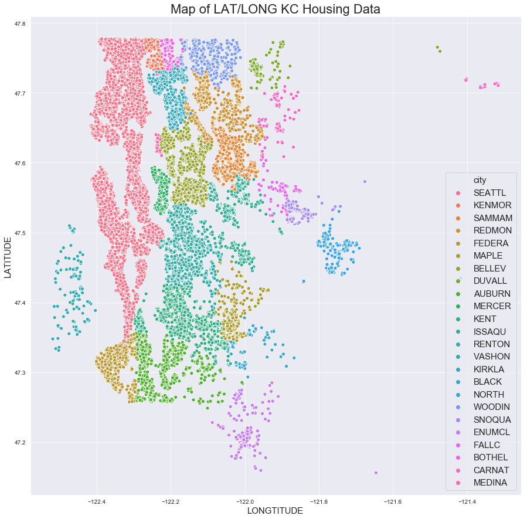
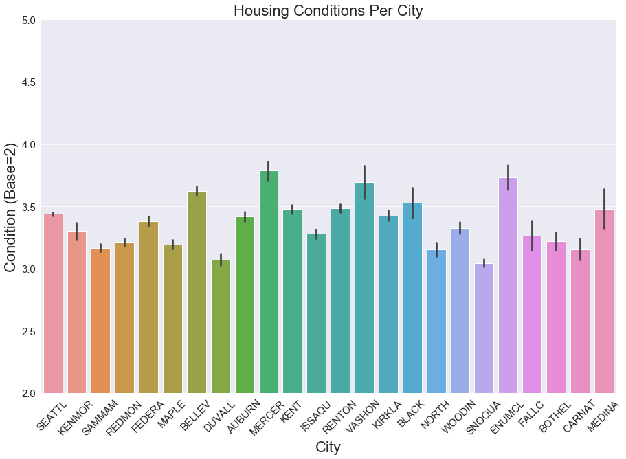
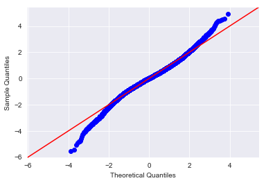
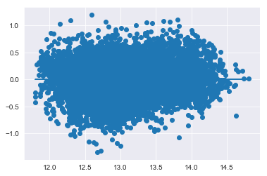

# King County Housing Market - Green Build Subsidy Analysis & Recommendations

### Dataset - King County House Sales (over 21,000 Records!) https://www.kaggle.com/harlfoxem/housesalesprediction

## Purpose of Analysis
The KC Municipality has proposed a bill to provide a Green Build Housing Subsidy for qualifying new-builds and 
renovations in cities with low-activity housing markets. The purpose of the subsidy is to encourage residential retention 
and environmental sustainability while supporting the local economy.

### Objective:
The KC Assessors Office has been tasked with providing pilot testing recommendations regarding ‘Where’ and ‘How’ these 
subsidies are to be granted.

## Questions
#### 1. What are the top 5 lowest activity cities?
#### 2. How do city housing conditions and grades influence qualification?
#### 3. Should subsidy amounts differ based on the build-type?

## Recommendations
### Question 1. 
#### The determination of ‘low-activity’ housing markets can be viewed in two different lights:
#### 1. Objective housing sales per city:
##### 1. Fall City - 79 (0.003%)
##### 2.Black Diamond - 98 (0.004%)
##### 3.Vashon - 116 (0.005%)
##### 4.Carnation - 122 (0.005%)
##### 5.Duvall - 188 (0.008%)

#### or;

#### -Housing sales per capita per city:
##### 1. Bothell - 195 (0.006 per person)
##### 2. Kent - 1201 (0.008 per person)
##### 3. Federal Way - 779 (0.008 per person)
##### 4. Auburn - 911 (0.010 per person)
##### 5 . Seattle - 8973 (0.010 per person)

### Question 2 & 3
#### The data has shown that there is a difference in market values for new-build homes versus renovated homes.  However, the differences between the two can vary greatly depending on the average condition and grade of homes per city.

## Future Work
#### 1. More information about local economies & construction costs to determine if subsidy would be an effective incentive.
#### 2.  Local environmental concerns, as they likely vary widely throughout the county.

# Visualizations Samples
### KC Zipcode to City Conversion

## Housing Conditions per City

## Final Model Residuals

